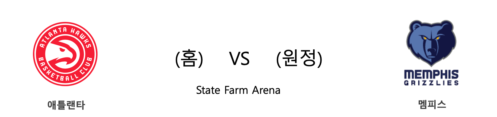
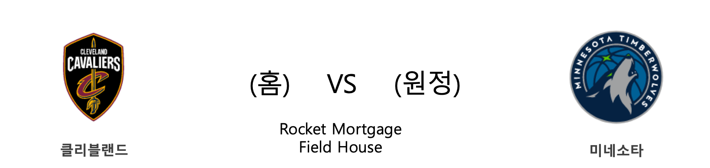
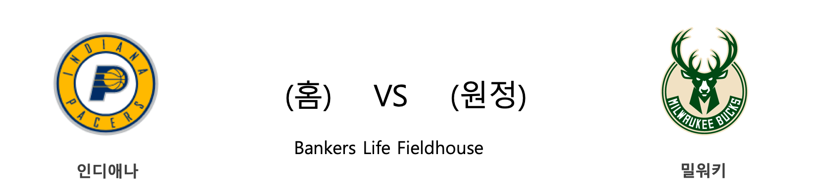

####  BOS(홈) VS TOR(원정) 

#### 2018-2019 시즌 성적

<table class="tg">
  <tr>
    <td class="tg-rr9t">BOS</td>
    <td class="tg-rr9t">팀</td>
    <td class="tg-rr9t">TOR</td>
  </tr>
  <tr>
    <th class="tg-dcpn">1위(1승 0패)</th>
    <th class="tg-o8le">시즌 순위</th>
    <th class="tg-dcpn">1위(1승 0패)</th>
  </tr>
  <tr>
    <td class="tg-txr3">105.0/87.0</td>
    <td class="tg-o8le">평균 득점/실점</td>
    <td class="tg-txr3">116.0/104.0</td>
  </tr>
  <tr>
    <td class="tg-dcpn">홈 0승 0패 원정 1승 0패</td>
    <td class="tg-wazi">홈/원정 성적</td>
    <td class="tg-dcpn">홈 0승 0패 원정 1승 0패</td>
  </tr>
</table>

#### 최근 5경기 상대전적(정규시즌)

<table class="tg">
  <tr>
    <th class="tg-d14o">경기일자 (홈팀)</th>
    <th class="tg-d14o">팀</th>
    <th class="tg-d14o">1Q</th>
    <th class="tg-d14o">2Q</th>
    <th class="tg-d14o">3Q</th>
    <th class="tg-d14o">4Q</th>
    <th class="tg-d14o">EQ</th>
    <th class="tg-d14o">Total</th>
    <th class="tg-d14o">승리팀</th>
  </tr>
</table> 
#### BOS 최근 5경기 분석(정규시즌)

<table class="tg">
  <tr>
    <th class="tg-d14o">경기일자 (홈팀)</th>
    <th class="tg-d14o">팀</th>
    <th class="tg-d14o">1Q</th>
    <th class="tg-d14o">2Q</th>
    <th class="tg-d14o">3Q</th>
    <th class="tg-d14o">4Q</th>
    <th class="tg-d14o">EQ</th>
    <th class="tg-d14o">Total</th>
    <th class="tg-d14o">승리팀</th>
  </tr>

<tr>
  <td class="tg-50j8" rowspan="2">2018-10-16(화) (PHI)</td>
  <td class="tg-50j8">PHI</td>
  <td class="tg-50j8">21</td>
  <td class="tg-50j8">21</td>
  <td class="tg-50j8">24</td>
  <td class="tg-50j8">21</td>
  <td class="tg-50j8">0</td>
  <td class="tg-50j8">87</td>
  <td class="tg-50j8" rowspan="2">BOS</td>
</tr>
<tr>
  <td class="tg-50j8">BOS</td>
  <td class="tg-50j8">21</td>
  <td class="tg-50j8">26</td>
  <td class="tg-50j8">30</td>
  <td class="tg-50j8">28</td>
  <td class="tg-50j8">0</td>
  <td class=" tg-jb7t">105</td>
</tr>
</table> 
#### TOR 최근 5경기 분석(정규시즌)

<table class="tg">
  <tr>
    <th class="tg-d14o">경기일자 (홈팀)</th>
    <th class="tg-d14o">팀</th>
    <th class="tg-d14o">1Q</th>
    <th class="tg-d14o">2Q</th>
    <th class="tg-d14o">3Q</th>
    <th class="tg-d14o">4Q</th>
    <th class="tg-d14o">EQ</th>
    <th class="tg-d14o">Total</th>
    <th class="tg-d14o">승리팀</th>
  </tr>

<tr>
  <td class="tg-50j8" rowspan="2">2018-10-17(수) (CLE)</td>
  <td class="tg-50j8">CLE</td>
  <td class="tg-50j8">25</td>
  <td class="tg-50j8">22</td>
  <td class="tg-50j8">28</td>
  <td class="tg-50j8">29</td>
  <td class="tg-50j8">0</td>
  <td class="tg-50j8">104</td>
  <td class="tg-50j8" rowspan="2">TOR</td>
</tr>
<tr>
  <td class="tg-50j8">TOR</td>
  <td class="tg-50j8">28</td>
  <td class="tg-50j8">32</td>
  <td class="tg-50j8">30</td>
  <td class="tg-50j8">26</td>
  <td class="tg-50j8">0</td>
  <td class=" tg-jb7t">116</td>
</tr>
</table> 
####  OKC(홈) VS LAC(원정) 

#### 2018-2019 시즌 성적

<table class="tg">
  <tr>
    <td class="tg-rr9t">OKC</td>
    <td class="tg-rr9t">팀</td>
    <td class="tg-rr9t">LAC</td>
  </tr>
  <tr>
    <th class="tg-dcpn">8위(0승 1패)</th>
    <th class="tg-o8le">시즌 순위</th>
    <th class="tg-dcpn">8위(0승 1패)</th>
  </tr>
  <tr>
    <td class="tg-txr3">100.0/108.0</td>
    <td class="tg-o8le">평균 득점/실점</td>
    <td class="tg-txr3">98.0/107.0</td>
  </tr>
  <tr>
    <td class="tg-dcpn">홈 0승 1패 원정 0승 0패</td>
    <td class="tg-wazi">홈/원정 성적</td>
    <td class="tg-dcpn">홈 0승 0패 원정 0승 1패</td>
  </tr>
</table>

#### 최근 5경기 상대전적(정규시즌)

<table class="tg">
  <tr>
    <th class="tg-d14o">경기일자 (홈팀)</th>
    <th class="tg-d14o">팀</th>
    <th class="tg-d14o">1Q</th>
    <th class="tg-d14o">2Q</th>
    <th class="tg-d14o">3Q</th>
    <th class="tg-d14o">4Q</th>
    <th class="tg-d14o">EQ</th>
    <th class="tg-d14o">Total</th>
    <th class="tg-d14o">승리팀</th>
  </tr>
</table> 
#### OKC 최근 5경기 분석(정규시즌)

<table class="tg">
  <tr>
    <th class="tg-d14o">경기일자 (홈팀)</th>
    <th class="tg-d14o">팀</th>
    <th class="tg-d14o">1Q</th>
    <th class="tg-d14o">2Q</th>
    <th class="tg-d14o">3Q</th>
    <th class="tg-d14o">4Q</th>
    <th class="tg-d14o">EQ</th>
    <th class="tg-d14o">Total</th>
    <th class="tg-d14o">승리팀</th>
  </tr>

<tr>
  <td class="tg-50j8" rowspan="2">2018-10-16(화) (OKC)</td>
  <td class="tg-50j8">OKC</td>
  <td class="tg-50j8">23</td>
  <td class="tg-50j8">24</td>
  <td class="tg-50j8">32</td>
  <td class="tg-50j8">21</td>
  <td class="tg-50j8">0</td>
  <td class="tg-50j8">100</td>
  <td class="tg-50j8" rowspan="2">GSW</td>
</tr>
<tr>
  <td class="tg-50j8">GSW</td>
  <td class="tg-50j8">31</td>
  <td class="tg-50j8">26</td>
  <td class="tg-50j8">26</td>
  <td class="tg-50j8">25</td>
  <td class="tg-50j8">0</td>
  <td class=" tg-jb7t">108</td>
</tr>
</table> 
#### LAC 최근 5경기 분석(정규시즌)

<table class="tg">
  <tr>
    <th class="tg-d14o">경기일자 (홈팀)</th>
    <th class="tg-d14o">팀</th>
    <th class="tg-d14o">1Q</th>
    <th class="tg-d14o">2Q</th>
    <th class="tg-d14o">3Q</th>
    <th class="tg-d14o">4Q</th>
    <th class="tg-d14o">EQ</th>
    <th class="tg-d14o">Total</th>
    <th class="tg-d14o">승리팀</th>
  </tr>

<tr>
  <td class="tg-50j8" rowspan="2">2018-10-17(수) (DEN)</td>
  <td class="tg-50j8">DEN</td>
  <td class="tg-50j8">29</td>
  <td class="tg-50j8">30</td>
  <td class="tg-50j8">15</td>
  <td class="tg-50j8">33</td>
  <td class="tg-50j8">0</td>
  <td class="tg-jb7t">107</td>
  <td class="tg-50j8" rowspan="2">DEN</td>
</tr>
<tr>
  <td class="tg-50j8">LAC</td>
  <td class="tg-50j8">24</td>
  <td class="tg-50j8">30</td>
  <td class="tg-50j8">18</td>
  <td class="tg-50j8">26</td>
  <td class="tg-50j8">0</td>
  <td class=" tg-50j8">98</td>
</tr>
</table> 
####  ATL(홈) VS MEM(원정) 

#### 2018-2019 시즌 성적

<table class="tg">
  <tr>
    <td class="tg-rr9t">ATL</td>
    <td class="tg-rr9t">팀</td>
    <td class="tg-rr9t">MEM</td>
  </tr>
  <tr>
    <th class="tg-dcpn">10위(0승 1패)</th>
    <th class="tg-o8le">시즌 순위</th>
    <th class="tg-dcpn">8위(0승 1패)</th>
  </tr>
  <tr>
    <td class="tg-txr3">107.0/126.0</td>
    <td class="tg-o8le">평균 득점/실점</td>
    <td class="tg-txr3">83.0/111.0</td>
  </tr>
  <tr>
    <td class="tg-dcpn">홈 0승 1패 원정 0승 0패</td>
    <td class="tg-wazi">홈/원정 성적</td>
    <td class="tg-dcpn">홈 0승 1패 원정 0승 0패</td>
  </tr>
</table>

#### 최근 5경기 상대전적(정규시즌)

<table class="tg">
  <tr>
    <th class="tg-d14o">경기일자 (홈팀)</th>
    <th class="tg-d14o">팀</th>
    <th class="tg-d14o">1Q</th>
    <th class="tg-d14o">2Q</th>
    <th class="tg-d14o">3Q</th>
    <th class="tg-d14o">4Q</th>
    <th class="tg-d14o">EQ</th>
    <th class="tg-d14o">Total</th>
    <th class="tg-d14o">승리팀</th>
  </tr>
</table> 
#### ATL 최근 5경기 분석(정규시즌)

<table class="tg">
  <tr>
    <th class="tg-d14o">경기일자 (홈팀)</th>
    <th class="tg-d14o">팀</th>
    <th class="tg-d14o">1Q</th>
    <th class="tg-d14o">2Q</th>
    <th class="tg-d14o">3Q</th>
    <th class="tg-d14o">4Q</th>
    <th class="tg-d14o">EQ</th>
    <th class="tg-d14o">Total</th>
    <th class="tg-d14o">승리팀</th>
  </tr>

<tr>
  <td class="tg-50j8" rowspan="2">2018-10-17(수) (ATL)</td>
  <td class="tg-50j8">ATL</td>
  <td class="tg-50j8">24</td>
  <td class="tg-50j8">25</td>
  <td class="tg-50j8">35</td>
  <td class="tg-50j8">23</td>
  <td class="tg-50j8">0</td>
  <td class="tg-50j8">107</td>
  <td class="tg-50j8" rowspan="2">NYK</td>
</tr>
<tr>
  <td class="tg-50j8">NYK</td>
  <td class="tg-50j8">23</td>
  <td class="tg-50j8">49</td>
  <td class="tg-50j8">34</td>
  <td class="tg-50j8">20</td>
  <td class="tg-50j8">0</td>
  <td class=" tg-jb7t">126</td>
</tr>
</table> 
#### MEM 최근 5경기 분석(정규시즌)

<table class="tg">
  <tr>
    <th class="tg-d14o">경기일자 (홈팀)</th>
    <th class="tg-d14o">팀</th>
    <th class="tg-d14o">1Q</th>
    <th class="tg-d14o">2Q</th>
    <th class="tg-d14o">3Q</th>
    <th class="tg-d14o">4Q</th>
    <th class="tg-d14o">EQ</th>
    <th class="tg-d14o">Total</th>
    <th class="tg-d14o">승리팀</th>
  </tr>

<tr>
  <td class="tg-50j8" rowspan="2">2018-10-17(수) (MEM)</td>
  <td class="tg-50j8">MEM</td>
  <td class="tg-50j8">16</td>
  <td class="tg-50j8">23</td>
  <td class="tg-50j8">19</td>
  <td class="tg-50j8">25</td>
  <td class="tg-50j8">0</td>
  <td class="tg-50j8">83</td>
  <td class="tg-50j8" rowspan="2">IND</td>
</tr>
<tr>
  <td class="tg-50j8">IND</td>
  <td class="tg-50j8">27</td>
  <td class="tg-50j8">29</td>
  <td class="tg-50j8">20</td>
  <td class="tg-50j8">35</td>
  <td class="tg-50j8">0</td>
  <td class=" tg-jb7t">111</td>
</tr>
</table> 
####  SAC(홈) VS NOP(원정) 

#### 2018-2019 시즌 성적

<table class="tg">
  <tr>
    <td class="tg-rr9t">SAC</td>
    <td class="tg-rr9t">팀</td>
    <td class="tg-rr9t">NOP</td>
  </tr>
  <tr>
    <th class="tg-dcpn">8위(0승 1패)</th>
    <th class="tg-o8le">시즌 순위</th>
    <th class="tg-dcpn">1위(1승 0패)</th>
  </tr>
  <tr>
    <td class="tg-txr3">117.0/123.0</td>
    <td class="tg-o8le">평균 득점/실점</td>
    <td class="tg-txr3">131.0/112.0</td>
  </tr>
  <tr>
    <td class="tg-dcpn">홈 0승 0패 원정 0승 1패</td>
    <td class="tg-wazi">홈/원정 성적</td>
    <td class="tg-dcpn">홈 1승 0패 원정 0승 0패</td>
  </tr>
</table>

#### 최근 5경기 상대전적(정규시즌)

<table class="tg">
  <tr>
    <th class="tg-d14o">경기일자 (홈팀)</th>
    <th class="tg-d14o">팀</th>
    <th class="tg-d14o">1Q</th>
    <th class="tg-d14o">2Q</th>
    <th class="tg-d14o">3Q</th>
    <th class="tg-d14o">4Q</th>
    <th class="tg-d14o">EQ</th>
    <th class="tg-d14o">Total</th>
    <th class="tg-d14o">승리팀</th>
  </tr>
</table> 
#### SAC 최근 5경기 분석(정규시즌)

<table class="tg">
  <tr>
    <th class="tg-d14o">경기일자 (홈팀)</th>
    <th class="tg-d14o">팀</th>
    <th class="tg-d14o">1Q</th>
    <th class="tg-d14o">2Q</th>
    <th class="tg-d14o">3Q</th>
    <th class="tg-d14o">4Q</th>
    <th class="tg-d14o">EQ</th>
    <th class="tg-d14o">Total</th>
    <th class="tg-d14o">승리팀</th>
  </tr>

<tr>
  <td class="tg-50j8" rowspan="2">2018-10-17(수) (UTA)</td>
  <td class="tg-50j8">UTA</td>
  <td class="tg-50j8">30</td>
  <td class="tg-50j8">38</td>
  <td class="tg-50j8">25</td>
  <td class="tg-50j8">30</td>
  <td class="tg-50j8">0</td>
  <td class="tg-jb7t">123</td>
  <td class="tg-50j8" rowspan="2">UTA</td>
</tr>
<tr>
  <td class="tg-50j8">SAC</td>
  <td class="tg-50j8">34</td>
  <td class="tg-50j8">21</td>
  <td class="tg-50j8">32</td>
  <td class="tg-50j8">30</td>
  <td class="tg-50j8">0</td>
  <td class=" tg-50j8">117</td>
</tr>
</table> 
#### NOP 최근 5경기 분석(정규시즌)

<table class="tg">
  <tr>
    <th class="tg-d14o">경기일자 (홈팀)</th>
    <th class="tg-d14o">팀</th>
    <th class="tg-d14o">1Q</th>
    <th class="tg-d14o">2Q</th>
    <th class="tg-d14o">3Q</th>
    <th class="tg-d14o">4Q</th>
    <th class="tg-d14o">EQ</th>
    <th class="tg-d14o">Total</th>
    <th class="tg-d14o">승리팀</th>
  </tr>

<tr>
  <td class="tg-50j8" rowspan="2">2018-10-17(수) (NOP)</td>
  <td class="tg-50j8">NOP</td>
  <td class="tg-50j8">35</td>
  <td class="tg-50j8">36</td>
  <td class="tg-50j8">30</td>
  <td class="tg-50j8">30</td>
  <td class="tg-50j8">0</td>
  <td class="tg-jb7t">131</td>
  <td class="tg-50j8" rowspan="2">NOP</td>
</tr>
<tr>
  <td class="tg-50j8">HOU</td>
  <td class="tg-50j8">29</td>
  <td class="tg-50j8">25</td>
  <td class="tg-50j8">30</td>
  <td class="tg-50j8">28</td>
  <td class="tg-50j8">0</td>
  <td class=" tg-50j8">112</td>
</tr>
</table> 
####  CHA(홈) VS ORL(원정) 

#### 2018-2019 시즌 성적

<table class="tg">
  <tr>
    <td class="tg-rr9t">CHA</td>
    <td class="tg-rr9t">팀</td>
    <td class="tg-rr9t">ORL</td>
  </tr>
  <tr>
    <th class="tg-dcpn">10위(0승 1패)</th>
    <th class="tg-o8le">시즌 순위</th>
    <th class="tg-dcpn">1위(1승 0패)</th>
  </tr>
  <tr>
    <td class="tg-txr3">112.0/113.0</td>
    <td class="tg-o8le">평균 득점/실점</td>
    <td class="tg-txr3">104.0/101.0</td>
  </tr>
  <tr>
    <td class="tg-dcpn">홈 0승 0패 원정 0승 1패</td>
    <td class="tg-wazi">홈/원정 성적</td>
    <td class="tg-dcpn">홈 0승 0패 원정 1승 0패</td>
  </tr>
</table>

#### 최근 5경기 상대전적(정규시즌)

<table class="tg">
  <tr>
    <th class="tg-d14o">경기일자 (홈팀)</th>
    <th class="tg-d14o">팀</th>
    <th class="tg-d14o">1Q</th>
    <th class="tg-d14o">2Q</th>
    <th class="tg-d14o">3Q</th>
    <th class="tg-d14o">4Q</th>
    <th class="tg-d14o">EQ</th>
    <th class="tg-d14o">Total</th>
    <th class="tg-d14o">승리팀</th>
  </tr>
</table> 
#### CHA 최근 5경기 분석(정규시즌)

<table class="tg">
  <tr>
    <th class="tg-d14o">경기일자 (홈팀)</th>
    <th class="tg-d14o">팀</th>
    <th class="tg-d14o">1Q</th>
    <th class="tg-d14o">2Q</th>
    <th class="tg-d14o">3Q</th>
    <th class="tg-d14o">4Q</th>
    <th class="tg-d14o">EQ</th>
    <th class="tg-d14o">Total</th>
    <th class="tg-d14o">승리팀</th>
  </tr>

<tr>
  <td class="tg-50j8" rowspan="2">2018-10-17(수) (MIL)</td>
  <td class="tg-50j8">MIL</td>
  <td class="tg-50j8">36</td>
  <td class="tg-50j8">31</td>
  <td class="tg-50j8">26</td>
  <td class="tg-50j8">20</td>
  <td class="tg-50j8">0</td>
  <td class="tg-jb7t">113</td>
  <td class="tg-50j8" rowspan="2">MIL</td>
</tr>
<tr>
  <td class="tg-50j8">CHA</td>
  <td class="tg-50j8">23</td>
  <td class="tg-50j8">31</td>
  <td class="tg-50j8">29</td>
  <td class="tg-50j8">29</td>
  <td class="tg-50j8">0</td>
  <td class=" tg-50j8">112</td>
</tr>
</table> 
#### ORL 최근 5경기 분석(정규시즌)

<table class="tg">
  <tr>
    <th class="tg-d14o">경기일자 (홈팀)</th>
    <th class="tg-d14o">팀</th>
    <th class="tg-d14o">1Q</th>
    <th class="tg-d14o">2Q</th>
    <th class="tg-d14o">3Q</th>
    <th class="tg-d14o">4Q</th>
    <th class="tg-d14o">EQ</th>
    <th class="tg-d14o">Total</th>
    <th class="tg-d14o">승리팀</th>
  </tr>

<tr>
  <td class="tg-50j8" rowspan="2">2018-10-17(수) (MIA)</td>
  <td class="tg-50j8">MIA</td>
  <td class="tg-50j8">31</td>
  <td class="tg-50j8">20</td>
  <td class="tg-50j8">27</td>
  <td class="tg-50j8">23</td>
  <td class="tg-50j8">0</td>
  <td class="tg-50j8">101</td>
  <td class="tg-50j8" rowspan="2">ORL</td>
</tr>
<tr>
  <td class="tg-50j8">ORL</td>
  <td class="tg-50j8">25</td>
  <td class="tg-50j8">29</td>
  <td class="tg-50j8">25</td>
  <td class="tg-50j8">25</td>
  <td class="tg-50j8">0</td>
  <td class=" tg-jb7t">104</td>
</tr>
</table> 
####  CLE(홈) VS MIN(원정) 

#### 2018-2019 시즌 성적

<table class="tg">
  <tr>
    <td class="tg-rr9t">CLE</td>
    <td class="tg-rr9t">팀</td>
    <td class="tg-rr9t">MIN</td>
  </tr>
  <tr>
    <th class="tg-dcpn">10위(0승 1패)</th>
    <th class="tg-o8le">시즌 순위</th>
    <th class="tg-dcpn">8위(0승 1패)</th>
  </tr>
  <tr>
    <td class="tg-txr3">104.0/116.0</td>
    <td class="tg-o8le">평균 득점/실점</td>
    <td class="tg-txr3">108.0/112.0</td>
  </tr>
  <tr>
    <td class="tg-dcpn">홈 0승 1패 원정 0승 0패</td>
    <td class="tg-wazi">홈/원정 성적</td>
    <td class="tg-dcpn">홈 0승 1패 원정 0승 0패</td>
  </tr>
</table>

#### 최근 5경기 상대전적(정규시즌)

<table class="tg">
  <tr>
    <th class="tg-d14o">경기일자 (홈팀)</th>
    <th class="tg-d14o">팀</th>
    <th class="tg-d14o">1Q</th>
    <th class="tg-d14o">2Q</th>
    <th class="tg-d14o">3Q</th>
    <th class="tg-d14o">4Q</th>
    <th class="tg-d14o">EQ</th>
    <th class="tg-d14o">Total</th>
    <th class="tg-d14o">승리팀</th>
  </tr>
</table> 
#### CLE 최근 5경기 분석(정규시즌)

<table class="tg">
  <tr>
    <th class="tg-d14o">경기일자 (홈팀)</th>
    <th class="tg-d14o">팀</th>
    <th class="tg-d14o">1Q</th>
    <th class="tg-d14o">2Q</th>
    <th class="tg-d14o">3Q</th>
    <th class="tg-d14o">4Q</th>
    <th class="tg-d14o">EQ</th>
    <th class="tg-d14o">Total</th>
    <th class="tg-d14o">승리팀</th>
  </tr>

<tr>
  <td class="tg-50j8" rowspan="2">2018-10-17(수) (CLE)</td>
  <td class="tg-50j8">CLE</td>
  <td class="tg-50j8">25</td>
  <td class="tg-50j8">22</td>
  <td class="tg-50j8">28</td>
  <td class="tg-50j8">29</td>
  <td class="tg-50j8">0</td>
  <td class="tg-50j8">104</td>
  <td class="tg-50j8" rowspan="2">TOR</td>
</tr>
<tr>
  <td class="tg-50j8">TOR</td>
  <td class="tg-50j8">28</td>
  <td class="tg-50j8">32</td>
  <td class="tg-50j8">30</td>
  <td class="tg-50j8">26</td>
  <td class="tg-50j8">0</td>
  <td class=" tg-jb7t">116</td>
</tr>
</table> 
#### MIN 최근 5경기 분석(정규시즌)

<table class="tg">
  <tr>
    <th class="tg-d14o">경기일자 (홈팀)</th>
    <th class="tg-d14o">팀</th>
    <th class="tg-d14o">1Q</th>
    <th class="tg-d14o">2Q</th>
    <th class="tg-d14o">3Q</th>
    <th class="tg-d14o">4Q</th>
    <th class="tg-d14o">EQ</th>
    <th class="tg-d14o">Total</th>
    <th class="tg-d14o">승리팀</th>
  </tr>

<tr>
  <td class="tg-50j8" rowspan="2">2018-10-17(수) (MIN)</td>
  <td class="tg-50j8">MIN</td>
  <td class="tg-50j8">23</td>
  <td class="tg-50j8">29</td>
  <td class="tg-50j8">31</td>
  <td class="tg-50j8">25</td>
  <td class="tg-50j8">0</td>
  <td class="tg-50j8">108</td>
  <td class="tg-50j8" rowspan="2">SAS</td>
</tr>
<tr>
  <td class="tg-50j8">SAS</td>
  <td class="tg-50j8">31</td>
  <td class="tg-50j8">25</td>
  <td class="tg-50j8">25</td>
  <td class="tg-50j8">31</td>
  <td class="tg-50j8">0</td>
  <td class=" tg-jb7t">112</td>
</tr>
</table> 
####  IND(홈) VS MIL(원정) 

#### 2018-2019 시즌 성적

<table class="tg">
  <tr>
    <td class="tg-rr9t">IND</td>
    <td class="tg-rr9t">팀</td>
    <td class="tg-rr9t">MIL</td>
  </tr>
  <tr>
    <th class="tg-dcpn">1위(1승 0패)</th>
    <th class="tg-o8le">시즌 순위</th>
    <th class="tg-dcpn">1위(1승 0패)</th>
  </tr>
  <tr>
    <td class="tg-txr3">111.0/83.0</td>
    <td class="tg-o8le">평균 득점/실점</td>
    <td class="tg-txr3">113.0/112.0</td>
  </tr>
  <tr>
    <td class="tg-dcpn">홈 0승 0패 원정 1승 0패</td>
    <td class="tg-wazi">홈/원정 성적</td>
    <td class="tg-dcpn">홈 1승 0패 원정 0승 0패</td>
  </tr>
</table>

#### 최근 5경기 상대전적(정규시즌)

<table class="tg">
  <tr>
    <th class="tg-d14o">경기일자 (홈팀)</th>
    <th class="tg-d14o">팀</th>
    <th class="tg-d14o">1Q</th>
    <th class="tg-d14o">2Q</th>
    <th class="tg-d14o">3Q</th>
    <th class="tg-d14o">4Q</th>
    <th class="tg-d14o">EQ</th>
    <th class="tg-d14o">Total</th>
    <th class="tg-d14o">승리팀</th>
  </tr>
</table> 
#### IND 최근 5경기 분석(정규시즌)

<table class="tg">
  <tr>
    <th class="tg-d14o">경기일자 (홈팀)</th>
    <th class="tg-d14o">팀</th>
    <th class="tg-d14o">1Q</th>
    <th class="tg-d14o">2Q</th>
    <th class="tg-d14o">3Q</th>
    <th class="tg-d14o">4Q</th>
    <th class="tg-d14o">EQ</th>
    <th class="tg-d14o">Total</th>
    <th class="tg-d14o">승리팀</th>
  </tr>

<tr>
  <td class="tg-50j8" rowspan="2">2018-10-17(수) (MEM)</td>
  <td class="tg-50j8">MEM</td>
  <td class="tg-50j8">16</td>
  <td class="tg-50j8">23</td>
  <td class="tg-50j8">19</td>
  <td class="tg-50j8">25</td>
  <td class="tg-50j8">0</td>
  <td class="tg-50j8">83</td>
  <td class="tg-50j8" rowspan="2">IND</td>
</tr>
<tr>
  <td class="tg-50j8">IND</td>
  <td class="tg-50j8">27</td>
  <td class="tg-50j8">29</td>
  <td class="tg-50j8">20</td>
  <td class="tg-50j8">35</td>
  <td class="tg-50j8">0</td>
  <td class=" tg-jb7t">111</td>
</tr>
</table> 
#### MIL 최근 5경기 분석(정규시즌)

<table class="tg">
  <tr>
    <th class="tg-d14o">경기일자 (홈팀)</th>
    <th class="tg-d14o">팀</th>
    <th class="tg-d14o">1Q</th>
    <th class="tg-d14o">2Q</th>
    <th class="tg-d14o">3Q</th>
    <th class="tg-d14o">4Q</th>
    <th class="tg-d14o">EQ</th>
    <th class="tg-d14o">Total</th>
    <th class="tg-d14o">승리팀</th>
  </tr>

<tr>
  <td class="tg-50j8" rowspan="2">2018-10-17(수) (MIL)</td>
  <td class="tg-50j8">MIL</td>
  <td class="tg-50j8">36</td>
  <td class="tg-50j8">31</td>
  <td class="tg-50j8">26</td>
  <td class="tg-50j8">20</td>
  <td class="tg-50j8">0</td>
  <td class="tg-jb7t">113</td>
  <td class="tg-50j8" rowspan="2">MIL</td>
</tr>
<tr>
  <td class="tg-50j8">CHA</td>
  <td class="tg-50j8">23</td>
  <td class="tg-50j8">31</td>
  <td class="tg-50j8">29</td>
  <td class="tg-50j8">29</td>
  <td class="tg-50j8">0</td>
  <td class=" tg-50j8">112</td>
</tr>
</table> 
####  NYK(홈) VS BKN(원정) 

#### 2018-2019 시즌 성적

<table class="tg">
  <tr>
    <td class="tg-rr9t">NYK</td>
    <td class="tg-rr9t">팀</td>
    <td class="tg-rr9t">BKN</td>
  </tr>
  <tr>
    <th class="tg-dcpn">1위(1승 0패)</th>
    <th class="tg-o8le">시즌 순위</th>
    <th class="tg-dcpn">10위(0승 1패)</th>
  </tr>
  <tr>
    <td class="tg-txr3">126.0/107.0</td>
    <td class="tg-o8le">평균 득점/실점</td>
    <td class="tg-txr3">100.0/103.0</td>
  </tr>
  <tr>
    <td class="tg-dcpn">홈 0승 0패 원정 1승 0패</td>
    <td class="tg-wazi">홈/원정 성적</td>
    <td class="tg-dcpn">홈 0승 1패 원정 0승 0패</td>
  </tr>
</table>

#### 최근 5경기 상대전적(정규시즌)

<table class="tg">
  <tr>
    <th class="tg-d14o">경기일자 (홈팀)</th>
    <th class="tg-d14o">팀</th>
    <th class="tg-d14o">1Q</th>
    <th class="tg-d14o">2Q</th>
    <th class="tg-d14o">3Q</th>
    <th class="tg-d14o">4Q</th>
    <th class="tg-d14o">EQ</th>
    <th class="tg-d14o">Total</th>
    <th class="tg-d14o">승리팀</th>
  </tr>
</table> 
#### NYK 최근 5경기 분석(정규시즌)

<table class="tg">
  <tr>
    <th class="tg-d14o">경기일자 (홈팀)</th>
    <th class="tg-d14o">팀</th>
    <th class="tg-d14o">1Q</th>
    <th class="tg-d14o">2Q</th>
    <th class="tg-d14o">3Q</th>
    <th class="tg-d14o">4Q</th>
    <th class="tg-d14o">EQ</th>
    <th class="tg-d14o">Total</th>
    <th class="tg-d14o">승리팀</th>
  </tr>

<tr>
  <td class="tg-50j8" rowspan="2">2018-10-17(수) (ATL)</td>
  <td class="tg-50j8">ATL</td>
  <td class="tg-50j8">24</td>
  <td class="tg-50j8">25</td>
  <td class="tg-50j8">35</td>
  <td class="tg-50j8">23</td>
  <td class="tg-50j8">0</td>
  <td class="tg-50j8">107</td>
  <td class="tg-50j8" rowspan="2">NYK</td>
</tr>
<tr>
  <td class="tg-50j8">NYK</td>
  <td class="tg-50j8">23</td>
  <td class="tg-50j8">49</td>
  <td class="tg-50j8">34</td>
  <td class="tg-50j8">20</td>
  <td class="tg-50j8">0</td>
  <td class=" tg-jb7t">126</td>
</tr>
</table> 
#### BKN 최근 5경기 분석(정규시즌)

<table class="tg">
  <tr>
    <th class="tg-d14o">경기일자 (홈팀)</th>
    <th class="tg-d14o">팀</th>
    <th class="tg-d14o">1Q</th>
    <th class="tg-d14o">2Q</th>
    <th class="tg-d14o">3Q</th>
    <th class="tg-d14o">4Q</th>
    <th class="tg-d14o">EQ</th>
    <th class="tg-d14o">Total</th>
    <th class="tg-d14o">승리팀</th>
  </tr>

<tr>
  <td class="tg-50j8" rowspan="2">2018-10-17(수) (BKN)</td>
  <td class="tg-50j8">BKN</td>
  <td class="tg-50j8">29</td>
  <td class="tg-50j8">22</td>
  <td class="tg-50j8">25</td>
  <td class="tg-50j8">24</td>
  <td class="tg-50j8">0</td>
  <td class="tg-50j8">100</td>
  <td class="tg-50j8" rowspan="2">DET</td>
</tr>
<tr>
  <td class="tg-50j8">DET</td>
  <td class="tg-50j8">24</td>
  <td class="tg-50j8">27</td>
  <td class="tg-50j8">32</td>
  <td class="tg-50j8">20</td>
  <td class="tg-50j8">0</td>
  <td class=" tg-jb7t">103</td>
</tr>
</table> 
####  GSW(홈) VS UTA(원정) 

#### 2018-2019 시즌 성적

<table class="tg">
  <tr>
    <td class="tg-rr9t">GSW</td>
    <td class="tg-rr9t">팀</td>
    <td class="tg-rr9t">UTA</td>
  </tr>
  <tr>
    <th class="tg-dcpn">1위(1승 0패)</th>
    <th class="tg-o8le">시즌 순위</th>
    <th class="tg-dcpn">1위(1승 0패)</th>
  </tr>
  <tr>
    <td class="tg-txr3">108.0/100.0</td>
    <td class="tg-o8le">평균 득점/실점</td>
    <td class="tg-txr3">123.0/117.0</td>
  </tr>
  <tr>
    <td class="tg-dcpn">홈 0승 0패 원정 1승 0패</td>
    <td class="tg-wazi">홈/원정 성적</td>
    <td class="tg-dcpn">홈 1승 0패 원정 0승 0패</td>
  </tr>
</table>

#### 최근 5경기 상대전적(정규시즌)

<table class="tg">
  <tr>
    <th class="tg-d14o">경기일자 (홈팀)</th>
    <th class="tg-d14o">팀</th>
    <th class="tg-d14o">1Q</th>
    <th class="tg-d14o">2Q</th>
    <th class="tg-d14o">3Q</th>
    <th class="tg-d14o">4Q</th>
    <th class="tg-d14o">EQ</th>
    <th class="tg-d14o">Total</th>
    <th class="tg-d14o">승리팀</th>
  </tr>
</table> 
#### GSW 최근 5경기 분석(정규시즌)

<table class="tg">
  <tr>
    <th class="tg-d14o">경기일자 (홈팀)</th>
    <th class="tg-d14o">팀</th>
    <th class="tg-d14o">1Q</th>
    <th class="tg-d14o">2Q</th>
    <th class="tg-d14o">3Q</th>
    <th class="tg-d14o">4Q</th>
    <th class="tg-d14o">EQ</th>
    <th class="tg-d14o">Total</th>
    <th class="tg-d14o">승리팀</th>
  </tr>

<tr>
  <td class="tg-50j8" rowspan="2">2018-10-16(화) (OKC)</td>
  <td class="tg-50j8">OKC</td>
  <td class="tg-50j8">23</td>
  <td class="tg-50j8">24</td>
  <td class="tg-50j8">32</td>
  <td class="tg-50j8">21</td>
  <td class="tg-50j8">0</td>
  <td class="tg-50j8">100</td>
  <td class="tg-50j8" rowspan="2">GSW</td>
</tr>
<tr>
  <td class="tg-50j8">GSW</td>
  <td class="tg-50j8">31</td>
  <td class="tg-50j8">26</td>
  <td class="tg-50j8">26</td>
  <td class="tg-50j8">25</td>
  <td class="tg-50j8">0</td>
  <td class=" tg-jb7t">108</td>
</tr>
</table> 
#### UTA 최근 5경기 분석(정규시즌)

<table class="tg">
  <tr>
    <th class="tg-d14o">경기일자 (홈팀)</th>
    <th class="tg-d14o">팀</th>
    <th class="tg-d14o">1Q</th>
    <th class="tg-d14o">2Q</th>
    <th class="tg-d14o">3Q</th>
    <th class="tg-d14o">4Q</th>
    <th class="tg-d14o">EQ</th>
    <th class="tg-d14o">Total</th>
    <th class="tg-d14o">승리팀</th>
  </tr>

<tr>
  <td class="tg-50j8" rowspan="2">2018-10-17(수) (UTA)</td>
  <td class="tg-50j8">UTA</td>
  <td class="tg-50j8">30</td>
  <td class="tg-50j8">38</td>
  <td class="tg-50j8">25</td>
  <td class="tg-50j8">30</td>
  <td class="tg-50j8">0</td>
  <td class="tg-jb7t">123</td>
  <td class="tg-50j8" rowspan="2">UTA</td>
</tr>
<tr>
  <td class="tg-50j8">SAC</td>
  <td class="tg-50j8">34</td>
  <td class="tg-50j8">21</td>
  <td class="tg-50j8">32</td>
  <td class="tg-50j8">30</td>
  <td class="tg-50j8">0</td>
  <td class=" tg-50j8">117</td>
</tr>
</table> 
#### 리그 (Eastern) 순위
    

<table class="tg">
  <tr>
    <th class="tg-d14o">순위</th>
    <th class="tg-d14o">팀명</th>
    <th class="tg-d14o">경기수</th>
    <th class="tg-d14o">승</th>
    <th class="tg-d14o">패</th>
    <th class="tg-d14o">승차</th>
    <th class="tg-d14o">승률</th>
  </tr>
  
<tr>
    <td class="tg-50j8">1</td>
    <td class="tg-50j8">NYK</td>
    <td class="tg-50j8">1</td>
    <td class="tg-50j8">1</td>
    <td class="tg-50j8">0</td>
    <td class="tg-50j8">0</td>
    <td class="tg-50j8">1.0</td>
</tr>

<tr>
    <td class="tg-50j8">1</td>
    <td class="tg-50j8">TOR</td>
    <td class="tg-50j8">1</td>
    <td class="tg-50j8">1</td>
    <td class="tg-50j8">0</td>
    <td class="tg-50j8">0</td>
    <td class="tg-50j8">1.0</td>
</tr>

<tr>
    <td class="tg-50j8">1</td>
    <td class="tg-50j8">BOS</td>
    <td class="tg-50j8">1</td>
    <td class="tg-50j8">1</td>
    <td class="tg-50j8">0</td>
    <td class="tg-50j8">0</td>
    <td class="tg-50j8">1.0</td>
</tr>

<tr>
    <td class="tg-50j8">1</td>
    <td class="tg-50j8">MIL</td>
    <td class="tg-50j8">1</td>
    <td class="tg-50j8">1</td>
    <td class="tg-50j8">0</td>
    <td class="tg-50j8">0</td>
    <td class="tg-50j8">1.0</td>
</tr>

<tr>
    <td class="tg-50j8">1</td>
    <td class="tg-50j8">IND</td>
    <td class="tg-50j8">1</td>
    <td class="tg-50j8">1</td>
    <td class="tg-50j8">0</td>
    <td class="tg-50j8">0</td>
    <td class="tg-50j8">1.0</td>
</tr>

<tr>
    <td class="tg-50j8">1</td>
    <td class="tg-50j8">ORL</td>
    <td class="tg-50j8">1</td>
    <td class="tg-50j8">1</td>
    <td class="tg-50j8">0</td>
    <td class="tg-50j8">0</td>
    <td class="tg-50j8">1.0</td>
</tr>

<tr>
    <td class="tg-50j8">1</td>
    <td class="tg-50j8">DET</td>
    <td class="tg-50j8">1</td>
    <td class="tg-50j8">1</td>
    <td class="tg-50j8">0</td>
    <td class="tg-50j8">0</td>
    <td class="tg-50j8">1.0</td>
</tr>

<tr>
    <td class="tg-50j8">8</td>
    <td class="tg-50j8">PHI</td>
    <td class="tg-50j8">2</td>
    <td class="tg-50j8">1</td>
    <td class="tg-50j8">1</td>
    <td class="tg-50j8">0</td>
    <td class="tg-50j8">0.5</td>
</tr>

<tr>
    <td class="tg-50j8">8</td>
    <td class="tg-50j8">MIA</td>
    <td class="tg-50j8">2</td>
    <td class="tg-50j8">1</td>
    <td class="tg-50j8">1</td>
    <td class="tg-50j8">0</td>
    <td class="tg-50j8">0.5</td>
</tr>

<tr>
    <td class="tg-50j8">10</td>
    <td class="tg-50j8">CHI</td>
    <td class="tg-50j8">1</td>
    <td class="tg-50j8">0</td>
    <td class="tg-50j8">1</td>
    <td class="tg-50j8">1</td>
    <td class="tg-50j8">0.0</td>
</tr>

<tr>
    <td class="tg-50j8">10</td>
    <td class="tg-50j8">BKN</td>
    <td class="tg-50j8">1</td>
    <td class="tg-50j8">0</td>
    <td class="tg-50j8">1</td>
    <td class="tg-50j8">1</td>
    <td class="tg-50j8">0.0</td>
</tr>

<tr>
    <td class="tg-50j8">10</td>
    <td class="tg-50j8">ATL</td>
    <td class="tg-50j8">1</td>
    <td class="tg-50j8">0</td>
    <td class="tg-50j8">1</td>
    <td class="tg-50j8">1</td>
    <td class="tg-50j8">0.0</td>
</tr>

<tr>
    <td class="tg-50j8">10</td>
    <td class="tg-50j8">CLE</td>
    <td class="tg-50j8">1</td>
    <td class="tg-50j8">0</td>
    <td class="tg-50j8">1</td>
    <td class="tg-50j8">1</td>
    <td class="tg-50j8">0.0</td>
</tr>

<tr>
    <td class="tg-50j8">10</td>
    <td class="tg-50j8">WAS</td>
    <td class="tg-50j8">1</td>
    <td class="tg-50j8">0</td>
    <td class="tg-50j8">1</td>
    <td class="tg-50j8">1</td>
    <td class="tg-50j8">0.0</td>
</tr>

<tr>
    <td class="tg-50j8">10</td>
    <td class="tg-50j8">CHA</td>
    <td class="tg-50j8">1</td>
    <td class="tg-50j8">0</td>
    <td class="tg-50j8">1</td>
    <td class="tg-50j8">1</td>
    <td class="tg-50j8">0.0</td>
</tr>
</table> 
#### 리그 (Western) 순위
    

<table class="tg">
  <tr>
    <th class="tg-d14o">순위</th>
    <th class="tg-d14o">팀명</th>
    <th class="tg-d14o">경기수</th>
    <th class="tg-d14o">승</th>
    <th class="tg-d14o">패</th>
    <th class="tg-d14o">승차</th>
    <th class="tg-d14o">승률</th>
  </tr>
  
<tr>
    <td class="tg-50j8">1</td>
    <td class="tg-50j8">NOP</td>
    <td class="tg-50j8">1</td>
    <td class="tg-50j8">1</td>
    <td class="tg-50j8">0</td>
    <td class="tg-50j8">0</td>
    <td class="tg-50j8">1.0</td>
</tr>

<tr>
    <td class="tg-50j8">1</td>
    <td class="tg-50j8">POR</td>
    <td class="tg-50j8">1</td>
    <td class="tg-50j8">1</td>
    <td class="tg-50j8">0</td>
    <td class="tg-50j8">0</td>
    <td class="tg-50j8">1.0</td>
</tr>

<tr>
    <td class="tg-50j8">1</td>
    <td class="tg-50j8">UTA</td>
    <td class="tg-50j8">1</td>
    <td class="tg-50j8">1</td>
    <td class="tg-50j8">0</td>
    <td class="tg-50j8">0</td>
    <td class="tg-50j8">1.0</td>
</tr>

<tr>
    <td class="tg-50j8">1</td>
    <td class="tg-50j8">PHX</td>
    <td class="tg-50j8">1</td>
    <td class="tg-50j8">1</td>
    <td class="tg-50j8">0</td>
    <td class="tg-50j8">0</td>
    <td class="tg-50j8">1.0</td>
</tr>

<tr>
    <td class="tg-50j8">1</td>
    <td class="tg-50j8">GSW</td>
    <td class="tg-50j8">1</td>
    <td class="tg-50j8">1</td>
    <td class="tg-50j8">0</td>
    <td class="tg-50j8">0</td>
    <td class="tg-50j8">1.0</td>
</tr>

<tr>
    <td class="tg-50j8">1</td>
    <td class="tg-50j8">SAS</td>
    <td class="tg-50j8">1</td>
    <td class="tg-50j8">1</td>
    <td class="tg-50j8">0</td>
    <td class="tg-50j8">0</td>
    <td class="tg-50j8">1.0</td>
</tr>

<tr>
    <td class="tg-50j8">1</td>
    <td class="tg-50j8">DEN</td>
    <td class="tg-50j8">1</td>
    <td class="tg-50j8">1</td>
    <td class="tg-50j8">0</td>
    <td class="tg-50j8">0</td>
    <td class="tg-50j8">1.0</td>
</tr>

<tr>
    <td class="tg-50j8">8</td>
    <td class="tg-50j8">MEM</td>
    <td class="tg-50j8">1</td>
    <td class="tg-50j8">0</td>
    <td class="tg-50j8">1</td>
    <td class="tg-50j8">1</td>
    <td class="tg-50j8">0.0</td>
</tr>

<tr>
    <td class="tg-50j8">8</td>
    <td class="tg-50j8">DAL</td>
    <td class="tg-50j8">1</td>
    <td class="tg-50j8">0</td>
    <td class="tg-50j8">1</td>
    <td class="tg-50j8">1</td>
    <td class="tg-50j8">0.0</td>
</tr>

<tr>
    <td class="tg-50j8">8</td>
    <td class="tg-50j8">SAC</td>
    <td class="tg-50j8">1</td>
    <td class="tg-50j8">0</td>
    <td class="tg-50j8">1</td>
    <td class="tg-50j8">1</td>
    <td class="tg-50j8">0.0</td>
</tr>

<tr>
    <td class="tg-50j8">8</td>
    <td class="tg-50j8">OKC</td>
    <td class="tg-50j8">1</td>
    <td class="tg-50j8">0</td>
    <td class="tg-50j8">1</td>
    <td class="tg-50j8">1</td>
    <td class="tg-50j8">0.0</td>
</tr>

<tr>
    <td class="tg-50j8">8</td>
    <td class="tg-50j8">HOU</td>
    <td class="tg-50j8">1</td>
    <td class="tg-50j8">0</td>
    <td class="tg-50j8">1</td>
    <td class="tg-50j8">1</td>
    <td class="tg-50j8">0.0</td>
</tr>

<tr>
    <td class="tg-50j8">8</td>
    <td class="tg-50j8">LAL</td>
    <td class="tg-50j8">1</td>
    <td class="tg-50j8">0</td>
    <td class="tg-50j8">1</td>
    <td class="tg-50j8">1</td>
    <td class="tg-50j8">0.0</td>
</tr>

<tr>
    <td class="tg-50j8">8</td>
    <td class="tg-50j8">MIN</td>
    <td class="tg-50j8">1</td>
    <td class="tg-50j8">0</td>
    <td class="tg-50j8">1</td>
    <td class="tg-50j8">1</td>
    <td class="tg-50j8">0.0</td>
</tr>

<tr>
    <td class="tg-50j8">8</td>
    <td class="tg-50j8">LAC</td>
    <td class="tg-50j8">1</td>
    <td class="tg-50j8">0</td>
    <td class="tg-50j8">1</td>
    <td class="tg-50j8">1</td>
    <td class="tg-50j8">0.0</td>
</tr>
</table> 