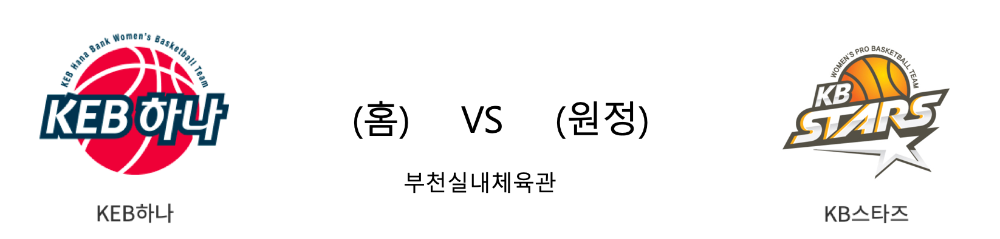

####  KEB하나(홈) VS KB스타즈(원정) 

<table class="tg">
  <tr>
    <th class="tg-rr9t">KEB하나</th>
    <th class="tg-rr9t">팀</th>
    <th class="tg-rr9t">KB스타즈</th>
  </tr>
  <tr>
    <td class="tg-dcpn">0승 1패</td>
    <td class="tg-rr9t">시즌 상대전적</td>
    <td class="tg-dcpn">1승 0패</td>
  </tr>
  <tr>
    <td class="tg-dcpn">77</td>
    <td class="tg-rr9t">점수</td>
    <td class="tg-dcpn">88</td>
  </tr>
  <tr>
    <td class="tg-dcpn">18/38(47%)</td>
    <td class="tg-rr9t">2점(%)</td>
    <td class="tg-dcpn">26/55(47%)</td>
  </tr>
  <tr>
    <td class="tg-dcpn">11/28(39%)</td>
    <td class="tg-rr9t">3점(%)</td>
    <td class="tg-dcpn">10/18(56%)</td>
  </tr>
  <tr>
    <td class="tg-dcpn">8/13(62%)</td>
    <td class="tg-rr9t">자유투(%)</td>
    <td class="tg-dcpn">6/8(75%)</td>
  </tr>
  <tr>
    <td class="tg-dcpn">22</td>
    <td class="tg-rr9t">리바운드</td>
    <td class="tg-dcpn">53</td>
  </tr>
  <tr>
    <td class="tg-dcpn">23</td>
    <td class="tg-rr9t">어시스트</td>
    <td class="tg-dcpn">26</td>
  </tr>
  <tr>
    <td class="tg-dcpn">10</td>
    <td class="tg-rr9t">스틸</td>
    <td class="tg-dcpn">6</td>
  </tr>
  <tr>
    <td class="tg-dcpn">11</td>
    <td class="tg-rr9t">블록</td>
    <td class="tg-dcpn">16</td>
  </tr>
  <tr>
    <td class="tg-dcpn">17</td>
    <td class="tg-rr9t">턴오버</td>
    <td class="tg-dcpn">14</td>
  </tr>
  <tr>
    <td class="tg-dcpn">강이슬(15) 파커(28)</td>
    <td class="tg-rr9t">주요 득점선수</td>
    <td class="tg-dcpn">쏜튼(28)</td>
  </tr>
</table>
