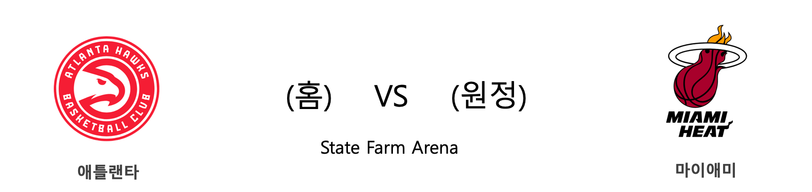

####  NYK(홈) VS DET(원정) 

#### 2018-2019 시즌 성적

<table class="tg">
  <tr>
    <td class="tg-rr9t">NYK</td>
    <td class="tg-rr9t">팀</td>
    <td class="tg-rr9t">DET</td>
  </tr>
  <tr>
    <th class="tg-dcpn">12위(7승 14패)</th>
    <th class="tg-o8le">시즌 순위</th>
    <th class="tg-dcpn">6위(10승 7패)</th>
  </tr>
  <tr>
    <td class="tg-txr3">108.6/113.5</td>
    <td class="tg-o8le">평균 득점/실점</td>
    <td class="tg-txr3">111.6/110.9</td>
  </tr>
  <tr>
    <td class="tg-dcpn">홈 4승 8패 원정 3승 6패</td>
    <td class="tg-wazi">홈/원정 성적</td>
    <td class="tg-dcpn">홈 4승 4패 원정 6승 3패</td>
  </tr>
</table>

#### 최근 5경기 상대전적(정규시즌)

<table class="tg">
  <tr>
    <th class="tg-d14o">경기일자 (홈팀)</th>
    <th class="tg-d14o">팀</th>
    <th class="tg-d14o">1Q</th>
    <th class="tg-d14o">2Q</th>
    <th class="tg-d14o">3Q</th>
    <th class="tg-d14o">4Q</th>
    <th class="tg-d14o">EQ</th>
    <th class="tg-d14o">Total</th>
    <th class="tg-d14o">승리팀</th>
  </tr>
</table> 
#### NYK 최근 5경기 분석(정규시즌)

<table class="tg">
  <tr>
    <th class="tg-d14o">경기일자 (홈팀)</th>
    <th class="tg-d14o">팀</th>
    <th class="tg-d14o">1Q</th>
    <th class="tg-d14o">2Q</th>
    <th class="tg-d14o">3Q</th>
    <th class="tg-d14o">4Q</th>
    <th class="tg-d14o">EQ</th>
    <th class="tg-d14o">Total</th>
    <th class="tg-d14o">승리팀</th>
  </tr>

<tr>
  <td class="tg-50j8" rowspan="2">2018-11-25(일) (NYK)</td>
  <td class="tg-50j8">NYK</td>
  <td class="tg-50j8">21</td>
  <td class="tg-50j8">22</td>
  <td class="tg-50j8">35</td>
  <td class="tg-50j8">25</td>
  <td class="tg-50j8">0</td>
  <td class="tg-jb7t">103</td>
  <td class="tg-50j8" rowspan="2">NYK</td>
</tr>
<tr>
  <td class="tg-50j8">MEM</td>
  <td class="tg-50j8">26</td>
  <td class="tg-50j8">26</td>
  <td class="tg-50j8">19</td>
  <td class="tg-50j8">27</td>
  <td class="tg-50j8">0</td>
  <td class=" tg-50j8">98</td>
</tr>

<tr>
  <td class="tg-50j8" rowspan="2">2018-11-23(금) (NOP)</td>
  <td class="tg-50j8">NOP</td>
  <td class="tg-50j8">34</td>
  <td class="tg-50j8">26</td>
  <td class="tg-50j8">30</td>
  <td class="tg-50j8">19</td>
  <td class="tg-50j8">0</td>
  <td class="tg-50j8">109</td>
  <td class="tg-50j8" rowspan="2">NYK</td>
</tr>
<tr>
  <td class="tg-50j8">NYK</td>
  <td class="tg-50j8">28</td>
  <td class="tg-50j8">31</td>
  <td class="tg-50j8">28</td>
  <td class="tg-50j8">27</td>
  <td class="tg-50j8">0</td>
  <td class=" tg-jb7t">114</td>
</tr>

<tr>
  <td class="tg-50j8" rowspan="2">2018-11-21(수) (NYK)</td>
  <td class="tg-50j8">NYK</td>
  <td class="tg-50j8">26</td>
  <td class="tg-50j8">39</td>
  <td class="tg-50j8">19</td>
  <td class="tg-50j8">33</td>
  <td class="tg-50j8">0</td>
  <td class="tg-jb7t">117</td>
  <td class="tg-50j8" rowspan="2">NYK</td>
</tr>
<tr>
  <td class="tg-50j8">BOS</td>
  <td class="tg-50j8">18</td>
  <td class="tg-50j8">31</td>
  <td class="tg-50j8">20</td>
  <td class="tg-50j8">40</td>
  <td class="tg-50j8">0</td>
  <td class=" tg-50j8">109</td>
</tr>

<tr>
  <td class="tg-50j8" rowspan="2">2018-11-20(화) (POR)</td>
  <td class="tg-50j8">POR</td>
  <td class="tg-50j8">33</td>
  <td class="tg-50j8">25</td>
  <td class="tg-50j8">31</td>
  <td class="tg-50j8">29</td>
  <td class="tg-50j8">0</td>
  <td class="tg-jb7t">118</td>
  <td class="tg-50j8" rowspan="2">POR</td>
</tr>
<tr>
  <td class="tg-50j8">NYK</td>
  <td class="tg-50j8">35</td>
  <td class="tg-50j8">25</td>
  <td class="tg-50j8">25</td>
  <td class="tg-50j8">29</td>
  <td class="tg-50j8">0</td>
  <td class=" tg-50j8">114</td>
</tr>

<tr>
  <td class="tg-50j8" rowspan="2">2018-11-18(일) (NYK)</td>
  <td class="tg-50j8">NYK</td>
  <td class="tg-50j8">31</td>
  <td class="tg-50j8">35</td>
  <td class="tg-50j8">26</td>
  <td class="tg-50j8">25</td>
  <td class="tg-50j8">0</td>
  <td class="tg-50j8">117</td>
  <td class="tg-50j8" rowspan="2">ORL</td>
</tr>
<tr>
  <td class="tg-50j8">ORL</td>
  <td class="tg-50j8">44</td>
  <td class="tg-50j8">23</td>
  <td class="tg-50j8">31</td>
  <td class="tg-50j8">33</td>
  <td class="tg-50j8">0</td>
  <td class=" tg-jb7t">131</td>
</tr>
</table> 
#### DET 최근 5경기 분석(정규시즌)

<table class="tg">
  <tr>
    <th class="tg-d14o">경기일자 (홈팀)</th>
    <th class="tg-d14o">팀</th>
    <th class="tg-d14o">1Q</th>
    <th class="tg-d14o">2Q</th>
    <th class="tg-d14o">3Q</th>
    <th class="tg-d14o">4Q</th>
    <th class="tg-d14o">EQ</th>
    <th class="tg-d14o">Total</th>
    <th class="tg-d14o">승리팀</th>
  </tr>

<tr>
  <td class="tg-50j8" rowspan="2">2018-11-25(일) (PHX)</td>
  <td class="tg-50j8">PHX</td>
  <td class="tg-50j8">32</td>
  <td class="tg-50j8">28</td>
  <td class="tg-50j8">24</td>
  <td class="tg-50j8">23</td>
  <td class="tg-50j8">0</td>
  <td class="tg-50j8">107</td>
  <td class="tg-50j8" rowspan="2">DET</td>
</tr>
<tr>
  <td class="tg-50j8">DET</td>
  <td class="tg-50j8">27</td>
  <td class="tg-50j8">35</td>
  <td class="tg-50j8">21</td>
  <td class="tg-50j8">35</td>
  <td class="tg-50j8">0</td>
  <td class=" tg-jb7t">118</td>
</tr>

<tr>
  <td class="tg-50j8" rowspan="2">2018-11-23(금) (HOU)</td>
  <td class="tg-50j8">HOU</td>
  <td class="tg-50j8">30</td>
  <td class="tg-50j8">26</td>
  <td class="tg-50j8">23</td>
  <td class="tg-50j8">19</td>
  <td class="tg-50j8">13</td>
  <td class="tg-50j8">111</td>
  <td class="tg-50j8" rowspan="2">DET</td>
</tr>
<tr>
  <td class="tg-50j8">DET</td>
  <td class="tg-50j8">34</td>
  <td class="tg-50j8">27</td>
  <td class="tg-50j8">17</td>
  <td class="tg-50j8">20</td>
  <td class="tg-50j8">18</td>
  <td class=" tg-jb7t">116</td>
</tr>

<tr>
  <td class="tg-50j8" rowspan="2">2018-11-21(수) (DET)</td>
  <td class="tg-50j8">DET</td>
  <td class="tg-50j8">29</td>
  <td class="tg-50j8">28</td>
  <td class="tg-50j8">26</td>
  <td class="tg-50j8">41</td>
  <td class="tg-50j8">0</td>
  <td class="tg-50j8">124</td>
  <td class="tg-50j8" rowspan="2">HOU</td>
</tr>
<tr>
  <td class="tg-50j8">HOU</td>
  <td class="tg-50j8">31</td>
  <td class="tg-50j8">25</td>
  <td class="tg-50j8">37</td>
  <td class="tg-50j8">33</td>
  <td class="tg-50j8">0</td>
  <td class=" tg-jb7t">126</td>
</tr>

<tr>
  <td class="tg-50j8" rowspan="2">2018-11-19(월) (CLE)</td>
  <td class="tg-50j8">CLE</td>
  <td class="tg-50j8">27</td>
  <td class="tg-50j8">19</td>
  <td class="tg-50j8">23</td>
  <td class="tg-50j8">33</td>
  <td class="tg-50j8">0</td>
  <td class="tg-50j8">102</td>
  <td class="tg-50j8" rowspan="2">DET</td>
</tr>
<tr>
  <td class="tg-50j8">DET</td>
  <td class="tg-50j8">38</td>
  <td class="tg-50j8">28</td>
  <td class="tg-50j8">27</td>
  <td class="tg-50j8">20</td>
  <td class="tg-50j8">0</td>
  <td class=" tg-jb7t">113</td>
</tr>

<tr>
  <td class="tg-50j8" rowspan="2">2018-11-14(수) (DET)</td>
  <td class="tg-50j8">DET</td>
  <td class="tg-50j8">26</td>
  <td class="tg-50j8">27</td>
  <td class="tg-50j8">24</td>
  <td class="tg-50j8">29</td>
  <td class="tg-50j8">0</td>
  <td class="tg-jb7t">106</td>
  <td class="tg-50j8" rowspan="2">DET</td>
</tr>
<tr>
  <td class="tg-50j8">TOR</td>
  <td class="tg-50j8">31</td>
  <td class="tg-50j8">34</td>
  <td class="tg-50j8">23</td>
  <td class="tg-50j8">16</td>
  <td class="tg-50j8">0</td>
  <td class=" tg-50j8">104</td>
</tr>
</table> 
####  ATL(홈) VS MIA(원정) 

#### 2018-2019 시즌 성적

<table class="tg">
  <tr>
    <td class="tg-rr9t">ATL</td>
    <td class="tg-rr9t">팀</td>
    <td class="tg-rr9t">MIA</td>
  </tr>
  <tr>
    <th class="tg-dcpn">15위(4승 16패)</th>
    <th class="tg-o8le">시즌 순위</th>
    <th class="tg-dcpn">11위(7승 12패)</th>
  </tr>
  <tr>
    <td class="tg-txr3">107.7/118.6</td>
    <td class="tg-o8le">평균 득점/실점</td>
    <td class="tg-txr3">108.4/110.3</td>
  </tr>
  <tr>
    <td class="tg-dcpn">홈 1승 9패 원정 3승 7패</td>
    <td class="tg-wazi">홈/원정 성적</td>
    <td class="tg-dcpn">홈 4승 5패 원정 3승 7패</td>
  </tr>
</table>

#### 최근 5경기 상대전적(정규시즌)

<table class="tg">
  <tr>
    <th class="tg-d14o">경기일자 (홈팀)</th>
    <th class="tg-d14o">팀</th>
    <th class="tg-d14o">1Q</th>
    <th class="tg-d14o">2Q</th>
    <th class="tg-d14o">3Q</th>
    <th class="tg-d14o">4Q</th>
    <th class="tg-d14o">EQ</th>
    <th class="tg-d14o">Total</th>
    <th class="tg-d14o">승리팀</th>
  </tr>

<tr>
  <td class="tg-50j8" rowspan="2">2018-11-03(토) (MIA)</td>
  <td class="tg-50j8">MIA</td>
  <td class="tg-50j8">31</td>
  <td class="tg-50j8">37</td>
  <td class="tg-50j8">25</td>
  <td class="tg-50j8">25</td>
  <td class="tg-50j8">0</td>
  <td class="tg-50j8">118</td>
  <td class="tg-50j8" rowspan="2">ATL</td>
</tr>
<tr>
  <td class="tg-50j8">ATL</td>
  <td class="tg-50j8">41</td>
  <td class="tg-50j8">33</td>
  <td class="tg-50j8">28</td>
  <td class="tg-50j8">21</td>
  <td class="tg-50j8">0</td>
  <td class=" tg-jb7t">123</td>
</tr>
</table> 
#### ATL 최근 5경기 분석(정규시즌)

<table class="tg">
  <tr>
    <th class="tg-d14o">경기일자 (홈팀)</th>
    <th class="tg-d14o">팀</th>
    <th class="tg-d14o">1Q</th>
    <th class="tg-d14o">2Q</th>
    <th class="tg-d14o">3Q</th>
    <th class="tg-d14o">4Q</th>
    <th class="tg-d14o">EQ</th>
    <th class="tg-d14o">Total</th>
    <th class="tg-d14o">승리팀</th>
  </tr>

<tr>
  <td class="tg-50j8" rowspan="2">2018-11-25(일) (CHA)</td>
  <td class="tg-50j8">CHA</td>
  <td class="tg-50j8">43</td>
  <td class="tg-50j8">23</td>
  <td class="tg-50j8">31</td>
  <td class="tg-50j8">26</td>
  <td class="tg-50j8">0</td>
  <td class="tg-50j8">123</td>
  <td class="tg-50j8" rowspan="2">ATL</td>
</tr>
<tr>
  <td class="tg-50j8">ATL</td>
  <td class="tg-50j8">32</td>
  <td class="tg-50j8">33</td>
  <td class="tg-50j8">35</td>
  <td class="tg-50j8">24</td>
  <td class="tg-50j8">0</td>
  <td class=" tg-jb7t">124</td>
</tr>

<tr>
  <td class="tg-50j8" rowspan="2">2018-11-23(금) (BOS)</td>
  <td class="tg-50j8">BOS</td>
  <td class="tg-50j8">45</td>
  <td class="tg-50j8">16</td>
  <td class="tg-50j8">21</td>
  <td class="tg-50j8">32</td>
  <td class="tg-50j8">0</td>
  <td class="tg-jb7t">114</td>
  <td class="tg-50j8" rowspan="2">BOS</td>
</tr>
<tr>
  <td class="tg-50j8">ATL</td>
  <td class="tg-50j8">23</td>
  <td class="tg-50j8">22</td>
  <td class="tg-50j8">19</td>
  <td class="tg-50j8">32</td>
  <td class="tg-50j8">0</td>
  <td class=" tg-50j8">96</td>
</tr>

<tr>
  <td class="tg-50j8" rowspan="2">2018-11-21(수) (TOR)</td>
  <td class="tg-50j8">TOR</td>
  <td class="tg-50j8">29</td>
  <td class="tg-50j8">26</td>
  <td class="tg-50j8">31</td>
  <td class="tg-50j8">38</td>
  <td class="tg-50j8">0</td>
  <td class="tg-jb7t">124</td>
  <td class="tg-50j8" rowspan="2">TOR</td>
</tr>
<tr>
  <td class="tg-50j8">ATL</td>
  <td class="tg-50j8">24</td>
  <td class="tg-50j8">20</td>
  <td class="tg-50j8">29</td>
  <td class="tg-50j8">35</td>
  <td class="tg-50j8">0</td>
  <td class=" tg-50j8">108</td>
</tr>

<tr>
  <td class="tg-50j8" rowspan="2">2018-11-19(월) (LAC)</td>
  <td class="tg-50j8">LAC</td>
  <td class="tg-50j8">29</td>
  <td class="tg-50j8">32</td>
  <td class="tg-50j8">28</td>
  <td class="tg-50j8">38</td>
  <td class="tg-50j8">0</td>
  <td class="tg-jb7t">127</td>
  <td class="tg-50j8" rowspan="2">LAC</td>
</tr>
<tr>
  <td class="tg-50j8">ATL</td>
  <td class="tg-50j8">34</td>
  <td class="tg-50j8">30</td>
  <td class="tg-50j8">32</td>
  <td class="tg-50j8">23</td>
  <td class="tg-50j8">0</td>
  <td class=" tg-50j8">119</td>
</tr>

<tr>
  <td class="tg-50j8" rowspan="2">2018-11-17(토) (ATL)</td>
  <td class="tg-50j8">ATL</td>
  <td class="tg-50j8">24</td>
  <td class="tg-50j8">32</td>
  <td class="tg-50j8">16</td>
  <td class="tg-50j8">17</td>
  <td class="tg-50j8">0</td>
  <td class="tg-50j8">89</td>
  <td class="tg-50j8" rowspan="2">IND</td>
</tr>
<tr>
  <td class="tg-50j8">IND</td>
  <td class="tg-50j8">25</td>
  <td class="tg-50j8">22</td>
  <td class="tg-50j8">26</td>
  <td class="tg-50j8">24</td>
  <td class="tg-50j8">0</td>
  <td class=" tg-jb7t">97</td>
</tr>
</table> 
#### MIA 최근 5경기 분석(정규시즌)

<table class="tg">
  <tr>
    <th class="tg-d14o">경기일자 (홈팀)</th>
    <th class="tg-d14o">팀</th>
    <th class="tg-d14o">1Q</th>
    <th class="tg-d14o">2Q</th>
    <th class="tg-d14o">3Q</th>
    <th class="tg-d14o">4Q</th>
    <th class="tg-d14o">EQ</th>
    <th class="tg-d14o">Total</th>
    <th class="tg-d14o">승리팀</th>
  </tr>

<tr>
  <td class="tg-50j8" rowspan="2">2018-11-25(일) (MIA)</td>
  <td class="tg-50j8">MIA</td>
  <td class="tg-50j8">29</td>
  <td class="tg-50j8">25</td>
  <td class="tg-50j8">35</td>
  <td class="tg-50j8">26</td>
  <td class="tg-50j8">0</td>
  <td class="tg-50j8">115</td>
  <td class="tg-50j8" rowspan="2">TOR</td>
</tr>
<tr>
  <td class="tg-50j8">TOR</td>
  <td class="tg-50j8">36</td>
  <td class="tg-50j8">27</td>
  <td class="tg-50j8">38</td>
  <td class="tg-50j8">24</td>
  <td class="tg-50j8">0</td>
  <td class=" tg-jb7t">125</td>
</tr>

<tr>
  <td class="tg-50j8" rowspan="2">2018-11-23(금) (MIA)</td>
  <td class="tg-50j8">MIA</td>
  <td class="tg-50j8">28</td>
  <td class="tg-50j8">32</td>
  <td class="tg-50j8">18</td>
  <td class="tg-50j8">25</td>
  <td class="tg-50j8">0</td>
  <td class="tg-jb7t">103</td>
  <td class="tg-50j8" rowspan="2">MIA</td>
</tr>
<tr>
  <td class="tg-50j8">CHI</td>
  <td class="tg-50j8">26</td>
  <td class="tg-50j8">13</td>
  <td class="tg-50j8">30</td>
  <td class="tg-50j8">27</td>
  <td class="tg-50j8">0</td>
  <td class=" tg-50j8">96</td>
</tr>

<tr>
  <td class="tg-50j8" rowspan="2">2018-11-20(화) (BKN)</td>
  <td class="tg-50j8">BKN</td>
  <td class="tg-50j8">20</td>
  <td class="tg-50j8">19</td>
  <td class="tg-50j8">35</td>
  <td class="tg-50j8">30</td>
  <td class="tg-50j8">0</td>
  <td class="tg-jb7t">104</td>
  <td class="tg-50j8" rowspan="2">BKN</td>
</tr>
<tr>
  <td class="tg-50j8">MIA</td>
  <td class="tg-50j8">13</td>
  <td class="tg-50j8">29</td>
  <td class="tg-50j8">35</td>
  <td class="tg-50j8">15</td>
  <td class="tg-50j8">0</td>
  <td class=" tg-50j8">92</td>
</tr>

<tr>
  <td class="tg-50j8" rowspan="2">2018-11-18(일) (LAL)</td>
  <td class="tg-50j8">LAL</td>
  <td class="tg-50j8">34</td>
  <td class="tg-50j8">33</td>
  <td class="tg-50j8">25</td>
  <td class="tg-50j8">21</td>
  <td class="tg-50j8">0</td>
  <td class="tg-jb7t">113</td>
  <td class="tg-50j8" rowspan="2">LAL</td>
</tr>
<tr>
  <td class="tg-50j8">MIA</td>
  <td class="tg-50j8">21</td>
  <td class="tg-50j8">31</td>
  <td class="tg-50j8">24</td>
  <td class="tg-50j8">21</td>
  <td class="tg-50j8">0</td>
  <td class=" tg-50j8">97</td>
</tr>

<tr>
  <td class="tg-50j8" rowspan="2">2018-11-16(금) (MIA)</td>
  <td class="tg-50j8">MIA</td>
  <td class="tg-50j8">27</td>
  <td class="tg-50j8">16</td>
  <td class="tg-50j8">24</td>
  <td class="tg-50j8">24</td>
  <td class="tg-50j8">0</td>
  <td class="tg-50j8">91</td>
  <td class="tg-50j8" rowspan="2">IND</td>
</tr>
<tr>
  <td class="tg-50j8">IND</td>
  <td class="tg-50j8">18</td>
  <td class="tg-50j8">32</td>
  <td class="tg-50j8">22</td>
  <td class="tg-50j8">27</td>
  <td class="tg-50j8">0</td>
  <td class=" tg-jb7t">99</td>
</tr>
</table> 
####  LAL(홈) VS DEN(원정) 

#### 2018-2019 시즌 성적

<table class="tg">
  <tr>
    <td class="tg-rr9t">LAL</td>
    <td class="tg-rr9t">팀</td>
    <td class="tg-rr9t">DEN</td>
  </tr>
  <tr>
    <th class="tg-dcpn">7위(11승 8패)</th>
    <th class="tg-o8le">시즌 순위</th>
    <th class="tg-dcpn">3위(13승 7패)</th>
  </tr>
  <tr>
    <td class="tg-txr3">114.2/112.7</td>
    <td class="tg-o8le">평균 득점/실점</td>
    <td class="tg-txr3">109.9/103.2</td>
  </tr>
  <tr>
    <td class="tg-dcpn">홈 5승 4패 원정 6승 4패</td>
    <td class="tg-wazi">홈/원정 성적</td>
    <td class="tg-dcpn">홈 5승 4패 원정 8승 3패</td>
  </tr>
</table>

#### 최근 5경기 상대전적(정규시즌)

<table class="tg">
  <tr>
    <th class="tg-d14o">경기일자 (홈팀)</th>
    <th class="tg-d14o">팀</th>
    <th class="tg-d14o">1Q</th>
    <th class="tg-d14o">2Q</th>
    <th class="tg-d14o">3Q</th>
    <th class="tg-d14o">4Q</th>
    <th class="tg-d14o">EQ</th>
    <th class="tg-d14o">Total</th>
    <th class="tg-d14o">승리팀</th>
  </tr>

<tr>
  <td class="tg-50j8" rowspan="2">2018-10-25(목) (DEN)</td>
  <td class="tg-50j8">DEN</td>
  <td class="tg-50j8">26</td>
  <td class="tg-50j8">31</td>
  <td class="tg-50j8">32</td>
  <td class="tg-50j8">25</td>
  <td class="tg-50j8">0</td>
  <td class="tg-50j8">114</td>
  <td class="tg-50j8" rowspan="2">LAL</td>
</tr>
<tr>
  <td class="tg-50j8">LAL</td>
  <td class="tg-50j8">22</td>
  <td class="tg-50j8">36</td>
  <td class="tg-50j8">29</td>
  <td class="tg-50j8">34</td>
  <td class="tg-50j8">0</td>
  <td class=" tg-jb7t">121</td>
</tr>
</table> 
#### LAL 최근 5경기 분석(정규시즌)

<table class="tg">
  <tr>
    <th class="tg-d14o">경기일자 (홈팀)</th>
    <th class="tg-d14o">팀</th>
    <th class="tg-d14o">1Q</th>
    <th class="tg-d14o">2Q</th>
    <th class="tg-d14o">3Q</th>
    <th class="tg-d14o">4Q</th>
    <th class="tg-d14o">EQ</th>
    <th class="tg-d14o">Total</th>
    <th class="tg-d14o">승리팀</th>
  </tr>

<tr>
  <td class="tg-50j8" rowspan="2">2018-11-25(일) (ORL)</td>
  <td class="tg-50j8">ORL</td>
  <td class="tg-50j8">19</td>
  <td class="tg-50j8">32</td>
  <td class="tg-50j8">35</td>
  <td class="tg-50j8">22</td>
  <td class="tg-50j8">0</td>
  <td class="tg-jb7t">108</td>
  <td class="tg-50j8" rowspan="2">ORL</td>
</tr>
<tr>
  <td class="tg-50j8">LAL</td>
  <td class="tg-50j8">29</td>
  <td class="tg-50j8">23</td>
  <td class="tg-50j8">19</td>
  <td class="tg-50j8">33</td>
  <td class="tg-50j8">0</td>
  <td class=" tg-50j8">104</td>
</tr>

<tr>
  <td class="tg-50j8" rowspan="2">2018-11-23(금) (UTA)</td>
  <td class="tg-50j8">UTA</td>
  <td class="tg-50j8">16</td>
  <td class="tg-50j8">22</td>
  <td class="tg-50j8">25</td>
  <td class="tg-50j8">20</td>
  <td class="tg-50j8">0</td>
  <td class="tg-50j8">83</td>
  <td class="tg-50j8" rowspan="2">LAL</td>
</tr>
<tr>
  <td class="tg-50j8">LAL</td>
  <td class="tg-50j8">22</td>
  <td class="tg-50j8">16</td>
  <td class="tg-50j8">26</td>
  <td class="tg-50j8">26</td>
  <td class="tg-50j8">0</td>
  <td class=" tg-jb7t">90</td>
</tr>

<tr>
  <td class="tg-50j8" rowspan="2">2018-11-21(수) (LAL)</td>
  <td class="tg-50j8">LAL</td>
  <td class="tg-50j8">24</td>
  <td class="tg-50j8">25</td>
  <td class="tg-50j8">32</td>
  <td class="tg-50j8">28</td>
  <td class="tg-50j8">0</td>
  <td class="tg-jb7t">109</td>
  <td class="tg-50j8" rowspan="2">LAL</td>
</tr>
<tr>
  <td class="tg-50j8">CLE</td>
  <td class="tg-50j8">28</td>
  <td class="tg-50j8">24</td>
  <td class="tg-50j8">29</td>
  <td class="tg-50j8">24</td>
  <td class="tg-50j8">0</td>
  <td class=" tg-50j8">105</td>
</tr>

<tr>
  <td class="tg-50j8" rowspan="2">2018-11-18(일) (LAL)</td>
  <td class="tg-50j8">LAL</td>
  <td class="tg-50j8">34</td>
  <td class="tg-50j8">33</td>
  <td class="tg-50j8">25</td>
  <td class="tg-50j8">21</td>
  <td class="tg-50j8">0</td>
  <td class="tg-jb7t">113</td>
  <td class="tg-50j8" rowspan="2">LAL</td>
</tr>
<tr>
  <td class="tg-50j8">MIA</td>
  <td class="tg-50j8">21</td>
  <td class="tg-50j8">31</td>
  <td class="tg-50j8">24</td>
  <td class="tg-50j8">21</td>
  <td class="tg-50j8">0</td>
  <td class=" tg-50j8">97</td>
</tr>

<tr>
  <td class="tg-50j8" rowspan="2">2018-11-17(토) (LAL)</td>
  <td class="tg-50j8">LAL</td>
  <td class="tg-50j8">31</td>
  <td class="tg-50j8">22</td>
  <td class="tg-50j8">28</td>
  <td class="tg-50j8">36</td>
  <td class="tg-50j8">0</td>
  <td class="tg-50j8">117</td>
  <td class="tg-50j8" rowspan="2">ORL</td>
</tr>
<tr>
  <td class="tg-50j8">ORL</td>
  <td class="tg-50j8">25</td>
  <td class="tg-50j8">37</td>
  <td class="tg-50j8">38</td>
  <td class="tg-50j8">30</td>
  <td class="tg-50j8">0</td>
  <td class=" tg-jb7t">130</td>
</tr>
</table> 
#### DEN 최근 5경기 분석(정규시즌)

<table class="tg">
  <tr>
    <th class="tg-d14o">경기일자 (홈팀)</th>
    <th class="tg-d14o">팀</th>
    <th class="tg-d14o">1Q</th>
    <th class="tg-d14o">2Q</th>
    <th class="tg-d14o">3Q</th>
    <th class="tg-d14o">4Q</th>
    <th class="tg-d14o">EQ</th>
    <th class="tg-d14o">Total</th>
    <th class="tg-d14o">승리팀</th>
  </tr>

<tr>
  <td class="tg-50j8" rowspan="2">2018-11-24(토) (DEN)</td>
  <td class="tg-50j8">DEN</td>
  <td class="tg-50j8">33</td>
  <td class="tg-50j8">30</td>
  <td class="tg-50j8">16</td>
  <td class="tg-50j8">26</td>
  <td class="tg-50j8">0</td>
  <td class="tg-jb7t">105</td>
  <td class="tg-50j8" rowspan="2">DEN</td>
</tr>
<tr>
  <td class="tg-50j8">OKC</td>
  <td class="tg-50j8">23</td>
  <td class="tg-50j8">19</td>
  <td class="tg-50j8">24</td>
  <td class="tg-50j8">32</td>
  <td class="tg-50j8">0</td>
  <td class=" tg-50j8">98</td>
</tr>

<tr>
  <td class="tg-50j8" rowspan="2">2018-11-23(금) (ORL)</td>
  <td class="tg-50j8">ORL</td>
  <td class="tg-50j8">19</td>
  <td class="tg-50j8">22</td>
  <td class="tg-50j8">27</td>
  <td class="tg-50j8">19</td>
  <td class="tg-50j8">0</td>
  <td class="tg-50j8">87</td>
  <td class="tg-50j8" rowspan="2">DEN</td>
</tr>
<tr>
  <td class="tg-50j8">DEN</td>
  <td class="tg-50j8">21</td>
  <td class="tg-50j8">33</td>
  <td class="tg-50j8">26</td>
  <td class="tg-50j8">32</td>
  <td class="tg-50j8">0</td>
  <td class=" tg-jb7t">112</td>
</tr>

<tr>
  <td class="tg-50j8" rowspan="2">2018-11-21(수) (DEN)</td>
  <td class="tg-50j8">DEN</td>
  <td class="tg-50j8">23</td>
  <td class="tg-50j8">27</td>
  <td class="tg-50j8">35</td>
  <td class="tg-50j8">18</td>
  <td class="tg-50j8">0</td>
  <td class="tg-jb7t">103</td>
  <td class="tg-50j8" rowspan="2">DEN</td>
</tr>
<tr>
  <td class="tg-50j8">MIN</td>
  <td class="tg-50j8">25</td>
  <td class="tg-50j8">31</td>
  <td class="tg-50j8">18</td>
  <td class="tg-50j8">27</td>
  <td class="tg-50j8">0</td>
  <td class=" tg-50j8">101</td>
</tr>

<tr>
  <td class="tg-50j8" rowspan="2">2018-11-19(월) (DEN)</td>
  <td class="tg-50j8">DEN</td>
  <td class="tg-50j8">29</td>
  <td class="tg-50j8">27</td>
  <td class="tg-50j8">21</td>
  <td class="tg-50j8">21</td>
  <td class="tg-50j8">0</td>
  <td class="tg-50j8">98</td>
  <td class="tg-50j8" rowspan="2">MIL</td>
</tr>
<tr>
  <td class="tg-50j8">MIL</td>
  <td class="tg-50j8">25</td>
  <td class="tg-50j8">21</td>
  <td class="tg-50j8">32</td>
  <td class="tg-50j8">26</td>
  <td class="tg-50j8">0</td>
  <td class=" tg-jb7t">104</td>
</tr>

<tr>
  <td class="tg-50j8" rowspan="2">2018-11-17(토) (DEN)</td>
  <td class="tg-50j8">DEN</td>
  <td class="tg-50j8">35</td>
  <td class="tg-50j8">32</td>
  <td class="tg-50j8">21</td>
  <td class="tg-50j8">27</td>
  <td class="tg-50j8">0</td>
  <td class="tg-50j8">115</td>
  <td class="tg-50j8" rowspan="2">NOP</td>
</tr>
<tr>
  <td class="tg-50j8">NOP</td>
  <td class="tg-50j8">37</td>
  <td class="tg-50j8">33</td>
  <td class="tg-50j8">28</td>
  <td class="tg-50j8">27</td>
  <td class="tg-50j8">0</td>
  <td class=" tg-jb7t">125</td>
</tr>
</table> 
####  TOR(홈) VS MEM(원정) 

#### 2018-2019 시즌 성적

<table class="tg">
  <tr>
    <td class="tg-rr9t">TOR</td>
    <td class="tg-rr9t">팀</td>
    <td class="tg-rr9t">MEM</td>
  </tr>
  <tr>
    <th class="tg-dcpn">1위(17승 4패)</th>
    <th class="tg-o8le">시즌 순위</th>
    <th class="tg-dcpn">4위(12승 7패)</th>
  </tr>
  <tr>
    <td class="tg-txr3">116.8/107.8</td>
    <td class="tg-o8le">평균 득점/실점</td>
    <td class="tg-txr3">103.0/100.9</td>
  </tr>
  <tr>
    <td class="tg-dcpn">홈 8승 2패 원정 9승 2패</td>
    <td class="tg-wazi">홈/원정 성적</td>
    <td class="tg-dcpn">홈 5승 5패 원정 7승 2패</td>
  </tr>
</table>

#### 최근 5경기 상대전적(정규시즌)

<table class="tg">
  <tr>
    <th class="tg-d14o">경기일자 (홈팀)</th>
    <th class="tg-d14o">팀</th>
    <th class="tg-d14o">1Q</th>
    <th class="tg-d14o">2Q</th>
    <th class="tg-d14o">3Q</th>
    <th class="tg-d14o">4Q</th>
    <th class="tg-d14o">EQ</th>
    <th class="tg-d14o">Total</th>
    <th class="tg-d14o">승리팀</th>
  </tr>
</table> 
#### TOR 최근 5경기 분석(정규시즌)

<table class="tg">
  <tr>
    <th class="tg-d14o">경기일자 (홈팀)</th>
    <th class="tg-d14o">팀</th>
    <th class="tg-d14o">1Q</th>
    <th class="tg-d14o">2Q</th>
    <th class="tg-d14o">3Q</th>
    <th class="tg-d14o">4Q</th>
    <th class="tg-d14o">EQ</th>
    <th class="tg-d14o">Total</th>
    <th class="tg-d14o">승리팀</th>
  </tr>

<tr>
  <td class="tg-50j8" rowspan="2">2018-11-25(일) (MIA)</td>
  <td class="tg-50j8">MIA</td>
  <td class="tg-50j8">29</td>
  <td class="tg-50j8">25</td>
  <td class="tg-50j8">35</td>
  <td class="tg-50j8">26</td>
  <td class="tg-50j8">0</td>
  <td class="tg-50j8">115</td>
  <td class="tg-50j8" rowspan="2">TOR</td>
</tr>
<tr>
  <td class="tg-50j8">TOR</td>
  <td class="tg-50j8">36</td>
  <td class="tg-50j8">27</td>
  <td class="tg-50j8">38</td>
  <td class="tg-50j8">24</td>
  <td class="tg-50j8">0</td>
  <td class=" tg-jb7t">125</td>
</tr>

<tr>
  <td class="tg-50j8" rowspan="2">2018-11-23(금) (WAS)</td>
  <td class="tg-50j8">WAS</td>
  <td class="tg-50j8">26</td>
  <td class="tg-50j8">36</td>
  <td class="tg-50j8">25</td>
  <td class="tg-50j8">20</td>
  <td class="tg-50j8">0</td>
  <td class="tg-50j8">107</td>
  <td class="tg-50j8" rowspan="2">TOR</td>
</tr>
<tr>
  <td class="tg-50j8">TOR</td>
  <td class="tg-50j8">38</td>
  <td class="tg-50j8">32</td>
  <td class="tg-50j8">31</td>
  <td class="tg-50j8">24</td>
  <td class="tg-50j8">0</td>
  <td class=" tg-jb7t">125</td>
</tr>

<tr>
  <td class="tg-50j8" rowspan="2">2018-11-21(수) (TOR)</td>
  <td class="tg-50j8">TOR</td>
  <td class="tg-50j8">29</td>
  <td class="tg-50j8">26</td>
  <td class="tg-50j8">31</td>
  <td class="tg-50j8">38</td>
  <td class="tg-50j8">0</td>
  <td class="tg-jb7t">124</td>
  <td class="tg-50j8" rowspan="2">TOR</td>
</tr>
<tr>
  <td class="tg-50j8">ATL</td>
  <td class="tg-50j8">24</td>
  <td class="tg-50j8">20</td>
  <td class="tg-50j8">29</td>
  <td class="tg-50j8">35</td>
  <td class="tg-50j8">0</td>
  <td class=" tg-50j8">108</td>
</tr>

<tr>
  <td class="tg-50j8" rowspan="2">2018-11-20(화) (TOR)</td>
  <td class="tg-50j8">TOR</td>
  <td class="tg-50j8">29</td>
  <td class="tg-50j8">18</td>
  <td class="tg-50j8">26</td>
  <td class="tg-50j8">20</td>
  <td class="tg-50j8">0</td>
  <td class="tg-jb7t">93</td>
  <td class="tg-50j8" rowspan="2">TOR</td>
</tr>
<tr>
  <td class="tg-50j8">ORL</td>
  <td class="tg-50j8">17</td>
  <td class="tg-50j8">20</td>
  <td class="tg-50j8">38</td>
  <td class="tg-50j8">16</td>
  <td class="tg-50j8">0</td>
  <td class=" tg-50j8">91</td>
</tr>

<tr>
  <td class="tg-50j8" rowspan="2">2018-11-17(토) (TOR)</td>
  <td class="tg-50j8">TOR</td>
  <td class="tg-50j8">27</td>
  <td class="tg-50j8">30</td>
  <td class="tg-50j8">32</td>
  <td class="tg-50j8">33</td>
  <td class="tg-50j8">0</td>
  <td class="tg-jb7t">122</td>
  <td class="tg-50j8" rowspan="2">TOR</td>
</tr>
<tr>
  <td class="tg-50j8">CHI</td>
  <td class="tg-50j8">18</td>
  <td class="tg-50j8">26</td>
  <td class="tg-50j8">12</td>
  <td class="tg-50j8">27</td>
  <td class="tg-50j8">0</td>
  <td class=" tg-50j8">83</td>
</tr>
</table> 
#### MEM 최근 5경기 분석(정규시즌)

<table class="tg">
  <tr>
    <th class="tg-d14o">경기일자 (홈팀)</th>
    <th class="tg-d14o">팀</th>
    <th class="tg-d14o">1Q</th>
    <th class="tg-d14o">2Q</th>
    <th class="tg-d14o">3Q</th>
    <th class="tg-d14o">4Q</th>
    <th class="tg-d14o">EQ</th>
    <th class="tg-d14o">Total</th>
    <th class="tg-d14o">승리팀</th>
  </tr>

<tr>
  <td class="tg-50j8" rowspan="2">2018-11-25(일) (NYK)</td>
  <td class="tg-50j8">NYK</td>
  <td class="tg-50j8">21</td>
  <td class="tg-50j8">22</td>
  <td class="tg-50j8">35</td>
  <td class="tg-50j8">25</td>
  <td class="tg-50j8">0</td>
  <td class="tg-jb7t">103</td>
  <td class="tg-50j8" rowspan="2">NYK</td>
</tr>
<tr>
  <td class="tg-50j8">MEM</td>
  <td class="tg-50j8">26</td>
  <td class="tg-50j8">26</td>
  <td class="tg-50j8">19</td>
  <td class="tg-50j8">27</td>
  <td class="tg-50j8">0</td>
  <td class=" tg-50j8">98</td>
</tr>

<tr>
  <td class="tg-50j8" rowspan="2">2018-11-23(금) (MEM)</td>
  <td class="tg-50j8">MEM</td>
  <td class="tg-50j8">22</td>
  <td class="tg-50j8">30</td>
  <td class="tg-50j8">18</td>
  <td class="tg-50j8">28</td>
  <td class="tg-50j8">9</td>
  <td class="tg-50j8">107</td>
  <td class="tg-50j8" rowspan="2">LAC</td>
</tr>
<tr>
  <td class="tg-50j8">LAC</td>
  <td class="tg-50j8">16</td>
  <td class="tg-50j8">28</td>
  <td class="tg-50j8">31</td>
  <td class="tg-50j8">23</td>
  <td class="tg-50j8">14</td>
  <td class=" tg-jb7t">112</td>
</tr>

<tr>
  <td class="tg-50j8" rowspan="2">2018-11-21(수) (MEM)</td>
  <td class="tg-50j8">MEM</td>
  <td class="tg-50j8">30</td>
  <td class="tg-50j8">31</td>
  <td class="tg-50j8">20</td>
  <td class="tg-50j8">23</td>
  <td class="tg-50j8">0</td>
  <td class="tg-jb7t">104</td>
  <td class="tg-50j8" rowspan="2">MEM</td>
</tr>
<tr>
  <td class="tg-50j8">SAS</td>
  <td class="tg-50j8">32</td>
  <td class="tg-50j8">27</td>
  <td class="tg-50j8">18</td>
  <td class="tg-50j8">26</td>
  <td class="tg-50j8">0</td>
  <td class=" tg-50j8">103</td>
</tr>

<tr>
  <td class="tg-50j8" rowspan="2">2018-11-19(월) (DAL)</td>
  <td class="tg-50j8">DAL</td>
  <td class="tg-50j8">21</td>
  <td class="tg-50j8">28</td>
  <td class="tg-50j8">25</td>
  <td class="tg-50j8">14</td>
  <td class="tg-50j8">0</td>
  <td class="tg-50j8">88</td>
  <td class="tg-50j8" rowspan="2">MEM</td>
</tr>
<tr>
  <td class="tg-50j8">MEM</td>
  <td class="tg-50j8">25</td>
  <td class="tg-50j8">28</td>
  <td class="tg-50j8">21</td>
  <td class="tg-50j8">24</td>
  <td class="tg-50j8">0</td>
  <td class=" tg-jb7t">98</td>
</tr>

<tr>
  <td class="tg-50j8" rowspan="2">2018-11-18(일) (MEM)</td>
  <td class="tg-50j8">MEM</td>
  <td class="tg-50j8">17</td>
  <td class="tg-50j8">30</td>
  <td class="tg-50j8">28</td>
  <td class="tg-50j8">25</td>
  <td class="tg-50j8">0</td>
  <td class="tg-jb7t">100</td>
  <td class="tg-50j8" rowspan="2">MEM</td>
</tr>
<tr>
  <td class="tg-50j8">MIN</td>
  <td class="tg-50j8">20</td>
  <td class="tg-50j8">23</td>
  <td class="tg-50j8">19</td>
  <td class="tg-50j8">25</td>
  <td class="tg-50j8">0</td>
  <td class=" tg-50j8">87</td>
</tr>
</table> 
####  IND(홈) VS PHX(원정) 

#### 2018-2019 시즌 성적

<table class="tg">
  <tr>
    <td class="tg-rr9t">IND</td>
    <td class="tg-rr9t">팀</td>
    <td class="tg-rr9t">PHX</td>
  </tr>
  <tr>
    <th class="tg-dcpn">4위(12승 8패)</th>
    <th class="tg-o8le">시즌 순위</th>
    <th class="tg-dcpn">15위(4승 15패)</th>
  </tr>
  <tr>
    <td class="tg-txr3">106.3/102.1</td>
    <td class="tg-o8le">평균 득점/실점</td>
    <td class="tg-txr3">104.4/114.3</td>
  </tr>
  <tr>
    <td class="tg-dcpn">홈 6승 4패 원정 6승 4패</td>
    <td class="tg-wazi">홈/원정 성적</td>
    <td class="tg-dcpn">홈 1승 9패 원정 3승 6패</td>
  </tr>
</table>

#### 최근 5경기 상대전적(정규시즌)

<table class="tg">
  <tr>
    <th class="tg-d14o">경기일자 (홈팀)</th>
    <th class="tg-d14o">팀</th>
    <th class="tg-d14o">1Q</th>
    <th class="tg-d14o">2Q</th>
    <th class="tg-d14o">3Q</th>
    <th class="tg-d14o">4Q</th>
    <th class="tg-d14o">EQ</th>
    <th class="tg-d14o">Total</th>
    <th class="tg-d14o">승리팀</th>
  </tr>
</table> 
#### IND 최근 5경기 분석(정규시즌)

<table class="tg">
  <tr>
    <th class="tg-d14o">경기일자 (홈팀)</th>
    <th class="tg-d14o">팀</th>
    <th class="tg-d14o">1Q</th>
    <th class="tg-d14o">2Q</th>
    <th class="tg-d14o">3Q</th>
    <th class="tg-d14o">4Q</th>
    <th class="tg-d14o">EQ</th>
    <th class="tg-d14o">Total</th>
    <th class="tg-d14o">승리팀</th>
  </tr>

<tr>
  <td class="tg-50j8" rowspan="2">2018-11-26(월) (IND)</td>
  <td class="tg-50j8">IND</td>
  <td class="tg-50j8">33</td>
  <td class="tg-50j8">25</td>
  <td class="tg-50j8">31</td>
  <td class="tg-50j8">32</td>
  <td class="tg-50j8">0</td>
  <td class="tg-jb7t">121</td>
  <td class="tg-50j8" rowspan="2">IND</td>
</tr>
<tr>
  <td class="tg-50j8">UTA</td>
  <td class="tg-50j8">25</td>
  <td class="tg-50j8">22</td>
  <td class="tg-50j8">23</td>
  <td class="tg-50j8">18</td>
  <td class="tg-50j8">0</td>
  <td class=" tg-50j8">88</td>
</tr>

<tr>
  <td class="tg-50j8" rowspan="2">2018-11-23(금) (SAS)</td>
  <td class="tg-50j8">SAS</td>
  <td class="tg-50j8">29</td>
  <td class="tg-50j8">25</td>
  <td class="tg-50j8">28</td>
  <td class="tg-50j8">29</td>
  <td class="tg-50j8">0</td>
  <td class="tg-jb7t">111</td>
  <td class="tg-50j8" rowspan="2">SAS</td>
</tr>
<tr>
  <td class="tg-50j8">IND</td>
  <td class="tg-50j8">23</td>
  <td class="tg-50j8">22</td>
  <td class="tg-50j8">24</td>
  <td class="tg-50j8">31</td>
  <td class="tg-50j8">0</td>
  <td class=" tg-50j8">100</td>
</tr>

<tr>
  <td class="tg-50j8" rowspan="2">2018-11-21(수) (IND)</td>
  <td class="tg-50j8">IND</td>
  <td class="tg-50j8">30</td>
  <td class="tg-50j8">30</td>
  <td class="tg-50j8">24</td>
  <td class="tg-50j8">25</td>
  <td class="tg-50j8">0</td>
  <td class="tg-50j8">109</td>
  <td class="tg-50j8" rowspan="2">CHA</td>
</tr>
<tr>
  <td class="tg-50j8">CHA</td>
  <td class="tg-50j8">35</td>
  <td class="tg-50j8">33</td>
  <td class="tg-50j8">37</td>
  <td class="tg-50j8">22</td>
  <td class="tg-50j8">0</td>
  <td class=" tg-jb7t">127</td>
</tr>

<tr>
  <td class="tg-50j8" rowspan="2">2018-11-19(월) (UTA)</td>
  <td class="tg-50j8">UTA</td>
  <td class="tg-50j8">19</td>
  <td class="tg-50j8">28</td>
  <td class="tg-50j8">23</td>
  <td class="tg-50j8">24</td>
  <td class="tg-50j8">0</td>
  <td class="tg-50j8">94</td>
  <td class="tg-50j8" rowspan="2">IND</td>
</tr>
<tr>
  <td class="tg-50j8">IND</td>
  <td class="tg-50j8">32</td>
  <td class="tg-50j8">25</td>
  <td class="tg-50j8">29</td>
  <td class="tg-50j8">35</td>
  <td class="tg-50j8">0</td>
  <td class=" tg-jb7t">121</td>
</tr>

<tr>
  <td class="tg-50j8" rowspan="2">2018-11-17(토) (ATL)</td>
  <td class="tg-50j8">ATL</td>
  <td class="tg-50j8">24</td>
  <td class="tg-50j8">32</td>
  <td class="tg-50j8">16</td>
  <td class="tg-50j8">17</td>
  <td class="tg-50j8">0</td>
  <td class="tg-50j8">89</td>
  <td class="tg-50j8" rowspan="2">IND</td>
</tr>
<tr>
  <td class="tg-50j8">IND</td>
  <td class="tg-50j8">25</td>
  <td class="tg-50j8">22</td>
  <td class="tg-50j8">26</td>
  <td class="tg-50j8">24</td>
  <td class="tg-50j8">0</td>
  <td class=" tg-jb7t">97</td>
</tr>
</table> 
#### PHX 최근 5경기 분석(정규시즌)

<table class="tg">
  <tr>
    <th class="tg-d14o">경기일자 (홈팀)</th>
    <th class="tg-d14o">팀</th>
    <th class="tg-d14o">1Q</th>
    <th class="tg-d14o">2Q</th>
    <th class="tg-d14o">3Q</th>
    <th class="tg-d14o">4Q</th>
    <th class="tg-d14o">EQ</th>
    <th class="tg-d14o">Total</th>
    <th class="tg-d14o">승리팀</th>
  </tr>

<tr>
  <td class="tg-50j8" rowspan="2">2018-11-25(일) (PHX)</td>
  <td class="tg-50j8">PHX</td>
  <td class="tg-50j8">32</td>
  <td class="tg-50j8">28</td>
  <td class="tg-50j8">24</td>
  <td class="tg-50j8">23</td>
  <td class="tg-50j8">0</td>
  <td class="tg-50j8">107</td>
  <td class="tg-50j8" rowspan="2">DET</td>
</tr>
<tr>
  <td class="tg-50j8">DET</td>
  <td class="tg-50j8">27</td>
  <td class="tg-50j8">35</td>
  <td class="tg-50j8">21</td>
  <td class="tg-50j8">35</td>
  <td class="tg-50j8">0</td>
  <td class=" tg-jb7t">118</td>
</tr>

<tr>
  <td class="tg-50j8" rowspan="2">2018-11-23(금) (PHX)</td>
  <td class="tg-50j8">PHX</td>
  <td class="tg-50j8">34</td>
  <td class="tg-50j8">30</td>
  <td class="tg-50j8">27</td>
  <td class="tg-50j8">25</td>
  <td class="tg-50j8">0</td>
  <td class="tg-jb7t">116</td>
  <td class="tg-50j8" rowspan="2">PHX</td>
</tr>
<tr>
  <td class="tg-50j8">MIL</td>
  <td class="tg-50j8">30</td>
  <td class="tg-50j8">31</td>
  <td class="tg-50j8">29</td>
  <td class="tg-50j8">24</td>
  <td class="tg-50j8">0</td>
  <td class=" tg-50j8">114</td>
</tr>

<tr>
  <td class="tg-50j8" rowspan="2">2018-11-21(수) (PHX)</td>
  <td class="tg-50j8">PHX</td>
  <td class="tg-50j8">28</td>
  <td class="tg-50j8">41</td>
  <td class="tg-50j8">24</td>
  <td class="tg-50j8">23</td>
  <td class="tg-50j8">0</td>
  <td class="tg-50j8">116</td>
  <td class="tg-50j8" rowspan="2">CHI</td>
</tr>
<tr>
  <td class="tg-50j8">CHI</td>
  <td class="tg-50j8">25</td>
  <td class="tg-50j8">39</td>
  <td class="tg-50j8">30</td>
  <td class="tg-50j8">30</td>
  <td class="tg-50j8">0</td>
  <td class=" tg-jb7t">124</td>
</tr>

<tr>
  <td class="tg-50j8" rowspan="2">2018-11-19(월) (PHX)</td>
  <td class="tg-50j8">PHX</td>
  <td class="tg-50j8">36</td>
  <td class="tg-50j8">26</td>
  <td class="tg-50j8">24</td>
  <td class="tg-50j8">28</td>
  <td class="tg-50j8">0</td>
  <td class="tg-50j8">114</td>
  <td class="tg-50j8" rowspan="2">PHI</td>
</tr>
<tr>
  <td class="tg-50j8">PHI</td>
  <td class="tg-50j8">26</td>
  <td class="tg-50j8">31</td>
  <td class="tg-50j8">35</td>
  <td class="tg-50j8">27</td>
  <td class="tg-50j8">0</td>
  <td class=" tg-jb7t">119</td>
</tr>

<tr>
  <td class="tg-50j8" rowspan="2">2018-11-17(토) (OKC)</td>
  <td class="tg-50j8">OKC</td>
  <td class="tg-50j8">30</td>
  <td class="tg-50j8">17</td>
  <td class="tg-50j8">32</td>
  <td class="tg-50j8">31</td>
  <td class="tg-50j8">0</td>
  <td class="tg-jb7t">110</td>
  <td class="tg-50j8" rowspan="2">OKC</td>
</tr>
<tr>
  <td class="tg-50j8">PHX</td>
  <td class="tg-50j8">25</td>
  <td class="tg-50j8">17</td>
  <td class="tg-50j8">23</td>
  <td class="tg-50j8">35</td>
  <td class="tg-50j8">0</td>
  <td class=" tg-50j8">100</td>
</tr>
</table> 
#### 리그 (Eastern) 순위
    

<table class="tg">
  <tr>
    <th class="tg-d14o">순위</th>
    <th class="tg-d14o">팀명</th>
    <th class="tg-d14o">경기수</th>
    <th class="tg-d14o">승</th>
    <th class="tg-d14o">패</th>
    <th class="tg-d14o">승차</th>
    <th class="tg-d14o">승률</th>
  </tr>
  
<tr>
    <td class="tg-50j8">1</td>
    <td class="tg-50j8">TOR</td>
    <td class="tg-50j8">21</td>
    <td class="tg-50j8">17</td>
    <td class="tg-50j8">4</td>
    <td class="tg-50j8">0</td>
    <td class="tg-50j8">0.81</td>
</tr>

<tr>
    <td class="tg-50j8">2</td>
    <td class="tg-50j8">MIL</td>
    <td class="tg-50j8">20</td>
    <td class="tg-50j8">14</td>
    <td class="tg-50j8">6</td>
    <td class="tg-50j8">3</td>
    <td class="tg-50j8">0.7</td>
</tr>

<tr>
    <td class="tg-50j8">3</td>
    <td class="tg-50j8">PHI</td>
    <td class="tg-50j8">22</td>
    <td class="tg-50j8">14</td>
    <td class="tg-50j8">8</td>
    <td class="tg-50j8">3</td>
    <td class="tg-50j8">0.636</td>
</tr>

<tr>
    <td class="tg-50j8">4</td>
    <td class="tg-50j8">IND</td>
    <td class="tg-50j8">20</td>
    <td class="tg-50j8">12</td>
    <td class="tg-50j8">8</td>
    <td class="tg-50j8">5</td>
    <td class="tg-50j8">0.6</td>
</tr>

<tr>
    <td class="tg-50j8">5</td>
    <td class="tg-50j8">BOS</td>
    <td class="tg-50j8">21</td>
    <td class="tg-50j8">11</td>
    <td class="tg-50j8">10</td>
    <td class="tg-50j8">6</td>
    <td class="tg-50j8">0.524</td>
</tr>

<tr>
    <td class="tg-50j8">6</td>
    <td class="tg-50j8">DET</td>
    <td class="tg-50j8">17</td>
    <td class="tg-50j8">10</td>
    <td class="tg-50j8">7</td>
    <td class="tg-50j8">7</td>
    <td class="tg-50j8">0.588</td>
</tr>

<tr>
    <td class="tg-50j8">7</td>
    <td class="tg-50j8">CHA</td>
    <td class="tg-50j8">20</td>
    <td class="tg-50j8">10</td>
    <td class="tg-50j8">10</td>
    <td class="tg-50j8">7</td>
    <td class="tg-50j8">0.5</td>
</tr>

<tr>
    <td class="tg-50j8">8</td>
    <td class="tg-50j8">ORL</td>
    <td class="tg-50j8">21</td>
    <td class="tg-50j8">10</td>
    <td class="tg-50j8">11</td>
    <td class="tg-50j8">7</td>
    <td class="tg-50j8">0.476</td>
</tr>

<tr>
    <td class="tg-50j8">9</td>
    <td class="tg-50j8">WAS</td>
    <td class="tg-50j8">20</td>
    <td class="tg-50j8">8</td>
    <td class="tg-50j8">12</td>
    <td class="tg-50j8">9</td>
    <td class="tg-50j8">0.4</td>
</tr>

<tr>
    <td class="tg-50j8">10</td>
    <td class="tg-50j8">BKN</td>
    <td class="tg-50j8">21</td>
    <td class="tg-50j8">8</td>
    <td class="tg-50j8">13</td>
    <td class="tg-50j8">9</td>
    <td class="tg-50j8">0.381</td>
</tr>

<tr>
    <td class="tg-50j8">11</td>
    <td class="tg-50j8">MIA</td>
    <td class="tg-50j8">19</td>
    <td class="tg-50j8">7</td>
    <td class="tg-50j8">12</td>
    <td class="tg-50j8">10</td>
    <td class="tg-50j8">0.368</td>
</tr>

<tr>
    <td class="tg-50j8">12</td>
    <td class="tg-50j8">NYK</td>
    <td class="tg-50j8">21</td>
    <td class="tg-50j8">7</td>
    <td class="tg-50j8">14</td>
    <td class="tg-50j8">10</td>
    <td class="tg-50j8">0.333</td>
</tr>

<tr>
    <td class="tg-50j8">13</td>
    <td class="tg-50j8">CHI</td>
    <td class="tg-50j8">21</td>
    <td class="tg-50j8">5</td>
    <td class="tg-50j8">16</td>
    <td class="tg-50j8">12</td>
    <td class="tg-50j8">0.238</td>
</tr>

<tr>
    <td class="tg-50j8">14</td>
    <td class="tg-50j8">CLE</td>
    <td class="tg-50j8">19</td>
    <td class="tg-50j8">4</td>
    <td class="tg-50j8">15</td>
    <td class="tg-50j8">13</td>
    <td class="tg-50j8">0.211</td>
</tr>

<tr>
    <td class="tg-50j8">15</td>
    <td class="tg-50j8">ATL</td>
    <td class="tg-50j8">20</td>
    <td class="tg-50j8">4</td>
    <td class="tg-50j8">16</td>
    <td class="tg-50j8">13</td>
    <td class="tg-50j8">0.2</td>
</tr>
</table> 
#### 리그 (Western) 순위
    

<table class="tg">
  <tr>
    <th class="tg-d14o">순위</th>
    <th class="tg-d14o">팀명</th>
    <th class="tg-d14o">경기수</th>
    <th class="tg-d14o">승</th>
    <th class="tg-d14o">패</th>
    <th class="tg-d14o">승차</th>
    <th class="tg-d14o">승률</th>
  </tr>
  
<tr>
    <td class="tg-50j8">1</td>
    <td class="tg-50j8">GSW</td>
    <td class="tg-50j8">22</td>
    <td class="tg-50j8">15</td>
    <td class="tg-50j8">7</td>
    <td class="tg-50j8">2</td>
    <td class="tg-50j8">0.682</td>
</tr>

<tr>
    <td class="tg-50j8">2</td>
    <td class="tg-50j8">LAC</td>
    <td class="tg-50j8">19</td>
    <td class="tg-50j8">13</td>
    <td class="tg-50j8">6</td>
    <td class="tg-50j8">4</td>
    <td class="tg-50j8">0.684</td>
</tr>

<tr>
    <td class="tg-50j8">3</td>
    <td class="tg-50j8">DEN</td>
    <td class="tg-50j8">20</td>
    <td class="tg-50j8">13</td>
    <td class="tg-50j8">7</td>
    <td class="tg-50j8">4</td>
    <td class="tg-50j8">0.65</td>
</tr>

<tr>
    <td class="tg-50j8">4</td>
    <td class="tg-50j8">MEM</td>
    <td class="tg-50j8">19</td>
    <td class="tg-50j8">12</td>
    <td class="tg-50j8">7</td>
    <td class="tg-50j8">5</td>
    <td class="tg-50j8">0.632</td>
</tr>

<tr>
    <td class="tg-50j8">4</td>
    <td class="tg-50j8">OKC</td>
    <td class="tg-50j8">19</td>
    <td class="tg-50j8">12</td>
    <td class="tg-50j8">7</td>
    <td class="tg-50j8">5</td>
    <td class="tg-50j8">0.632</td>
</tr>

<tr>
    <td class="tg-50j8">6</td>
    <td class="tg-50j8">POR</td>
    <td class="tg-50j8">20</td>
    <td class="tg-50j8">12</td>
    <td class="tg-50j8">8</td>
    <td class="tg-50j8">5</td>
    <td class="tg-50j8">0.6</td>
</tr>

<tr>
    <td class="tg-50j8">7</td>
    <td class="tg-50j8">LAL</td>
    <td class="tg-50j8">19</td>
    <td class="tg-50j8">11</td>
    <td class="tg-50j8">8</td>
    <td class="tg-50j8">6</td>
    <td class="tg-50j8">0.579</td>
</tr>

<tr>
    <td class="tg-50j8">8</td>
    <td class="tg-50j8">SAC</td>
    <td class="tg-50j8">20</td>
    <td class="tg-50j8">10</td>
    <td class="tg-50j8">10</td>
    <td class="tg-50j8">7</td>
    <td class="tg-50j8">0.5</td>
</tr>

<tr>
    <td class="tg-50j8">8</td>
    <td class="tg-50j8">SAS</td>
    <td class="tg-50j8">20</td>
    <td class="tg-50j8">10</td>
    <td class="tg-50j8">10</td>
    <td class="tg-50j8">7</td>
    <td class="tg-50j8">0.5</td>
</tr>

<tr>
    <td class="tg-50j8">10</td>
    <td class="tg-50j8">NOP</td>
    <td class="tg-50j8">21</td>
    <td class="tg-50j8">10</td>
    <td class="tg-50j8">11</td>
    <td class="tg-50j8">7</td>
    <td class="tg-50j8">0.476</td>
</tr>

<tr>
    <td class="tg-50j8">10</td>
    <td class="tg-50j8">MIN</td>
    <td class="tg-50j8">21</td>
    <td class="tg-50j8">10</td>
    <td class="tg-50j8">11</td>
    <td class="tg-50j8">7</td>
    <td class="tg-50j8">0.476</td>
</tr>

<tr>
    <td class="tg-50j8">12</td>
    <td class="tg-50j8">DAL</td>
    <td class="tg-50j8">18</td>
    <td class="tg-50j8">9</td>
    <td class="tg-50j8">9</td>
    <td class="tg-50j8">8</td>
    <td class="tg-50j8">0.5</td>
</tr>

<tr>
    <td class="tg-50j8">13</td>
    <td class="tg-50j8">HOU</td>
    <td class="tg-50j8">19</td>
    <td class="tg-50j8">9</td>
    <td class="tg-50j8">10</td>
    <td class="tg-50j8">8</td>
    <td class="tg-50j8">0.474</td>
</tr>

<tr>
    <td class="tg-50j8">14</td>
    <td class="tg-50j8">UTA</td>
    <td class="tg-50j8">21</td>
    <td class="tg-50j8">9</td>
    <td class="tg-50j8">12</td>
    <td class="tg-50j8">8</td>
    <td class="tg-50j8">0.429</td>
</tr>

<tr>
    <td class="tg-50j8">15</td>
    <td class="tg-50j8">PHX</td>
    <td class="tg-50j8">19</td>
    <td class="tg-50j8">4</td>
    <td class="tg-50j8">15</td>
    <td class="tg-50j8">13</td>
    <td class="tg-50j8">0.211</td>
</tr>
</table> 