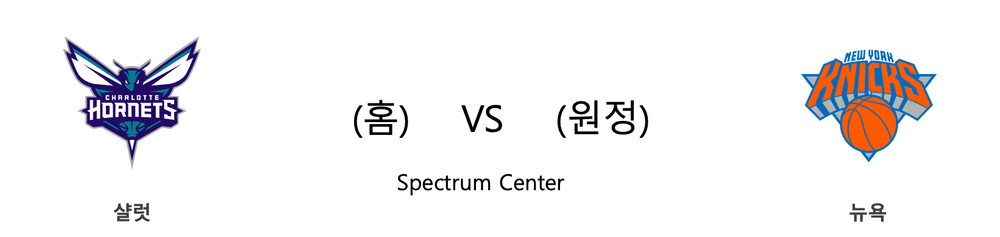

####  NOP(홈) VS DET(원정) 

#### 2018-2019 시즌 성적

<table class="tg">
  <tr>
    <td class="tg-rr9t">NOP</td>
    <td class="tg-rr9t">팀</td>
    <td class="tg-rr9t">DET</td>
  </tr>
  <tr>
    <th class="tg-dcpn">12위(13승 14패)</th>
    <th class="tg-o8le">시즌 순위</th>
    <th class="tg-dcpn">6위(13승 10패)</th>
  </tr>
  <tr>
    <td class="tg-txr3">118.1/115.9</td>
    <td class="tg-o8le">평균 득점/실점</td>
    <td class="tg-txr3">109.4/109.8</td>
  </tr>
  <tr>
    <td class="tg-dcpn">홈 3승 10패 원정 10승 4패</td>
    <td class="tg-wazi">홈/원정 성적</td>
    <td class="tg-dcpn">홈 4승 5패 원정 9승 5패</td>
  </tr>
</table>

#### 최근 5경기 상대전적(정규시즌)

<table class="tg">
  <tr>
    <th class="tg-d14o">경기일자 (홈팀)</th>
    <th class="tg-d14o">팀</th>
    <th class="tg-d14o">1Q</th>
    <th class="tg-d14o">2Q</th>
    <th class="tg-d14o">3Q</th>
    <th class="tg-d14o">4Q</th>
    <th class="tg-d14o">EQ</th>
    <th class="tg-d14o">Total</th>
    <th class="tg-d14o">승리팀</th>
  </tr>
</table> 
#### NOP 최근 5경기 분석(정규시즌)

<table class="tg">
  <tr>
    <th class="tg-d14o">경기일자 (홈팀)</th>
    <th class="tg-d14o">팀</th>
    <th class="tg-d14o">1Q</th>
    <th class="tg-d14o">2Q</th>
    <th class="tg-d14o">3Q</th>
    <th class="tg-d14o">4Q</th>
    <th class="tg-d14o">EQ</th>
    <th class="tg-d14o">Total</th>
    <th class="tg-d14o">승리팀</th>
  </tr>

<tr>
  <td class="tg-50j8" rowspan="2">2018-12-07(금) (MEM)</td>
  <td class="tg-50j8">MEM</td>
  <td class="tg-50j8">31</td>
  <td class="tg-50j8">27</td>
  <td class="tg-50j8">27</td>
  <td class="tg-50j8">22</td>
  <td class="tg-50j8">0</td>
  <td class="tg-jb7t">107</td>
  <td class="tg-50j8" rowspan="2">MEM</td>
</tr>
<tr>
  <td class="tg-50j8">NOP</td>
  <td class="tg-50j8">30</td>
  <td class="tg-50j8">30</td>
  <td class="tg-50j8">24</td>
  <td class="tg-50j8">19</td>
  <td class="tg-50j8">0</td>
  <td class=" tg-50j8">103</td>
</tr>

<tr>
  <td class="tg-50j8" rowspan="2">2018-12-05(수) (DAL)</td>
  <td class="tg-50j8">DAL</td>
  <td class="tg-50j8">31</td>
  <td class="tg-50j8">22</td>
  <td class="tg-50j8">27</td>
  <td class="tg-50j8">26</td>
  <td class="tg-50j8">0</td>
  <td class="tg-50j8">106</td>
  <td class="tg-50j8" rowspan="2">NOP</td>
</tr>
<tr>
  <td class="tg-50j8">NOP</td>
  <td class="tg-50j8">32</td>
  <td class="tg-50j8">37</td>
  <td class="tg-50j8">28</td>
  <td class="tg-50j8">35</td>
  <td class="tg-50j8">0</td>
  <td class=" tg-jb7t">132</td>
</tr>

<tr>
  <td class="tg-50j8" rowspan="2">2018-12-03(월) (LAC)</td>
  <td class="tg-50j8">LAC</td>
  <td class="tg-50j8">36</td>
  <td class="tg-50j8">41</td>
  <td class="tg-50j8">24</td>
  <td class="tg-50j8">28</td>
  <td class="tg-50j8">0</td>
  <td class="tg-jb7t">129</td>
  <td class="tg-50j8" rowspan="2">LAC</td>
</tr>
<tr>
  <td class="tg-50j8">NOP</td>
  <td class="tg-50j8">29</td>
  <td class="tg-50j8">36</td>
  <td class="tg-50j8">32</td>
  <td class="tg-50j8">29</td>
  <td class="tg-50j8">0</td>
  <td class=" tg-50j8">126</td>
</tr>

<tr>
  <td class="tg-50j8" rowspan="2">2018-12-02(일) (NOP)</td>
  <td class="tg-50j8">NOP</td>
  <td class="tg-50j8">29</td>
  <td class="tg-50j8">36</td>
  <td class="tg-50j8">22</td>
  <td class="tg-50j8">32</td>
  <td class="tg-50j8">0</td>
  <td class="tg-jb7t">119</td>
  <td class="tg-50j8" rowspan="2">NOP</td>
</tr>
<tr>
  <td class="tg-50j8">CHA</td>
  <td class="tg-50j8">30</td>
  <td class="tg-50j8">26</td>
  <td class="tg-50j8">21</td>
  <td class="tg-50j8">32</td>
  <td class="tg-50j8">0</td>
  <td class=" tg-50j8">109</td>
</tr>

<tr>
  <td class="tg-50j8" rowspan="2">2018-11-30(금) (NOP)</td>
  <td class="tg-50j8">NOP</td>
  <td class="tg-50j8">17</td>
  <td class="tg-50j8">24</td>
  <td class="tg-50j8">34</td>
  <td class="tg-50j8">26</td>
  <td class="tg-50j8">0</td>
  <td class="tg-50j8">101</td>
  <td class="tg-50j8" rowspan="2">MIA</td>
</tr>
<tr>
  <td class="tg-50j8">MIA</td>
  <td class="tg-50j8">37</td>
  <td class="tg-50j8">24</td>
  <td class="tg-50j8">20</td>
  <td class="tg-50j8">25</td>
  <td class="tg-50j8">0</td>
  <td class=" tg-jb7t">106</td>
</tr>
</table> 
#### DET 최근 5경기 분석(정규시즌)

<table class="tg">
  <tr>
    <th class="tg-d14o">경기일자 (홈팀)</th>
    <th class="tg-d14o">팀</th>
    <th class="tg-d14o">1Q</th>
    <th class="tg-d14o">2Q</th>
    <th class="tg-d14o">3Q</th>
    <th class="tg-d14o">4Q</th>
    <th class="tg-d14o">EQ</th>
    <th class="tg-d14o">Total</th>
    <th class="tg-d14o">승리팀</th>
  </tr>

<tr>
  <td class="tg-50j8" rowspan="2">2018-12-07(금) (PHI)</td>
  <td class="tg-50j8">PHI</td>
  <td class="tg-50j8">28</td>
  <td class="tg-50j8">28</td>
  <td class="tg-50j8">33</td>
  <td class="tg-50j8">28</td>
  <td class="tg-50j8">0</td>
  <td class="tg-jb7t">117</td>
  <td class="tg-50j8" rowspan="2">PHI</td>
</tr>
<tr>
  <td class="tg-50j8">DET</td>
  <td class="tg-50j8">27</td>
  <td class="tg-50j8">41</td>
  <td class="tg-50j8">22</td>
  <td class="tg-50j8">21</td>
  <td class="tg-50j8">0</td>
  <td class=" tg-50j8">111</td>
</tr>

<tr>
  <td class="tg-50j8" rowspan="2">2018-12-05(수) (DET)</td>
  <td class="tg-50j8">DET</td>
  <td class="tg-50j8">21</td>
  <td class="tg-50j8">24</td>
  <td class="tg-50j8">19</td>
  <td class="tg-50j8">28</td>
  <td class="tg-50j8">0</td>
  <td class="tg-50j8">92</td>
  <td class="tg-50j8" rowspan="2">MIL</td>
</tr>
<tr>
  <td class="tg-50j8">MIL</td>
  <td class="tg-50j8">30</td>
  <td class="tg-50j8">26</td>
  <td class="tg-50j8">28</td>
  <td class="tg-50j8">31</td>
  <td class="tg-50j8">0</td>
  <td class=" tg-jb7t">115</td>
</tr>

<tr>
  <td class="tg-50j8" rowspan="2">2018-12-03(월) (OKC)</td>
  <td class="tg-50j8">OKC</td>
  <td class="tg-50j8">26</td>
  <td class="tg-50j8">24</td>
  <td class="tg-50j8">37</td>
  <td class="tg-50j8">23</td>
  <td class="tg-50j8">0</td>
  <td class="tg-jb7t">110</td>
  <td class="tg-50j8" rowspan="2">OKC</td>
</tr>
<tr>
  <td class="tg-50j8">DET</td>
  <td class="tg-50j8">17</td>
  <td class="tg-50j8">23</td>
  <td class="tg-50j8">19</td>
  <td class="tg-50j8">24</td>
  <td class="tg-50j8">0</td>
  <td class=" tg-50j8">83</td>
</tr>

<tr>
  <td class="tg-50j8" rowspan="2">2018-12-01(토) (GSW)</td>
  <td class="tg-50j8">GSW</td>
  <td class="tg-50j8">24</td>
  <td class="tg-50j8">22</td>
  <td class="tg-50j8">32</td>
  <td class="tg-50j8">24</td>
  <td class="tg-50j8">0</td>
  <td class="tg-50j8">102</td>
  <td class="tg-50j8" rowspan="2">DET</td>
</tr>
<tr>
  <td class="tg-50j8">DET</td>
  <td class="tg-50j8">24</td>
  <td class="tg-50j8">30</td>
  <td class="tg-50j8">31</td>
  <td class="tg-50j8">26</td>
  <td class="tg-50j8">0</td>
  <td class=" tg-jb7t">111</td>
</tr>

<tr>
  <td class="tg-50j8" rowspan="2">2018-11-30(금) (CHI)</td>
  <td class="tg-50j8">CHI</td>
  <td class="tg-50j8">21</td>
  <td class="tg-50j8">19</td>
  <td class="tg-50j8">25</td>
  <td class="tg-50j8">23</td>
  <td class="tg-50j8">0</td>
  <td class="tg-50j8">88</td>
  <td class="tg-50j8" rowspan="2">DET</td>
</tr>
<tr>
  <td class="tg-50j8">DET</td>
  <td class="tg-50j8">34</td>
  <td class="tg-50j8">21</td>
  <td class="tg-50j8">24</td>
  <td class="tg-50j8">28</td>
  <td class="tg-50j8">0</td>
  <td class=" tg-jb7t">107</td>
</tr>
</table> 
####  MIL(홈) VS TOR(원정) 

#### 2018-2019 시즌 성적

<table class="tg">
  <tr>
    <td class="tg-rr9t">MIL</td>
    <td class="tg-rr9t">팀</td>
    <td class="tg-rr9t">TOR</td>
  </tr>
  <tr>
    <th class="tg-dcpn">3위(16승 8패)</th>
    <th class="tg-o8le">시즌 순위</th>
    <th class="tg-dcpn">1위(21승 6패)</th>
  </tr>
  <tr>
    <td class="tg-txr3">120.0/110.2</td>
    <td class="tg-o8le">평균 득점/실점</td>
    <td class="tg-txr3">116.0/108.0</td>
  </tr>
  <tr>
    <td class="tg-dcpn">홈 4승 5패 원정 12승 3패</td>
    <td class="tg-wazi">홈/원정 성적</td>
    <td class="tg-dcpn">홈 10승 3패 원정 11승 3패</td>
  </tr>
</table>

#### 최근 5경기 상대전적(정규시즌)

<table class="tg">
  <tr>
    <th class="tg-d14o">경기일자 (홈팀)</th>
    <th class="tg-d14o">팀</th>
    <th class="tg-d14o">1Q</th>
    <th class="tg-d14o">2Q</th>
    <th class="tg-d14o">3Q</th>
    <th class="tg-d14o">4Q</th>
    <th class="tg-d14o">EQ</th>
    <th class="tg-d14o">Total</th>
    <th class="tg-d14o">승리팀</th>
  </tr>

<tr>
  <td class="tg-50j8" rowspan="2">2018-10-29(월) (TOR)</td>
  <td class="tg-50j8">TOR</td>
  <td class="tg-50j8">29</td>
  <td class="tg-50j8">24</td>
  <td class="tg-50j8">27</td>
  <td class="tg-50j8">29</td>
  <td class="tg-50j8">0</td>
  <td class="tg-50j8">109</td>
  <td class="tg-50j8" rowspan="2">MIL</td>
</tr>
<tr>
  <td class="tg-50j8">MIL</td>
  <td class="tg-50j8">30</td>
  <td class="tg-50j8">32</td>
  <td class="tg-50j8">33</td>
  <td class="tg-50j8">29</td>
  <td class="tg-50j8">0</td>
  <td class=" tg-jb7t">124</td>
</tr>
</table> 
#### MIL 최근 5경기 분석(정규시즌)

<table class="tg">
  <tr>
    <th class="tg-d14o">경기일자 (홈팀)</th>
    <th class="tg-d14o">팀</th>
    <th class="tg-d14o">1Q</th>
    <th class="tg-d14o">2Q</th>
    <th class="tg-d14o">3Q</th>
    <th class="tg-d14o">4Q</th>
    <th class="tg-d14o">EQ</th>
    <th class="tg-d14o">Total</th>
    <th class="tg-d14o">승리팀</th>
  </tr>

<tr>
  <td class="tg-50j8" rowspan="2">2018-12-07(금) (GSW)</td>
  <td class="tg-50j8">GSW</td>
  <td class="tg-50j8">27</td>
  <td class="tg-50j8">30</td>
  <td class="tg-50j8">26</td>
  <td class="tg-50j8">22</td>
  <td class="tg-50j8">0</td>
  <td class="tg-jb7t">105</td>
  <td class="tg-50j8" rowspan="2">GSW</td>
</tr>
<tr>
  <td class="tg-50j8">MIL</td>
  <td class="tg-50j8">22</td>
  <td class="tg-50j8">29</td>
  <td class="tg-50j8">25</td>
  <td class="tg-50j8">19</td>
  <td class="tg-50j8">0</td>
  <td class=" tg-50j8">95</td>
</tr>

<tr>
  <td class="tg-50j8" rowspan="2">2018-12-05(수) (DET)</td>
  <td class="tg-50j8">DET</td>
  <td class="tg-50j8">21</td>
  <td class="tg-50j8">24</td>
  <td class="tg-50j8">19</td>
  <td class="tg-50j8">28</td>
  <td class="tg-50j8">0</td>
  <td class="tg-50j8">92</td>
  <td class="tg-50j8" rowspan="2">MIL</td>
</tr>
<tr>
  <td class="tg-50j8">MIL</td>
  <td class="tg-50j8">30</td>
  <td class="tg-50j8">26</td>
  <td class="tg-50j8">28</td>
  <td class="tg-50j8">31</td>
  <td class="tg-50j8">0</td>
  <td class=" tg-jb7t">115</td>
</tr>

<tr>
  <td class="tg-50j8" rowspan="2">2018-12-01(토) (MIL)</td>
  <td class="tg-50j8">MIL</td>
  <td class="tg-50j8">35</td>
  <td class="tg-50j8">31</td>
  <td class="tg-50j8">31</td>
  <td class="tg-50j8">27</td>
  <td class="tg-50j8">10</td>
  <td class="tg-50j8">134</td>
  <td class="tg-50j8" rowspan="2">NYK</td>
</tr>
<tr>
  <td class="tg-50j8">NYK</td>
  <td class="tg-50j8">28</td>
  <td class="tg-50j8">33</td>
  <td class="tg-50j8">32</td>
  <td class="tg-50j8">31</td>
  <td class="tg-50j8">12</td>
  <td class=" tg-jb7t">136</td>
</tr>

<tr>
  <td class="tg-50j8" rowspan="2">2018-11-28(수) (CHI)</td>
  <td class="tg-50j8">CHI</td>
  <td class="tg-50j8">40</td>
  <td class="tg-50j8">22</td>
  <td class="tg-50j8">27</td>
  <td class="tg-50j8">24</td>
  <td class="tg-50j8">0</td>
  <td class="tg-50j8">113</td>
  <td class="tg-50j8" rowspan="2">MIL</td>
</tr>
<tr>
  <td class="tg-50j8">MIL</td>
  <td class="tg-50j8">30</td>
  <td class="tg-50j8">33</td>
  <td class="tg-50j8">29</td>
  <td class="tg-50j8">24</td>
  <td class="tg-50j8">0</td>
  <td class=" tg-jb7t">116</td>
</tr>

<tr>
  <td class="tg-50j8" rowspan="2">2018-11-26(월) (MIL)</td>
  <td class="tg-50j8">MIL</td>
  <td class="tg-50j8">35</td>
  <td class="tg-50j8">17</td>
  <td class="tg-50j8">28</td>
  <td class="tg-50j8">27</td>
  <td class="tg-50j8">0</td>
  <td class="tg-50j8">107</td>
  <td class="tg-50j8" rowspan="2">CHA</td>
</tr>
<tr>
  <td class="tg-50j8">CHA</td>
  <td class="tg-50j8">32</td>
  <td class="tg-50j8">33</td>
  <td class="tg-50j8">28</td>
  <td class="tg-50j8">17</td>
  <td class="tg-50j8">0</td>
  <td class=" tg-jb7t">110</td>
</tr>
</table> 
#### TOR 최근 5경기 분석(정규시즌)

<table class="tg">
  <tr>
    <th class="tg-d14o">경기일자 (홈팀)</th>
    <th class="tg-d14o">팀</th>
    <th class="tg-d14o">1Q</th>
    <th class="tg-d14o">2Q</th>
    <th class="tg-d14o">3Q</th>
    <th class="tg-d14o">4Q</th>
    <th class="tg-d14o">EQ</th>
    <th class="tg-d14o">Total</th>
    <th class="tg-d14o">승리팀</th>
  </tr>

<tr>
  <td class="tg-50j8" rowspan="2">2018-12-07(금) (TOR)</td>
  <td class="tg-50j8">TOR</td>
  <td class="tg-50j8">20</td>
  <td class="tg-50j8">33</td>
  <td class="tg-50j8">26</td>
  <td class="tg-50j8">19</td>
  <td class="tg-50j8">7</td>
  <td class="tg-50j8">105</td>
  <td class="tg-50j8" rowspan="2">BKN</td>
</tr>
<tr>
  <td class="tg-50j8">BKN</td>
  <td class="tg-50j8">24</td>
  <td class="tg-50j8">29</td>
  <td class="tg-50j8">27</td>
  <td class="tg-50j8">18</td>
  <td class="tg-50j8">8</td>
  <td class=" tg-jb7t">106</td>
</tr>

<tr>
  <td class="tg-50j8" rowspan="2">2018-12-05(수) (PHI)</td>
  <td class="tg-50j8">PHI</td>
  <td class="tg-50j8">29</td>
  <td class="tg-50j8">20</td>
  <td class="tg-50j8">28</td>
  <td class="tg-50j8">25</td>
  <td class="tg-50j8">0</td>
  <td class="tg-50j8">102</td>
  <td class="tg-50j8" rowspan="2">TOR</td>
</tr>
<tr>
  <td class="tg-50j8">TOR</td>
  <td class="tg-50j8">23</td>
  <td class="tg-50j8">30</td>
  <td class="tg-50j8">25</td>
  <td class="tg-50j8">35</td>
  <td class="tg-50j8">0</td>
  <td class=" tg-jb7t">113</td>
</tr>

<tr>
  <td class="tg-50j8" rowspan="2">2018-12-03(월) (DEN)</td>
  <td class="tg-50j8">DEN</td>
  <td class="tg-50j8">27</td>
  <td class="tg-50j8">32</td>
  <td class="tg-50j8">27</td>
  <td class="tg-50j8">20</td>
  <td class="tg-50j8">0</td>
  <td class="tg-jb7t">106</td>
  <td class="tg-50j8" rowspan="2">DEN</td>
</tr>
<tr>
  <td class="tg-50j8">TOR</td>
  <td class="tg-50j8">24</td>
  <td class="tg-50j8">23</td>
  <td class="tg-50j8">31</td>
  <td class="tg-50j8">25</td>
  <td class="tg-50j8">0</td>
  <td class=" tg-50j8">103</td>
</tr>

<tr>
  <td class="tg-50j8" rowspan="2">2018-12-01(토) (TOR)</td>
  <td class="tg-50j8">TOR</td>
  <td class="tg-50j8">21</td>
  <td class="tg-50j8">26</td>
  <td class="tg-50j8">30</td>
  <td class="tg-50j8">29</td>
  <td class="tg-50j8">0</td>
  <td class="tg-jb7t">106</td>
  <td class="tg-50j8" rowspan="2">TOR</td>
</tr>
<tr>
  <td class="tg-50j8">CLE</td>
  <td class="tg-50j8">21</td>
  <td class="tg-50j8">19</td>
  <td class="tg-50j8">27</td>
  <td class="tg-50j8">28</td>
  <td class="tg-50j8">0</td>
  <td class=" tg-50j8">95</td>
</tr>

<tr>
  <td class="tg-50j8" rowspan="2">2018-11-29(목) (GSW)</td>
  <td class="tg-50j8">GSW</td>
  <td class="tg-50j8">25</td>
  <td class="tg-50j8">33</td>
  <td class="tg-50j8">30</td>
  <td class="tg-50j8">31</td>
  <td class="tg-50j8">9</td>
  <td class="tg-50j8">128</td>
  <td class="tg-50j8" rowspan="2">TOR</td>
</tr>
<tr>
  <td class="tg-50j8">TOR</td>
  <td class="tg-50j8">38</td>
  <td class="tg-50j8">29</td>
  <td class="tg-50j8">29</td>
  <td class="tg-50j8">23</td>
  <td class="tg-50j8">12</td>
  <td class=" tg-jb7t">131</td>
</tr>
</table> 
####  UTA(홈) VS SAS(원정) 

#### 2018-2019 시즌 성적

<table class="tg">
  <tr>
    <td class="tg-rr9t">UTA</td>
    <td class="tg-rr9t">팀</td>
    <td class="tg-rr9t">SAS</td>
  </tr>
  <tr>
    <th class="tg-dcpn">10위(13승 13패)</th>
    <th class="tg-o8le">시즌 순위</th>
    <th class="tg-dcpn">13위(12승 14패)</th>
  </tr>
  <tr>
    <td class="tg-txr3">107.4/107.2</td>
    <td class="tg-o8le">평균 득점/실점</td>
    <td class="tg-txr3">110.3/114.0</td>
  </tr>
  <tr>
    <td class="tg-dcpn">홈 9승 7패 원정 4승 6패</td>
    <td class="tg-wazi">홈/원정 성적</td>
    <td class="tg-dcpn">홈 4승 10패 원정 8승 4패</td>
  </tr>
</table>

#### 최근 5경기 상대전적(정규시즌)

<table class="tg">
  <tr>
    <th class="tg-d14o">경기일자 (홈팀)</th>
    <th class="tg-d14o">팀</th>
    <th class="tg-d14o">1Q</th>
    <th class="tg-d14o">2Q</th>
    <th class="tg-d14o">3Q</th>
    <th class="tg-d14o">4Q</th>
    <th class="tg-d14o">EQ</th>
    <th class="tg-d14o">Total</th>
    <th class="tg-d14o">승리팀</th>
  </tr>

<tr>
  <td class="tg-50j8" rowspan="2">2018-12-04(화) (SAS)</td>
  <td class="tg-50j8">SAS</td>
  <td class="tg-50j8">20</td>
  <td class="tg-50j8">27</td>
  <td class="tg-50j8">31</td>
  <td class="tg-50j8">27</td>
  <td class="tg-50j8">0</td>
  <td class="tg-50j8">105</td>
  <td class="tg-50j8" rowspan="2">UTA</td>
</tr>
<tr>
  <td class="tg-50j8">UTA</td>
  <td class="tg-50j8">34</td>
  <td class="tg-50j8">29</td>
  <td class="tg-50j8">41</td>
  <td class="tg-50j8">35</td>
  <td class="tg-50j8">0</td>
  <td class=" tg-jb7t">139</td>
</tr>
</table> 
#### UTA 최근 5경기 분석(정규시즌)

<table class="tg">
  <tr>
    <th class="tg-d14o">경기일자 (홈팀)</th>
    <th class="tg-d14o">팀</th>
    <th class="tg-d14o">1Q</th>
    <th class="tg-d14o">2Q</th>
    <th class="tg-d14o">3Q</th>
    <th class="tg-d14o">4Q</th>
    <th class="tg-d14o">EQ</th>
    <th class="tg-d14o">Total</th>
    <th class="tg-d14o">승리팀</th>
  </tr>

<tr>
  <td class="tg-50j8" rowspan="2">2018-12-06(목) (HOU)</td>
  <td class="tg-50j8">HOU</td>
  <td class="tg-50j8">18</td>
  <td class="tg-50j8">27</td>
  <td class="tg-50j8">11</td>
  <td class="tg-50j8">35</td>
  <td class="tg-50j8">0</td>
  <td class="tg-50j8">91</td>
  <td class="tg-50j8" rowspan="2">UTA</td>
</tr>
<tr>
  <td class="tg-50j8">UTA</td>
  <td class="tg-50j8">27</td>
  <td class="tg-50j8">26</td>
  <td class="tg-50j8">38</td>
  <td class="tg-50j8">27</td>
  <td class="tg-50j8">0</td>
  <td class=" tg-jb7t">118</td>
</tr>

<tr>
  <td class="tg-50j8" rowspan="2">2018-12-04(화) (SAS)</td>
  <td class="tg-50j8">SAS</td>
  <td class="tg-50j8">20</td>
  <td class="tg-50j8">27</td>
  <td class="tg-50j8">31</td>
  <td class="tg-50j8">27</td>
  <td class="tg-50j8">0</td>
  <td class="tg-50j8">105</td>
  <td class="tg-50j8" rowspan="2">UTA</td>
</tr>
<tr>
  <td class="tg-50j8">UTA</td>
  <td class="tg-50j8">34</td>
  <td class="tg-50j8">29</td>
  <td class="tg-50j8">41</td>
  <td class="tg-50j8">35</td>
  <td class="tg-50j8">0</td>
  <td class=" tg-jb7t">139</td>
</tr>

<tr>
  <td class="tg-50j8" rowspan="2">2018-12-02(일) (UTA)</td>
  <td class="tg-50j8">UTA</td>
  <td class="tg-50j8">35</td>
  <td class="tg-50j8">20</td>
  <td class="tg-50j8">22</td>
  <td class="tg-50j8">23</td>
  <td class="tg-50j8">0</td>
  <td class="tg-50j8">100</td>
  <td class="tg-50j8" rowspan="2">MIA</td>
</tr>
<tr>
  <td class="tg-50j8">MIA</td>
  <td class="tg-50j8">27</td>
  <td class="tg-50j8">26</td>
  <td class="tg-50j8">27</td>
  <td class="tg-50j8">22</td>
  <td class="tg-50j8">0</td>
  <td class=" tg-jb7t">102</td>
</tr>

<tr>
  <td class="tg-50j8" rowspan="2">2018-11-30(금) (UTA)</td>
  <td class="tg-50j8">UTA</td>
  <td class="tg-50j8">33</td>
  <td class="tg-50j8">24</td>
  <td class="tg-50j8">34</td>
  <td class="tg-50j8">28</td>
  <td class="tg-50j8">0</td>
  <td class="tg-jb7t">119</td>
  <td class="tg-50j8" rowspan="2">UTA</td>
</tr>
<tr>
  <td class="tg-50j8">CHA</td>
  <td class="tg-50j8">19</td>
  <td class="tg-50j8">34</td>
  <td class="tg-50j8">30</td>
  <td class="tg-50j8">28</td>
  <td class="tg-50j8">0</td>
  <td class=" tg-50j8">111</td>
</tr>

<tr>
  <td class="tg-50j8" rowspan="2">2018-11-28(수) (UTA)</td>
  <td class="tg-50j8">UTA</td>
  <td class="tg-50j8">17</td>
  <td class="tg-50j8">26</td>
  <td class="tg-50j8">27</td>
  <td class="tg-50j8">31</td>
  <td class="tg-50j8">0</td>
  <td class="tg-jb7t">101</td>
  <td class="tg-50j8" rowspan="2">UTA</td>
</tr>
<tr>
  <td class="tg-50j8">BKN</td>
  <td class="tg-50j8">16</td>
  <td class="tg-50j8">26</td>
  <td class="tg-50j8">36</td>
  <td class="tg-50j8">13</td>
  <td class="tg-50j8">0</td>
  <td class=" tg-50j8">91</td>
</tr>
</table> 
#### SAS 최근 5경기 분석(정규시즌)

<table class="tg">
  <tr>
    <th class="tg-d14o">경기일자 (홈팀)</th>
    <th class="tg-d14o">팀</th>
    <th class="tg-d14o">1Q</th>
    <th class="tg-d14o">2Q</th>
    <th class="tg-d14o">3Q</th>
    <th class="tg-d14o">4Q</th>
    <th class="tg-d14o">EQ</th>
    <th class="tg-d14o">Total</th>
    <th class="tg-d14o">승리팀</th>
  </tr>

<tr>
  <td class="tg-50j8" rowspan="2">2018-12-07(금) (LAL)</td>
  <td class="tg-50j8">LAL</td>
  <td class="tg-50j8">36</td>
  <td class="tg-50j8">36</td>
  <td class="tg-50j8">27</td>
  <td class="tg-50j8">21</td>
  <td class="tg-50j8">0</td>
  <td class="tg-50j8">120</td>
  <td class="tg-50j8" rowspan="2">SAS</td>
</tr>
<tr>
  <td class="tg-50j8">SAS</td>
  <td class="tg-50j8">32</td>
  <td class="tg-50j8">36</td>
  <td class="tg-50j8">21</td>
  <td class="tg-50j8">44</td>
  <td class="tg-50j8">0</td>
  <td class=" tg-jb7t">133</td>
</tr>

<tr>
  <td class="tg-50j8" rowspan="2">2018-12-05(수) (SAS)</td>
  <td class="tg-50j8">SAS</td>
  <td class="tg-50j8">23</td>
  <td class="tg-50j8">22</td>
  <td class="tg-50j8">37</td>
  <td class="tg-50j8">31</td>
  <td class="tg-50j8">0</td>
  <td class="tg-50j8">113</td>
  <td class="tg-50j8" rowspan="2">LAL</td>
</tr>
<tr>
  <td class="tg-50j8">LAL</td>
  <td class="tg-50j8">31</td>
  <td class="tg-50j8">19</td>
  <td class="tg-50j8">28</td>
  <td class="tg-50j8">43</td>
  <td class="tg-50j8">0</td>
  <td class=" tg-jb7t">121</td>
</tr>

<tr>
  <td class="tg-50j8" rowspan="2">2018-12-04(화) (SAS)</td>
  <td class="tg-50j8">SAS</td>
  <td class="tg-50j8">20</td>
  <td class="tg-50j8">27</td>
  <td class="tg-50j8">31</td>
  <td class="tg-50j8">27</td>
  <td class="tg-50j8">0</td>
  <td class="tg-50j8">105</td>
  <td class="tg-50j8" rowspan="2">UTA</td>
</tr>
<tr>
  <td class="tg-50j8">UTA</td>
  <td class="tg-50j8">34</td>
  <td class="tg-50j8">29</td>
  <td class="tg-50j8">41</td>
  <td class="tg-50j8">35</td>
  <td class="tg-50j8">0</td>
  <td class=" tg-jb7t">139</td>
</tr>

<tr>
  <td class="tg-50j8" rowspan="2">2018-12-02(일) (POR)</td>
  <td class="tg-50j8">POR</td>
  <td class="tg-50j8">33</td>
  <td class="tg-50j8">22</td>
  <td class="tg-50j8">35</td>
  <td class="tg-50j8">28</td>
  <td class="tg-50j8">0</td>
  <td class="tg-50j8">118</td>
  <td class="tg-50j8" rowspan="2">SAS</td>
</tr>
<tr>
  <td class="tg-50j8">SAS</td>
  <td class="tg-50j8">32</td>
  <td class="tg-50j8">30</td>
  <td class="tg-50j8">35</td>
  <td class="tg-50j8">34</td>
  <td class="tg-50j8">0</td>
  <td class=" tg-jb7t">131</td>
</tr>

<tr>
  <td class="tg-50j8" rowspan="2">2018-11-30(금) (HOU)</td>
  <td class="tg-50j8">HOU</td>
  <td class="tg-50j8">39</td>
  <td class="tg-50j8">31</td>
  <td class="tg-50j8">40</td>
  <td class="tg-50j8">26</td>
  <td class="tg-50j8">0</td>
  <td class="tg-jb7t">136</td>
  <td class="tg-50j8" rowspan="2">HOU</td>
</tr>
<tr>
  <td class="tg-50j8">SAS</td>
  <td class="tg-50j8">23</td>
  <td class="tg-50j8">24</td>
  <td class="tg-50j8">27</td>
  <td class="tg-50j8">31</td>
  <td class="tg-50j8">0</td>
  <td class=" tg-50j8">105</td>
</tr>
</table> 
####  CHA(홈) VS NYK(원정) 

#### 2018-2019 시즌 성적

<table class="tg">
  <tr>
    <td class="tg-rr9t">CHA</td>
    <td class="tg-rr9t">팀</td>
    <td class="tg-rr9t">NYK</td>
  </tr>
  <tr>
    <th class="tg-dcpn">7위(12승 13패)</th>
    <th class="tg-o8le">시즌 순위</th>
    <th class="tg-dcpn">12위(8승 19패)</th>
  </tr>
  <tr>
    <td class="tg-txr3">114.0/111.0</td>
    <td class="tg-o8le">평균 득점/실점</td>
    <td class="tg-txr3">108.4/114.8</td>
  </tr>
  <tr>
    <td class="tg-dcpn">홈 3승 8패 원정 9승 5패</td>
    <td class="tg-wazi">홈/원정 성적</td>
    <td class="tg-dcpn">홈 4승 11패 원정 4승 8패</td>
  </tr>
</table>

#### 최근 5경기 상대전적(정규시즌)

<table class="tg">
  <tr>
    <th class="tg-d14o">경기일자 (홈팀)</th>
    <th class="tg-d14o">팀</th>
    <th class="tg-d14o">1Q</th>
    <th class="tg-d14o">2Q</th>
    <th class="tg-d14o">3Q</th>
    <th class="tg-d14o">4Q</th>
    <th class="tg-d14o">EQ</th>
    <th class="tg-d14o">Total</th>
    <th class="tg-d14o">승리팀</th>
  </tr>
</table> 
#### CHA 최근 5경기 분석(정규시즌)

<table class="tg">
  <tr>
    <th class="tg-d14o">경기일자 (홈팀)</th>
    <th class="tg-d14o">팀</th>
    <th class="tg-d14o">1Q</th>
    <th class="tg-d14o">2Q</th>
    <th class="tg-d14o">3Q</th>
    <th class="tg-d14o">4Q</th>
    <th class="tg-d14o">EQ</th>
    <th class="tg-d14o">Total</th>
    <th class="tg-d14o">승리팀</th>
  </tr>

<tr>
  <td class="tg-50j8" rowspan="2">2018-12-07(금) (DEN)</td>
  <td class="tg-50j8">DEN</td>
  <td class="tg-50j8">25</td>
  <td class="tg-50j8">28</td>
  <td class="tg-50j8">26</td>
  <td class="tg-50j8">28</td>
  <td class="tg-50j8">0</td>
  <td class="tg-50j8">107</td>
  <td class="tg-50j8" rowspan="2">CHA</td>
</tr>
<tr>
  <td class="tg-50j8">CHA</td>
  <td class="tg-50j8">24</td>
  <td class="tg-50j8">40</td>
  <td class="tg-50j8">23</td>
  <td class="tg-50j8">26</td>
  <td class="tg-50j8">0</td>
  <td class=" tg-jb7t">113</td>
</tr>

<tr>
  <td class="tg-50j8" rowspan="2">2018-12-05(수) (CHA)</td>
  <td class="tg-50j8">CHA</td>
  <td class="tg-50j8">31</td>
  <td class="tg-50j8">33</td>
  <td class="tg-50j8">22</td>
  <td class="tg-50j8">18</td>
  <td class="tg-50j8">0</td>
  <td class="tg-50j8">104</td>
  <td class="tg-50j8" rowspan="2">MIN</td>
</tr>
<tr>
  <td class="tg-50j8">MIN</td>
  <td class="tg-50j8">31</td>
  <td class="tg-50j8">31</td>
  <td class="tg-50j8">24</td>
  <td class="tg-50j8">35</td>
  <td class="tg-50j8">0</td>
  <td class=" tg-jb7t">121</td>
</tr>

<tr>
  <td class="tg-50j8" rowspan="2">2018-12-02(일) (NOP)</td>
  <td class="tg-50j8">NOP</td>
  <td class="tg-50j8">29</td>
  <td class="tg-50j8">36</td>
  <td class="tg-50j8">22</td>
  <td class="tg-50j8">32</td>
  <td class="tg-50j8">0</td>
  <td class="tg-jb7t">119</td>
  <td class="tg-50j8" rowspan="2">NOP</td>
</tr>
<tr>
  <td class="tg-50j8">CHA</td>
  <td class="tg-50j8">30</td>
  <td class="tg-50j8">26</td>
  <td class="tg-50j8">21</td>
  <td class="tg-50j8">32</td>
  <td class="tg-50j8">0</td>
  <td class=" tg-50j8">109</td>
</tr>

<tr>
  <td class="tg-50j8" rowspan="2">2018-11-30(금) (UTA)</td>
  <td class="tg-50j8">UTA</td>
  <td class="tg-50j8">33</td>
  <td class="tg-50j8">24</td>
  <td class="tg-50j8">34</td>
  <td class="tg-50j8">28</td>
  <td class="tg-50j8">0</td>
  <td class="tg-jb7t">119</td>
  <td class="tg-50j8" rowspan="2">UTA</td>
</tr>
<tr>
  <td class="tg-50j8">CHA</td>
  <td class="tg-50j8">19</td>
  <td class="tg-50j8">34</td>
  <td class="tg-50j8">30</td>
  <td class="tg-50j8">28</td>
  <td class="tg-50j8">0</td>
  <td class=" tg-50j8">111</td>
</tr>

<tr>
  <td class="tg-50j8" rowspan="2">2018-11-28(수) (ATL)</td>
  <td class="tg-50j8">ATL</td>
  <td class="tg-50j8">28</td>
  <td class="tg-50j8">21</td>
  <td class="tg-50j8">26</td>
  <td class="tg-50j8">19</td>
  <td class="tg-50j8">0</td>
  <td class="tg-50j8">94</td>
  <td class="tg-50j8" rowspan="2">CHA</td>
</tr>
<tr>
  <td class="tg-50j8">CHA</td>
  <td class="tg-50j8">24</td>
  <td class="tg-50j8">31</td>
  <td class="tg-50j8">31</td>
  <td class="tg-50j8">22</td>
  <td class="tg-50j8">0</td>
  <td class=" tg-jb7t">108</td>
</tr>
</table> 
#### NYK 최근 5경기 분석(정규시즌)

<table class="tg">
  <tr>
    <th class="tg-d14o">경기일자 (홈팀)</th>
    <th class="tg-d14o">팀</th>
    <th class="tg-d14o">1Q</th>
    <th class="tg-d14o">2Q</th>
    <th class="tg-d14o">3Q</th>
    <th class="tg-d14o">4Q</th>
    <th class="tg-d14o">EQ</th>
    <th class="tg-d14o">Total</th>
    <th class="tg-d14o">승리팀</th>
  </tr>

<tr>
  <td class="tg-50j8" rowspan="2">2018-12-08(토) (BKN)</td>
  <td class="tg-50j8">BKN</td>
  <td class="tg-50j8">30</td>
  <td class="tg-50j8">26</td>
  <td class="tg-50j8">38</td>
  <td class="tg-50j8">18</td>
  <td class="tg-50j8">0</td>
  <td class="tg-jb7t">112</td>
  <td class="tg-50j8" rowspan="2">BKN</td>
</tr>
<tr>
  <td class="tg-50j8">NYK</td>
  <td class="tg-50j8">23</td>
  <td class="tg-50j8">22</td>
  <td class="tg-50j8">32</td>
  <td class="tg-50j8">27</td>
  <td class="tg-50j8">0</td>
  <td class=" tg-50j8">104</td>
</tr>

<tr>
  <td class="tg-50j8" rowspan="2">2018-12-06(목) (NYK)</td>
  <td class="tg-50j8">NYK</td>
  <td class="tg-50j8">30</td>
  <td class="tg-50j8">28</td>
  <td class="tg-50j8">26</td>
  <td class="tg-50j8">16</td>
  <td class="tg-50j8">0</td>
  <td class="tg-50j8">100</td>
  <td class="tg-50j8" rowspan="2">BOS</td>
</tr>
<tr>
  <td class="tg-50j8">BOS</td>
  <td class="tg-50j8">38</td>
  <td class="tg-50j8">31</td>
  <td class="tg-50j8">30</td>
  <td class="tg-50j8">29</td>
  <td class="tg-50j8">0</td>
  <td class=" tg-jb7t">128</td>
</tr>

<tr>
  <td class="tg-50j8" rowspan="2">2018-12-03(월) (WAS)</td>
  <td class="tg-50j8">WAS</td>
  <td class="tg-50j8">26</td>
  <td class="tg-50j8">26</td>
  <td class="tg-50j8">34</td>
  <td class="tg-50j8">24</td>
  <td class="tg-50j8">0</td>
  <td class="tg-jb7t">110</td>
  <td class="tg-50j8" rowspan="2">WAS</td>
</tr>
<tr>
  <td class="tg-50j8">NYK</td>
  <td class="tg-50j8">32</td>
  <td class="tg-50j8">29</td>
  <td class="tg-50j8">19</td>
  <td class="tg-50j8">27</td>
  <td class="tg-50j8">0</td>
  <td class=" tg-50j8">107</td>
</tr>

<tr>
  <td class="tg-50j8" rowspan="2">2018-12-01(토) (MIL)</td>
  <td class="tg-50j8">MIL</td>
  <td class="tg-50j8">35</td>
  <td class="tg-50j8">31</td>
  <td class="tg-50j8">31</td>
  <td class="tg-50j8">27</td>
  <td class="tg-50j8">10</td>
  <td class="tg-50j8">134</td>
  <td class="tg-50j8" rowspan="2">NYK</td>
</tr>
<tr>
  <td class="tg-50j8">NYK</td>
  <td class="tg-50j8">28</td>
  <td class="tg-50j8">33</td>
  <td class="tg-50j8">32</td>
  <td class="tg-50j8">31</td>
  <td class="tg-50j8">12</td>
  <td class=" tg-jb7t">136</td>
</tr>

<tr>
  <td class="tg-50j8" rowspan="2">2018-11-28(수) (NYK)</td>
  <td class="tg-50j8">NYK</td>
  <td class="tg-50j8">27</td>
  <td class="tg-50j8">21</td>
  <td class="tg-50j8">20</td>
  <td class="tg-50j8">23</td>
  <td class="tg-50j8">0</td>
  <td class="tg-50j8">91</td>
  <td class="tg-50j8" rowspan="2">PHI</td>
</tr>
<tr>
  <td class="tg-50j8">PHI</td>
  <td class="tg-50j8">41</td>
  <td class="tg-50j8">27</td>
  <td class="tg-50j8">25</td>
  <td class="tg-50j8">24</td>
  <td class="tg-50j8">0</td>
  <td class=" tg-jb7t">117</td>
</tr>
</table> 
#### 리그 (Eastern) 순위
    

<table class="tg">
  <tr>
    <th class="tg-d14o">순위</th>
    <th class="tg-d14o">팀명</th>
    <th class="tg-d14o">경기수</th>
    <th class="tg-d14o">승</th>
    <th class="tg-d14o">패</th>
    <th class="tg-d14o">승차</th>
    <th class="tg-d14o">승률</th>
  </tr>
  
<tr>
    <td class="tg-50j8">1</td>
    <td class="tg-50j8">TOR</td>
    <td class="tg-50j8">27</td>
    <td class="tg-50j8">21</td>
    <td class="tg-50j8">6</td>
    <td class="tg-50j8">0</td>
    <td class="tg-50j8">0.778</td>
</tr>

<tr>
    <td class="tg-50j8">2</td>
    <td class="tg-50j8">PHI</td>
    <td class="tg-50j8">27</td>
    <td class="tg-50j8">18</td>
    <td class="tg-50j8">9</td>
    <td class="tg-50j8">3</td>
    <td class="tg-50j8">0.667</td>
</tr>

<tr>
    <td class="tg-50j8">3</td>
    <td class="tg-50j8">MIL</td>
    <td class="tg-50j8">24</td>
    <td class="tg-50j8">16</td>
    <td class="tg-50j8">8</td>
    <td class="tg-50j8">5</td>
    <td class="tg-50j8">0.667</td>
</tr>

<tr>
    <td class="tg-50j8">4</td>
    <td class="tg-50j8">IND</td>
    <td class="tg-50j8">26</td>
    <td class="tg-50j8">16</td>
    <td class="tg-50j8">10</td>
    <td class="tg-50j8">5</td>
    <td class="tg-50j8">0.615</td>
</tr>

<tr>
    <td class="tg-50j8">5</td>
    <td class="tg-50j8">BOS</td>
    <td class="tg-50j8">25</td>
    <td class="tg-50j8">15</td>
    <td class="tg-50j8">10</td>
    <td class="tg-50j8">6</td>
    <td class="tg-50j8">0.6</td>
</tr>

<tr>
    <td class="tg-50j8">6</td>
    <td class="tg-50j8">DET</td>
    <td class="tg-50j8">23</td>
    <td class="tg-50j8">13</td>
    <td class="tg-50j8">10</td>
    <td class="tg-50j8">8</td>
    <td class="tg-50j8">0.565</td>
</tr>

<tr>
    <td class="tg-50j8">7</td>
    <td class="tg-50j8">CHA</td>
    <td class="tg-50j8">25</td>
    <td class="tg-50j8">12</td>
    <td class="tg-50j8">13</td>
    <td class="tg-50j8">9</td>
    <td class="tg-50j8">0.48</td>
</tr>

<tr>
    <td class="tg-50j8">8</td>
    <td class="tg-50j8">ORL</td>
    <td class="tg-50j8">26</td>
    <td class="tg-50j8">12</td>
    <td class="tg-50j8">14</td>
    <td class="tg-50j8">9</td>
    <td class="tg-50j8">0.462</td>
</tr>

<tr>
    <td class="tg-50j8">9</td>
    <td class="tg-50j8">MIA</td>
    <td class="tg-50j8">25</td>
    <td class="tg-50j8">11</td>
    <td class="tg-50j8">14</td>
    <td class="tg-50j8">10</td>
    <td class="tg-50j8">0.44</td>
</tr>

<tr>
    <td class="tg-50j8">10</td>
    <td class="tg-50j8">WAS</td>
    <td class="tg-50j8">26</td>
    <td class="tg-50j8">11</td>
    <td class="tg-50j8">15</td>
    <td class="tg-50j8">10</td>
    <td class="tg-50j8">0.423</td>
</tr>

<tr>
    <td class="tg-50j8">11</td>
    <td class="tg-50j8">BKN</td>
    <td class="tg-50j8">28</td>
    <td class="tg-50j8">10</td>
    <td class="tg-50j8">18</td>
    <td class="tg-50j8">11</td>
    <td class="tg-50j8">0.357</td>
</tr>

<tr>
    <td class="tg-50j8">12</td>
    <td class="tg-50j8">NYK</td>
    <td class="tg-50j8">27</td>
    <td class="tg-50j8">8</td>
    <td class="tg-50j8">19</td>
    <td class="tg-50j8">13</td>
    <td class="tg-50j8">0.296</td>
</tr>

<tr>
    <td class="tg-50j8">13</td>
    <td class="tg-50j8">ATL</td>
    <td class="tg-50j8">26</td>
    <td class="tg-50j8">6</td>
    <td class="tg-50j8">20</td>
    <td class="tg-50j8">15</td>
    <td class="tg-50j8">0.231</td>
</tr>

<tr>
    <td class="tg-50j8">13</td>
    <td class="tg-50j8">CLE</td>
    <td class="tg-50j8">26</td>
    <td class="tg-50j8">6</td>
    <td class="tg-50j8">20</td>
    <td class="tg-50j8">15</td>
    <td class="tg-50j8">0.231</td>
</tr>

<tr>
    <td class="tg-50j8">15</td>
    <td class="tg-50j8">CHI</td>
    <td class="tg-50j8">27</td>
    <td class="tg-50j8">6</td>
    <td class="tg-50j8">21</td>
    <td class="tg-50j8">15</td>
    <td class="tg-50j8">0.222</td>
</tr>
</table> 
#### 리그 (Western) 순위
    

<table class="tg">
  <tr>
    <th class="tg-d14o">순위</th>
    <th class="tg-d14o">팀명</th>
    <th class="tg-d14o">경기수</th>
    <th class="tg-d14o">승</th>
    <th class="tg-d14o">패</th>
    <th class="tg-d14o">승차</th>
    <th class="tg-d14o">승률</th>
  </tr>
  
<tr>
    <td class="tg-50j8">1</td>
    <td class="tg-50j8">GSW</td>
    <td class="tg-50j8">27</td>
    <td class="tg-50j8">18</td>
    <td class="tg-50j8">9</td>
    <td class="tg-50j8">3</td>
    <td class="tg-50j8">0.667</td>
</tr>

<tr>
    <td class="tg-50j8">2</td>
    <td class="tg-50j8">DEN</td>
    <td class="tg-50j8">26</td>
    <td class="tg-50j8">17</td>
    <td class="tg-50j8">9</td>
    <td class="tg-50j8">4</td>
    <td class="tg-50j8">0.654</td>
</tr>

<tr>
    <td class="tg-50j8">3</td>
    <td class="tg-50j8">OKC</td>
    <td class="tg-50j8">24</td>
    <td class="tg-50j8">16</td>
    <td class="tg-50j8">8</td>
    <td class="tg-50j8">5</td>
    <td class="tg-50j8">0.667</td>
</tr>

<tr>
    <td class="tg-50j8">4</td>
    <td class="tg-50j8">LAC</td>
    <td class="tg-50j8">25</td>
    <td class="tg-50j8">16</td>
    <td class="tg-50j8">9</td>
    <td class="tg-50j8">5</td>
    <td class="tg-50j8">0.64</td>
</tr>

<tr>
    <td class="tg-50j8">5</td>
    <td class="tg-50j8">LAL</td>
    <td class="tg-50j8">26</td>
    <td class="tg-50j8">16</td>
    <td class="tg-50j8">10</td>
    <td class="tg-50j8">5</td>
    <td class="tg-50j8">0.615</td>
</tr>

<tr>
    <td class="tg-50j8">6</td>
    <td class="tg-50j8">MEM</td>
    <td class="tg-50j8">25</td>
    <td class="tg-50j8">15</td>
    <td class="tg-50j8">10</td>
    <td class="tg-50j8">6</td>
    <td class="tg-50j8">0.6</td>
</tr>

<tr>
    <td class="tg-50j8">7</td>
    <td class="tg-50j8">POR</td>
    <td class="tg-50j8">26</td>
    <td class="tg-50j8">15</td>
    <td class="tg-50j8">11</td>
    <td class="tg-50j8">6</td>
    <td class="tg-50j8">0.577</td>
</tr>

<tr>
    <td class="tg-50j8">8</td>
    <td class="tg-50j8">DAL</td>
    <td class="tg-50j8">24</td>
    <td class="tg-50j8">13</td>
    <td class="tg-50j8">11</td>
    <td class="tg-50j8">8</td>
    <td class="tg-50j8">0.542</td>
</tr>

<tr>
    <td class="tg-50j8">9</td>
    <td class="tg-50j8">SAC</td>
    <td class="tg-50j8">25</td>
    <td class="tg-50j8">13</td>
    <td class="tg-50j8">12</td>
    <td class="tg-50j8">8</td>
    <td class="tg-50j8">0.52</td>
</tr>

<tr>
    <td class="tg-50j8">10</td>
    <td class="tg-50j8">UTA</td>
    <td class="tg-50j8">26</td>
    <td class="tg-50j8">13</td>
    <td class="tg-50j8">13</td>
    <td class="tg-50j8">8</td>
    <td class="tg-50j8">0.5</td>
</tr>

<tr>
    <td class="tg-50j8">10</td>
    <td class="tg-50j8">MIN</td>
    <td class="tg-50j8">26</td>
    <td class="tg-50j8">13</td>
    <td class="tg-50j8">13</td>
    <td class="tg-50j8">8</td>
    <td class="tg-50j8">0.5</td>
</tr>

<tr>
    <td class="tg-50j8">12</td>
    <td class="tg-50j8">NOP</td>
    <td class="tg-50j8">27</td>
    <td class="tg-50j8">13</td>
    <td class="tg-50j8">14</td>
    <td class="tg-50j8">8</td>
    <td class="tg-50j8">0.481</td>
</tr>

<tr>
    <td class="tg-50j8">13</td>
    <td class="tg-50j8">SAS</td>
    <td class="tg-50j8">26</td>
    <td class="tg-50j8">12</td>
    <td class="tg-50j8">14</td>
    <td class="tg-50j8">9</td>
    <td class="tg-50j8">0.462</td>
</tr>

<tr>
    <td class="tg-50j8">14</td>
    <td class="tg-50j8">HOU</td>
    <td class="tg-50j8">25</td>
    <td class="tg-50j8">11</td>
    <td class="tg-50j8">14</td>
    <td class="tg-50j8">10</td>
    <td class="tg-50j8">0.44</td>
</tr>

<tr>
    <td class="tg-50j8">15</td>
    <td class="tg-50j8">PHX</td>
    <td class="tg-50j8">26</td>
    <td class="tg-50j8">4</td>
    <td class="tg-50j8">22</td>
    <td class="tg-50j8">17</td>
    <td class="tg-50j8">0.154</td>
</tr>
</table> 