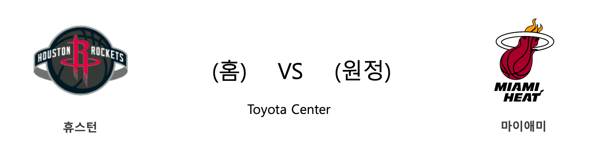

####  HOU(홈) VS MIA(원정) 

#### 2018-2019 시즌 성적

<table class="tg">
  <tr>
    <td class="tg-rr9t">HOU</td>
    <td class="tg-rr9t">팀</td>
    <td class="tg-rr9t">MIA</td>
  </tr>
  <tr>
    <th class="tg-dcpn">8위(16승 14패)</th>
    <th class="tg-o8le">시즌 순위</th>
    <th class="tg-dcpn">10위(13승 16패)</th>
  </tr>
  <tr>
    <td class="tg-txr3">109.6/109.0</td>
    <td class="tg-o8le">평균 득점/실점</td>
    <td class="tg-txr3">106.8/107.7</td>
  </tr>
  <tr>
    <td class="tg-dcpn">홈 7승 9패 원정 9승 5패</td>
    <td class="tg-wazi">홈/원정 성적</td>
    <td class="tg-dcpn">홈 8승 7패 원정 5승 9패</td>
  </tr>
</table>

#### 최근 5경기 상대전적(정규시즌)

<table class="tg">
  <tr>
    <th class="tg-d14o">경기일자 (홈팀)</th>
    <th class="tg-d14o">팀</th>
    <th class="tg-d14o">1Q</th>
    <th class="tg-d14o">2Q</th>
    <th class="tg-d14o">3Q</th>
    <th class="tg-d14o">4Q</th>
    <th class="tg-d14o">EQ</th>
    <th class="tg-d14o">Total</th>
    <th class="tg-d14o">승리팀</th>
  </tr>
</table> 
#### HOU 최근 5경기 분석(정규시즌)

<table class="tg">
  <tr>
    <th class="tg-d14o">경기일자 (홈팀)</th>
    <th class="tg-d14o">팀</th>
    <th class="tg-d14o">1Q</th>
    <th class="tg-d14o">2Q</th>
    <th class="tg-d14o">3Q</th>
    <th class="tg-d14o">4Q</th>
    <th class="tg-d14o">EQ</th>
    <th class="tg-d14o">Total</th>
    <th class="tg-d14o">승리팀</th>
  </tr>

<tr>
  <td class="tg-50j8" rowspan="2">2018-12-19(수) (WAS)</td>
  <td class="tg-50j8">WAS</td>
  <td class="tg-50j8">28</td>
  <td class="tg-50j8">30</td>
  <td class="tg-50j8">32</td>
  <td class="tg-50j8">28</td>
  <td class="tg-50j8">0</td>
  <td class="tg-50j8">118</td>
  <td class="tg-50j8" rowspan="2">HOU</td>
</tr>
<tr>
  <td class="tg-50j8">HOU</td>
  <td class="tg-50j8">34</td>
  <td class="tg-50j8">36</td>
  <td class="tg-50j8">31</td>
  <td class="tg-50j8">35</td>
  <td class="tg-50j8">0</td>
  <td class=" tg-jb7t">136</td>
</tr>

<tr>
  <td class="tg-50j8" rowspan="2">2018-12-17(월) (UTA)</td>
  <td class="tg-50j8">UTA</td>
  <td class="tg-50j8">23</td>
  <td class="tg-50j8">14</td>
  <td class="tg-50j8">36</td>
  <td class="tg-50j8">24</td>
  <td class="tg-50j8">0</td>
  <td class="tg-50j8">97</td>
  <td class="tg-50j8" rowspan="2">HOU</td>
</tr>
<tr>
  <td class="tg-50j8">HOU</td>
  <td class="tg-50j8">25</td>
  <td class="tg-50j8">25</td>
  <td class="tg-50j8">33</td>
  <td class="tg-50j8">19</td>
  <td class="tg-50j8">0</td>
  <td class=" tg-jb7t">102</td>
</tr>

<tr>
  <td class="tg-50j8" rowspan="2">2018-12-15(토) (HOU)</td>
  <td class="tg-50j8">HOU</td>
  <td class="tg-50j8">36</td>
  <td class="tg-50j8">25</td>
  <td class="tg-50j8">18</td>
  <td class="tg-50j8">26</td>
  <td class="tg-50j8">0</td>
  <td class="tg-jb7t">105</td>
  <td class="tg-50j8" rowspan="2">HOU</td>
</tr>
<tr>
  <td class="tg-50j8">MEM</td>
  <td class="tg-50j8">29</td>
  <td class="tg-50j8">11</td>
  <td class="tg-50j8">25</td>
  <td class="tg-50j8">32</td>
  <td class="tg-50j8">0</td>
  <td class=" tg-50j8">97</td>
</tr>

<tr>
  <td class="tg-50j8" rowspan="2">2018-12-13(목) (LAL)</td>
  <td class="tg-50j8">LAL</td>
  <td class="tg-50j8">24</td>
  <td class="tg-50j8">32</td>
  <td class="tg-50j8">32</td>
  <td class="tg-50j8">23</td>
  <td class="tg-50j8">0</td>
  <td class="tg-50j8">111</td>
  <td class="tg-50j8" rowspan="2">HOU</td>
</tr>
<tr>
  <td class="tg-50j8">HOU</td>
  <td class="tg-50j8">29</td>
  <td class="tg-50j8">33</td>
  <td class="tg-50j8">28</td>
  <td class="tg-50j8">36</td>
  <td class="tg-50j8">0</td>
  <td class=" tg-jb7t">126</td>
</tr>

<tr>
  <td class="tg-50j8" rowspan="2">2018-12-11(화) (POR)</td>
  <td class="tg-50j8">POR</td>
  <td class="tg-50j8">29</td>
  <td class="tg-50j8">25</td>
  <td class="tg-50j8">24</td>
  <td class="tg-50j8">26</td>
  <td class="tg-50j8">0</td>
  <td class="tg-50j8">104</td>
  <td class="tg-50j8" rowspan="2">HOU</td>
</tr>
<tr>
  <td class="tg-50j8">HOU</td>
  <td class="tg-50j8">27</td>
  <td class="tg-50j8">24</td>
  <td class="tg-50j8">30</td>
  <td class="tg-50j8">30</td>
  <td class="tg-50j8">0</td>
  <td class=" tg-jb7t">111</td>
</tr>
</table> 
#### MIA 최근 5경기 분석(정규시즌)

<table class="tg">
  <tr>
    <th class="tg-d14o">경기일자 (홈팀)</th>
    <th class="tg-d14o">팀</th>
    <th class="tg-d14o">1Q</th>
    <th class="tg-d14o">2Q</th>
    <th class="tg-d14o">3Q</th>
    <th class="tg-d14o">4Q</th>
    <th class="tg-d14o">EQ</th>
    <th class="tg-d14o">Total</th>
    <th class="tg-d14o">승리팀</th>
  </tr>

<tr>
  <td class="tg-50j8" rowspan="2">2018-12-16(일) (MIA)</td>
  <td class="tg-50j8">MIA</td>
  <td class="tg-50j8">33</td>
  <td class="tg-50j8">24</td>
  <td class="tg-50j8">28</td>
  <td class="tg-50j8">17</td>
  <td class="tg-50j8">0</td>
  <td class="tg-jb7t">102</td>
  <td class="tg-50j8" rowspan="2">MIA</td>
</tr>
<tr>
  <td class="tg-50j8">NOP</td>
  <td class="tg-50j8">28</td>
  <td class="tg-50j8">23</td>
  <td class="tg-50j8">22</td>
  <td class="tg-50j8">23</td>
  <td class="tg-50j8">0</td>
  <td class=" tg-50j8">96</td>
</tr>

<tr>
  <td class="tg-50j8" rowspan="2">2018-12-14(금) (MIA)</td>
  <td class="tg-50j8">MIA</td>
  <td class="tg-50j8">29</td>
  <td class="tg-50j8">22</td>
  <td class="tg-50j8">20</td>
  <td class="tg-50j8">29</td>
  <td class="tg-50j8">0</td>
  <td class="tg-jb7t">100</td>
  <td class="tg-50j8" rowspan="2">MIA</td>
</tr>
<tr>
  <td class="tg-50j8">MEM</td>
  <td class="tg-50j8">28</td>
  <td class="tg-50j8">21</td>
  <td class="tg-50j8">24</td>
  <td class="tg-50j8">24</td>
  <td class="tg-50j8">0</td>
  <td class=" tg-50j8">97</td>
</tr>

<tr>
  <td class="tg-50j8" rowspan="2">2018-12-12(수) (MIA)</td>
  <td class="tg-50j8">MIA</td>
  <td class="tg-50j8">15</td>
  <td class="tg-50j8">18</td>
  <td class="tg-50j8">20</td>
  <td class="tg-50j8">31</td>
  <td class="tg-50j8">0</td>
  <td class="tg-50j8">84</td>
  <td class="tg-50j8" rowspan="2">UTA</td>
</tr>
<tr>
  <td class="tg-50j8">UTA</td>
  <td class="tg-50j8">40</td>
  <td class="tg-50j8">20</td>
  <td class="tg-50j8">32</td>
  <td class="tg-50j8">19</td>
  <td class="tg-50j8">0</td>
  <td class=" tg-jb7t">111</td>
</tr>

<tr>
  <td class="tg-50j8" rowspan="2">2018-12-10(월) (MIA)</td>
  <td class="tg-50j8">MIA</td>
  <td class="tg-50j8">23</td>
  <td class="tg-50j8">35</td>
  <td class="tg-50j8">25</td>
  <td class="tg-50j8">22</td>
  <td class="tg-50j8">0</td>
  <td class="tg-50j8">105</td>
  <td class="tg-50j8" rowspan="2">LAL</td>
</tr>
<tr>
  <td class="tg-50j8">LAL</td>
  <td class="tg-50j8">27</td>
  <td class="tg-50j8">28</td>
  <td class="tg-50j8">29</td>
  <td class="tg-50j8">24</td>
  <td class="tg-50j8">0</td>
  <td class=" tg-jb7t">108</td>
</tr>

<tr>
  <td class="tg-50j8" rowspan="2">2018-12-08(토) (MIA)</td>
  <td class="tg-50j8">MIA</td>
  <td class="tg-50j8">34</td>
  <td class="tg-50j8">31</td>
  <td class="tg-50j8">26</td>
  <td class="tg-50j8">30</td>
  <td class="tg-50j8">0</td>
  <td class="tg-jb7t">121</td>
  <td class="tg-50j8" rowspan="2">MIA</td>
</tr>
<tr>
  <td class="tg-50j8">LAC</td>
  <td class="tg-50j8">30</td>
  <td class="tg-50j8">32</td>
  <td class="tg-50j8">28</td>
  <td class="tg-50j8">8</td>
  <td class="tg-50j8">0</td>
  <td class=" tg-50j8">98</td>
</tr>
</table> 
####  DAL(홈) VS LAC(원정) 

#### 2018-2019 시즌 성적

<table class="tg">
  <tr>
    <td class="tg-rr9t">DAL</td>
    <td class="tg-rr9t">팀</td>
    <td class="tg-rr9t">LAC</td>
  </tr>
  <tr>
    <th class="tg-dcpn">11위(15승 14패)</th>
    <th class="tg-o8le">시즌 순위</th>
    <th class="tg-dcpn">6위(17승 13패)</th>
  </tr>
  <tr>
    <td class="tg-txr3">109.9/108.7</td>
    <td class="tg-o8le">평균 득점/실점</td>
    <td class="tg-txr3">114.4/114.1</td>
  </tr>
  <tr>
    <td class="tg-dcpn">홈 2승 11패 원정 13승 3패</td>
    <td class="tg-wazi">홈/원정 성적</td>
    <td class="tg-dcpn">홈 8승 9패 원정 9승 4패</td>
  </tr>
</table>

#### 최근 5경기 상대전적(정규시즌)

<table class="tg">
  <tr>
    <th class="tg-d14o">경기일자 (홈팀)</th>
    <th class="tg-d14o">팀</th>
    <th class="tg-d14o">1Q</th>
    <th class="tg-d14o">2Q</th>
    <th class="tg-d14o">3Q</th>
    <th class="tg-d14o">4Q</th>
    <th class="tg-d14o">EQ</th>
    <th class="tg-d14o">Total</th>
    <th class="tg-d14o">승리팀</th>
  </tr>

<tr>
  <td class="tg-50j8" rowspan="2">2018-12-02(일) (LAC)</td>
  <td class="tg-50j8">LAC</td>
  <td class="tg-50j8">35</td>
  <td class="tg-50j8">23</td>
  <td class="tg-50j8">22</td>
  <td class="tg-50j8">30</td>
  <td class="tg-50j8">0</td>
  <td class="tg-50j8">110</td>
  <td class="tg-50j8" rowspan="2">DAL</td>
</tr>
<tr>
  <td class="tg-50j8">DAL</td>
  <td class="tg-50j8">34</td>
  <td class="tg-50j8">28</td>
  <td class="tg-50j8">26</td>
  <td class="tg-50j8">26</td>
  <td class="tg-50j8">0</td>
  <td class=" tg-jb7t">114</td>
</tr>
</table> 
#### DAL 최근 5경기 분석(정규시즌)

<table class="tg">
  <tr>
    <th class="tg-d14o">경기일자 (홈팀)</th>
    <th class="tg-d14o">팀</th>
    <th class="tg-d14o">1Q</th>
    <th class="tg-d14o">2Q</th>
    <th class="tg-d14o">3Q</th>
    <th class="tg-d14o">4Q</th>
    <th class="tg-d14o">EQ</th>
    <th class="tg-d14o">Total</th>
    <th class="tg-d14o">승리팀</th>
  </tr>

<tr>
  <td class="tg-50j8" rowspan="2">2018-12-18(화) (DAL)</td>
  <td class="tg-50j8">DAL</td>
  <td class="tg-50j8">33</td>
  <td class="tg-50j8">36</td>
  <td class="tg-50j8">26</td>
  <td class="tg-50j8">23</td>
  <td class="tg-50j8">0</td>
  <td class="tg-50j8">118</td>
  <td class="tg-50j8" rowspan="2">DEN</td>
</tr>
<tr>
  <td class="tg-50j8">DEN</td>
  <td class="tg-50j8">34</td>
  <td class="tg-50j8">40</td>
  <td class="tg-50j8">31</td>
  <td class="tg-50j8">21</td>
  <td class="tg-50j8">0</td>
  <td class=" tg-jb7t">126</td>
</tr>

<tr>
  <td class="tg-50j8" rowspan="2">2018-12-16(일) (SAC)</td>
  <td class="tg-50j8">SAC</td>
  <td class="tg-50j8">34</td>
  <td class="tg-50j8">27</td>
  <td class="tg-50j8">32</td>
  <td class="tg-50j8">27</td>
  <td class="tg-50j8">0</td>
  <td class="tg-jb7t">120</td>
  <td class="tg-50j8" rowspan="2">SAC</td>
</tr>
<tr>
  <td class="tg-50j8">DAL</td>
  <td class="tg-50j8">31</td>
  <td class="tg-50j8">27</td>
  <td class="tg-50j8">25</td>
  <td class="tg-50j8">30</td>
  <td class="tg-50j8">0</td>
  <td class=" tg-50j8">113</td>
</tr>

<tr>
  <td class="tg-50j8" rowspan="2">2018-12-13(목) (DAL)</td>
  <td class="tg-50j8">DAL</td>
  <td class="tg-50j8">21</td>
  <td class="tg-50j8">19</td>
  <td class="tg-50j8">27</td>
  <td class="tg-50j8">22</td>
  <td class="tg-50j8">0</td>
  <td class="tg-50j8">89</td>
  <td class="tg-50j8" rowspan="2">PHX</td>
</tr>
<tr>
  <td class="tg-50j8">PHX</td>
  <td class="tg-50j8">25</td>
  <td class="tg-50j8">25</td>
  <td class="tg-50j8">28</td>
  <td class="tg-50j8">21</td>
  <td class="tg-50j8">0</td>
  <td class=" tg-jb7t">99</td>
</tr>

<tr>
  <td class="tg-50j8" rowspan="2">2018-12-12(수) (ATL)</td>
  <td class="tg-50j8">ATL</td>
  <td class="tg-50j8">26</td>
  <td class="tg-50j8">26</td>
  <td class="tg-50j8">26</td>
  <td class="tg-50j8">29</td>
  <td class="tg-50j8">0</td>
  <td class="tg-50j8">107</td>
  <td class="tg-50j8" rowspan="2">DAL</td>
</tr>
<tr>
  <td class="tg-50j8">DAL</td>
  <td class="tg-50j8">28</td>
  <td class="tg-50j8">23</td>
  <td class="tg-50j8">30</td>
  <td class="tg-50j8">33</td>
  <td class="tg-50j8">0</td>
  <td class=" tg-jb7t">114</td>
</tr>

<tr>
  <td class="tg-50j8" rowspan="2">2018-12-10(월) (ORL)</td>
  <td class="tg-50j8">ORL</td>
  <td class="tg-50j8">19</td>
  <td class="tg-50j8">21</td>
  <td class="tg-50j8">13</td>
  <td class="tg-50j8">23</td>
  <td class="tg-50j8">0</td>
  <td class="tg-50j8">76</td>
  <td class="tg-50j8" rowspan="2">DAL</td>
</tr>
<tr>
  <td class="tg-50j8">DAL</td>
  <td class="tg-50j8">24</td>
  <td class="tg-50j8">28</td>
  <td class="tg-50j8">23</td>
  <td class="tg-50j8">26</td>
  <td class="tg-50j8">0</td>
  <td class=" tg-jb7t">101</td>
</tr>
</table> 
#### LAC 최근 5경기 분석(정규시즌)

<table class="tg">
  <tr>
    <th class="tg-d14o">경기일자 (홈팀)</th>
    <th class="tg-d14o">팀</th>
    <th class="tg-d14o">1Q</th>
    <th class="tg-d14o">2Q</th>
    <th class="tg-d14o">3Q</th>
    <th class="tg-d14o">4Q</th>
    <th class="tg-d14o">EQ</th>
    <th class="tg-d14o">Total</th>
    <th class="tg-d14o">승리팀</th>
  </tr>

<tr>
  <td class="tg-50j8" rowspan="2">2018-12-17(월) (POR)</td>
  <td class="tg-50j8">POR</td>
  <td class="tg-50j8">37</td>
  <td class="tg-50j8">21</td>
  <td class="tg-50j8">42</td>
  <td class="tg-50j8">31</td>
  <td class="tg-50j8">0</td>
  <td class="tg-jb7t">131</td>
  <td class="tg-50j8" rowspan="2">POR</td>
</tr>
<tr>
  <td class="tg-50j8">LAC</td>
  <td class="tg-50j8">29</td>
  <td class="tg-50j8">31</td>
  <td class="tg-50j8">28</td>
  <td class="tg-50j8">39</td>
  <td class="tg-50j8">0</td>
  <td class=" tg-50j8">127</td>
</tr>

<tr>
  <td class="tg-50j8" rowspan="2">2018-12-15(토) (LAC)</td>
  <td class="tg-50j8">LAC</td>
  <td class="tg-50j8">25</td>
  <td class="tg-50j8">25</td>
  <td class="tg-50j8">19</td>
  <td class="tg-50j8">35</td>
  <td class="tg-50j8">0</td>
  <td class="tg-50j8">104</td>
  <td class="tg-50j8" rowspan="2">OKC</td>
</tr>
<tr>
  <td class="tg-50j8">OKC</td>
  <td class="tg-50j8">30</td>
  <td class="tg-50j8">31</td>
  <td class="tg-50j8">25</td>
  <td class="tg-50j8">24</td>
  <td class="tg-50j8">0</td>
  <td class=" tg-jb7t">110</td>
</tr>

<tr>
  <td class="tg-50j8" rowspan="2">2018-12-13(목) (LAC)</td>
  <td class="tg-50j8">LAC</td>
  <td class="tg-50j8">27</td>
  <td class="tg-50j8">30</td>
  <td class="tg-50j8">20</td>
  <td class="tg-50j8">10</td>
  <td class="tg-50j8">0</td>
  <td class="tg-50j8">87</td>
  <td class="tg-50j8" rowspan="2">SAS</td>
</tr>
<tr>
  <td class="tg-50j8">SAS</td>
  <td class="tg-50j8">38</td>
  <td class="tg-50j8">28</td>
  <td class="tg-50j8">32</td>
  <td class="tg-50j8">27</td>
  <td class="tg-50j8">0</td>
  <td class=" tg-jb7t">125</td>
</tr>

<tr>
  <td class="tg-50j8" rowspan="2">2018-12-11(화) (TOR)</td>
  <td class="tg-50j8">TOR</td>
  <td class="tg-50j8">36</td>
  <td class="tg-50j8">34</td>
  <td class="tg-50j8">33</td>
  <td class="tg-50j8">20</td>
  <td class="tg-50j8">0</td>
  <td class="tg-jb7t">123</td>
  <td class="tg-50j8" rowspan="2">TOR</td>
</tr>
<tr>
  <td class="tg-50j8">LAC</td>
  <td class="tg-50j8">23</td>
  <td class="tg-50j8">34</td>
  <td class="tg-50j8">17</td>
  <td class="tg-50j8">25</td>
  <td class="tg-50j8">0</td>
  <td class=" tg-50j8">99</td>
</tr>

<tr>
  <td class="tg-50j8" rowspan="2">2018-12-10(월) (LAC)</td>
  <td class="tg-50j8">LAC</td>
  <td class="tg-50j8">21</td>
  <td class="tg-50j8">37</td>
  <td class="tg-50j8">30</td>
  <td class="tg-50j8">23</td>
  <td class="tg-50j8">12</td>
  <td class="tg-jb7t">123</td>
  <td class="tg-50j8" rowspan="2">LAC</td>
</tr>
<tr>
  <td class="tg-50j8">PHX</td>
  <td class="tg-50j8">29</td>
  <td class="tg-50j8">27</td>
  <td class="tg-50j8">30</td>
  <td class="tg-50j8">25</td>
  <td class="tg-50j8">8</td>
  <td class=" tg-50j8">119</td>
</tr>
</table> 
#### 리그 (Eastern) 순위
    

<table class="tg">
  <tr>
    <th class="tg-d14o">순위</th>
    <th class="tg-d14o">팀명</th>
    <th class="tg-d14o">경기수</th>
    <th class="tg-d14o">승</th>
    <th class="tg-d14o">패</th>
    <th class="tg-d14o">승차</th>
    <th class="tg-d14o">승률</th>
  </tr>
  
<tr>
    <td class="tg-50j8">1</td>
    <td class="tg-50j8">TOR</td>
    <td class="tg-50j8">33</td>
    <td class="tg-50j8">24</td>
    <td class="tg-50j8">9</td>
    <td class="tg-50j8">0</td>
    <td class="tg-50j8">0.727</td>
</tr>

<tr>
    <td class="tg-50j8">2</td>
    <td class="tg-50j8">MIL</td>
    <td class="tg-50j8">30</td>
    <td class="tg-50j8">21</td>
    <td class="tg-50j8">9</td>
    <td class="tg-50j8">3</td>
    <td class="tg-50j8">0.7</td>
</tr>

<tr>
    <td class="tg-50j8">3</td>
    <td class="tg-50j8">PHI</td>
    <td class="tg-50j8">33</td>
    <td class="tg-50j8">21</td>
    <td class="tg-50j8">12</td>
    <td class="tg-50j8">3</td>
    <td class="tg-50j8">0.636</td>
</tr>

<tr>
    <td class="tg-50j8">4</td>
    <td class="tg-50j8">IND</td>
    <td class="tg-50j8">32</td>
    <td class="tg-50j8">20</td>
    <td class="tg-50j8">12</td>
    <td class="tg-50j8">4</td>
    <td class="tg-50j8">0.625</td>
</tr>

<tr>
    <td class="tg-50j8">5</td>
    <td class="tg-50j8">BOS</td>
    <td class="tg-50j8">30</td>
    <td class="tg-50j8">18</td>
    <td class="tg-50j8">12</td>
    <td class="tg-50j8">6</td>
    <td class="tg-50j8">0.6</td>
</tr>

<tr>
    <td class="tg-50j8">6</td>
    <td class="tg-50j8">DET</td>
    <td class="tg-50j8">29</td>
    <td class="tg-50j8">15</td>
    <td class="tg-50j8">14</td>
    <td class="tg-50j8">9</td>
    <td class="tg-50j8">0.517</td>
</tr>

<tr>
    <td class="tg-50j8">7</td>
    <td class="tg-50j8">CHA</td>
    <td class="tg-50j8">30</td>
    <td class="tg-50j8">15</td>
    <td class="tg-50j8">15</td>
    <td class="tg-50j8">9</td>
    <td class="tg-50j8">0.5</td>
</tr>

<tr>
    <td class="tg-50j8">8</td>
    <td class="tg-50j8">BKN</td>
    <td class="tg-50j8">33</td>
    <td class="tg-50j8">15</td>
    <td class="tg-50j8">18</td>
    <td class="tg-50j8">9</td>
    <td class="tg-50j8">0.455</td>
</tr>

<tr>
    <td class="tg-50j8">9</td>
    <td class="tg-50j8">ORL</td>
    <td class="tg-50j8">30</td>
    <td class="tg-50j8">14</td>
    <td class="tg-50j8">16</td>
    <td class="tg-50j8">10</td>
    <td class="tg-50j8">0.467</td>
</tr>

<tr>
    <td class="tg-50j8">10</td>
    <td class="tg-50j8">MIA</td>
    <td class="tg-50j8">29</td>
    <td class="tg-50j8">13</td>
    <td class="tg-50j8">16</td>
    <td class="tg-50j8">11</td>
    <td class="tg-50j8">0.448</td>
</tr>

<tr>
    <td class="tg-50j8">11</td>
    <td class="tg-50j8">WAS</td>
    <td class="tg-50j8">32</td>
    <td class="tg-50j8">12</td>
    <td class="tg-50j8">20</td>
    <td class="tg-50j8">12</td>
    <td class="tg-50j8">0.375</td>
</tr>

<tr>
    <td class="tg-50j8">12</td>
    <td class="tg-50j8">NYK</td>
    <td class="tg-50j8">33</td>
    <td class="tg-50j8">9</td>
    <td class="tg-50j8">24</td>
    <td class="tg-50j8">15</td>
    <td class="tg-50j8">0.273</td>
</tr>

<tr>
    <td class="tg-50j8">13</td>
    <td class="tg-50j8">CLE</td>
    <td class="tg-50j8">32</td>
    <td class="tg-50j8">8</td>
    <td class="tg-50j8">24</td>
    <td class="tg-50j8">16</td>
    <td class="tg-50j8">0.25</td>
</tr>

<tr>
    <td class="tg-50j8">14</td>
    <td class="tg-50j8">ATL</td>
    <td class="tg-50j8">30</td>
    <td class="tg-50j8">7</td>
    <td class="tg-50j8">23</td>
    <td class="tg-50j8">17</td>
    <td class="tg-50j8">0.233</td>
</tr>

<tr>
    <td class="tg-50j8">15</td>
    <td class="tg-50j8">CHI</td>
    <td class="tg-50j8">32</td>
    <td class="tg-50j8">7</td>
    <td class="tg-50j8">25</td>
    <td class="tg-50j8">17</td>
    <td class="tg-50j8">0.219</td>
</tr>
</table> 
#### 리그 (Western) 순위
    

<table class="tg">
  <tr>
    <th class="tg-d14o">순위</th>
    <th class="tg-d14o">팀명</th>
    <th class="tg-d14o">경기수</th>
    <th class="tg-d14o">승</th>
    <th class="tg-d14o">패</th>
    <th class="tg-d14o">승차</th>
    <th class="tg-d14o">승률</th>
  </tr>
  
<tr>
    <td class="tg-50j8">1</td>
    <td class="tg-50j8">DEN</td>
    <td class="tg-50j8">30</td>
    <td class="tg-50j8">21</td>
    <td class="tg-50j8">9</td>
    <td class="tg-50j8">3</td>
    <td class="tg-50j8">0.7</td>
</tr>

<tr>
    <td class="tg-50j8">2</td>
    <td class="tg-50j8">GSW</td>
    <td class="tg-50j8">32</td>
    <td class="tg-50j8">21</td>
    <td class="tg-50j8">11</td>
    <td class="tg-50j8">3</td>
    <td class="tg-50j8">0.656</td>
</tr>

<tr>
    <td class="tg-50j8">3</td>
    <td class="tg-50j8">OKC</td>
    <td class="tg-50j8">30</td>
    <td class="tg-50j8">20</td>
    <td class="tg-50j8">10</td>
    <td class="tg-50j8">4</td>
    <td class="tg-50j8">0.667</td>
</tr>

<tr>
    <td class="tg-50j8">4</td>
    <td class="tg-50j8">POR</td>
    <td class="tg-50j8">31</td>
    <td class="tg-50j8">18</td>
    <td class="tg-50j8">13</td>
    <td class="tg-50j8">6</td>
    <td class="tg-50j8">0.581</td>
</tr>

<tr>
    <td class="tg-50j8">4</td>
    <td class="tg-50j8">LAL</td>
    <td class="tg-50j8">31</td>
    <td class="tg-50j8">18</td>
    <td class="tg-50j8">13</td>
    <td class="tg-50j8">6</td>
    <td class="tg-50j8">0.581</td>
</tr>

<tr>
    <td class="tg-50j8">6</td>
    <td class="tg-50j8">LAC</td>
    <td class="tg-50j8">30</td>
    <td class="tg-50j8">17</td>
    <td class="tg-50j8">13</td>
    <td class="tg-50j8">7</td>
    <td class="tg-50j8">0.567</td>
</tr>

<tr>
    <td class="tg-50j8">7</td>
    <td class="tg-50j8">SAS</td>
    <td class="tg-50j8">32</td>
    <td class="tg-50j8">17</td>
    <td class="tg-50j8">15</td>
    <td class="tg-50j8">7</td>
    <td class="tg-50j8">0.531</td>
</tr>

<tr>
    <td class="tg-50j8">8</td>
    <td class="tg-50j8">HOU</td>
    <td class="tg-50j8">30</td>
    <td class="tg-50j8">16</td>
    <td class="tg-50j8">14</td>
    <td class="tg-50j8">8</td>
    <td class="tg-50j8">0.533</td>
</tr>

<tr>
    <td class="tg-50j8">9</td>
    <td class="tg-50j8">MEM</td>
    <td class="tg-50j8">31</td>
    <td class="tg-50j8">16</td>
    <td class="tg-50j8">15</td>
    <td class="tg-50j8">8</td>
    <td class="tg-50j8">0.516</td>
</tr>

<tr>
    <td class="tg-50j8">9</td>
    <td class="tg-50j8">SAC</td>
    <td class="tg-50j8">31</td>
    <td class="tg-50j8">16</td>
    <td class="tg-50j8">15</td>
    <td class="tg-50j8">8</td>
    <td class="tg-50j8">0.516</td>
</tr>

<tr>
    <td class="tg-50j8">11</td>
    <td class="tg-50j8">DAL</td>
    <td class="tg-50j8">29</td>
    <td class="tg-50j8">15</td>
    <td class="tg-50j8">14</td>
    <td class="tg-50j8">9</td>
    <td class="tg-50j8">0.517</td>
</tr>

<tr>
    <td class="tg-50j8">12</td>
    <td class="tg-50j8">NOP</td>
    <td class="tg-50j8">32</td>
    <td class="tg-50j8">15</td>
    <td class="tg-50j8">17</td>
    <td class="tg-50j8">9</td>
    <td class="tg-50j8">0.469</td>
</tr>

<tr>
    <td class="tg-50j8">12</td>
    <td class="tg-50j8">UTA</td>
    <td class="tg-50j8">32</td>
    <td class="tg-50j8">15</td>
    <td class="tg-50j8">17</td>
    <td class="tg-50j8">9</td>
    <td class="tg-50j8">0.469</td>
</tr>

<tr>
    <td class="tg-50j8">14</td>
    <td class="tg-50j8">MIN</td>
    <td class="tg-50j8">31</td>
    <td class="tg-50j8">14</td>
    <td class="tg-50j8">17</td>
    <td class="tg-50j8">10</td>
    <td class="tg-50j8">0.452</td>
</tr>

<tr>
    <td class="tg-50j8">15</td>
    <td class="tg-50j8">PHX</td>
    <td class="tg-50j8">32</td>
    <td class="tg-50j8">8</td>
    <td class="tg-50j8">24</td>
    <td class="tg-50j8">16</td>
    <td class="tg-50j8">0.25</td>
</tr>
</table> 