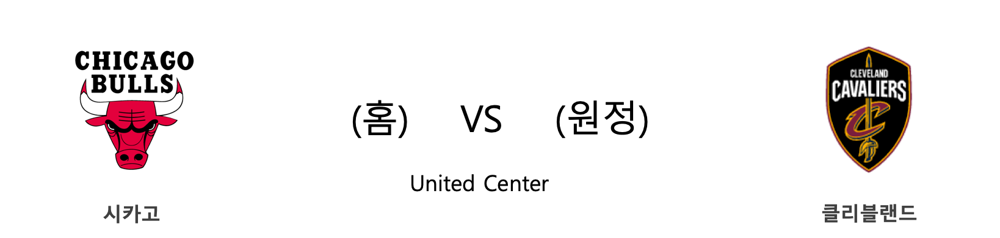

####  PHX(홈) VS BKN(원정) 

#### 2018-2019 시즌 성적

<table class="tg">
  <tr>
    <td class="tg-rr9t">PHX</td>
    <td class="tg-rr9t">팀</td>
    <td class="tg-rr9t">BKN</td>
  </tr>
  <tr>
    <th class="tg-dcpn">15위(8승 25패)</th>
    <th class="tg-o8le">시즌 순위</th>
    <th class="tg-dcpn">9위(15승 19패)</th>
  </tr>
  <tr>
    <td class="tg-txr3">104.6/113.5</td>
    <td class="tg-o8le">평균 득점/실점</td>
    <td class="tg-txr3">110.5/111.3</td>
  </tr>
  <tr>
    <td class="tg-dcpn">홈 3승 14패 원정 5승 11패</td>
    <td class="tg-wazi">홈/원정 성적</td>
    <td class="tg-dcpn">홈 8승 8패 원정 7승 11패</td>
  </tr>
</table>

#### 최근 5경기 상대전적(정규시즌)

<table class="tg">
  <tr>
    <th class="tg-d14o">경기일자 (홈팀)</th>
    <th class="tg-d14o">팀</th>
    <th class="tg-d14o">1Q</th>
    <th class="tg-d14o">2Q</th>
    <th class="tg-d14o">3Q</th>
    <th class="tg-d14o">4Q</th>
    <th class="tg-d14o">EQ</th>
    <th class="tg-d14o">Total</th>
    <th class="tg-d14o">승리팀</th>
  </tr>

<tr>
  <td class="tg-50j8" rowspan="2">2018-11-06(화) (BKN)</td>
  <td class="tg-50j8">BKN</td>
  <td class="tg-50j8">24</td>
  <td class="tg-50j8">28</td>
  <td class="tg-50j8">24</td>
  <td class="tg-50j8">28</td>
  <td class="tg-50j8">0</td>
  <td class="tg-jb7t">104</td>
  <td class="tg-50j8" rowspan="2">BKN</td>
</tr>
<tr>
  <td class="tg-50j8">PHX</td>
  <td class="tg-50j8">22</td>
  <td class="tg-50j8">20</td>
  <td class="tg-50j8">24</td>
  <td class="tg-50j8">16</td>
  <td class="tg-50j8">0</td>
  <td class=" tg-50j8">82</td>
</tr>
</table> 
#### PHX 최근 5경기 분석(정규시즌)

<table class="tg">
  <tr>
    <th class="tg-d14o">경기일자 (홈팀)</th>
    <th class="tg-d14o">팀</th>
    <th class="tg-d14o">1Q</th>
    <th class="tg-d14o">2Q</th>
    <th class="tg-d14o">3Q</th>
    <th class="tg-d14o">4Q</th>
    <th class="tg-d14o">EQ</th>
    <th class="tg-d14o">Total</th>
    <th class="tg-d14o">승리팀</th>
  </tr>

<tr>
  <td class="tg-50j8" rowspan="2">2018-12-22(토) (PHX)</td>
  <td class="tg-50j8">PHX</td>
  <td class="tg-50j8">29</td>
  <td class="tg-50j8">26</td>
  <td class="tg-50j8">24</td>
  <td class="tg-50j8">30</td>
  <td class="tg-50j8">37</td>
  <td class="tg-50j8">146</td>
  <td class="tg-50j8" rowspan="2">WAS</td>
</tr>
<tr>
  <td class="tg-50j8">WAS</td>
  <td class="tg-50j8">33</td>
  <td class="tg-50j8">22</td>
  <td class="tg-50j8">28</td>
  <td class="tg-50j8">26</td>
  <td class="tg-50j8">40</td>
  <td class=" tg-jb7t">149</td>
</tr>

<tr>
  <td class="tg-50j8" rowspan="2">2018-12-19(수) (PHX)</td>
  <td class="tg-50j8">PHX</td>
  <td class="tg-50j8">26</td>
  <td class="tg-50j8">33</td>
  <td class="tg-50j8">27</td>
  <td class="tg-50j8">25</td>
  <td class="tg-50j8">0</td>
  <td class="tg-jb7t">111</td>
  <td class="tg-50j8" rowspan="2">PHX</td>
</tr>
<tr>
  <td class="tg-50j8">BOS</td>
  <td class="tg-50j8">37</td>
  <td class="tg-50j8">25</td>
  <td class="tg-50j8">18</td>
  <td class="tg-50j8">23</td>
  <td class="tg-50j8">0</td>
  <td class=" tg-50j8">103</td>
</tr>

<tr>
  <td class="tg-50j8" rowspan="2">2018-12-17(월) (PHX)</td>
  <td class="tg-50j8">PHX</td>
  <td class="tg-50j8">28</td>
  <td class="tg-50j8">31</td>
  <td class="tg-50j8">41</td>
  <td class="tg-50j8">28</td>
  <td class="tg-50j8">0</td>
  <td class="tg-jb7t">128</td>
  <td class="tg-50j8" rowspan="2">PHX</td>
</tr>
<tr>
  <td class="tg-50j8">NYK</td>
  <td class="tg-50j8">32</td>
  <td class="tg-50j8">34</td>
  <td class="tg-50j8">17</td>
  <td class="tg-50j8">27</td>
  <td class="tg-50j8">0</td>
  <td class=" tg-50j8">110</td>
</tr>

<tr>
  <td class="tg-50j8" rowspan="2">2018-12-15(토) (MIN)</td>
  <td class="tg-50j8">MIN</td>
  <td class="tg-50j8">30</td>
  <td class="tg-50j8">28</td>
  <td class="tg-50j8">24</td>
  <td class="tg-50j8">17</td>
  <td class="tg-50j8">0</td>
  <td class="tg-50j8">99</td>
  <td class="tg-50j8" rowspan="2">PHX</td>
</tr>
<tr>
  <td class="tg-50j8">PHX</td>
  <td class="tg-50j8">28</td>
  <td class="tg-50j8">28</td>
  <td class="tg-50j8">29</td>
  <td class="tg-50j8">22</td>
  <td class="tg-50j8">0</td>
  <td class=" tg-jb7t">107</td>
</tr>

<tr>
  <td class="tg-50j8" rowspan="2">2018-12-13(목) (DAL)</td>
  <td class="tg-50j8">DAL</td>
  <td class="tg-50j8">21</td>
  <td class="tg-50j8">19</td>
  <td class="tg-50j8">27</td>
  <td class="tg-50j8">22</td>
  <td class="tg-50j8">0</td>
  <td class="tg-50j8">89</td>
  <td class="tg-50j8" rowspan="2">PHX</td>
</tr>
<tr>
  <td class="tg-50j8">PHX</td>
  <td class="tg-50j8">25</td>
  <td class="tg-50j8">25</td>
  <td class="tg-50j8">28</td>
  <td class="tg-50j8">21</td>
  <td class="tg-50j8">0</td>
  <td class=" tg-jb7t">99</td>
</tr>
</table> 
#### BKN 최근 5경기 분석(정규시즌)

<table class="tg">
  <tr>
    <th class="tg-d14o">경기일자 (홈팀)</th>
    <th class="tg-d14o">팀</th>
    <th class="tg-d14o">1Q</th>
    <th class="tg-d14o">2Q</th>
    <th class="tg-d14o">3Q</th>
    <th class="tg-d14o">4Q</th>
    <th class="tg-d14o">EQ</th>
    <th class="tg-d14o">Total</th>
    <th class="tg-d14o">승리팀</th>
  </tr>

<tr>
  <td class="tg-50j8" rowspan="2">2018-12-21(금) (IND)</td>
  <td class="tg-50j8">IND</td>
  <td class="tg-50j8">37</td>
  <td class="tg-50j8">22</td>
  <td class="tg-50j8">25</td>
  <td class="tg-50j8">30</td>
  <td class="tg-50j8">0</td>
  <td class="tg-jb7t">114</td>
  <td class="tg-50j8" rowspan="2">IND</td>
</tr>
<tr>
  <td class="tg-50j8">BKN</td>
  <td class="tg-50j8">27</td>
  <td class="tg-50j8">22</td>
  <td class="tg-50j8">31</td>
  <td class="tg-50j8">26</td>
  <td class="tg-50j8">0</td>
  <td class=" tg-50j8">106</td>
</tr>

<tr>
  <td class="tg-50j8" rowspan="2">2018-12-19(수) (BKN)</td>
  <td class="tg-50j8">BKN</td>
  <td class="tg-50j8">22</td>
  <td class="tg-50j8">18</td>
  <td class="tg-50j8">31</td>
  <td class="tg-50j8">25</td>
  <td class="tg-50j8">0</td>
  <td class="tg-jb7t">96</td>
  <td class="tg-50j8" rowspan="2">BKN</td>
</tr>
<tr>
  <td class="tg-50j8">CHI</td>
  <td class="tg-50j8">27</td>
  <td class="tg-50j8">12</td>
  <td class="tg-50j8">32</td>
  <td class="tg-50j8">22</td>
  <td class="tg-50j8">0</td>
  <td class=" tg-50j8">93</td>
</tr>

<tr>
  <td class="tg-50j8" rowspan="2">2018-12-18(화) (LAL)</td>
  <td class="tg-50j8">LAL</td>
  <td class="tg-50j8">32</td>
  <td class="tg-50j8">25</td>
  <td class="tg-50j8">26</td>
  <td class="tg-50j8">27</td>
  <td class="tg-50j8">0</td>
  <td class="tg-50j8">110</td>
  <td class="tg-50j8" rowspan="2">BKN</td>
</tr>
<tr>
  <td class="tg-50j8">BKN</td>
  <td class="tg-50j8">33</td>
  <td class="tg-50j8">29</td>
  <td class="tg-50j8">28</td>
  <td class="tg-50j8">25</td>
  <td class="tg-50j8">0</td>
  <td class=" tg-jb7t">115</td>
</tr>

<tr>
  <td class="tg-50j8" rowspan="2">2018-12-16(일) (ATL)</td>
  <td class="tg-50j8">ATL</td>
  <td class="tg-50j8">23</td>
  <td class="tg-50j8">43</td>
  <td class="tg-50j8">30</td>
  <td class="tg-50j8">31</td>
  <td class="tg-50j8">0</td>
  <td class="tg-50j8">127</td>
  <td class="tg-50j8" rowspan="2">BKN</td>
</tr>
<tr>
  <td class="tg-50j8">BKN</td>
  <td class="tg-50j8">42</td>
  <td class="tg-50j8">30</td>
  <td class="tg-50j8">39</td>
  <td class="tg-50j8">33</td>
  <td class="tg-50j8">0</td>
  <td class=" tg-jb7t">144</td>
</tr>

<tr>
  <td class="tg-50j8" rowspan="2">2018-12-14(금) (WAS)</td>
  <td class="tg-50j8">WAS</td>
  <td class="tg-50j8">31</td>
  <td class="tg-50j8">28</td>
  <td class="tg-50j8">26</td>
  <td class="tg-50j8">33</td>
  <td class="tg-50j8">0</td>
  <td class="tg-50j8">118</td>
  <td class="tg-50j8" rowspan="2">BKN</td>
</tr>
<tr>
  <td class="tg-50j8">BKN</td>
  <td class="tg-50j8">27</td>
  <td class="tg-50j8">43</td>
  <td class="tg-50j8">31</td>
  <td class="tg-50j8">24</td>
  <td class="tg-50j8">0</td>
  <td class=" tg-jb7t">125</td>
</tr>
</table> 
####  MIA(홈) VS ORL(원정) 

#### 2018-2019 시즌 성적

<table class="tg">
  <tr>
    <td class="tg-rr9t">MIA</td>
    <td class="tg-rr9t">팀</td>
    <td class="tg-rr9t">ORL</td>
  </tr>
  <tr>
    <th class="tg-dcpn">8위(15승 16패)</th>
    <th class="tg-o8le">시즌 순위</th>
    <th class="tg-dcpn">10위(14승 17패)</th>
  </tr>
  <tr>
    <td class="tg-txr3">106.2/106.8</td>
    <td class="tg-o8le">평균 득점/실점</td>
    <td class="tg-txr3">102.8/106.9</td>
  </tr>
  <tr>
    <td class="tg-dcpn">홈 8승 7패 원정 7승 9패</td>
    <td class="tg-wazi">홈/원정 성적</td>
    <td class="tg-dcpn">홈 6승 8패 원정 8승 9패</td>
  </tr>
</table>

#### 최근 5경기 상대전적(정규시즌)

<table class="tg">
  <tr>
    <th class="tg-d14o">경기일자 (홈팀)</th>
    <th class="tg-d14o">팀</th>
    <th class="tg-d14o">1Q</th>
    <th class="tg-d14o">2Q</th>
    <th class="tg-d14o">3Q</th>
    <th class="tg-d14o">4Q</th>
    <th class="tg-d14o">EQ</th>
    <th class="tg-d14o">Total</th>
    <th class="tg-d14o">승리팀</th>
  </tr>

<tr>
  <td class="tg-50j8" rowspan="2">2018-12-04(화) (ORL)</td>
  <td class="tg-50j8">ORL</td>
  <td class="tg-50j8">27</td>
  <td class="tg-50j8">19</td>
  <td class="tg-50j8">30</td>
  <td class="tg-50j8">29</td>
  <td class="tg-50j8">0</td>
  <td class="tg-jb7t">105</td>
  <td class="tg-50j8" rowspan="2">ORL</td>
</tr>
<tr>
  <td class="tg-50j8">MIA</td>
  <td class="tg-50j8">25</td>
  <td class="tg-50j8">25</td>
  <td class="tg-50j8">12</td>
  <td class="tg-50j8">28</td>
  <td class="tg-50j8">0</td>
  <td class=" tg-50j8">90</td>
</tr>

<tr>
  <td class="tg-50j8" rowspan="2">2018-10-17(수) (MIA)</td>
  <td class="tg-50j8">MIA</td>
  <td class="tg-50j8">31</td>
  <td class="tg-50j8">20</td>
  <td class="tg-50j8">27</td>
  <td class="tg-50j8">23</td>
  <td class="tg-50j8">0</td>
  <td class="tg-50j8">101</td>
  <td class="tg-50j8" rowspan="2">ORL</td>
</tr>
<tr>
  <td class="tg-50j8">ORL</td>
  <td class="tg-50j8">25</td>
  <td class="tg-50j8">29</td>
  <td class="tg-50j8">25</td>
  <td class="tg-50j8">25</td>
  <td class="tg-50j8">0</td>
  <td class=" tg-jb7t">104</td>
</tr>
</table> 
#### MIA 최근 5경기 분석(정규시즌)

<table class="tg">
  <tr>
    <th class="tg-d14o">경기일자 (홈팀)</th>
    <th class="tg-d14o">팀</th>
    <th class="tg-d14o">1Q</th>
    <th class="tg-d14o">2Q</th>
    <th class="tg-d14o">3Q</th>
    <th class="tg-d14o">4Q</th>
    <th class="tg-d14o">EQ</th>
    <th class="tg-d14o">Total</th>
    <th class="tg-d14o">승리팀</th>
  </tr>

<tr>
  <td class="tg-50j8" rowspan="2">2018-12-22(토) (MIL)</td>
  <td class="tg-50j8">MIL</td>
  <td class="tg-50j8">8</td>
  <td class="tg-50j8">30</td>
  <td class="tg-50j8">20</td>
  <td class="tg-50j8">29</td>
  <td class="tg-50j8">0</td>
  <td class="tg-50j8">87</td>
  <td class="tg-50j8" rowspan="2">MIA</td>
</tr>
<tr>
  <td class="tg-50j8">MIA</td>
  <td class="tg-50j8">21</td>
  <td class="tg-50j8">16</td>
  <td class="tg-50j8">35</td>
  <td class="tg-50j8">22</td>
  <td class="tg-50j8">0</td>
  <td class=" tg-jb7t">94</td>
</tr>

<tr>
  <td class="tg-50j8" rowspan="2">2018-12-20(목) (HOU)</td>
  <td class="tg-50j8">HOU</td>
  <td class="tg-50j8">33</td>
  <td class="tg-50j8">25</td>
  <td class="tg-50j8">18</td>
  <td class="tg-50j8">23</td>
  <td class="tg-50j8">0</td>
  <td class="tg-50j8">99</td>
  <td class="tg-50j8" rowspan="2">MIA</td>
</tr>
<tr>
  <td class="tg-50j8">MIA</td>
  <td class="tg-50j8">21</td>
  <td class="tg-50j8">32</td>
  <td class="tg-50j8">29</td>
  <td class="tg-50j8">19</td>
  <td class="tg-50j8">0</td>
  <td class=" tg-jb7t">101</td>
</tr>

<tr>
  <td class="tg-50j8" rowspan="2">2018-12-16(일) (MIA)</td>
  <td class="tg-50j8">MIA</td>
  <td class="tg-50j8">33</td>
  <td class="tg-50j8">24</td>
  <td class="tg-50j8">28</td>
  <td class="tg-50j8">17</td>
  <td class="tg-50j8">0</td>
  <td class="tg-jb7t">102</td>
  <td class="tg-50j8" rowspan="2">MIA</td>
</tr>
<tr>
  <td class="tg-50j8">NOP</td>
  <td class="tg-50j8">28</td>
  <td class="tg-50j8">23</td>
  <td class="tg-50j8">22</td>
  <td class="tg-50j8">23</td>
  <td class="tg-50j8">0</td>
  <td class=" tg-50j8">96</td>
</tr>

<tr>
  <td class="tg-50j8" rowspan="2">2018-12-14(금) (MIA)</td>
  <td class="tg-50j8">MIA</td>
  <td class="tg-50j8">29</td>
  <td class="tg-50j8">22</td>
  <td class="tg-50j8">20</td>
  <td class="tg-50j8">29</td>
  <td class="tg-50j8">0</td>
  <td class="tg-jb7t">100</td>
  <td class="tg-50j8" rowspan="2">MIA</td>
</tr>
<tr>
  <td class="tg-50j8">MEM</td>
  <td class="tg-50j8">28</td>
  <td class="tg-50j8">21</td>
  <td class="tg-50j8">24</td>
  <td class="tg-50j8">24</td>
  <td class="tg-50j8">0</td>
  <td class=" tg-50j8">97</td>
</tr>

<tr>
  <td class="tg-50j8" rowspan="2">2018-12-12(수) (MIA)</td>
  <td class="tg-50j8">MIA</td>
  <td class="tg-50j8">15</td>
  <td class="tg-50j8">18</td>
  <td class="tg-50j8">20</td>
  <td class="tg-50j8">31</td>
  <td class="tg-50j8">0</td>
  <td class="tg-50j8">84</td>
  <td class="tg-50j8" rowspan="2">UTA</td>
</tr>
<tr>
  <td class="tg-50j8">UTA</td>
  <td class="tg-50j8">40</td>
  <td class="tg-50j8">20</td>
  <td class="tg-50j8">32</td>
  <td class="tg-50j8">19</td>
  <td class="tg-50j8">0</td>
  <td class=" tg-jb7t">111</td>
</tr>
</table> 
#### ORL 최근 5경기 분석(정규시즌)

<table class="tg">
  <tr>
    <th class="tg-d14o">경기일자 (홈팀)</th>
    <th class="tg-d14o">팀</th>
    <th class="tg-d14o">1Q</th>
    <th class="tg-d14o">2Q</th>
    <th class="tg-d14o">3Q</th>
    <th class="tg-d14o">4Q</th>
    <th class="tg-d14o">EQ</th>
    <th class="tg-d14o">Total</th>
    <th class="tg-d14o">승리팀</th>
  </tr>

<tr>
  <td class="tg-50j8" rowspan="2">2018-12-21(금) (ORL)</td>
  <td class="tg-50j8">ORL</td>
  <td class="tg-50j8">20</td>
  <td class="tg-50j8">19</td>
  <td class="tg-50j8">24</td>
  <td class="tg-50j8">17</td>
  <td class="tg-50j8">0</td>
  <td class="tg-50j8">80</td>
  <td class="tg-50j8" rowspan="2">CHI</td>
</tr>
<tr>
  <td class="tg-50j8">CHI</td>
  <td class="tg-50j8">19</td>
  <td class="tg-50j8">27</td>
  <td class="tg-50j8">27</td>
  <td class="tg-50j8">17</td>
  <td class="tg-50j8">0</td>
  <td class=" tg-jb7t">90</td>
</tr>

<tr>
  <td class="tg-50j8" rowspan="2">2018-12-19(수) (SAS)</td>
  <td class="tg-50j8">SAS</td>
  <td class="tg-50j8">31</td>
  <td class="tg-50j8">35</td>
  <td class="tg-50j8">38</td>
  <td class="tg-50j8">25</td>
  <td class="tg-50j8">0</td>
  <td class="tg-jb7t">129</td>
  <td class="tg-50j8" rowspan="2">SAS</td>
</tr>
<tr>
  <td class="tg-50j8">ORL</td>
  <td class="tg-50j8">24</td>
  <td class="tg-50j8">20</td>
  <td class="tg-50j8">33</td>
  <td class="tg-50j8">13</td>
  <td class="tg-50j8">0</td>
  <td class=" tg-50j8">90</td>
</tr>

<tr>
  <td class="tg-50j8" rowspan="2">2018-12-15(토) (UTA)</td>
  <td class="tg-50j8">UTA</td>
  <td class="tg-50j8">14</td>
  <td class="tg-50j8">21</td>
  <td class="tg-50j8">24</td>
  <td class="tg-50j8">30</td>
  <td class="tg-50j8">0</td>
  <td class="tg-50j8">89</td>
  <td class="tg-50j8" rowspan="2">ORL</td>
</tr>
<tr>
  <td class="tg-50j8">ORL</td>
  <td class="tg-50j8">14</td>
  <td class="tg-50j8">19</td>
  <td class="tg-50j8">22</td>
  <td class="tg-50j8">41</td>
  <td class="tg-50j8">0</td>
  <td class=" tg-jb7t">96</td>
</tr>

<tr>
  <td class="tg-50j8" rowspan="2">2018-12-13(목) (CHI)</td>
  <td class="tg-50j8">CHI</td>
  <td class="tg-50j8">26</td>
  <td class="tg-50j8">20</td>
  <td class="tg-50j8">25</td>
  <td class="tg-50j8">20</td>
  <td class="tg-50j8">0</td>
  <td class="tg-50j8">91</td>
  <td class="tg-50j8" rowspan="2">ORL</td>
</tr>
<tr>
  <td class="tg-50j8">ORL</td>
  <td class="tg-50j8">24</td>
  <td class="tg-50j8">27</td>
  <td class="tg-50j8">26</td>
  <td class="tg-50j8">20</td>
  <td class="tg-50j8">0</td>
  <td class=" tg-jb7t">97</td>
</tr>

<tr>
  <td class="tg-50j8" rowspan="2">2018-12-10(월) (ORL)</td>
  <td class="tg-50j8">ORL</td>
  <td class="tg-50j8">19</td>
  <td class="tg-50j8">21</td>
  <td class="tg-50j8">13</td>
  <td class="tg-50j8">23</td>
  <td class="tg-50j8">0</td>
  <td class="tg-50j8">76</td>
  <td class="tg-50j8" rowspan="2">DAL</td>
</tr>
<tr>
  <td class="tg-50j8">DAL</td>
  <td class="tg-50j8">24</td>
  <td class="tg-50j8">28</td>
  <td class="tg-50j8">23</td>
  <td class="tg-50j8">26</td>
  <td class="tg-50j8">0</td>
  <td class=" tg-jb7t">101</td>
</tr>
</table> 
####  DAL(홈) VS POR(원정) 

#### 2018-2019 시즌 성적

<table class="tg">
  <tr>
    <td class="tg-rr9t">DAL</td>
    <td class="tg-rr9t">팀</td>
    <td class="tg-rr9t">POR</td>
  </tr>
  <tr>
    <th class="tg-dcpn">12위(15승 16패)</th>
    <th class="tg-o8le">시즌 순위</th>
    <th class="tg-dcpn">6위(18승 14패)</th>
  </tr>
  <tr>
    <td class="tg-txr3">110.4/109.6</td>
    <td class="tg-o8le">평균 득점/실점</td>
    <td class="tg-txr3">111.1/110.5</td>
  </tr>
  <tr>
    <td class="tg-dcpn">홈 2승 13패 원정 13승 3패</td>
    <td class="tg-wazi">홈/원정 성적</td>
    <td class="tg-dcpn">홈 6승 9패 원정 12승 5패</td>
  </tr>
</table>

#### 최근 5경기 상대전적(정규시즌)

<table class="tg">
  <tr>
    <th class="tg-d14o">경기일자 (홈팀)</th>
    <th class="tg-d14o">팀</th>
    <th class="tg-d14o">1Q</th>
    <th class="tg-d14o">2Q</th>
    <th class="tg-d14o">3Q</th>
    <th class="tg-d14o">4Q</th>
    <th class="tg-d14o">EQ</th>
    <th class="tg-d14o">Total</th>
    <th class="tg-d14o">승리팀</th>
  </tr>

<tr>
  <td class="tg-50j8" rowspan="2">2018-12-04(화) (POR)</td>
  <td class="tg-50j8">POR</td>
  <td class="tg-50j8">20</td>
  <td class="tg-50j8">25</td>
  <td class="tg-50j8">28</td>
  <td class="tg-50j8">29</td>
  <td class="tg-50j8">0</td>
  <td class="tg-50j8">102</td>
  <td class="tg-50j8" rowspan="2">DAL</td>
</tr>
<tr>
  <td class="tg-50j8">DAL</td>
  <td class="tg-50j8">34</td>
  <td class="tg-50j8">26</td>
  <td class="tg-50j8">27</td>
  <td class="tg-50j8">24</td>
  <td class="tg-50j8">0</td>
  <td class=" tg-jb7t">111</td>
</tr>
</table> 
#### DAL 최근 5경기 분석(정규시즌)

<table class="tg">
  <tr>
    <th class="tg-d14o">경기일자 (홈팀)</th>
    <th class="tg-d14o">팀</th>
    <th class="tg-d14o">1Q</th>
    <th class="tg-d14o">2Q</th>
    <th class="tg-d14o">3Q</th>
    <th class="tg-d14o">4Q</th>
    <th class="tg-d14o">EQ</th>
    <th class="tg-d14o">Total</th>
    <th class="tg-d14o">승리팀</th>
  </tr>

<tr>
  <td class="tg-50j8" rowspan="2">2018-12-22(토) (DAL)</td>
  <td class="tg-50j8">DAL</td>
  <td class="tg-50j8">31</td>
  <td class="tg-50j8">30</td>
  <td class="tg-50j8">26</td>
  <td class="tg-50j8">29</td>
  <td class="tg-50j8">0</td>
  <td class="tg-50j8">116</td>
  <td class="tg-50j8" rowspan="2">GSW</td>
</tr>
<tr>
  <td class="tg-50j8">GSW</td>
  <td class="tg-50j8">28</td>
  <td class="tg-50j8">30</td>
  <td class="tg-50j8">36</td>
  <td class="tg-50j8">26</td>
  <td class="tg-50j8">0</td>
  <td class=" tg-jb7t">120</td>
</tr>

<tr>
  <td class="tg-50j8" rowspan="2">2018-12-20(목) (DAL)</td>
  <td class="tg-50j8">DAL</td>
  <td class="tg-50j8">27</td>
  <td class="tg-50j8">27</td>
  <td class="tg-50j8">28</td>
  <td class="tg-50j8">39</td>
  <td class="tg-50j8">0</td>
  <td class="tg-50j8">121</td>
  <td class="tg-50j8" rowspan="2">LAC</td>
</tr>
<tr>
  <td class="tg-50j8">LAC</td>
  <td class="tg-50j8">30</td>
  <td class="tg-50j8">35</td>
  <td class="tg-50j8">24</td>
  <td class="tg-50j8">36</td>
  <td class="tg-50j8">0</td>
  <td class=" tg-jb7t">125</td>
</tr>

<tr>
  <td class="tg-50j8" rowspan="2">2018-12-18(화) (DAL)</td>
  <td class="tg-50j8">DAL</td>
  <td class="tg-50j8">33</td>
  <td class="tg-50j8">36</td>
  <td class="tg-50j8">26</td>
  <td class="tg-50j8">23</td>
  <td class="tg-50j8">0</td>
  <td class="tg-50j8">118</td>
  <td class="tg-50j8" rowspan="2">DEN</td>
</tr>
<tr>
  <td class="tg-50j8">DEN</td>
  <td class="tg-50j8">34</td>
  <td class="tg-50j8">40</td>
  <td class="tg-50j8">31</td>
  <td class="tg-50j8">21</td>
  <td class="tg-50j8">0</td>
  <td class=" tg-jb7t">126</td>
</tr>

<tr>
  <td class="tg-50j8" rowspan="2">2018-12-16(일) (SAC)</td>
  <td class="tg-50j8">SAC</td>
  <td class="tg-50j8">34</td>
  <td class="tg-50j8">27</td>
  <td class="tg-50j8">32</td>
  <td class="tg-50j8">27</td>
  <td class="tg-50j8">0</td>
  <td class="tg-jb7t">120</td>
  <td class="tg-50j8" rowspan="2">SAC</td>
</tr>
<tr>
  <td class="tg-50j8">DAL</td>
  <td class="tg-50j8">31</td>
  <td class="tg-50j8">27</td>
  <td class="tg-50j8">25</td>
  <td class="tg-50j8">30</td>
  <td class="tg-50j8">0</td>
  <td class=" tg-50j8">113</td>
</tr>

<tr>
  <td class="tg-50j8" rowspan="2">2018-12-13(목) (DAL)</td>
  <td class="tg-50j8">DAL</td>
  <td class="tg-50j8">21</td>
  <td class="tg-50j8">19</td>
  <td class="tg-50j8">27</td>
  <td class="tg-50j8">22</td>
  <td class="tg-50j8">0</td>
  <td class="tg-50j8">89</td>
  <td class="tg-50j8" rowspan="2">PHX</td>
</tr>
<tr>
  <td class="tg-50j8">PHX</td>
  <td class="tg-50j8">25</td>
  <td class="tg-50j8">25</td>
  <td class="tg-50j8">28</td>
  <td class="tg-50j8">21</td>
  <td class="tg-50j8">0</td>
  <td class=" tg-jb7t">99</td>
</tr>
</table> 
#### POR 최근 5경기 분석(정규시즌)

<table class="tg">
  <tr>
    <th class="tg-d14o">경기일자 (홈팀)</th>
    <th class="tg-d14o">팀</th>
    <th class="tg-d14o">1Q</th>
    <th class="tg-d14o">2Q</th>
    <th class="tg-d14o">3Q</th>
    <th class="tg-d14o">4Q</th>
    <th class="tg-d14o">EQ</th>
    <th class="tg-d14o">Total</th>
    <th class="tg-d14o">승리팀</th>
  </tr>

<tr>
  <td class="tg-50j8" rowspan="2">2018-12-21(금) (UTA)</td>
  <td class="tg-50j8">UTA</td>
  <td class="tg-50j8">33</td>
  <td class="tg-50j8">22</td>
  <td class="tg-50j8">28</td>
  <td class="tg-50j8">37</td>
  <td class="tg-50j8">0</td>
  <td class="tg-jb7t">120</td>
  <td class="tg-50j8" rowspan="2">UTA</td>
</tr>
<tr>
  <td class="tg-50j8">POR</td>
  <td class="tg-50j8">26</td>
  <td class="tg-50j8">23</td>
  <td class="tg-50j8">19</td>
  <td class="tg-50j8">22</td>
  <td class="tg-50j8">0</td>
  <td class=" tg-50j8">90</td>
</tr>

<tr>
  <td class="tg-50j8" rowspan="2">2018-12-19(수) (MEM)</td>
  <td class="tg-50j8">MEM</td>
  <td class="tg-50j8">18</td>
  <td class="tg-50j8">34</td>
  <td class="tg-50j8">19</td>
  <td class="tg-50j8">21</td>
  <td class="tg-50j8">0</td>
  <td class="tg-50j8">92</td>
  <td class="tg-50j8" rowspan="2">POR</td>
</tr>
<tr>
  <td class="tg-50j8">POR</td>
  <td class="tg-50j8">17</td>
  <td class="tg-50j8">30</td>
  <td class="tg-50j8">27</td>
  <td class="tg-50j8">25</td>
  <td class="tg-50j8">0</td>
  <td class=" tg-jb7t">99</td>
</tr>

<tr>
  <td class="tg-50j8" rowspan="2">2018-12-17(월) (POR)</td>
  <td class="tg-50j8">POR</td>
  <td class="tg-50j8">37</td>
  <td class="tg-50j8">21</td>
  <td class="tg-50j8">42</td>
  <td class="tg-50j8">31</td>
  <td class="tg-50j8">0</td>
  <td class="tg-jb7t">131</td>
  <td class="tg-50j8" rowspan="2">POR</td>
</tr>
<tr>
  <td class="tg-50j8">LAC</td>
  <td class="tg-50j8">29</td>
  <td class="tg-50j8">31</td>
  <td class="tg-50j8">28</td>
  <td class="tg-50j8">39</td>
  <td class="tg-50j8">0</td>
  <td class=" tg-50j8">127</td>
</tr>

<tr>
  <td class="tg-50j8" rowspan="2">2018-12-14(금) (TOR)</td>
  <td class="tg-50j8">TOR</td>
  <td class="tg-50j8">23</td>
  <td class="tg-50j8">27</td>
  <td class="tg-50j8">39</td>
  <td class="tg-50j8">33</td>
  <td class="tg-50j8">0</td>
  <td class="tg-50j8">122</td>
  <td class="tg-50j8" rowspan="2">POR</td>
</tr>
<tr>
  <td class="tg-50j8">POR</td>
  <td class="tg-50j8">28</td>
  <td class="tg-50j8">30</td>
  <td class="tg-50j8">33</td>
  <td class="tg-50j8">37</td>
  <td class="tg-50j8">0</td>
  <td class=" tg-jb7t">128</td>
</tr>

<tr>
  <td class="tg-50j8" rowspan="2">2018-12-12(수) (POR)</td>
  <td class="tg-50j8">POR</td>
  <td class="tg-50j8">26</td>
  <td class="tg-50j8">14</td>
  <td class="tg-50j8">23</td>
  <td class="tg-50j8">20</td>
  <td class="tg-50j8">0</td>
  <td class="tg-50j8">83</td>
  <td class="tg-50j8" rowspan="2">MEM</td>
</tr>
<tr>
  <td class="tg-50j8">MEM</td>
  <td class="tg-50j8">15</td>
  <td class="tg-50j8">27</td>
  <td class="tg-50j8">26</td>
  <td class="tg-50j8">24</td>
  <td class="tg-50j8">0</td>
  <td class=" tg-jb7t">92</td>
</tr>
</table> 
####  CHI(홈) VS CLE(원정) 

#### 2018-2019 시즌 성적

<table class="tg">
  <tr>
    <td class="tg-rr9t">CHI</td>
    <td class="tg-rr9t">팀</td>
    <td class="tg-rr9t">CLE</td>
  </tr>
  <tr>
    <th class="tg-dcpn">14위(8승 25패)</th>
    <th class="tg-o8le">시즌 순위</th>
    <th class="tg-dcpn">14위(8승 25패)</th>
  </tr>
  <tr>
    <td class="tg-txr3">100.6/110.5</td>
    <td class="tg-o8le">평균 득점/실점</td>
    <td class="tg-txr3">103.1/111.6</td>
  </tr>
  <tr>
    <td class="tg-dcpn">홈 3승 13패 원정 5승 12패</td>
    <td class="tg-wazi">홈/원정 성적</td>
    <td class="tg-dcpn">홈 3승 13패 원정 5승 12패</td>
  </tr>
</table>

#### 최근 5경기 상대전적(정규시즌)

<table class="tg">
  <tr>
    <th class="tg-d14o">경기일자 (홈팀)</th>
    <th class="tg-d14o">팀</th>
    <th class="tg-d14o">1Q</th>
    <th class="tg-d14o">2Q</th>
    <th class="tg-d14o">3Q</th>
    <th class="tg-d14o">4Q</th>
    <th class="tg-d14o">EQ</th>
    <th class="tg-d14o">Total</th>
    <th class="tg-d14o">승리팀</th>
  </tr>

<tr>
  <td class="tg-50j8" rowspan="2">2018-11-10(토) (CLE)</td>
  <td class="tg-50j8">CLE</td>
  <td class="tg-50j8">23</td>
  <td class="tg-50j8">30</td>
  <td class="tg-50j8">24</td>
  <td class="tg-50j8">21</td>
  <td class="tg-50j8">0</td>
  <td class="tg-50j8">98</td>
  <td class="tg-50j8" rowspan="2">CHI</td>
</tr>
<tr>
  <td class="tg-50j8">CHI</td>
  <td class="tg-50j8">37</td>
  <td class="tg-50j8">16</td>
  <td class="tg-50j8">26</td>
  <td class="tg-50j8">20</td>
  <td class="tg-50j8">0</td>
  <td class=" tg-jb7t">99</td>
</tr>
</table> 
#### CHI 최근 5경기 분석(정규시즌)

<table class="tg">
  <tr>
    <th class="tg-d14o">경기일자 (홈팀)</th>
    <th class="tg-d14o">팀</th>
    <th class="tg-d14o">1Q</th>
    <th class="tg-d14o">2Q</th>
    <th class="tg-d14o">3Q</th>
    <th class="tg-d14o">4Q</th>
    <th class="tg-d14o">EQ</th>
    <th class="tg-d14o">Total</th>
    <th class="tg-d14o">승리팀</th>
  </tr>

<tr>
  <td class="tg-50j8" rowspan="2">2018-12-21(금) (ORL)</td>
  <td class="tg-50j8">ORL</td>
  <td class="tg-50j8">20</td>
  <td class="tg-50j8">19</td>
  <td class="tg-50j8">24</td>
  <td class="tg-50j8">17</td>
  <td class="tg-50j8">0</td>
  <td class="tg-50j8">80</td>
  <td class="tg-50j8" rowspan="2">CHI</td>
</tr>
<tr>
  <td class="tg-50j8">CHI</td>
  <td class="tg-50j8">19</td>
  <td class="tg-50j8">27</td>
  <td class="tg-50j8">27</td>
  <td class="tg-50j8">17</td>
  <td class="tg-50j8">0</td>
  <td class=" tg-jb7t">90</td>
</tr>

<tr>
  <td class="tg-50j8" rowspan="2">2018-12-19(수) (BKN)</td>
  <td class="tg-50j8">BKN</td>
  <td class="tg-50j8">22</td>
  <td class="tg-50j8">18</td>
  <td class="tg-50j8">31</td>
  <td class="tg-50j8">25</td>
  <td class="tg-50j8">0</td>
  <td class="tg-jb7t">96</td>
  <td class="tg-50j8" rowspan="2">BKN</td>
</tr>
<tr>
  <td class="tg-50j8">CHI</td>
  <td class="tg-50j8">27</td>
  <td class="tg-50j8">12</td>
  <td class="tg-50j8">32</td>
  <td class="tg-50j8">22</td>
  <td class="tg-50j8">0</td>
  <td class=" tg-50j8">93</td>
</tr>

<tr>
  <td class="tg-50j8" rowspan="2">2018-12-17(월) (CHI)</td>
  <td class="tg-50j8">CHI</td>
  <td class="tg-50j8">22</td>
  <td class="tg-50j8">22</td>
  <td class="tg-50j8">25</td>
  <td class="tg-50j8">27</td>
  <td class="tg-50j8">0</td>
  <td class="tg-50j8">96</td>
  <td class="tg-50j8" rowspan="2">OKC</td>
</tr>
<tr>
  <td class="tg-50j8">OKC</td>
  <td class="tg-50j8">31</td>
  <td class="tg-50j8">33</td>
  <td class="tg-50j8">24</td>
  <td class="tg-50j8">33</td>
  <td class="tg-50j8">0</td>
  <td class=" tg-jb7t">121</td>
</tr>

<tr>
  <td class="tg-50j8" rowspan="2">2018-12-15(토) (CHI)</td>
  <td class="tg-50j8">CHI</td>
  <td class="tg-50j8">21</td>
  <td class="tg-50j8">22</td>
  <td class="tg-50j8">31</td>
  <td class="tg-50j8">24</td>
  <td class="tg-50j8">0</td>
  <td class="tg-jb7t">98</td>
  <td class="tg-50j8" rowspan="2">CHI</td>
</tr>
<tr>
  <td class="tg-50j8">SAS</td>
  <td class="tg-50j8">28</td>
  <td class="tg-50j8">34</td>
  <td class="tg-50j8">16</td>
  <td class="tg-50j8">15</td>
  <td class="tg-50j8">0</td>
  <td class=" tg-50j8">93</td>
</tr>

<tr>
  <td class="tg-50j8" rowspan="2">2018-12-13(목) (CHI)</td>
  <td class="tg-50j8">CHI</td>
  <td class="tg-50j8">26</td>
  <td class="tg-50j8">20</td>
  <td class="tg-50j8">25</td>
  <td class="tg-50j8">20</td>
  <td class="tg-50j8">0</td>
  <td class="tg-50j8">91</td>
  <td class="tg-50j8" rowspan="2">ORL</td>
</tr>
<tr>
  <td class="tg-50j8">ORL</td>
  <td class="tg-50j8">24</td>
  <td class="tg-50j8">27</td>
  <td class="tg-50j8">26</td>
  <td class="tg-50j8">20</td>
  <td class="tg-50j8">0</td>
  <td class=" tg-jb7t">97</td>
</tr>
</table> 
#### CLE 최근 5경기 분석(정규시즌)

<table class="tg">
  <tr>
    <th class="tg-d14o">경기일자 (홈팀)</th>
    <th class="tg-d14o">팀</th>
    <th class="tg-d14o">1Q</th>
    <th class="tg-d14o">2Q</th>
    <th class="tg-d14o">3Q</th>
    <th class="tg-d14o">4Q</th>
    <th class="tg-d14o">EQ</th>
    <th class="tg-d14o">Total</th>
    <th class="tg-d14o">승리팀</th>
  </tr>

<tr>
  <td class="tg-50j8" rowspan="2">2018-12-21(금) (CLE)</td>
  <td class="tg-50j8">CLE</td>
  <td class="tg-50j8">28</td>
  <td class="tg-50j8">24</td>
  <td class="tg-50j8">41</td>
  <td class="tg-50j8">17</td>
  <td class="tg-50j8">0</td>
  <td class="tg-50j8">110</td>
  <td class="tg-50j8" rowspan="2">TOR</td>
</tr>
<tr>
  <td class="tg-50j8">TOR</td>
  <td class="tg-50j8">34</td>
  <td class="tg-50j8">25</td>
  <td class="tg-50j8">40</td>
  <td class="tg-50j8">27</td>
  <td class="tg-50j8">0</td>
  <td class=" tg-jb7t">126</td>
</tr>

<tr>
  <td class="tg-50j8" rowspan="2">2018-12-19(수) (CLE)</td>
  <td class="tg-50j8">CLE</td>
  <td class="tg-50j8">25</td>
  <td class="tg-50j8">21</td>
  <td class="tg-50j8">29</td>
  <td class="tg-50j8">24</td>
  <td class="tg-50j8">0</td>
  <td class="tg-50j8">99</td>
  <td class="tg-50j8" rowspan="2">CHA</td>
</tr>
<tr>
  <td class="tg-50j8">CHA</td>
  <td class="tg-50j8">16</td>
  <td class="tg-50j8">25</td>
  <td class="tg-50j8">41</td>
  <td class="tg-50j8">28</td>
  <td class="tg-50j8">0</td>
  <td class=" tg-jb7t">110</td>
</tr>

<tr>
  <td class="tg-50j8" rowspan="2">2018-12-18(화) (CLE)</td>
  <td class="tg-50j8">CLE</td>
  <td class="tg-50j8">21</td>
  <td class="tg-50j8">24</td>
  <td class="tg-50j8">22</td>
  <td class="tg-50j8">25</td>
  <td class="tg-50j8">0</td>
  <td class="tg-jb7t">92</td>
  <td class="tg-50j8" rowspan="2">CLE</td>
</tr>
<tr>
  <td class="tg-50j8">IND</td>
  <td class="tg-50j8">19</td>
  <td class="tg-50j8">25</td>
  <td class="tg-50j8">24</td>
  <td class="tg-50j8">23</td>
  <td class="tg-50j8">0</td>
  <td class=" tg-50j8">91</td>
</tr>

<tr>
  <td class="tg-50j8" rowspan="2">2018-12-16(일) (PHI)</td>
  <td class="tg-50j8">PHI</td>
  <td class="tg-50j8">29</td>
  <td class="tg-50j8">36</td>
  <td class="tg-50j8">24</td>
  <td class="tg-50j8">39</td>
  <td class="tg-50j8">0</td>
  <td class="tg-jb7t">128</td>
  <td class="tg-50j8" rowspan="2">PHI</td>
</tr>
<tr>
  <td class="tg-50j8">CLE</td>
  <td class="tg-50j8">36</td>
  <td class="tg-50j8">22</td>
  <td class="tg-50j8">27</td>
  <td class="tg-50j8">20</td>
  <td class="tg-50j8">0</td>
  <td class=" tg-50j8">105</td>
</tr>

<tr>
  <td class="tg-50j8" rowspan="2">2018-12-14(금) (MIL)</td>
  <td class="tg-50j8">MIL</td>
  <td class="tg-50j8">27</td>
  <td class="tg-50j8">34</td>
  <td class="tg-50j8">30</td>
  <td class="tg-50j8">23</td>
  <td class="tg-50j8">0</td>
  <td class="tg-jb7t">114</td>
  <td class="tg-50j8" rowspan="2">MIL</td>
</tr>
<tr>
  <td class="tg-50j8">CLE</td>
  <td class="tg-50j8">16</td>
  <td class="tg-50j8">31</td>
  <td class="tg-50j8">30</td>
  <td class="tg-50j8">25</td>
  <td class="tg-50j8">0</td>
  <td class=" tg-50j8">102</td>
</tr>
</table> 
####  CHA(홈) VS BOS(원정) 

#### 2018-2019 시즌 성적

<table class="tg">
  <tr>
    <td class="tg-rr9t">CHA</td>
    <td class="tg-rr9t">팀</td>
    <td class="tg-rr9t">BOS</td>
  </tr>
  <tr>
    <th class="tg-dcpn">6위(16승 15패)</th>
    <th class="tg-o8le">시즌 순위</th>
    <th class="tg-dcpn">5위(18승 13패)</th>
  </tr>
  <tr>
    <td class="tg-txr3">113.2/110.6</td>
    <td class="tg-o8le">평균 득점/실점</td>
    <td class="tg-txr3">111.1/104.8</td>
  </tr>
  <tr>
    <td class="tg-dcpn">홈 4승 8패 원정 12승 7패</td>
    <td class="tg-wazi">홈/원정 성적</td>
    <td class="tg-dcpn">홈 9승 8패 원정 9승 5패</td>
  </tr>
</table>

#### 최근 5경기 상대전적(정규시즌)

<table class="tg">
  <tr>
    <th class="tg-d14o">경기일자 (홈팀)</th>
    <th class="tg-d14o">팀</th>
    <th class="tg-d14o">1Q</th>
    <th class="tg-d14o">2Q</th>
    <th class="tg-d14o">3Q</th>
    <th class="tg-d14o">4Q</th>
    <th class="tg-d14o">EQ</th>
    <th class="tg-d14o">Total</th>
    <th class="tg-d14o">승리팀</th>
  </tr>

<tr>
  <td class="tg-50j8" rowspan="2">2018-11-19(월) (BOS)</td>
  <td class="tg-50j8">BOS</td>
  <td class="tg-50j8">24</td>
  <td class="tg-50j8">32</td>
  <td class="tg-50j8">31</td>
  <td class="tg-50j8">25</td>
  <td class="tg-50j8">0</td>
  <td class="tg-50j8">112</td>
  <td class="tg-50j8" rowspan="2">CHA</td>
</tr>
<tr>
  <td class="tg-50j8">CHA</td>
  <td class="tg-50j8">29</td>
  <td class="tg-50j8">25</td>
  <td class="tg-50j8">30</td>
  <td class="tg-50j8">33</td>
  <td class="tg-50j8">0</td>
  <td class=" tg-jb7t">117</td>
</tr>
</table> 
#### CHA 최근 5경기 분석(정규시즌)

<table class="tg">
  <tr>
    <th class="tg-d14o">경기일자 (홈팀)</th>
    <th class="tg-d14o">팀</th>
    <th class="tg-d14o">1Q</th>
    <th class="tg-d14o">2Q</th>
    <th class="tg-d14o">3Q</th>
    <th class="tg-d14o">4Q</th>
    <th class="tg-d14o">EQ</th>
    <th class="tg-d14o">Total</th>
    <th class="tg-d14o">승리팀</th>
  </tr>

<tr>
  <td class="tg-50j8" rowspan="2">2018-12-21(금) (DET)</td>
  <td class="tg-50j8">DET</td>
  <td class="tg-50j8">21</td>
  <td class="tg-50j8">19</td>
  <td class="tg-50j8">25</td>
  <td class="tg-50j8">21</td>
  <td class="tg-50j8">0</td>
  <td class="tg-50j8">86</td>
  <td class="tg-50j8" rowspan="2">CHA</td>
</tr>
<tr>
  <td class="tg-50j8">CHA</td>
  <td class="tg-50j8">25</td>
  <td class="tg-50j8">20</td>
  <td class="tg-50j8">30</td>
  <td class="tg-50j8">23</td>
  <td class="tg-50j8">0</td>
  <td class=" tg-jb7t">98</td>
</tr>

<tr>
  <td class="tg-50j8" rowspan="2">2018-12-19(수) (CLE)</td>
  <td class="tg-50j8">CLE</td>
  <td class="tg-50j8">25</td>
  <td class="tg-50j8">21</td>
  <td class="tg-50j8">29</td>
  <td class="tg-50j8">24</td>
  <td class="tg-50j8">0</td>
  <td class="tg-50j8">99</td>
  <td class="tg-50j8" rowspan="2">CHA</td>
</tr>
<tr>
  <td class="tg-50j8">CHA</td>
  <td class="tg-50j8">16</td>
  <td class="tg-50j8">25</td>
  <td class="tg-50j8">41</td>
  <td class="tg-50j8">28</td>
  <td class="tg-50j8">0</td>
  <td class=" tg-jb7t">110</td>
</tr>

<tr>
  <td class="tg-50j8" rowspan="2">2018-12-15(토) (LAL)</td>
  <td class="tg-50j8">LAL</td>
  <td class="tg-50j8">32</td>
  <td class="tg-50j8">25</td>
  <td class="tg-50j8">40</td>
  <td class="tg-50j8">31</td>
  <td class="tg-50j8">0</td>
  <td class="tg-jb7t">128</td>
  <td class="tg-50j8" rowspan="2">LAL</td>
</tr>
<tr>
  <td class="tg-50j8">CHA</td>
  <td class="tg-50j8">22</td>
  <td class="tg-50j8">28</td>
  <td class="tg-50j8">17</td>
  <td class="tg-50j8">33</td>
  <td class="tg-50j8">0</td>
  <td class=" tg-50j8">100</td>
</tr>

<tr>
  <td class="tg-50j8" rowspan="2">2018-12-14(금) (NYK)</td>
  <td class="tg-50j8">NYK</td>
  <td class="tg-50j8">16</td>
  <td class="tg-50j8">37</td>
  <td class="tg-50j8">25</td>
  <td class="tg-50j8">35</td>
  <td class="tg-50j8">13</td>
  <td class="tg-jb7t">126</td>
  <td class="tg-50j8" rowspan="2">NYK</td>
</tr>
<tr>
  <td class="tg-50j8">CHA</td>
  <td class="tg-50j8">33</td>
  <td class="tg-50j8">39</td>
  <td class="tg-50j8">21</td>
  <td class="tg-50j8">20</td>
  <td class="tg-50j8">11</td>
  <td class=" tg-50j8">124</td>
</tr>

<tr>
  <td class="tg-50j8" rowspan="2">2018-12-12(수) (DET)</td>
  <td class="tg-50j8">DET</td>
  <td class="tg-50j8">25</td>
  <td class="tg-50j8">30</td>
  <td class="tg-50j8">38</td>
  <td class="tg-50j8">14</td>
  <td class="tg-50j8">0</td>
  <td class="tg-50j8">107</td>
  <td class="tg-50j8" rowspan="2">CHA</td>
</tr>
<tr>
  <td class="tg-50j8">CHA</td>
  <td class="tg-50j8">37</td>
  <td class="tg-50j8">23</td>
  <td class="tg-50j8">22</td>
  <td class="tg-50j8">26</td>
  <td class="tg-50j8">0</td>
  <td class=" tg-jb7t">108</td>
</tr>
</table> 
#### BOS 최근 5경기 분석(정규시즌)

<table class="tg">
  <tr>
    <th class="tg-d14o">경기일자 (홈팀)</th>
    <th class="tg-d14o">팀</th>
    <th class="tg-d14o">1Q</th>
    <th class="tg-d14o">2Q</th>
    <th class="tg-d14o">3Q</th>
    <th class="tg-d14o">4Q</th>
    <th class="tg-d14o">EQ</th>
    <th class="tg-d14o">Total</th>
    <th class="tg-d14o">승리팀</th>
  </tr>

<tr>
  <td class="tg-50j8" rowspan="2">2018-12-21(금) (MIL)</td>
  <td class="tg-50j8">MIL</td>
  <td class="tg-50j8">35</td>
  <td class="tg-50j8">30</td>
  <td class="tg-50j8">28</td>
  <td class="tg-50j8">27</td>
  <td class="tg-50j8">0</td>
  <td class="tg-jb7t">120</td>
  <td class="tg-50j8" rowspan="2">MIL</td>
</tr>
<tr>
  <td class="tg-50j8">BOS</td>
  <td class="tg-50j8">22</td>
  <td class="tg-50j8">26</td>
  <td class="tg-50j8">30</td>
  <td class="tg-50j8">29</td>
  <td class="tg-50j8">0</td>
  <td class=" tg-50j8">107</td>
</tr>

<tr>
  <td class="tg-50j8" rowspan="2">2018-12-19(수) (PHX)</td>
  <td class="tg-50j8">PHX</td>
  <td class="tg-50j8">26</td>
  <td class="tg-50j8">33</td>
  <td class="tg-50j8">27</td>
  <td class="tg-50j8">25</td>
  <td class="tg-50j8">0</td>
  <td class="tg-jb7t">111</td>
  <td class="tg-50j8" rowspan="2">PHX</td>
</tr>
<tr>
  <td class="tg-50j8">BOS</td>
  <td class="tg-50j8">37</td>
  <td class="tg-50j8">25</td>
  <td class="tg-50j8">18</td>
  <td class="tg-50j8">23</td>
  <td class="tg-50j8">0</td>
  <td class=" tg-50j8">103</td>
</tr>

<tr>
  <td class="tg-50j8" rowspan="2">2018-12-15(토) (BOS)</td>
  <td class="tg-50j8">BOS</td>
  <td class="tg-50j8">33</td>
  <td class="tg-50j8">23</td>
  <td class="tg-50j8">22</td>
  <td class="tg-50j8">26</td>
  <td class="tg-50j8">0</td>
  <td class="tg-50j8">104</td>
  <td class="tg-50j8" rowspan="2">DET</td>
</tr>
<tr>
  <td class="tg-50j8">DET</td>
  <td class="tg-50j8">33</td>
  <td class="tg-50j8">24</td>
  <td class="tg-50j8">28</td>
  <td class="tg-50j8">28</td>
  <td class="tg-50j8">0</td>
  <td class=" tg-jb7t">113</td>
</tr>

<tr>
  <td class="tg-50j8" rowspan="2">2018-12-14(금) (ATL)</td>
  <td class="tg-50j8">ATL</td>
  <td class="tg-50j8">19</td>
  <td class="tg-50j8">37</td>
  <td class="tg-50j8">26</td>
  <td class="tg-50j8">26</td>
  <td class="tg-50j8">0</td>
  <td class="tg-50j8">108</td>
  <td class="tg-50j8" rowspan="2">BOS</td>
</tr>
<tr>
  <td class="tg-50j8">BOS</td>
  <td class="tg-50j8">42</td>
  <td class="tg-50j8">25</td>
  <td class="tg-50j8">41</td>
  <td class="tg-50j8">21</td>
  <td class="tg-50j8">0</td>
  <td class=" tg-jb7t">129</td>
</tr>

<tr>
  <td class="tg-50j8" rowspan="2">2018-12-12(수) (BOS)</td>
  <td class="tg-50j8">BOS</td>
  <td class="tg-50j8">24</td>
  <td class="tg-50j8">22</td>
  <td class="tg-50j8">38</td>
  <td class="tg-50j8">29</td>
  <td class="tg-50j8">17</td>
  <td class="tg-jb7t">130</td>
  <td class="tg-50j8" rowspan="2">BOS</td>
</tr>
<tr>
  <td class="tg-50j8">WAS</td>
  <td class="tg-50j8">28</td>
  <td class="tg-50j8">27</td>
  <td class="tg-50j8">22</td>
  <td class="tg-50j8">36</td>
  <td class="tg-50j8">12</td>
  <td class=" tg-50j8">125</td>
</tr>
</table> 
####  LAC(홈) VS GSW(원정) 

#### 2018-2019 시즌 성적

<table class="tg">
  <tr>
    <td class="tg-rr9t">LAC</td>
    <td class="tg-rr9t">팀</td>
    <td class="tg-rr9t">GSW</td>
  </tr>
  <tr>
    <th class="tg-dcpn">4위(19승 13패)</th>
    <th class="tg-o8le">시즌 순위</th>
    <th class="tg-dcpn">1위(22승 11패)</th>
  </tr>
  <tr>
    <td class="tg-txr3">115.2/114.2</td>
    <td class="tg-o8le">평균 득점/실점</td>
    <td class="tg-txr3">115.6/110.6</td>
  </tr>
  <tr>
    <td class="tg-dcpn">홈 8승 9패 원정 11승 4패</td>
    <td class="tg-wazi">홈/원정 성적</td>
    <td class="tg-dcpn">홈 8승 8패 원정 14승 3패</td>
  </tr>
</table>

#### 최근 5경기 상대전적(정규시즌)

<table class="tg">
  <tr>
    <th class="tg-d14o">경기일자 (홈팀)</th>
    <th class="tg-d14o">팀</th>
    <th class="tg-d14o">1Q</th>
    <th class="tg-d14o">2Q</th>
    <th class="tg-d14o">3Q</th>
    <th class="tg-d14o">4Q</th>
    <th class="tg-d14o">EQ</th>
    <th class="tg-d14o">Total</th>
    <th class="tg-d14o">승리팀</th>
  </tr>

<tr>
  <td class="tg-50j8" rowspan="2">2018-11-12(월) (GSW)</td>
  <td class="tg-50j8">GSW</td>
  <td class="tg-50j8">30</td>
  <td class="tg-50j8">31</td>
  <td class="tg-50j8">20</td>
  <td class="tg-50j8">25</td>
  <td class="tg-50j8">10</td>
  <td class="tg-50j8">116</td>
  <td class="tg-50j8" rowspan="2">LAC</td>
</tr>
<tr>
  <td class="tg-50j8">LAC</td>
  <td class="tg-50j8">34</td>
  <td class="tg-50j8">30</td>
  <td class="tg-50j8">26</td>
  <td class="tg-50j8">16</td>
  <td class="tg-50j8">15</td>
  <td class=" tg-jb7t">121</td>
</tr>
</table> 
#### LAC 최근 5경기 분석(정규시즌)

<table class="tg">
  <tr>
    <th class="tg-d14o">경기일자 (홈팀)</th>
    <th class="tg-d14o">팀</th>
    <th class="tg-d14o">1Q</th>
    <th class="tg-d14o">2Q</th>
    <th class="tg-d14o">3Q</th>
    <th class="tg-d14o">4Q</th>
    <th class="tg-d14o">EQ</th>
    <th class="tg-d14o">Total</th>
    <th class="tg-d14o">승리팀</th>
  </tr>

<tr>
  <td class="tg-50j8" rowspan="2">2018-12-22(토) (DEN)</td>
  <td class="tg-50j8">DEN</td>
  <td class="tg-50j8">26</td>
  <td class="tg-50j8">33</td>
  <td class="tg-50j8">27</td>
  <td class="tg-50j8">25</td>
  <td class="tg-50j8">0</td>
  <td class="tg-50j8">111</td>
  <td class="tg-50j8" rowspan="2">LAC</td>
</tr>
<tr>
  <td class="tg-50j8">LAC</td>
  <td class="tg-50j8">34</td>
  <td class="tg-50j8">34</td>
  <td class="tg-50j8">35</td>
  <td class="tg-50j8">29</td>
  <td class="tg-50j8">0</td>
  <td class=" tg-jb7t">132</td>
</tr>

<tr>
  <td class="tg-50j8" rowspan="2">2018-12-20(목) (DAL)</td>
  <td class="tg-50j8">DAL</td>
  <td class="tg-50j8">27</td>
  <td class="tg-50j8">27</td>
  <td class="tg-50j8">28</td>
  <td class="tg-50j8">39</td>
  <td class="tg-50j8">0</td>
  <td class="tg-50j8">121</td>
  <td class="tg-50j8" rowspan="2">LAC</td>
</tr>
<tr>
  <td class="tg-50j8">LAC</td>
  <td class="tg-50j8">30</td>
  <td class="tg-50j8">35</td>
  <td class="tg-50j8">24</td>
  <td class="tg-50j8">36</td>
  <td class="tg-50j8">0</td>
  <td class=" tg-jb7t">125</td>
</tr>

<tr>
  <td class="tg-50j8" rowspan="2">2018-12-17(월) (POR)</td>
  <td class="tg-50j8">POR</td>
  <td class="tg-50j8">37</td>
  <td class="tg-50j8">21</td>
  <td class="tg-50j8">42</td>
  <td class="tg-50j8">31</td>
  <td class="tg-50j8">0</td>
  <td class="tg-jb7t">131</td>
  <td class="tg-50j8" rowspan="2">POR</td>
</tr>
<tr>
  <td class="tg-50j8">LAC</td>
  <td class="tg-50j8">29</td>
  <td class="tg-50j8">31</td>
  <td class="tg-50j8">28</td>
  <td class="tg-50j8">39</td>
  <td class="tg-50j8">0</td>
  <td class=" tg-50j8">127</td>
</tr>

<tr>
  <td class="tg-50j8" rowspan="2">2018-12-15(토) (LAC)</td>
  <td class="tg-50j8">LAC</td>
  <td class="tg-50j8">25</td>
  <td class="tg-50j8">25</td>
  <td class="tg-50j8">19</td>
  <td class="tg-50j8">35</td>
  <td class="tg-50j8">0</td>
  <td class="tg-50j8">104</td>
  <td class="tg-50j8" rowspan="2">OKC</td>
</tr>
<tr>
  <td class="tg-50j8">OKC</td>
  <td class="tg-50j8">30</td>
  <td class="tg-50j8">31</td>
  <td class="tg-50j8">25</td>
  <td class="tg-50j8">24</td>
  <td class="tg-50j8">0</td>
  <td class=" tg-jb7t">110</td>
</tr>

<tr>
  <td class="tg-50j8" rowspan="2">2018-12-13(목) (LAC)</td>
  <td class="tg-50j8">LAC</td>
  <td class="tg-50j8">27</td>
  <td class="tg-50j8">30</td>
  <td class="tg-50j8">20</td>
  <td class="tg-50j8">10</td>
  <td class="tg-50j8">0</td>
  <td class="tg-50j8">87</td>
  <td class="tg-50j8" rowspan="2">SAS</td>
</tr>
<tr>
  <td class="tg-50j8">SAS</td>
  <td class="tg-50j8">38</td>
  <td class="tg-50j8">28</td>
  <td class="tg-50j8">32</td>
  <td class="tg-50j8">27</td>
  <td class="tg-50j8">0</td>
  <td class=" tg-jb7t">125</td>
</tr>
</table> 
#### GSW 최근 5경기 분석(정규시즌)

<table class="tg">
  <tr>
    <th class="tg-d14o">경기일자 (홈팀)</th>
    <th class="tg-d14o">팀</th>
    <th class="tg-d14o">1Q</th>
    <th class="tg-d14o">2Q</th>
    <th class="tg-d14o">3Q</th>
    <th class="tg-d14o">4Q</th>
    <th class="tg-d14o">EQ</th>
    <th class="tg-d14o">Total</th>
    <th class="tg-d14o">승리팀</th>
  </tr>

<tr>
  <td class="tg-50j8" rowspan="2">2018-12-22(토) (DAL)</td>
  <td class="tg-50j8">DAL</td>
  <td class="tg-50j8">31</td>
  <td class="tg-50j8">30</td>
  <td class="tg-50j8">26</td>
  <td class="tg-50j8">29</td>
  <td class="tg-50j8">0</td>
  <td class="tg-50j8">116</td>
  <td class="tg-50j8" rowspan="2">GSW</td>
</tr>
<tr>
  <td class="tg-50j8">GSW</td>
  <td class="tg-50j8">28</td>
  <td class="tg-50j8">30</td>
  <td class="tg-50j8">36</td>
  <td class="tg-50j8">26</td>
  <td class="tg-50j8">0</td>
  <td class=" tg-jb7t">120</td>
</tr>

<tr>
  <td class="tg-50j8" rowspan="2">2018-12-19(수) (GSW)</td>
  <td class="tg-50j8">GSW</td>
  <td class="tg-50j8">21</td>
  <td class="tg-50j8">34</td>
  <td class="tg-50j8">25</td>
  <td class="tg-50j8">23</td>
  <td class="tg-50j8">0</td>
  <td class="tg-50j8">103</td>
  <td class="tg-50j8" rowspan="2">UTA</td>
</tr>
<tr>
  <td class="tg-50j8">UTA</td>
  <td class="tg-50j8">24</td>
  <td class="tg-50j8">32</td>
  <td class="tg-50j8">28</td>
  <td class="tg-50j8">24</td>
  <td class="tg-50j8">0</td>
  <td class=" tg-jb7t">108</td>
</tr>

<tr>
  <td class="tg-50j8" rowspan="2">2018-12-17(월) (MEM)</td>
  <td class="tg-50j8">MEM</td>
  <td class="tg-50j8">22</td>
  <td class="tg-50j8">16</td>
  <td class="tg-50j8">29</td>
  <td class="tg-50j8">26</td>
  <td class="tg-50j8">0</td>
  <td class="tg-50j8">93</td>
  <td class="tg-50j8" rowspan="2">GSW</td>
</tr>
<tr>
  <td class="tg-50j8">GSW</td>
  <td class="tg-50j8">30</td>
  <td class="tg-50j8">31</td>
  <td class="tg-50j8">23</td>
  <td class="tg-50j8">26</td>
  <td class="tg-50j8">0</td>
  <td class=" tg-jb7t">110</td>
</tr>

<tr>
  <td class="tg-50j8" rowspan="2">2018-12-14(금) (GSW)</td>
  <td class="tg-50j8">GSW</td>
  <td class="tg-50j8">42</td>
  <td class="tg-50j8">34</td>
  <td class="tg-50j8">27</td>
  <td class="tg-50j8">27</td>
  <td class="tg-50j8">0</td>
  <td class="tg-jb7t">130</td>
  <td class="tg-50j8" rowspan="2">GSW</td>
</tr>
<tr>
  <td class="tg-50j8">SAC</td>
  <td class="tg-50j8">38</td>
  <td class="tg-50j8">26</td>
  <td class="tg-50j8">33</td>
  <td class="tg-50j8">28</td>
  <td class="tg-50j8">0</td>
  <td class=" tg-50j8">125</td>
</tr>

<tr>
  <td class="tg-50j8" rowspan="2">2018-12-12(수) (TOR)</td>
  <td class="tg-50j8">TOR</td>
  <td class="tg-50j8">31</td>
  <td class="tg-50j8">26</td>
  <td class="tg-50j8">25</td>
  <td class="tg-50j8">31</td>
  <td class="tg-50j8">0</td>
  <td class="tg-jb7t">113</td>
  <td class="tg-50j8" rowspan="2">TOR</td>
</tr>
<tr>
  <td class="tg-50j8">GSW</td>
  <td class="tg-50j8">22</td>
  <td class="tg-50j8">19</td>
  <td class="tg-50j8">26</td>
  <td class="tg-50j8">26</td>
  <td class="tg-50j8">0</td>
  <td class=" tg-50j8">93</td>
</tr>
</table> 
####  WAS(홈) VS IND(원정) 

#### 2018-2019 시즌 성적

<table class="tg">
  <tr>
    <td class="tg-rr9t">WAS</td>
    <td class="tg-rr9t">팀</td>
    <td class="tg-rr9t">IND</td>
  </tr>
  <tr>
    <th class="tg-dcpn">11위(13승 20패)</th>
    <th class="tg-o8le">시즌 순위</th>
    <th class="tg-dcpn">4위(21승 12패)</th>
  </tr>
  <tr>
    <td class="tg-txr3">114.0/118.4</td>
    <td class="tg-o8le">평균 득점/실점</td>
    <td class="tg-txr3">106.2/101.0</td>
  </tr>
  <tr>
    <td class="tg-dcpn">홈 4승 14패 원정 9승 6패</td>
    <td class="tg-wazi">홈/원정 성적</td>
    <td class="tg-dcpn">홈 10승 7패 원정 11승 5패</td>
  </tr>
</table>

#### 최근 5경기 상대전적(정규시즌)

<table class="tg">
  <tr>
    <th class="tg-d14o">경기일자 (홈팀)</th>
    <th class="tg-d14o">팀</th>
    <th class="tg-d14o">1Q</th>
    <th class="tg-d14o">2Q</th>
    <th class="tg-d14o">3Q</th>
    <th class="tg-d14o">4Q</th>
    <th class="tg-d14o">EQ</th>
    <th class="tg-d14o">Total</th>
    <th class="tg-d14o">승리팀</th>
  </tr>

<tr>
  <td class="tg-50j8" rowspan="2">2018-12-10(월) (WAS)</td>
  <td class="tg-50j8">WAS</td>
  <td class="tg-50j8">33</td>
  <td class="tg-50j8">17</td>
  <td class="tg-50j8">25</td>
  <td class="tg-50j8">26</td>
  <td class="tg-50j8">0</td>
  <td class="tg-50j8">101</td>
  <td class="tg-50j8" rowspan="2">IND</td>
</tr>
<tr>
  <td class="tg-50j8">IND</td>
  <td class="tg-50j8">29</td>
  <td class="tg-50j8">30</td>
  <td class="tg-50j8">28</td>
  <td class="tg-50j8">22</td>
  <td class="tg-50j8">0</td>
  <td class=" tg-jb7t">109</td>
</tr>
</table> 
#### WAS 최근 5경기 분석(정규시즌)

<table class="tg">
  <tr>
    <th class="tg-d14o">경기일자 (홈팀)</th>
    <th class="tg-d14o">팀</th>
    <th class="tg-d14o">1Q</th>
    <th class="tg-d14o">2Q</th>
    <th class="tg-d14o">3Q</th>
    <th class="tg-d14o">4Q</th>
    <th class="tg-d14o">EQ</th>
    <th class="tg-d14o">Total</th>
    <th class="tg-d14o">승리팀</th>
  </tr>

<tr>
  <td class="tg-50j8" rowspan="2">2018-12-22(토) (PHX)</td>
  <td class="tg-50j8">PHX</td>
  <td class="tg-50j8">29</td>
  <td class="tg-50j8">26</td>
  <td class="tg-50j8">24</td>
  <td class="tg-50j8">30</td>
  <td class="tg-50j8">37</td>
  <td class="tg-50j8">146</td>
  <td class="tg-50j8" rowspan="2">WAS</td>
</tr>
<tr>
  <td class="tg-50j8">WAS</td>
  <td class="tg-50j8">33</td>
  <td class="tg-50j8">22</td>
  <td class="tg-50j8">28</td>
  <td class="tg-50j8">26</td>
  <td class="tg-50j8">40</td>
  <td class=" tg-jb7t">149</td>
</tr>

<tr>
  <td class="tg-50j8" rowspan="2">2018-12-19(수) (WAS)</td>
  <td class="tg-50j8">WAS</td>
  <td class="tg-50j8">28</td>
  <td class="tg-50j8">30</td>
  <td class="tg-50j8">32</td>
  <td class="tg-50j8">28</td>
  <td class="tg-50j8">0</td>
  <td class="tg-50j8">118</td>
  <td class="tg-50j8" rowspan="2">HOU</td>
</tr>
<tr>
  <td class="tg-50j8">HOU</td>
  <td class="tg-50j8">34</td>
  <td class="tg-50j8">36</td>
  <td class="tg-50j8">31</td>
  <td class="tg-50j8">35</td>
  <td class="tg-50j8">0</td>
  <td class=" tg-jb7t">136</td>
</tr>

<tr>
  <td class="tg-50j8" rowspan="2">2018-12-18(화) (WAS)</td>
  <td class="tg-50j8">WAS</td>
  <td class="tg-50j8">24</td>
  <td class="tg-50j8">30</td>
  <td class="tg-50j8">28</td>
  <td class="tg-50j8">28</td>
  <td class="tg-50j8">0</td>
  <td class="tg-50j8">110</td>
  <td class="tg-50j8" rowspan="2">ATL</td>
</tr>
<tr>
  <td class="tg-50j8">ATL</td>
  <td class="tg-50j8">35</td>
  <td class="tg-50j8">23</td>
  <td class="tg-50j8">24</td>
  <td class="tg-50j8">36</td>
  <td class="tg-50j8">0</td>
  <td class=" tg-jb7t">118</td>
</tr>

<tr>
  <td class="tg-50j8" rowspan="2">2018-12-16(일) (LAL)</td>
  <td class="tg-50j8">LAL</td>
  <td class="tg-50j8">23</td>
  <td class="tg-50j8">28</td>
  <td class="tg-50j8">25</td>
  <td class="tg-50j8">34</td>
  <td class="tg-50j8">0</td>
  <td class="tg-50j8">110</td>
  <td class="tg-50j8" rowspan="2">WAS</td>
</tr>
<tr>
  <td class="tg-50j8">WAS</td>
  <td class="tg-50j8">33</td>
  <td class="tg-50j8">38</td>
  <td class="tg-50j8">28</td>
  <td class="tg-50j8">29</td>
  <td class="tg-50j8">0</td>
  <td class=" tg-jb7t">128</td>
</tr>

<tr>
  <td class="tg-50j8" rowspan="2">2018-12-14(금) (WAS)</td>
  <td class="tg-50j8">WAS</td>
  <td class="tg-50j8">31</td>
  <td class="tg-50j8">28</td>
  <td class="tg-50j8">26</td>
  <td class="tg-50j8">33</td>
  <td class="tg-50j8">0</td>
  <td class="tg-50j8">118</td>
  <td class="tg-50j8" rowspan="2">BKN</td>
</tr>
<tr>
  <td class="tg-50j8">BKN</td>
  <td class="tg-50j8">27</td>
  <td class="tg-50j8">43</td>
  <td class="tg-50j8">31</td>
  <td class="tg-50j8">24</td>
  <td class="tg-50j8">0</td>
  <td class=" tg-jb7t">125</td>
</tr>
</table> 
#### IND 최근 5경기 분석(정규시즌)

<table class="tg">
  <tr>
    <th class="tg-d14o">경기일자 (홈팀)</th>
    <th class="tg-d14o">팀</th>
    <th class="tg-d14o">1Q</th>
    <th class="tg-d14o">2Q</th>
    <th class="tg-d14o">3Q</th>
    <th class="tg-d14o">4Q</th>
    <th class="tg-d14o">EQ</th>
    <th class="tg-d14o">Total</th>
    <th class="tg-d14o">승리팀</th>
  </tr>

<tr>
  <td class="tg-50j8" rowspan="2">2018-12-21(금) (IND)</td>
  <td class="tg-50j8">IND</td>
  <td class="tg-50j8">37</td>
  <td class="tg-50j8">22</td>
  <td class="tg-50j8">25</td>
  <td class="tg-50j8">30</td>
  <td class="tg-50j8">0</td>
  <td class="tg-jb7t">114</td>
  <td class="tg-50j8" rowspan="2">IND</td>
</tr>
<tr>
  <td class="tg-50j8">BKN</td>
  <td class="tg-50j8">27</td>
  <td class="tg-50j8">22</td>
  <td class="tg-50j8">31</td>
  <td class="tg-50j8">26</td>
  <td class="tg-50j8">0</td>
  <td class=" tg-50j8">106</td>
</tr>

<tr>
  <td class="tg-50j8" rowspan="2">2018-12-19(수) (IND)</td>
  <td class="tg-50j8">IND</td>
  <td class="tg-50j8">34</td>
  <td class="tg-50j8">24</td>
  <td class="tg-50j8">27</td>
  <td class="tg-50j8">11</td>
  <td class="tg-50j8">0</td>
  <td class="tg-50j8">96</td>
  <td class="tg-50j8" rowspan="2">TOR</td>
</tr>
<tr>
  <td class="tg-50j8">TOR</td>
  <td class="tg-50j8">24</td>
  <td class="tg-50j8">26</td>
  <td class="tg-50j8">25</td>
  <td class="tg-50j8">24</td>
  <td class="tg-50j8">0</td>
  <td class=" tg-jb7t">99</td>
</tr>

<tr>
  <td class="tg-50j8" rowspan="2">2018-12-18(화) (CLE)</td>
  <td class="tg-50j8">CLE</td>
  <td class="tg-50j8">21</td>
  <td class="tg-50j8">24</td>
  <td class="tg-50j8">22</td>
  <td class="tg-50j8">25</td>
  <td class="tg-50j8">0</td>
  <td class="tg-jb7t">92</td>
  <td class="tg-50j8" rowspan="2">CLE</td>
</tr>
<tr>
  <td class="tg-50j8">IND</td>
  <td class="tg-50j8">19</td>
  <td class="tg-50j8">25</td>
  <td class="tg-50j8">24</td>
  <td class="tg-50j8">23</td>
  <td class="tg-50j8">0</td>
  <td class=" tg-50j8">91</td>
</tr>

<tr>
  <td class="tg-50j8" rowspan="2">2018-12-16(일) (NYK)</td>
  <td class="tg-50j8">NYK</td>
  <td class="tg-50j8">26</td>
  <td class="tg-50j8">27</td>
  <td class="tg-50j8">20</td>
  <td class="tg-50j8">26</td>
  <td class="tg-50j8">0</td>
  <td class="tg-50j8">99</td>
  <td class="tg-50j8" rowspan="2">IND</td>
</tr>
<tr>
  <td class="tg-50j8">IND</td>
  <td class="tg-50j8">28</td>
  <td class="tg-50j8">28</td>
  <td class="tg-50j8">23</td>
  <td class="tg-50j8">31</td>
  <td class="tg-50j8">0</td>
  <td class=" tg-jb7t">110</td>
</tr>

<tr>
  <td class="tg-50j8" rowspan="2">2018-12-14(금) (IND)</td>
  <td class="tg-50j8">IND</td>
  <td class="tg-50j8">24</td>
  <td class="tg-50j8">25</td>
  <td class="tg-50j8">31</td>
  <td class="tg-50j8">33</td>
  <td class="tg-50j8">0</td>
  <td class="tg-jb7t">113</td>
  <td class="tg-50j8" rowspan="2">IND</td>
</tr>
<tr>
  <td class="tg-50j8">PHI</td>
  <td class="tg-50j8">34</td>
  <td class="tg-50j8">25</td>
  <td class="tg-50j8">18</td>
  <td class="tg-50j8">24</td>
  <td class="tg-50j8">0</td>
  <td class=" tg-50j8">101</td>
</tr>
</table> 
####  NOP(홈) VS SAC(원정) 

#### 2018-2019 시즌 성적

<table class="tg">
  <tr>
    <td class="tg-rr9t">NOP</td>
    <td class="tg-rr9t">팀</td>
    <td class="tg-rr9t">SAC</td>
  </tr>
  <tr>
    <th class="tg-dcpn">13위(15승 18패)</th>
    <th class="tg-o8le">시즌 순위</th>
    <th class="tg-dcpn">8위(17승 15패)</th>
  </tr>
  <tr>
    <td class="tg-txr3">116.3/115.2</td>
    <td class="tg-o8le">평균 득점/실점</td>
    <td class="tg-txr3">114.9/116.4</td>
  </tr>
  <tr>
    <td class="tg-dcpn">홈 4승 13패 원정 11승 5패</td>
    <td class="tg-wazi">홈/원정 성적</td>
    <td class="tg-dcpn">홈 9승 8패 원정 8승 7패</td>
  </tr>
</table>

#### 최근 5경기 상대전적(정규시즌)

<table class="tg">
  <tr>
    <th class="tg-d14o">경기일자 (홈팀)</th>
    <th class="tg-d14o">팀</th>
    <th class="tg-d14o">1Q</th>
    <th class="tg-d14o">2Q</th>
    <th class="tg-d14o">3Q</th>
    <th class="tg-d14o">4Q</th>
    <th class="tg-d14o">EQ</th>
    <th class="tg-d14o">Total</th>
    <th class="tg-d14o">승리팀</th>
  </tr>

<tr>
  <td class="tg-50j8" rowspan="2">2018-10-19(금) (SAC)</td>
  <td class="tg-50j8">SAC</td>
  <td class="tg-50j8">32</td>
  <td class="tg-50j8">31</td>
  <td class="tg-50j8">27</td>
  <td class="tg-50j8">39</td>
  <td class="tg-50j8">0</td>
  <td class="tg-50j8">129</td>
  <td class="tg-50j8" rowspan="2">NOP</td>
</tr>
<tr>
  <td class="tg-50j8">NOP</td>
  <td class="tg-50j8">40</td>
  <td class="tg-50j8">32</td>
  <td class="tg-50j8">38</td>
  <td class="tg-50j8">39</td>
  <td class="tg-50j8">0</td>
  <td class=" tg-jb7t">149</td>
</tr>
</table> 
#### NOP 최근 5경기 분석(정규시즌)

<table class="tg">
  <tr>
    <th class="tg-d14o">경기일자 (홈팀)</th>
    <th class="tg-d14o">팀</th>
    <th class="tg-d14o">1Q</th>
    <th class="tg-d14o">2Q</th>
    <th class="tg-d14o">3Q</th>
    <th class="tg-d14o">4Q</th>
    <th class="tg-d14o">EQ</th>
    <th class="tg-d14o">Total</th>
    <th class="tg-d14o">승리팀</th>
  </tr>

<tr>
  <td class="tg-50j8" rowspan="2">2018-12-21(금) (NOP)</td>
  <td class="tg-50j8">NOP</td>
  <td class="tg-50j8">34</td>
  <td class="tg-50j8">31</td>
  <td class="tg-50j8">23</td>
  <td class="tg-50j8">16</td>
  <td class="tg-50j8">0</td>
  <td class="tg-50j8">104</td>
  <td class="tg-50j8" rowspan="2">LAL</td>
</tr>
<tr>
  <td class="tg-50j8">LAL</td>
  <td class="tg-50j8">34</td>
  <td class="tg-50j8">35</td>
  <td class="tg-50j8">25</td>
  <td class="tg-50j8">18</td>
  <td class="tg-50j8">0</td>
  <td class=" tg-jb7t">112</td>
</tr>

<tr>
  <td class="tg-50j8" rowspan="2">2018-12-19(수) (NOP)</td>
  <td class="tg-50j8">NOP</td>
  <td class="tg-50j8">31</td>
  <td class="tg-50j8">35</td>
  <td class="tg-50j8">24</td>
  <td class="tg-50j8">25</td>
  <td class="tg-50j8">0</td>
  <td class="tg-50j8">115</td>
  <td class="tg-50j8" rowspan="2">MIL</td>
</tr>
<tr>
  <td class="tg-50j8">MIL</td>
  <td class="tg-50j8">33</td>
  <td class="tg-50j8">29</td>
  <td class="tg-50j8">28</td>
  <td class="tg-50j8">33</td>
  <td class="tg-50j8">0</td>
  <td class=" tg-jb7t">123</td>
</tr>

<tr>
  <td class="tg-50j8" rowspan="2">2018-12-16(일) (MIA)</td>
  <td class="tg-50j8">MIA</td>
  <td class="tg-50j8">33</td>
  <td class="tg-50j8">24</td>
  <td class="tg-50j8">28</td>
  <td class="tg-50j8">17</td>
  <td class="tg-50j8">0</td>
  <td class="tg-jb7t">102</td>
  <td class="tg-50j8" rowspan="2">MIA</td>
</tr>
<tr>
  <td class="tg-50j8">NOP</td>
  <td class="tg-50j8">28</td>
  <td class="tg-50j8">23</td>
  <td class="tg-50j8">22</td>
  <td class="tg-50j8">23</td>
  <td class="tg-50j8">0</td>
  <td class=" tg-50j8">96</td>
</tr>

<tr>
  <td class="tg-50j8" rowspan="2">2018-12-12(수) (OKC)</td>
  <td class="tg-50j8">OKC</td>
  <td class="tg-50j8">28</td>
  <td class="tg-50j8">28</td>
  <td class="tg-50j8">28</td>
  <td class="tg-50j8">30</td>
  <td class="tg-50j8">0</td>
  <td class="tg-50j8">114</td>
  <td class="tg-50j8" rowspan="2">NOP</td>
</tr>
<tr>
  <td class="tg-50j8">NOP</td>
  <td class="tg-50j8">25</td>
  <td class="tg-50j8">32</td>
  <td class="tg-50j8">32</td>
  <td class="tg-50j8">29</td>
  <td class="tg-50j8">0</td>
  <td class=" tg-jb7t">118</td>
</tr>

<tr>
  <td class="tg-50j8" rowspan="2">2018-12-10(월) (NOP)</td>
  <td class="tg-50j8">NOP</td>
  <td class="tg-50j8">21</td>
  <td class="tg-50j8">32</td>
  <td class="tg-50j8">19</td>
  <td class="tg-50j8">28</td>
  <td class="tg-50j8">0</td>
  <td class="tg-50j8">100</td>
  <td class="tg-50j8" rowspan="2">BOS</td>
</tr>
<tr>
  <td class="tg-50j8">BOS</td>
  <td class="tg-50j8">28</td>
  <td class="tg-50j8">31</td>
  <td class="tg-50j8">24</td>
  <td class="tg-50j8">30</td>
  <td class="tg-50j8">0</td>
  <td class=" tg-jb7t">113</td>
</tr>
</table> 
#### SAC 최근 5경기 분석(정규시즌)

<table class="tg">
  <tr>
    <th class="tg-d14o">경기일자 (홈팀)</th>
    <th class="tg-d14o">팀</th>
    <th class="tg-d14o">1Q</th>
    <th class="tg-d14o">2Q</th>
    <th class="tg-d14o">3Q</th>
    <th class="tg-d14o">4Q</th>
    <th class="tg-d14o">EQ</th>
    <th class="tg-d14o">Total</th>
    <th class="tg-d14o">승리팀</th>
  </tr>

<tr>
  <td class="tg-50j8" rowspan="2">2018-12-21(금) (MEM)</td>
  <td class="tg-50j8">MEM</td>
  <td class="tg-50j8">32</td>
  <td class="tg-50j8">21</td>
  <td class="tg-50j8">21</td>
  <td class="tg-50j8">25</td>
  <td class="tg-50j8">0</td>
  <td class="tg-50j8">99</td>
  <td class="tg-50j8" rowspan="2">SAC</td>
</tr>
<tr>
  <td class="tg-50j8">SAC</td>
  <td class="tg-50j8">24</td>
  <td class="tg-50j8">16</td>
  <td class="tg-50j8">25</td>
  <td class="tg-50j8">37</td>
  <td class="tg-50j8">0</td>
  <td class=" tg-jb7t">102</td>
</tr>

<tr>
  <td class="tg-50j8" rowspan="2">2018-12-19(수) (OKC)</td>
  <td class="tg-50j8">OKC</td>
  <td class="tg-50j8">36</td>
  <td class="tg-50j8">35</td>
  <td class="tg-50j8">27</td>
  <td class="tg-50j8">34</td>
  <td class="tg-50j8">0</td>
  <td class="tg-jb7t">132</td>
  <td class="tg-50j8" rowspan="2">OKC</td>
</tr>
<tr>
  <td class="tg-50j8">SAC</td>
  <td class="tg-50j8">33</td>
  <td class="tg-50j8">19</td>
  <td class="tg-50j8">37</td>
  <td class="tg-50j8">24</td>
  <td class="tg-50j8">0</td>
  <td class=" tg-50j8">113</td>
</tr>

<tr>
  <td class="tg-50j8" rowspan="2">2018-12-17(월) (SAC)</td>
  <td class="tg-50j8">SAC</td>
  <td class="tg-50j8">23</td>
  <td class="tg-50j8">21</td>
  <td class="tg-50j8">33</td>
  <td class="tg-50j8">28</td>
  <td class="tg-50j8">0</td>
  <td class="tg-50j8">105</td>
  <td class="tg-50j8" rowspan="2">MIN</td>
</tr>
<tr>
  <td class="tg-50j8">MIN</td>
  <td class="tg-50j8">38</td>
  <td class="tg-50j8">36</td>
  <td class="tg-50j8">29</td>
  <td class="tg-50j8">29</td>
  <td class="tg-50j8">0</td>
  <td class=" tg-jb7t">132</td>
</tr>

<tr>
  <td class="tg-50j8" rowspan="2">2018-12-16(일) (SAC)</td>
  <td class="tg-50j8">SAC</td>
  <td class="tg-50j8">34</td>
  <td class="tg-50j8">27</td>
  <td class="tg-50j8">32</td>
  <td class="tg-50j8">27</td>
  <td class="tg-50j8">0</td>
  <td class="tg-jb7t">120</td>
  <td class="tg-50j8" rowspan="2">SAC</td>
</tr>
<tr>
  <td class="tg-50j8">DAL</td>
  <td class="tg-50j8">31</td>
  <td class="tg-50j8">27</td>
  <td class="tg-50j8">25</td>
  <td class="tg-50j8">30</td>
  <td class="tg-50j8">0</td>
  <td class=" tg-50j8">113</td>
</tr>

<tr>
  <td class="tg-50j8" rowspan="2">2018-12-14(금) (GSW)</td>
  <td class="tg-50j8">GSW</td>
  <td class="tg-50j8">42</td>
  <td class="tg-50j8">34</td>
  <td class="tg-50j8">27</td>
  <td class="tg-50j8">27</td>
  <td class="tg-50j8">0</td>
  <td class="tg-jb7t">130</td>
  <td class="tg-50j8" rowspan="2">GSW</td>
</tr>
<tr>
  <td class="tg-50j8">SAC</td>
  <td class="tg-50j8">38</td>
  <td class="tg-50j8">26</td>
  <td class="tg-50j8">33</td>
  <td class="tg-50j8">28</td>
  <td class="tg-50j8">0</td>
  <td class=" tg-50j8">125</td>
</tr>
</table> 
####  MEM(홈) VS LAL(원정) 

#### 2018-2019 시즌 성적

<table class="tg">
  <tr>
    <td class="tg-rr9t">MEM</td>
    <td class="tg-rr9t">팀</td>
    <td class="tg-rr9t">LAL</td>
  </tr>
  <tr>
    <th class="tg-dcpn">10위(16승 16패)</th>
    <th class="tg-o8le">시즌 순위</th>
    <th class="tg-dcpn">4위(19승 13패)</th>
  </tr>
  <tr>
    <td class="tg-txr3">101.8/102.2</td>
    <td class="tg-o8le">평균 득점/실점</td>
    <td class="tg-txr3">113.2/111.4</td>
  </tr>
  <tr>
    <td class="tg-dcpn">홈 7승 10패 원정 9승 6패</td>
    <td class="tg-wazi">홈/원정 성적</td>
    <td class="tg-dcpn">홈 7승 9패 원정 12승 4패</td>
  </tr>
</table>

#### 최근 5경기 상대전적(정규시즌)

<table class="tg">
  <tr>
    <th class="tg-d14o">경기일자 (홈팀)</th>
    <th class="tg-d14o">팀</th>
    <th class="tg-d14o">1Q</th>
    <th class="tg-d14o">2Q</th>
    <th class="tg-d14o">3Q</th>
    <th class="tg-d14o">4Q</th>
    <th class="tg-d14o">EQ</th>
    <th class="tg-d14o">Total</th>
    <th class="tg-d14o">승리팀</th>
  </tr>

<tr>
  <td class="tg-50j8" rowspan="2">2018-12-08(토) (LAL)</td>
  <td class="tg-50j8">LAL</td>
  <td class="tg-50j8">27</td>
  <td class="tg-50j8">36</td>
  <td class="tg-50j8">28</td>
  <td class="tg-50j8">20</td>
  <td class="tg-50j8">0</td>
  <td class="tg-jb7t">111</td>
  <td class="tg-50j8" rowspan="2">LAL</td>
</tr>
<tr>
  <td class="tg-50j8">MEM</td>
  <td class="tg-50j8">16</td>
  <td class="tg-50j8">24</td>
  <td class="tg-50j8">26</td>
  <td class="tg-50j8">22</td>
  <td class="tg-50j8">0</td>
  <td class=" tg-50j8">88</td>
</tr>
</table> 
#### MEM 최근 5경기 분석(정규시즌)

<table class="tg">
  <tr>
    <th class="tg-d14o">경기일자 (홈팀)</th>
    <th class="tg-d14o">팀</th>
    <th class="tg-d14o">1Q</th>
    <th class="tg-d14o">2Q</th>
    <th class="tg-d14o">3Q</th>
    <th class="tg-d14o">4Q</th>
    <th class="tg-d14o">EQ</th>
    <th class="tg-d14o">Total</th>
    <th class="tg-d14o">승리팀</th>
  </tr>

<tr>
  <td class="tg-50j8" rowspan="2">2018-12-21(금) (MEM)</td>
  <td class="tg-50j8">MEM</td>
  <td class="tg-50j8">32</td>
  <td class="tg-50j8">21</td>
  <td class="tg-50j8">21</td>
  <td class="tg-50j8">25</td>
  <td class="tg-50j8">0</td>
  <td class="tg-50j8">99</td>
  <td class="tg-50j8" rowspan="2">SAC</td>
</tr>
<tr>
  <td class="tg-50j8">SAC</td>
  <td class="tg-50j8">24</td>
  <td class="tg-50j8">16</td>
  <td class="tg-50j8">25</td>
  <td class="tg-50j8">37</td>
  <td class="tg-50j8">0</td>
  <td class=" tg-jb7t">102</td>
</tr>

<tr>
  <td class="tg-50j8" rowspan="2">2018-12-19(수) (MEM)</td>
  <td class="tg-50j8">MEM</td>
  <td class="tg-50j8">18</td>
  <td class="tg-50j8">34</td>
  <td class="tg-50j8">19</td>
  <td class="tg-50j8">21</td>
  <td class="tg-50j8">0</td>
  <td class="tg-50j8">92</td>
  <td class="tg-50j8" rowspan="2">POR</td>
</tr>
<tr>
  <td class="tg-50j8">POR</td>
  <td class="tg-50j8">17</td>
  <td class="tg-50j8">30</td>
  <td class="tg-50j8">27</td>
  <td class="tg-50j8">25</td>
  <td class="tg-50j8">0</td>
  <td class=" tg-jb7t">99</td>
</tr>

<tr>
  <td class="tg-50j8" rowspan="2">2018-12-17(월) (MEM)</td>
  <td class="tg-50j8">MEM</td>
  <td class="tg-50j8">22</td>
  <td class="tg-50j8">16</td>
  <td class="tg-50j8">29</td>
  <td class="tg-50j8">26</td>
  <td class="tg-50j8">0</td>
  <td class="tg-50j8">93</td>
  <td class="tg-50j8" rowspan="2">GSW</td>
</tr>
<tr>
  <td class="tg-50j8">GSW</td>
  <td class="tg-50j8">30</td>
  <td class="tg-50j8">31</td>
  <td class="tg-50j8">23</td>
  <td class="tg-50j8">26</td>
  <td class="tg-50j8">0</td>
  <td class=" tg-jb7t">110</td>
</tr>

<tr>
  <td class="tg-50j8" rowspan="2">2018-12-15(토) (HOU)</td>
  <td class="tg-50j8">HOU</td>
  <td class="tg-50j8">36</td>
  <td class="tg-50j8">25</td>
  <td class="tg-50j8">18</td>
  <td class="tg-50j8">26</td>
  <td class="tg-50j8">0</td>
  <td class="tg-jb7t">105</td>
  <td class="tg-50j8" rowspan="2">HOU</td>
</tr>
<tr>
  <td class="tg-50j8">MEM</td>
  <td class="tg-50j8">29</td>
  <td class="tg-50j8">11</td>
  <td class="tg-50j8">25</td>
  <td class="tg-50j8">32</td>
  <td class="tg-50j8">0</td>
  <td class=" tg-50j8">97</td>
</tr>

<tr>
  <td class="tg-50j8" rowspan="2">2018-12-14(금) (MIA)</td>
  <td class="tg-50j8">MIA</td>
  <td class="tg-50j8">29</td>
  <td class="tg-50j8">22</td>
  <td class="tg-50j8">20</td>
  <td class="tg-50j8">29</td>
  <td class="tg-50j8">0</td>
  <td class="tg-jb7t">100</td>
  <td class="tg-50j8" rowspan="2">MIA</td>
</tr>
<tr>
  <td class="tg-50j8">MEM</td>
  <td class="tg-50j8">28</td>
  <td class="tg-50j8">21</td>
  <td class="tg-50j8">24</td>
  <td class="tg-50j8">24</td>
  <td class="tg-50j8">0</td>
  <td class=" tg-50j8">97</td>
</tr>
</table> 
#### LAL 최근 5경기 분석(정규시즌)

<table class="tg">
  <tr>
    <th class="tg-d14o">경기일자 (홈팀)</th>
    <th class="tg-d14o">팀</th>
    <th class="tg-d14o">1Q</th>
    <th class="tg-d14o">2Q</th>
    <th class="tg-d14o">3Q</th>
    <th class="tg-d14o">4Q</th>
    <th class="tg-d14o">EQ</th>
    <th class="tg-d14o">Total</th>
    <th class="tg-d14o">승리팀</th>
  </tr>

<tr>
  <td class="tg-50j8" rowspan="2">2018-12-21(금) (NOP)</td>
  <td class="tg-50j8">NOP</td>
  <td class="tg-50j8">34</td>
  <td class="tg-50j8">31</td>
  <td class="tg-50j8">23</td>
  <td class="tg-50j8">16</td>
  <td class="tg-50j8">0</td>
  <td class="tg-50j8">104</td>
  <td class="tg-50j8" rowspan="2">LAL</td>
</tr>
<tr>
  <td class="tg-50j8">LAL</td>
  <td class="tg-50j8">34</td>
  <td class="tg-50j8">35</td>
  <td class="tg-50j8">25</td>
  <td class="tg-50j8">18</td>
  <td class="tg-50j8">0</td>
  <td class=" tg-jb7t">112</td>
</tr>

<tr>
  <td class="tg-50j8" rowspan="2">2018-12-18(화) (LAL)</td>
  <td class="tg-50j8">LAL</td>
  <td class="tg-50j8">32</td>
  <td class="tg-50j8">25</td>
  <td class="tg-50j8">26</td>
  <td class="tg-50j8">27</td>
  <td class="tg-50j8">0</td>
  <td class="tg-50j8">110</td>
  <td class="tg-50j8" rowspan="2">BKN</td>
</tr>
<tr>
  <td class="tg-50j8">BKN</td>
  <td class="tg-50j8">33</td>
  <td class="tg-50j8">29</td>
  <td class="tg-50j8">28</td>
  <td class="tg-50j8">25</td>
  <td class="tg-50j8">0</td>
  <td class=" tg-jb7t">115</td>
</tr>

<tr>
  <td class="tg-50j8" rowspan="2">2018-12-16(일) (LAL)</td>
  <td class="tg-50j8">LAL</td>
  <td class="tg-50j8">23</td>
  <td class="tg-50j8">28</td>
  <td class="tg-50j8">25</td>
  <td class="tg-50j8">34</td>
  <td class="tg-50j8">0</td>
  <td class="tg-50j8">110</td>
  <td class="tg-50j8" rowspan="2">WAS</td>
</tr>
<tr>
  <td class="tg-50j8">WAS</td>
  <td class="tg-50j8">33</td>
  <td class="tg-50j8">38</td>
  <td class="tg-50j8">28</td>
  <td class="tg-50j8">29</td>
  <td class="tg-50j8">0</td>
  <td class=" tg-jb7t">128</td>
</tr>

<tr>
  <td class="tg-50j8" rowspan="2">2018-12-15(토) (LAL)</td>
  <td class="tg-50j8">LAL</td>
  <td class="tg-50j8">32</td>
  <td class="tg-50j8">25</td>
  <td class="tg-50j8">40</td>
  <td class="tg-50j8">31</td>
  <td class="tg-50j8">0</td>
  <td class="tg-jb7t">128</td>
  <td class="tg-50j8" rowspan="2">LAL</td>
</tr>
<tr>
  <td class="tg-50j8">CHA</td>
  <td class="tg-50j8">22</td>
  <td class="tg-50j8">28</td>
  <td class="tg-50j8">17</td>
  <td class="tg-50j8">33</td>
  <td class="tg-50j8">0</td>
  <td class=" tg-50j8">100</td>
</tr>

<tr>
  <td class="tg-50j8" rowspan="2">2018-12-13(목) (LAL)</td>
  <td class="tg-50j8">LAL</td>
  <td class="tg-50j8">24</td>
  <td class="tg-50j8">32</td>
  <td class="tg-50j8">32</td>
  <td class="tg-50j8">23</td>
  <td class="tg-50j8">0</td>
  <td class="tg-50j8">111</td>
  <td class="tg-50j8" rowspan="2">HOU</td>
</tr>
<tr>
  <td class="tg-50j8">HOU</td>
  <td class="tg-50j8">29</td>
  <td class="tg-50j8">33</td>
  <td class="tg-50j8">28</td>
  <td class="tg-50j8">36</td>
  <td class="tg-50j8">0</td>
  <td class=" tg-jb7t">126</td>
</tr>
</table> 
####  MIN(홈) VS OKC(원정) 

#### 2018-2019 시즌 성적

<table class="tg">
  <tr>
    <td class="tg-rr9t">MIN</td>
    <td class="tg-rr9t">팀</td>
    <td class="tg-rr9t">OKC</td>
  </tr>
  <tr>
    <th class="tg-dcpn">14위(14승 18패)</th>
    <th class="tg-o8le">시즌 순위</th>
    <th class="tg-dcpn">2위(21승 10패)</th>
  </tr>
  <tr>
    <td class="tg-txr3">110.8/111.6</td>
    <td class="tg-o8le">평균 득점/실점</td>
    <td class="tg-txr3">112.0/105.3</td>
  </tr>
  <tr>
    <td class="tg-dcpn">홈 2승 13패 원정 12승 5패</td>
    <td class="tg-wazi">홈/원정 성적</td>
    <td class="tg-dcpn">홈 9승 7패 원정 12승 3패</td>
  </tr>
</table>

#### 최근 5경기 상대전적(정규시즌)

<table class="tg">
  <tr>
    <th class="tg-d14o">경기일자 (홈팀)</th>
    <th class="tg-d14o">팀</th>
    <th class="tg-d14o">1Q</th>
    <th class="tg-d14o">2Q</th>
    <th class="tg-d14o">3Q</th>
    <th class="tg-d14o">4Q</th>
    <th class="tg-d14o">EQ</th>
    <th class="tg-d14o">Total</th>
    <th class="tg-d14o">승리팀</th>
  </tr>
</table> 
#### MIN 최근 5경기 분석(정규시즌)

<table class="tg">
  <tr>
    <th class="tg-d14o">경기일자 (홈팀)</th>
    <th class="tg-d14o">팀</th>
    <th class="tg-d14o">1Q</th>
    <th class="tg-d14o">2Q</th>
    <th class="tg-d14o">3Q</th>
    <th class="tg-d14o">4Q</th>
    <th class="tg-d14o">EQ</th>
    <th class="tg-d14o">Total</th>
    <th class="tg-d14o">승리팀</th>
  </tr>

<tr>
  <td class="tg-50j8" rowspan="2">2018-12-21(금) (MIN)</td>
  <td class="tg-50j8">MIN</td>
  <td class="tg-50j8">21</td>
  <td class="tg-50j8">23</td>
  <td class="tg-50j8">27</td>
  <td class="tg-50j8">27</td>
  <td class="tg-50j8">0</td>
  <td class="tg-50j8">98</td>
  <td class="tg-50j8" rowspan="2">SAS</td>
</tr>
<tr>
  <td class="tg-50j8">SAS</td>
  <td class="tg-50j8">29</td>
  <td class="tg-50j8">33</td>
  <td class="tg-50j8">25</td>
  <td class="tg-50j8">37</td>
  <td class="tg-50j8">0</td>
  <td class=" tg-jb7t">124</td>
</tr>

<tr>
  <td class="tg-50j8" rowspan="2">2018-12-19(수) (DET)</td>
  <td class="tg-50j8">DET</td>
  <td class="tg-50j8">27</td>
  <td class="tg-50j8">26</td>
  <td class="tg-50j8">25</td>
  <td class="tg-50j8">40</td>
  <td class="tg-50j8">11</td>
  <td class="tg-jb7t">129</td>
  <td class="tg-50j8" rowspan="2">DET</td>
</tr>
<tr>
  <td class="tg-50j8">MIN</td>
  <td class="tg-50j8">26</td>
  <td class="tg-50j8">36</td>
  <td class="tg-50j8">30</td>
  <td class="tg-50j8">26</td>
  <td class="tg-50j8">5</td>
  <td class=" tg-50j8">123</td>
</tr>

<tr>
  <td class="tg-50j8" rowspan="2">2018-12-17(월) (SAC)</td>
  <td class="tg-50j8">SAC</td>
  <td class="tg-50j8">23</td>
  <td class="tg-50j8">21</td>
  <td class="tg-50j8">33</td>
  <td class="tg-50j8">28</td>
  <td class="tg-50j8">0</td>
  <td class="tg-50j8">105</td>
  <td class="tg-50j8" rowspan="2">MIN</td>
</tr>
<tr>
  <td class="tg-50j8">MIN</td>
  <td class="tg-50j8">38</td>
  <td class="tg-50j8">36</td>
  <td class="tg-50j8">29</td>
  <td class="tg-50j8">29</td>
  <td class="tg-50j8">0</td>
  <td class=" tg-jb7t">132</td>
</tr>

<tr>
  <td class="tg-50j8" rowspan="2">2018-12-15(토) (MIN)</td>
  <td class="tg-50j8">MIN</td>
  <td class="tg-50j8">30</td>
  <td class="tg-50j8">28</td>
  <td class="tg-50j8">24</td>
  <td class="tg-50j8">17</td>
  <td class="tg-50j8">0</td>
  <td class="tg-50j8">99</td>
  <td class="tg-50j8" rowspan="2">PHX</td>
</tr>
<tr>
  <td class="tg-50j8">PHX</td>
  <td class="tg-50j8">28</td>
  <td class="tg-50j8">28</td>
  <td class="tg-50j8">29</td>
  <td class="tg-50j8">22</td>
  <td class="tg-50j8">0</td>
  <td class=" tg-jb7t">107</td>
</tr>

<tr>
  <td class="tg-50j8" rowspan="2">2018-12-12(수) (MIN)</td>
  <td class="tg-50j8">MIN</td>
  <td class="tg-50j8">31</td>
  <td class="tg-50j8">19</td>
  <td class="tg-50j8">42</td>
  <td class="tg-50j8">38</td>
  <td class="tg-50j8">0</td>
  <td class="tg-50j8">130</td>
  <td class="tg-50j8" rowspan="2">SAC</td>
</tr>
<tr>
  <td class="tg-50j8">SAC</td>
  <td class="tg-50j8">35</td>
  <td class="tg-50j8">28</td>
  <td class="tg-50j8">33</td>
  <td class="tg-50j8">45</td>
  <td class="tg-50j8">0</td>
  <td class=" tg-jb7t">141</td>
</tr>
</table> 
#### OKC 최근 5경기 분석(정규시즌)

<table class="tg">
  <tr>
    <th class="tg-d14o">경기일자 (홈팀)</th>
    <th class="tg-d14o">팀</th>
    <th class="tg-d14o">1Q</th>
    <th class="tg-d14o">2Q</th>
    <th class="tg-d14o">3Q</th>
    <th class="tg-d14o">4Q</th>
    <th class="tg-d14o">EQ</th>
    <th class="tg-d14o">Total</th>
    <th class="tg-d14o">승리팀</th>
  </tr>

<tr>
  <td class="tg-50j8" rowspan="2">2018-12-22(토) (OKC)</td>
  <td class="tg-50j8">OKC</td>
  <td class="tg-50j8">26</td>
  <td class="tg-50j8">32</td>
  <td class="tg-50j8">35</td>
  <td class="tg-50j8">14</td>
  <td class="tg-50j8">0</td>
  <td class="tg-jb7t">107</td>
  <td class="tg-50j8" rowspan="2">OKC</td>
</tr>
<tr>
  <td class="tg-50j8">UTA</td>
  <td class="tg-50j8">32</td>
  <td class="tg-50j8">29</td>
  <td class="tg-50j8">20</td>
  <td class="tg-50j8">25</td>
  <td class="tg-50j8">0</td>
  <td class=" tg-50j8">106</td>
</tr>

<tr>
  <td class="tg-50j8" rowspan="2">2018-12-19(수) (OKC)</td>
  <td class="tg-50j8">OKC</td>
  <td class="tg-50j8">36</td>
  <td class="tg-50j8">35</td>
  <td class="tg-50j8">27</td>
  <td class="tg-50j8">34</td>
  <td class="tg-50j8">0</td>
  <td class="tg-jb7t">132</td>
  <td class="tg-50j8" rowspan="2">OKC</td>
</tr>
<tr>
  <td class="tg-50j8">SAC</td>
  <td class="tg-50j8">33</td>
  <td class="tg-50j8">19</td>
  <td class="tg-50j8">37</td>
  <td class="tg-50j8">24</td>
  <td class="tg-50j8">0</td>
  <td class=" tg-50j8">113</td>
</tr>

<tr>
  <td class="tg-50j8" rowspan="2">2018-12-17(월) (CHI)</td>
  <td class="tg-50j8">CHI</td>
  <td class="tg-50j8">22</td>
  <td class="tg-50j8">22</td>
  <td class="tg-50j8">25</td>
  <td class="tg-50j8">27</td>
  <td class="tg-50j8">0</td>
  <td class="tg-50j8">96</td>
  <td class="tg-50j8" rowspan="2">OKC</td>
</tr>
<tr>
  <td class="tg-50j8">OKC</td>
  <td class="tg-50j8">31</td>
  <td class="tg-50j8">33</td>
  <td class="tg-50j8">24</td>
  <td class="tg-50j8">33</td>
  <td class="tg-50j8">0</td>
  <td class=" tg-jb7t">121</td>
</tr>

<tr>
  <td class="tg-50j8" rowspan="2">2018-12-15(토) (LAC)</td>
  <td class="tg-50j8">LAC</td>
  <td class="tg-50j8">25</td>
  <td class="tg-50j8">25</td>
  <td class="tg-50j8">19</td>
  <td class="tg-50j8">35</td>
  <td class="tg-50j8">0</td>
  <td class="tg-50j8">104</td>
  <td class="tg-50j8" rowspan="2">OKC</td>
</tr>
<tr>
  <td class="tg-50j8">OKC</td>
  <td class="tg-50j8">30</td>
  <td class="tg-50j8">31</td>
  <td class="tg-50j8">25</td>
  <td class="tg-50j8">24</td>
  <td class="tg-50j8">0</td>
  <td class=" tg-jb7t">110</td>
</tr>

<tr>
  <td class="tg-50j8" rowspan="2">2018-12-14(금) (OKC)</td>
  <td class="tg-50j8">OKC</td>
  <td class="tg-50j8">32</td>
  <td class="tg-50j8">20</td>
  <td class="tg-50j8">24</td>
  <td class="tg-50j8">22</td>
  <td class="tg-50j8">0</td>
  <td class="tg-50j8">98</td>
  <td class="tg-50j8" rowspan="2">DEN</td>
</tr>
<tr>
  <td class="tg-50j8">DEN</td>
  <td class="tg-50j8">39</td>
  <td class="tg-50j8">21</td>
  <td class="tg-50j8">22</td>
  <td class="tg-50j8">27</td>
  <td class="tg-50j8">0</td>
  <td class=" tg-jb7t">109</td>
</tr>
</table> 
####  ATL(홈) VS DET(원정) 

#### 2018-2019 시즌 성적

<table class="tg">
  <tr>
    <td class="tg-rr9t">ATL</td>
    <td class="tg-rr9t">팀</td>
    <td class="tg-rr9t">DET</td>
  </tr>
  <tr>
    <th class="tg-dcpn">13위(8승 23패)</th>
    <th class="tg-o8le">시즌 순위</th>
    <th class="tg-dcpn">7위(15승 15패)</th>
  </tr>
  <tr>
    <td class="tg-txr3">109.0/118.6</td>
    <td class="tg-o8le">평균 득점/실점</td>
    <td class="tg-txr3">108.9/109.9</td>
  </tr>
  <tr>
    <td class="tg-dcpn">홈 3승 14패 원정 5승 9패</td>
    <td class="tg-wazi">홈/원정 성적</td>
    <td class="tg-dcpn">홈 5승 8패 원정 10승 7패</td>
  </tr>
</table>

#### 최근 5경기 상대전적(정규시즌)

<table class="tg">
  <tr>
    <th class="tg-d14o">경기일자 (홈팀)</th>
    <th class="tg-d14o">팀</th>
    <th class="tg-d14o">1Q</th>
    <th class="tg-d14o">2Q</th>
    <th class="tg-d14o">3Q</th>
    <th class="tg-d14o">4Q</th>
    <th class="tg-d14o">EQ</th>
    <th class="tg-d14o">Total</th>
    <th class="tg-d14o">승리팀</th>
  </tr>

<tr>
  <td class="tg-50j8" rowspan="2">2018-11-09(금) (DET)</td>
  <td class="tg-50j8">DET</td>
  <td class="tg-50j8">40</td>
  <td class="tg-50j8">34</td>
  <td class="tg-50j8">29</td>
  <td class="tg-50j8">21</td>
  <td class="tg-50j8">0</td>
  <td class="tg-jb7t">124</td>
  <td class="tg-50j8" rowspan="2">DET</td>
</tr>
<tr>
  <td class="tg-50j8">ATL</td>
  <td class="tg-50j8">20</td>
  <td class="tg-50j8">31</td>
  <td class="tg-50j8">26</td>
  <td class="tg-50j8">32</td>
  <td class="tg-50j8">0</td>
  <td class=" tg-50j8">109</td>
</tr>
</table> 
#### ATL 최근 5경기 분석(정규시즌)

<table class="tg">
  <tr>
    <th class="tg-d14o">경기일자 (홈팀)</th>
    <th class="tg-d14o">팀</th>
    <th class="tg-d14o">1Q</th>
    <th class="tg-d14o">2Q</th>
    <th class="tg-d14o">3Q</th>
    <th class="tg-d14o">4Q</th>
    <th class="tg-d14o">EQ</th>
    <th class="tg-d14o">Total</th>
    <th class="tg-d14o">승리팀</th>
  </tr>

<tr>
  <td class="tg-50j8" rowspan="2">2018-12-21(금) (ATL)</td>
  <td class="tg-50j8">ATL</td>
  <td class="tg-50j8">28</td>
  <td class="tg-50j8">32</td>
  <td class="tg-50j8">27</td>
  <td class="tg-50j8">27</td>
  <td class="tg-50j8">0</td>
  <td class="tg-jb7t">114</td>
  <td class="tg-50j8" rowspan="2">ATL</td>
</tr>
<tr>
  <td class="tg-50j8">NYK</td>
  <td class="tg-50j8">39</td>
  <td class="tg-50j8">30</td>
  <td class="tg-50j8">20</td>
  <td class="tg-50j8">18</td>
  <td class="tg-50j8">0</td>
  <td class=" tg-50j8">107</td>
</tr>

<tr>
  <td class="tg-50j8" rowspan="2">2018-12-18(화) (WAS)</td>
  <td class="tg-50j8">WAS</td>
  <td class="tg-50j8">24</td>
  <td class="tg-50j8">30</td>
  <td class="tg-50j8">28</td>
  <td class="tg-50j8">28</td>
  <td class="tg-50j8">0</td>
  <td class="tg-50j8">110</td>
  <td class="tg-50j8" rowspan="2">ATL</td>
</tr>
<tr>
  <td class="tg-50j8">ATL</td>
  <td class="tg-50j8">35</td>
  <td class="tg-50j8">23</td>
  <td class="tg-50j8">24</td>
  <td class="tg-50j8">36</td>
  <td class="tg-50j8">0</td>
  <td class=" tg-jb7t">118</td>
</tr>

<tr>
  <td class="tg-50j8" rowspan="2">2018-12-16(일) (ATL)</td>
  <td class="tg-50j8">ATL</td>
  <td class="tg-50j8">23</td>
  <td class="tg-50j8">43</td>
  <td class="tg-50j8">30</td>
  <td class="tg-50j8">31</td>
  <td class="tg-50j8">0</td>
  <td class="tg-50j8">127</td>
  <td class="tg-50j8" rowspan="2">BKN</td>
</tr>
<tr>
  <td class="tg-50j8">BKN</td>
  <td class="tg-50j8">42</td>
  <td class="tg-50j8">30</td>
  <td class="tg-50j8">39</td>
  <td class="tg-50j8">33</td>
  <td class="tg-50j8">0</td>
  <td class=" tg-jb7t">144</td>
</tr>

<tr>
  <td class="tg-50j8" rowspan="2">2018-12-14(금) (ATL)</td>
  <td class="tg-50j8">ATL</td>
  <td class="tg-50j8">19</td>
  <td class="tg-50j8">37</td>
  <td class="tg-50j8">26</td>
  <td class="tg-50j8">26</td>
  <td class="tg-50j8">0</td>
  <td class="tg-50j8">108</td>
  <td class="tg-50j8" rowspan="2">BOS</td>
</tr>
<tr>
  <td class="tg-50j8">BOS</td>
  <td class="tg-50j8">42</td>
  <td class="tg-50j8">25</td>
  <td class="tg-50j8">41</td>
  <td class="tg-50j8">21</td>
  <td class="tg-50j8">0</td>
  <td class=" tg-jb7t">129</td>
</tr>

<tr>
  <td class="tg-50j8" rowspan="2">2018-12-12(수) (ATL)</td>
  <td class="tg-50j8">ATL</td>
  <td class="tg-50j8">26</td>
  <td class="tg-50j8">26</td>
  <td class="tg-50j8">26</td>
  <td class="tg-50j8">29</td>
  <td class="tg-50j8">0</td>
  <td class="tg-50j8">107</td>
  <td class="tg-50j8" rowspan="2">DAL</td>
</tr>
<tr>
  <td class="tg-50j8">DAL</td>
  <td class="tg-50j8">28</td>
  <td class="tg-50j8">23</td>
  <td class="tg-50j8">30</td>
  <td class="tg-50j8">33</td>
  <td class="tg-50j8">0</td>
  <td class=" tg-jb7t">114</td>
</tr>
</table> 
#### DET 최근 5경기 분석(정규시즌)

<table class="tg">
  <tr>
    <th class="tg-d14o">경기일자 (홈팀)</th>
    <th class="tg-d14o">팀</th>
    <th class="tg-d14o">1Q</th>
    <th class="tg-d14o">2Q</th>
    <th class="tg-d14o">3Q</th>
    <th class="tg-d14o">4Q</th>
    <th class="tg-d14o">EQ</th>
    <th class="tg-d14o">Total</th>
    <th class="tg-d14o">승리팀</th>
  </tr>

<tr>
  <td class="tg-50j8" rowspan="2">2018-12-21(금) (DET)</td>
  <td class="tg-50j8">DET</td>
  <td class="tg-50j8">21</td>
  <td class="tg-50j8">19</td>
  <td class="tg-50j8">25</td>
  <td class="tg-50j8">21</td>
  <td class="tg-50j8">0</td>
  <td class="tg-50j8">86</td>
  <td class="tg-50j8" rowspan="2">CHA</td>
</tr>
<tr>
  <td class="tg-50j8">CHA</td>
  <td class="tg-50j8">25</td>
  <td class="tg-50j8">20</td>
  <td class="tg-50j8">30</td>
  <td class="tg-50j8">23</td>
  <td class="tg-50j8">0</td>
  <td class=" tg-jb7t">98</td>
</tr>

<tr>
  <td class="tg-50j8" rowspan="2">2018-12-19(수) (DET)</td>
  <td class="tg-50j8">DET</td>
  <td class="tg-50j8">27</td>
  <td class="tg-50j8">26</td>
  <td class="tg-50j8">25</td>
  <td class="tg-50j8">40</td>
  <td class="tg-50j8">11</td>
  <td class="tg-jb7t">129</td>
  <td class="tg-50j8" rowspan="2">DET</td>
</tr>
<tr>
  <td class="tg-50j8">MIN</td>
  <td class="tg-50j8">26</td>
  <td class="tg-50j8">36</td>
  <td class="tg-50j8">30</td>
  <td class="tg-50j8">26</td>
  <td class="tg-50j8">5</td>
  <td class=" tg-50j8">123</td>
</tr>

<tr>
  <td class="tg-50j8" rowspan="2">2018-12-17(월) (MIL)</td>
  <td class="tg-50j8">MIL</td>
  <td class="tg-50j8">25</td>
  <td class="tg-50j8">30</td>
  <td class="tg-50j8">26</td>
  <td class="tg-50j8">26</td>
  <td class="tg-50j8">0</td>
  <td class="tg-jb7t">107</td>
  <td class="tg-50j8" rowspan="2">MIL</td>
</tr>
<tr>
  <td class="tg-50j8">DET</td>
  <td class="tg-50j8">27</td>
  <td class="tg-50j8">16</td>
  <td class="tg-50j8">34</td>
  <td class="tg-50j8">27</td>
  <td class="tg-50j8">0</td>
  <td class=" tg-50j8">104</td>
</tr>

<tr>
  <td class="tg-50j8" rowspan="2">2018-12-15(토) (BOS)</td>
  <td class="tg-50j8">BOS</td>
  <td class="tg-50j8">33</td>
  <td class="tg-50j8">23</td>
  <td class="tg-50j8">22</td>
  <td class="tg-50j8">26</td>
  <td class="tg-50j8">0</td>
  <td class="tg-50j8">104</td>
  <td class="tg-50j8" rowspan="2">DET</td>
</tr>
<tr>
  <td class="tg-50j8">DET</td>
  <td class="tg-50j8">33</td>
  <td class="tg-50j8">24</td>
  <td class="tg-50j8">28</td>
  <td class="tg-50j8">28</td>
  <td class="tg-50j8">0</td>
  <td class=" tg-jb7t">113</td>
</tr>

<tr>
  <td class="tg-50j8" rowspan="2">2018-12-12(수) (DET)</td>
  <td class="tg-50j8">DET</td>
  <td class="tg-50j8">25</td>
  <td class="tg-50j8">30</td>
  <td class="tg-50j8">38</td>
  <td class="tg-50j8">14</td>
  <td class="tg-50j8">0</td>
  <td class="tg-50j8">107</td>
  <td class="tg-50j8" rowspan="2">CHA</td>
</tr>
<tr>
  <td class="tg-50j8">CHA</td>
  <td class="tg-50j8">37</td>
  <td class="tg-50j8">23</td>
  <td class="tg-50j8">22</td>
  <td class="tg-50j8">26</td>
  <td class="tg-50j8">0</td>
  <td class=" tg-jb7t">108</td>
</tr>
</table> 
#### 리그 (Eastern) 순위
    

<table class="tg">
  <tr>
    <th class="tg-d14o">순위</th>
    <th class="tg-d14o">팀명</th>
    <th class="tg-d14o">경기수</th>
    <th class="tg-d14o">승</th>
    <th class="tg-d14o">패</th>
    <th class="tg-d14o">승차</th>
    <th class="tg-d14o">승률</th>
  </tr>
  
<tr>
    <td class="tg-50j8">1</td>
    <td class="tg-50j8">TOR</td>
    <td class="tg-50j8">35</td>
    <td class="tg-50j8">25</td>
    <td class="tg-50j8">10</td>
    <td class="tg-50j8">0</td>
    <td class="tg-50j8">0.714</td>
</tr>

<tr>
    <td class="tg-50j8">2</td>
    <td class="tg-50j8">MIL</td>
    <td class="tg-50j8">32</td>
    <td class="tg-50j8">22</td>
    <td class="tg-50j8">10</td>
    <td class="tg-50j8">3</td>
    <td class="tg-50j8">0.688</td>
</tr>

<tr>
    <td class="tg-50j8">3</td>
    <td class="tg-50j8">PHI</td>
    <td class="tg-50j8">34</td>
    <td class="tg-50j8">22</td>
    <td class="tg-50j8">12</td>
    <td class="tg-50j8">3</td>
    <td class="tg-50j8">0.647</td>
</tr>

<tr>
    <td class="tg-50j8">4</td>
    <td class="tg-50j8">IND</td>
    <td class="tg-50j8">33</td>
    <td class="tg-50j8">21</td>
    <td class="tg-50j8">12</td>
    <td class="tg-50j8">4</td>
    <td class="tg-50j8">0.636</td>
</tr>

<tr>
    <td class="tg-50j8">5</td>
    <td class="tg-50j8">BOS</td>
    <td class="tg-50j8">31</td>
    <td class="tg-50j8">18</td>
    <td class="tg-50j8">13</td>
    <td class="tg-50j8">7</td>
    <td class="tg-50j8">0.581</td>
</tr>

<tr>
    <td class="tg-50j8">6</td>
    <td class="tg-50j8">CHA</td>
    <td class="tg-50j8">31</td>
    <td class="tg-50j8">16</td>
    <td class="tg-50j8">15</td>
    <td class="tg-50j8">9</td>
    <td class="tg-50j8">0.516</td>
</tr>

<tr>
    <td class="tg-50j8">7</td>
    <td class="tg-50j8">DET</td>
    <td class="tg-50j8">30</td>
    <td class="tg-50j8">15</td>
    <td class="tg-50j8">15</td>
    <td class="tg-50j8">10</td>
    <td class="tg-50j8">0.5</td>
</tr>

<tr>
    <td class="tg-50j8">8</td>
    <td class="tg-50j8">MIA</td>
    <td class="tg-50j8">31</td>
    <td class="tg-50j8">15</td>
    <td class="tg-50j8">16</td>
    <td class="tg-50j8">10</td>
    <td class="tg-50j8">0.484</td>
</tr>

<tr>
    <td class="tg-50j8">9</td>
    <td class="tg-50j8">BKN</td>
    <td class="tg-50j8">34</td>
    <td class="tg-50j8">15</td>
    <td class="tg-50j8">19</td>
    <td class="tg-50j8">10</td>
    <td class="tg-50j8">0.441</td>
</tr>

<tr>
    <td class="tg-50j8">10</td>
    <td class="tg-50j8">ORL</td>
    <td class="tg-50j8">31</td>
    <td class="tg-50j8">14</td>
    <td class="tg-50j8">17</td>
    <td class="tg-50j8">11</td>
    <td class="tg-50j8">0.452</td>
</tr>

<tr>
    <td class="tg-50j8">11</td>
    <td class="tg-50j8">WAS</td>
    <td class="tg-50j8">33</td>
    <td class="tg-50j8">13</td>
    <td class="tg-50j8">20</td>
    <td class="tg-50j8">12</td>
    <td class="tg-50j8">0.394</td>
</tr>

<tr>
    <td class="tg-50j8">12</td>
    <td class="tg-50j8">NYK</td>
    <td class="tg-50j8">34</td>
    <td class="tg-50j8">9</td>
    <td class="tg-50j8">25</td>
    <td class="tg-50j8">16</td>
    <td class="tg-50j8">0.265</td>
</tr>

<tr>
    <td class="tg-50j8">13</td>
    <td class="tg-50j8">ATL</td>
    <td class="tg-50j8">31</td>
    <td class="tg-50j8">8</td>
    <td class="tg-50j8">23</td>
    <td class="tg-50j8">17</td>
    <td class="tg-50j8">0.258</td>
</tr>

<tr>
    <td class="tg-50j8">14</td>
    <td class="tg-50j8">CHI</td>
    <td class="tg-50j8">33</td>
    <td class="tg-50j8">8</td>
    <td class="tg-50j8">25</td>
    <td class="tg-50j8">17</td>
    <td class="tg-50j8">0.242</td>
</tr>

<tr>
    <td class="tg-50j8">14</td>
    <td class="tg-50j8">CLE</td>
    <td class="tg-50j8">33</td>
    <td class="tg-50j8">8</td>
    <td class="tg-50j8">25</td>
    <td class="tg-50j8">17</td>
    <td class="tg-50j8">0.242</td>
</tr>
</table> 
#### 리그 (Western) 순위
    

<table class="tg">
  <tr>
    <th class="tg-d14o">순위</th>
    <th class="tg-d14o">팀명</th>
    <th class="tg-d14o">경기수</th>
    <th class="tg-d14o">승</th>
    <th class="tg-d14o">패</th>
    <th class="tg-d14o">승차</th>
    <th class="tg-d14o">승률</th>
  </tr>
  
<tr>
    <td class="tg-50j8">1</td>
    <td class="tg-50j8">GSW</td>
    <td class="tg-50j8">33</td>
    <td class="tg-50j8">22</td>
    <td class="tg-50j8">11</td>
    <td class="tg-50j8">3</td>
    <td class="tg-50j8">0.667</td>
</tr>

<tr>
    <td class="tg-50j8">2</td>
    <td class="tg-50j8">OKC</td>
    <td class="tg-50j8">31</td>
    <td class="tg-50j8">21</td>
    <td class="tg-50j8">10</td>
    <td class="tg-50j8">4</td>
    <td class="tg-50j8">0.677</td>
</tr>

<tr>
    <td class="tg-50j8">2</td>
    <td class="tg-50j8">DEN</td>
    <td class="tg-50j8">31</td>
    <td class="tg-50j8">21</td>
    <td class="tg-50j8">10</td>
    <td class="tg-50j8">4</td>
    <td class="tg-50j8">0.677</td>
</tr>

<tr>
    <td class="tg-50j8">4</td>
    <td class="tg-50j8">LAL</td>
    <td class="tg-50j8">32</td>
    <td class="tg-50j8">19</td>
    <td class="tg-50j8">13</td>
    <td class="tg-50j8">6</td>
    <td class="tg-50j8">0.594</td>
</tr>

<tr>
    <td class="tg-50j8">4</td>
    <td class="tg-50j8">LAC</td>
    <td class="tg-50j8">32</td>
    <td class="tg-50j8">19</td>
    <td class="tg-50j8">13</td>
    <td class="tg-50j8">6</td>
    <td class="tg-50j8">0.594</td>
</tr>

<tr>
    <td class="tg-50j8">6</td>
    <td class="tg-50j8">POR</td>
    <td class="tg-50j8">32</td>
    <td class="tg-50j8">18</td>
    <td class="tg-50j8">14</td>
    <td class="tg-50j8">7</td>
    <td class="tg-50j8">0.562</td>
</tr>

<tr>
    <td class="tg-50j8">7</td>
    <td class="tg-50j8">SAS</td>
    <td class="tg-50j8">34</td>
    <td class="tg-50j8">18</td>
    <td class="tg-50j8">16</td>
    <td class="tg-50j8">7</td>
    <td class="tg-50j8">0.529</td>
</tr>

<tr>
    <td class="tg-50j8">8</td>
    <td class="tg-50j8">SAC</td>
    <td class="tg-50j8">32</td>
    <td class="tg-50j8">17</td>
    <td class="tg-50j8">15</td>
    <td class="tg-50j8">8</td>
    <td class="tg-50j8">0.531</td>
</tr>

<tr>
    <td class="tg-50j8">8</td>
    <td class="tg-50j8">HOU</td>
    <td class="tg-50j8">32</td>
    <td class="tg-50j8">17</td>
    <td class="tg-50j8">15</td>
    <td class="tg-50j8">8</td>
    <td class="tg-50j8">0.531</td>
</tr>

<tr>
    <td class="tg-50j8">10</td>
    <td class="tg-50j8">MEM</td>
    <td class="tg-50j8">32</td>
    <td class="tg-50j8">16</td>
    <td class="tg-50j8">16</td>
    <td class="tg-50j8">9</td>
    <td class="tg-50j8">0.5</td>
</tr>

<tr>
    <td class="tg-50j8">11</td>
    <td class="tg-50j8">UTA</td>
    <td class="tg-50j8">34</td>
    <td class="tg-50j8">16</td>
    <td class="tg-50j8">18</td>
    <td class="tg-50j8">9</td>
    <td class="tg-50j8">0.471</td>
</tr>

<tr>
    <td class="tg-50j8">12</td>
    <td class="tg-50j8">DAL</td>
    <td class="tg-50j8">31</td>
    <td class="tg-50j8">15</td>
    <td class="tg-50j8">16</td>
    <td class="tg-50j8">10</td>
    <td class="tg-50j8">0.484</td>
</tr>

<tr>
    <td class="tg-50j8">13</td>
    <td class="tg-50j8">NOP</td>
    <td class="tg-50j8">33</td>
    <td class="tg-50j8">15</td>
    <td class="tg-50j8">18</td>
    <td class="tg-50j8">10</td>
    <td class="tg-50j8">0.455</td>
</tr>

<tr>
    <td class="tg-50j8">14</td>
    <td class="tg-50j8">MIN</td>
    <td class="tg-50j8">32</td>
    <td class="tg-50j8">14</td>
    <td class="tg-50j8">18</td>
    <td class="tg-50j8">11</td>
    <td class="tg-50j8">0.438</td>
</tr>

<tr>
    <td class="tg-50j8">15</td>
    <td class="tg-50j8">PHX</td>
    <td class="tg-50j8">33</td>
    <td class="tg-50j8">8</td>
    <td class="tg-50j8">25</td>
    <td class="tg-50j8">17</td>
    <td class="tg-50j8">0.242</td>
</tr>
</table> 