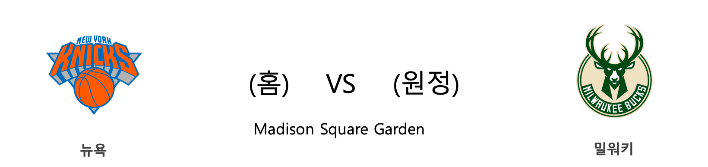

####  BOS(홈) VS HOU(원정) 

#### 2018-2019 시즌 성적

<table class="tg">
  <tr>
    <td class="tg-rr9t">BOS</td>
    <td class="tg-rr9t">팀</td>
    <td class="tg-rr9t">HOU</td>
  </tr>
  <tr>
    <th class="tg-dcpn">5위(20승 13패)</th>
    <th class="tg-o8le">시즌 순위</th>
    <th class="tg-dcpn">8위(18승 15패)</th>
  </tr>
  <tr>
    <td class="tg-txr3">111.6/105.0</td>
    <td class="tg-o8le">평균 득점/실점</td>
    <td class="tg-txr3">109.3/108.5</td>
  </tr>
  <tr>
    <td class="tg-dcpn">홈 9승 8패 원정 11승 5패</td>
    <td class="tg-wazi">홈/원정 성적</td>
    <td class="tg-dcpn">홈 7승 10패 원정 11승 5패</td>
  </tr>
</table>

#### 최근 5경기 상대전적(정규시즌)

<table class="tg">
  <tr>
    <th class="tg-d14o">경기일자 (홈팀)</th>
    <th class="tg-d14o">팀</th>
    <th class="tg-d14o">1Q</th>
    <th class="tg-d14o">2Q</th>
    <th class="tg-d14o">3Q</th>
    <th class="tg-d14o">4Q</th>
    <th class="tg-d14o">EQ</th>
    <th class="tg-d14o">Total</th>
    <th class="tg-d14o">승리팀</th>
  </tr>
</table> 
#### BOS 최근 5경기 분석(정규시즌)

<table class="tg">
  <tr>
    <th class="tg-d14o">경기일자 (홈팀)</th>
    <th class="tg-d14o">팀</th>
    <th class="tg-d14o">1Q</th>
    <th class="tg-d14o">2Q</th>
    <th class="tg-d14o">3Q</th>
    <th class="tg-d14o">4Q</th>
    <th class="tg-d14o">EQ</th>
    <th class="tg-d14o">Total</th>
    <th class="tg-d14o">승리팀</th>
  </tr>

<tr>
  <td class="tg-50j8" rowspan="2">2018-12-25(화) (PHI)</td>
  <td class="tg-50j8">PHI</td>
  <td class="tg-50j8">25</td>
  <td class="tg-50j8">26</td>
  <td class="tg-50j8">38</td>
  <td class="tg-50j8">19</td>
  <td class="tg-50j8">6</td>
  <td class="tg-50j8">114</td>
  <td class="tg-50j8" rowspan="2">BOS</td>
</tr>
<tr>
  <td class="tg-50j8">BOS</td>
  <td class="tg-50j8">32</td>
  <td class="tg-50j8">25</td>
  <td class="tg-50j8">29</td>
  <td class="tg-50j8">22</td>
  <td class="tg-50j8">13</td>
  <td class=" tg-jb7t">121</td>
</tr>

<tr>
  <td class="tg-50j8" rowspan="2">2018-12-23(일) (CHA)</td>
  <td class="tg-50j8">CHA</td>
  <td class="tg-50j8">26</td>
  <td class="tg-50j8">21</td>
  <td class="tg-50j8">20</td>
  <td class="tg-50j8">36</td>
  <td class="tg-50j8">0</td>
  <td class="tg-50j8">103</td>
  <td class="tg-50j8" rowspan="2">BOS</td>
</tr>
<tr>
  <td class="tg-50j8">BOS</td>
  <td class="tg-50j8">29</td>
  <td class="tg-50j8">39</td>
  <td class="tg-50j8">26</td>
  <td class="tg-50j8">25</td>
  <td class="tg-50j8">0</td>
  <td class=" tg-jb7t">119</td>
</tr>

<tr>
  <td class="tg-50j8" rowspan="2">2018-12-21(금) (MIL)</td>
  <td class="tg-50j8">MIL</td>
  <td class="tg-50j8">35</td>
  <td class="tg-50j8">30</td>
  <td class="tg-50j8">28</td>
  <td class="tg-50j8">27</td>
  <td class="tg-50j8">0</td>
  <td class="tg-jb7t">120</td>
  <td class="tg-50j8" rowspan="2">MIL</td>
</tr>
<tr>
  <td class="tg-50j8">BOS</td>
  <td class="tg-50j8">22</td>
  <td class="tg-50j8">26</td>
  <td class="tg-50j8">30</td>
  <td class="tg-50j8">29</td>
  <td class="tg-50j8">0</td>
  <td class=" tg-50j8">107</td>
</tr>

<tr>
  <td class="tg-50j8" rowspan="2">2018-12-19(수) (PHX)</td>
  <td class="tg-50j8">PHX</td>
  <td class="tg-50j8">26</td>
  <td class="tg-50j8">33</td>
  <td class="tg-50j8">27</td>
  <td class="tg-50j8">25</td>
  <td class="tg-50j8">0</td>
  <td class="tg-jb7t">111</td>
  <td class="tg-50j8" rowspan="2">PHX</td>
</tr>
<tr>
  <td class="tg-50j8">BOS</td>
  <td class="tg-50j8">37</td>
  <td class="tg-50j8">25</td>
  <td class="tg-50j8">18</td>
  <td class="tg-50j8">23</td>
  <td class="tg-50j8">0</td>
  <td class=" tg-50j8">103</td>
</tr>

<tr>
  <td class="tg-50j8" rowspan="2">2018-12-15(토) (BOS)</td>
  <td class="tg-50j8">BOS</td>
  <td class="tg-50j8">33</td>
  <td class="tg-50j8">23</td>
  <td class="tg-50j8">22</td>
  <td class="tg-50j8">26</td>
  <td class="tg-50j8">0</td>
  <td class="tg-50j8">104</td>
  <td class="tg-50j8" rowspan="2">DET</td>
</tr>
<tr>
  <td class="tg-50j8">DET</td>
  <td class="tg-50j8">33</td>
  <td class="tg-50j8">24</td>
  <td class="tg-50j8">28</td>
  <td class="tg-50j8">28</td>
  <td class="tg-50j8">0</td>
  <td class=" tg-jb7t">113</td>
</tr>
</table> 
#### HOU 최근 5경기 분석(정규시즌)

<table class="tg">
  <tr>
    <th class="tg-d14o">경기일자 (홈팀)</th>
    <th class="tg-d14o">팀</th>
    <th class="tg-d14o">1Q</th>
    <th class="tg-d14o">2Q</th>
    <th class="tg-d14o">3Q</th>
    <th class="tg-d14o">4Q</th>
    <th class="tg-d14o">EQ</th>
    <th class="tg-d14o">Total</th>
    <th class="tg-d14o">승리팀</th>
  </tr>

<tr>
  <td class="tg-50j8" rowspan="2">2018-12-25(화) (OKC)</td>
  <td class="tg-50j8">OKC</td>
  <td class="tg-50j8">22</td>
  <td class="tg-50j8">38</td>
  <td class="tg-50j8">28</td>
  <td class="tg-50j8">21</td>
  <td class="tg-50j8">0</td>
  <td class="tg-50j8">109</td>
  <td class="tg-50j8" rowspan="2">HOU</td>
</tr>
<tr>
  <td class="tg-50j8">HOU</td>
  <td class="tg-50j8">22</td>
  <td class="tg-50j8">30</td>
  <td class="tg-50j8">34</td>
  <td class="tg-50j8">27</td>
  <td class="tg-50j8">0</td>
  <td class=" tg-jb7t">113</td>
</tr>

<tr>
  <td class="tg-50j8" rowspan="2">2018-12-22(토) (SAS)</td>
  <td class="tg-50j8">SAS</td>
  <td class="tg-50j8">26</td>
  <td class="tg-50j8">17</td>
  <td class="tg-50j8">26</td>
  <td class="tg-50j8">32</td>
  <td class="tg-50j8">0</td>
  <td class="tg-50j8">101</td>
  <td class="tg-50j8" rowspan="2">HOU</td>
</tr>
<tr>
  <td class="tg-50j8">HOU</td>
  <td class="tg-50j8">28</td>
  <td class="tg-50j8">13</td>
  <td class="tg-50j8">43</td>
  <td class="tg-50j8">24</td>
  <td class="tg-50j8">0</td>
  <td class=" tg-jb7t">108</td>
</tr>

<tr>
  <td class="tg-50j8" rowspan="2">2018-12-20(목) (HOU)</td>
  <td class="tg-50j8">HOU</td>
  <td class="tg-50j8">33</td>
  <td class="tg-50j8">25</td>
  <td class="tg-50j8">18</td>
  <td class="tg-50j8">23</td>
  <td class="tg-50j8">0</td>
  <td class="tg-50j8">99</td>
  <td class="tg-50j8" rowspan="2">MIA</td>
</tr>
<tr>
  <td class="tg-50j8">MIA</td>
  <td class="tg-50j8">21</td>
  <td class="tg-50j8">32</td>
  <td class="tg-50j8">29</td>
  <td class="tg-50j8">19</td>
  <td class="tg-50j8">0</td>
  <td class=" tg-jb7t">101</td>
</tr>

<tr>
  <td class="tg-50j8" rowspan="2">2018-12-19(수) (WAS)</td>
  <td class="tg-50j8">WAS</td>
  <td class="tg-50j8">28</td>
  <td class="tg-50j8">30</td>
  <td class="tg-50j8">32</td>
  <td class="tg-50j8">28</td>
  <td class="tg-50j8">0</td>
  <td class="tg-50j8">118</td>
  <td class="tg-50j8" rowspan="2">HOU</td>
</tr>
<tr>
  <td class="tg-50j8">HOU</td>
  <td class="tg-50j8">34</td>
  <td class="tg-50j8">36</td>
  <td class="tg-50j8">31</td>
  <td class="tg-50j8">35</td>
  <td class="tg-50j8">0</td>
  <td class=" tg-jb7t">136</td>
</tr>

<tr>
  <td class="tg-50j8" rowspan="2">2018-12-17(월) (UTA)</td>
  <td class="tg-50j8">UTA</td>
  <td class="tg-50j8">23</td>
  <td class="tg-50j8">14</td>
  <td class="tg-50j8">36</td>
  <td class="tg-50j8">24</td>
  <td class="tg-50j8">0</td>
  <td class="tg-50j8">97</td>
  <td class="tg-50j8" rowspan="2">HOU</td>
</tr>
<tr>
  <td class="tg-50j8">HOU</td>
  <td class="tg-50j8">25</td>
  <td class="tg-50j8">25</td>
  <td class="tg-50j8">33</td>
  <td class="tg-50j8">19</td>
  <td class="tg-50j8">0</td>
  <td class=" tg-jb7t">102</td>
</tr>
</table> 
####  NYK(홈) VS MIL(원정) 

#### 2018-2019 시즌 성적

<table class="tg">
  <tr>
    <td class="tg-rr9t">NYK</td>
    <td class="tg-rr9t">팀</td>
    <td class="tg-rr9t">MIL</td>
  </tr>
  <tr>
    <th class="tg-dcpn">13위(9승 26패)</th>
    <th class="tg-o8le">시즌 순위</th>
    <th class="tg-dcpn">2위(23승 10패)</th>
  </tr>
  <tr>
    <td class="tg-txr3">108.2/115.7</td>
    <td class="tg-o8le">평균 득점/실점</td>
    <td class="tg-txr3">116.6/108.1</td>
  </tr>
  <tr>
    <td class="tg-dcpn">홈 5승 14패 원정 4승 12패</td>
    <td class="tg-wazi">홈/원정 성적</td>
    <td class="tg-dcpn">홈 9승 7패 원정 14승 3패</td>
  </tr>
</table>

#### 최근 5경기 상대전적(정규시즌)

<table class="tg">
  <tr>
    <th class="tg-d14o">경기일자 (홈팀)</th>
    <th class="tg-d14o">팀</th>
    <th class="tg-d14o">1Q</th>
    <th class="tg-d14o">2Q</th>
    <th class="tg-d14o">3Q</th>
    <th class="tg-d14o">4Q</th>
    <th class="tg-d14o">EQ</th>
    <th class="tg-d14o">Total</th>
    <th class="tg-d14o">승리팀</th>
  </tr>

<tr>
  <td class="tg-50j8" rowspan="2">2018-12-25(화) (MIL)</td>
  <td class="tg-50j8">MIL</td>
  <td class="tg-50j8">22</td>
  <td class="tg-50j8">26</td>
  <td class="tg-50j8">36</td>
  <td class="tg-50j8">25</td>
  <td class="tg-50j8">0</td>
  <td class="tg-jb7t">109</td>
  <td class="tg-50j8" rowspan="2">MIL</td>
</tr>
<tr>
  <td class="tg-50j8">NYK</td>
  <td class="tg-50j8">24</td>
  <td class="tg-50j8">22</td>
  <td class="tg-50j8">22</td>
  <td class="tg-50j8">27</td>
  <td class="tg-50j8">0</td>
  <td class=" tg-50j8">95</td>
</tr>

<tr>
  <td class="tg-50j8" rowspan="2">2018-12-01(토) (MIL)</td>
  <td class="tg-50j8">MIL</td>
  <td class="tg-50j8">35</td>
  <td class="tg-50j8">31</td>
  <td class="tg-50j8">31</td>
  <td class="tg-50j8">27</td>
  <td class="tg-50j8">10</td>
  <td class="tg-50j8">134</td>
  <td class="tg-50j8" rowspan="2">NYK</td>
</tr>
<tr>
  <td class="tg-50j8">NYK</td>
  <td class="tg-50j8">28</td>
  <td class="tg-50j8">33</td>
  <td class="tg-50j8">32</td>
  <td class="tg-50j8">31</td>
  <td class="tg-50j8">12</td>
  <td class=" tg-jb7t">136</td>
</tr>

<tr>
  <td class="tg-50j8" rowspan="2">2018-10-22(월) (NYK)</td>
  <td class="tg-50j8">NYK</td>
  <td class="tg-50j8">29</td>
  <td class="tg-50j8">23</td>
  <td class="tg-50j8">35</td>
  <td class="tg-50j8">26</td>
  <td class="tg-50j8">0</td>
  <td class="tg-50j8">113</td>
  <td class="tg-50j8" rowspan="2">MIL</td>
</tr>
<tr>
  <td class="tg-50j8">MIL</td>
  <td class="tg-50j8">33</td>
  <td class="tg-50j8">38</td>
  <td class="tg-50j8">17</td>
  <td class="tg-50j8">36</td>
  <td class="tg-50j8">0</td>
  <td class=" tg-jb7t">124</td>
</tr>
</table> 
#### NYK 최근 5경기 분석(정규시즌)

<table class="tg">
  <tr>
    <th class="tg-d14o">경기일자 (홈팀)</th>
    <th class="tg-d14o">팀</th>
    <th class="tg-d14o">1Q</th>
    <th class="tg-d14o">2Q</th>
    <th class="tg-d14o">3Q</th>
    <th class="tg-d14o">4Q</th>
    <th class="tg-d14o">EQ</th>
    <th class="tg-d14o">Total</th>
    <th class="tg-d14o">승리팀</th>
  </tr>

<tr>
  <td class="tg-50j8" rowspan="2">2018-12-25(화) (MIL)</td>
  <td class="tg-50j8">MIL</td>
  <td class="tg-50j8">22</td>
  <td class="tg-50j8">26</td>
  <td class="tg-50j8">36</td>
  <td class="tg-50j8">25</td>
  <td class="tg-50j8">0</td>
  <td class="tg-jb7t">109</td>
  <td class="tg-50j8" rowspan="2">MIL</td>
</tr>
<tr>
  <td class="tg-50j8">NYK</td>
  <td class="tg-50j8">24</td>
  <td class="tg-50j8">22</td>
  <td class="tg-50j8">22</td>
  <td class="tg-50j8">27</td>
  <td class="tg-50j8">0</td>
  <td class=" tg-50j8">95</td>
</tr>

<tr>
  <td class="tg-50j8" rowspan="2">2018-12-21(금) (ATL)</td>
  <td class="tg-50j8">ATL</td>
  <td class="tg-50j8">28</td>
  <td class="tg-50j8">32</td>
  <td class="tg-50j8">27</td>
  <td class="tg-50j8">27</td>
  <td class="tg-50j8">0</td>
  <td class="tg-jb7t">114</td>
  <td class="tg-50j8" rowspan="2">ATL</td>
</tr>
<tr>
  <td class="tg-50j8">NYK</td>
  <td class="tg-50j8">39</td>
  <td class="tg-50j8">30</td>
  <td class="tg-50j8">20</td>
  <td class="tg-50j8">18</td>
  <td class="tg-50j8">0</td>
  <td class=" tg-50j8">107</td>
</tr>

<tr>
  <td class="tg-50j8" rowspan="2">2018-12-19(수) (NYK)</td>
  <td class="tg-50j8">NYK</td>
  <td class="tg-50j8">33</td>
  <td class="tg-50j8">28</td>
  <td class="tg-50j8">24</td>
  <td class="tg-50j8">24</td>
  <td class="tg-50j8">0</td>
  <td class="tg-50j8">109</td>
  <td class="tg-50j8" rowspan="2">PHI</td>
</tr>
<tr>
  <td class="tg-50j8">PHI</td>
  <td class="tg-50j8">38</td>
  <td class="tg-50j8">31</td>
  <td class="tg-50j8">30</td>
  <td class="tg-50j8">32</td>
  <td class="tg-50j8">0</td>
  <td class=" tg-jb7t">131</td>
</tr>

<tr>
  <td class="tg-50j8" rowspan="2">2018-12-17(월) (PHX)</td>
  <td class="tg-50j8">PHX</td>
  <td class="tg-50j8">28</td>
  <td class="tg-50j8">31</td>
  <td class="tg-50j8">41</td>
  <td class="tg-50j8">28</td>
  <td class="tg-50j8">0</td>
  <td class="tg-jb7t">128</td>
  <td class="tg-50j8" rowspan="2">PHX</td>
</tr>
<tr>
  <td class="tg-50j8">NYK</td>
  <td class="tg-50j8">32</td>
  <td class="tg-50j8">34</td>
  <td class="tg-50j8">17</td>
  <td class="tg-50j8">27</td>
  <td class="tg-50j8">0</td>
  <td class=" tg-50j8">110</td>
</tr>

<tr>
  <td class="tg-50j8" rowspan="2">2018-12-16(일) (NYK)</td>
  <td class="tg-50j8">NYK</td>
  <td class="tg-50j8">26</td>
  <td class="tg-50j8">27</td>
  <td class="tg-50j8">20</td>
  <td class="tg-50j8">26</td>
  <td class="tg-50j8">0</td>
  <td class="tg-50j8">99</td>
  <td class="tg-50j8" rowspan="2">IND</td>
</tr>
<tr>
  <td class="tg-50j8">IND</td>
  <td class="tg-50j8">28</td>
  <td class="tg-50j8">28</td>
  <td class="tg-50j8">23</td>
  <td class="tg-50j8">31</td>
  <td class="tg-50j8">0</td>
  <td class=" tg-jb7t">110</td>
</tr>
</table> 
#### MIL 최근 5경기 분석(정규시즌)

<table class="tg">
  <tr>
    <th class="tg-d14o">경기일자 (홈팀)</th>
    <th class="tg-d14o">팀</th>
    <th class="tg-d14o">1Q</th>
    <th class="tg-d14o">2Q</th>
    <th class="tg-d14o">3Q</th>
    <th class="tg-d14o">4Q</th>
    <th class="tg-d14o">EQ</th>
    <th class="tg-d14o">Total</th>
    <th class="tg-d14o">승리팀</th>
  </tr>

<tr>
  <td class="tg-50j8" rowspan="2">2018-12-25(화) (MIL)</td>
  <td class="tg-50j8">MIL</td>
  <td class="tg-50j8">22</td>
  <td class="tg-50j8">26</td>
  <td class="tg-50j8">36</td>
  <td class="tg-50j8">25</td>
  <td class="tg-50j8">0</td>
  <td class="tg-jb7t">109</td>
  <td class="tg-50j8" rowspan="2">MIL</td>
</tr>
<tr>
  <td class="tg-50j8">NYK</td>
  <td class="tg-50j8">24</td>
  <td class="tg-50j8">22</td>
  <td class="tg-50j8">22</td>
  <td class="tg-50j8">27</td>
  <td class="tg-50j8">0</td>
  <td class=" tg-50j8">95</td>
</tr>

<tr>
  <td class="tg-50j8" rowspan="2">2018-12-22(토) (MIL)</td>
  <td class="tg-50j8">MIL</td>
  <td class="tg-50j8">8</td>
  <td class="tg-50j8">30</td>
  <td class="tg-50j8">20</td>
  <td class="tg-50j8">29</td>
  <td class="tg-50j8">0</td>
  <td class="tg-50j8">87</td>
  <td class="tg-50j8" rowspan="2">MIA</td>
</tr>
<tr>
  <td class="tg-50j8">MIA</td>
  <td class="tg-50j8">21</td>
  <td class="tg-50j8">16</td>
  <td class="tg-50j8">35</td>
  <td class="tg-50j8">22</td>
  <td class="tg-50j8">0</td>
  <td class=" tg-jb7t">94</td>
</tr>

<tr>
  <td class="tg-50j8" rowspan="2">2018-12-21(금) (MIL)</td>
  <td class="tg-50j8">MIL</td>
  <td class="tg-50j8">35</td>
  <td class="tg-50j8">30</td>
  <td class="tg-50j8">28</td>
  <td class="tg-50j8">27</td>
  <td class="tg-50j8">0</td>
  <td class="tg-jb7t">120</td>
  <td class="tg-50j8" rowspan="2">MIL</td>
</tr>
<tr>
  <td class="tg-50j8">BOS</td>
  <td class="tg-50j8">22</td>
  <td class="tg-50j8">26</td>
  <td class="tg-50j8">30</td>
  <td class="tg-50j8">29</td>
  <td class="tg-50j8">0</td>
  <td class=" tg-50j8">107</td>
</tr>

<tr>
  <td class="tg-50j8" rowspan="2">2018-12-19(수) (NOP)</td>
  <td class="tg-50j8">NOP</td>
  <td class="tg-50j8">31</td>
  <td class="tg-50j8">35</td>
  <td class="tg-50j8">24</td>
  <td class="tg-50j8">25</td>
  <td class="tg-50j8">0</td>
  <td class="tg-50j8">115</td>
  <td class="tg-50j8" rowspan="2">MIL</td>
</tr>
<tr>
  <td class="tg-50j8">MIL</td>
  <td class="tg-50j8">33</td>
  <td class="tg-50j8">29</td>
  <td class="tg-50j8">28</td>
  <td class="tg-50j8">33</td>
  <td class="tg-50j8">0</td>
  <td class=" tg-jb7t">123</td>
</tr>

<tr>
  <td class="tg-50j8" rowspan="2">2018-12-17(월) (MIL)</td>
  <td class="tg-50j8">MIL</td>
  <td class="tg-50j8">25</td>
  <td class="tg-50j8">30</td>
  <td class="tg-50j8">26</td>
  <td class="tg-50j8">26</td>
  <td class="tg-50j8">0</td>
  <td class="tg-jb7t">107</td>
  <td class="tg-50j8" rowspan="2">MIL</td>
</tr>
<tr>
  <td class="tg-50j8">DET</td>
  <td class="tg-50j8">27</td>
  <td class="tg-50j8">16</td>
  <td class="tg-50j8">34</td>
  <td class="tg-50j8">27</td>
  <td class="tg-50j8">0</td>
  <td class=" tg-50j8">104</td>
</tr>
</table> 
####  LAL(홈) VS SAC(원정) 

#### 2018-2019 시즌 성적

<table class="tg">
  <tr>
    <td class="tg-rr9t">LAL</td>
    <td class="tg-rr9t">팀</td>
    <td class="tg-rr9t">SAC</td>
  </tr>
  <tr>
    <th class="tg-dcpn">4위(20승 14패)</th>
    <th class="tg-o8le">시즌 순위</th>
    <th class="tg-dcpn">9위(18승 16패)</th>
  </tr>
  <tr>
    <td class="tg-txr3">113.2/111.0</td>
    <td class="tg-o8le">평균 득점/실점</td>
    <td class="tg-txr3">115.2/116.7</td>
  </tr>
  <tr>
    <td class="tg-dcpn">홈 8승 9패 원정 12승 5패</td>
    <td class="tg-wazi">홈/원정 성적</td>
    <td class="tg-dcpn">홈 9승 9패 원정 9승 7패</td>
  </tr>
</table>

#### 최근 5경기 상대전적(정규시즌)

<table class="tg">
  <tr>
    <th class="tg-d14o">경기일자 (홈팀)</th>
    <th class="tg-d14o">팀</th>
    <th class="tg-d14o">1Q</th>
    <th class="tg-d14o">2Q</th>
    <th class="tg-d14o">3Q</th>
    <th class="tg-d14o">4Q</th>
    <th class="tg-d14o">EQ</th>
    <th class="tg-d14o">Total</th>
    <th class="tg-d14o">승리팀</th>
  </tr>

<tr>
  <td class="tg-50j8" rowspan="2">2018-11-10(토) (LAL)</td>
  <td class="tg-50j8">LAL</td>
  <td class="tg-50j8">26</td>
  <td class="tg-50j8">24</td>
  <td class="tg-50j8">26</td>
  <td class="tg-50j8">25</td>
  <td class="tg-50j8">0</td>
  <td class="tg-jb7t">101</td>
  <td class="tg-50j8" rowspan="2">LAL</td>
</tr>
<tr>
  <td class="tg-50j8">SAC</td>
  <td class="tg-50j8">20</td>
  <td class="tg-50j8">24</td>
  <td class="tg-50j8">21</td>
  <td class="tg-50j8">21</td>
  <td class="tg-50j8">0</td>
  <td class=" tg-50j8">86</td>
</tr>
</table> 
#### LAL 최근 5경기 분석(정규시즌)

<table class="tg">
  <tr>
    <th class="tg-d14o">경기일자 (홈팀)</th>
    <th class="tg-d14o">팀</th>
    <th class="tg-d14o">1Q</th>
    <th class="tg-d14o">2Q</th>
    <th class="tg-d14o">3Q</th>
    <th class="tg-d14o">4Q</th>
    <th class="tg-d14o">EQ</th>
    <th class="tg-d14o">Total</th>
    <th class="tg-d14o">승리팀</th>
  </tr>

<tr>
  <td class="tg-50j8" rowspan="2">2018-12-25(화) (LAL)</td>
  <td class="tg-50j8">LAL</td>
  <td class="tg-50j8">32</td>
  <td class="tg-50j8">33</td>
  <td class="tg-50j8">26</td>
  <td class="tg-50j8">36</td>
  <td class="tg-50j8">0</td>
  <td class="tg-jb7t">127</td>
  <td class="tg-50j8" rowspan="2">LAL</td>
</tr>
<tr>
  <td class="tg-50j8">GSW</td>
  <td class="tg-50j8">25</td>
  <td class="tg-50j8">25</td>
  <td class="tg-50j8">32</td>
  <td class="tg-50j8">19</td>
  <td class="tg-50j8">0</td>
  <td class=" tg-50j8">101</td>
</tr>

<tr>
  <td class="tg-50j8" rowspan="2">2018-12-23(일) (MEM)</td>
  <td class="tg-50j8">MEM</td>
  <td class="tg-50j8">26</td>
  <td class="tg-50j8">24</td>
  <td class="tg-50j8">22</td>
  <td class="tg-50j8">35</td>
  <td class="tg-50j8">0</td>
  <td class="tg-jb7t">107</td>
  <td class="tg-50j8" rowspan="2">MEM</td>
</tr>
<tr>
  <td class="tg-50j8">LAL</td>
  <td class="tg-50j8">20</td>
  <td class="tg-50j8">26</td>
  <td class="tg-50j8">29</td>
  <td class="tg-50j8">24</td>
  <td class="tg-50j8">0</td>
  <td class=" tg-50j8">99</td>
</tr>

<tr>
  <td class="tg-50j8" rowspan="2">2018-12-21(금) (NOP)</td>
  <td class="tg-50j8">NOP</td>
  <td class="tg-50j8">34</td>
  <td class="tg-50j8">31</td>
  <td class="tg-50j8">23</td>
  <td class="tg-50j8">16</td>
  <td class="tg-50j8">0</td>
  <td class="tg-50j8">104</td>
  <td class="tg-50j8" rowspan="2">LAL</td>
</tr>
<tr>
  <td class="tg-50j8">LAL</td>
  <td class="tg-50j8">34</td>
  <td class="tg-50j8">35</td>
  <td class="tg-50j8">25</td>
  <td class="tg-50j8">18</td>
  <td class="tg-50j8">0</td>
  <td class=" tg-jb7t">112</td>
</tr>

<tr>
  <td class="tg-50j8" rowspan="2">2018-12-18(화) (LAL)</td>
  <td class="tg-50j8">LAL</td>
  <td class="tg-50j8">32</td>
  <td class="tg-50j8">25</td>
  <td class="tg-50j8">26</td>
  <td class="tg-50j8">27</td>
  <td class="tg-50j8">0</td>
  <td class="tg-50j8">110</td>
  <td class="tg-50j8" rowspan="2">BKN</td>
</tr>
<tr>
  <td class="tg-50j8">BKN</td>
  <td class="tg-50j8">33</td>
  <td class="tg-50j8">29</td>
  <td class="tg-50j8">28</td>
  <td class="tg-50j8">25</td>
  <td class="tg-50j8">0</td>
  <td class=" tg-jb7t">115</td>
</tr>

<tr>
  <td class="tg-50j8" rowspan="2">2018-12-16(일) (LAL)</td>
  <td class="tg-50j8">LAL</td>
  <td class="tg-50j8">23</td>
  <td class="tg-50j8">28</td>
  <td class="tg-50j8">25</td>
  <td class="tg-50j8">34</td>
  <td class="tg-50j8">0</td>
  <td class="tg-50j8">110</td>
  <td class="tg-50j8" rowspan="2">WAS</td>
</tr>
<tr>
  <td class="tg-50j8">WAS</td>
  <td class="tg-50j8">33</td>
  <td class="tg-50j8">38</td>
  <td class="tg-50j8">28</td>
  <td class="tg-50j8">29</td>
  <td class="tg-50j8">0</td>
  <td class=" tg-jb7t">128</td>
</tr>
</table> 
#### SAC 최근 5경기 분석(정규시즌)

<table class="tg">
  <tr>
    <th class="tg-d14o">경기일자 (홈팀)</th>
    <th class="tg-d14o">팀</th>
    <th class="tg-d14o">1Q</th>
    <th class="tg-d14o">2Q</th>
    <th class="tg-d14o">3Q</th>
    <th class="tg-d14o">4Q</th>
    <th class="tg-d14o">EQ</th>
    <th class="tg-d14o">Total</th>
    <th class="tg-d14o">승리팀</th>
  </tr>

<tr>
  <td class="tg-50j8" rowspan="2">2018-12-26(수) (SAC)</td>
  <td class="tg-50j8">SAC</td>
  <td class="tg-50j8">27</td>
  <td class="tg-50j8">29</td>
  <td class="tg-50j8">29</td>
  <td class="tg-50j8">33</td>
  <td class="tg-50j8">0</td>
  <td class="tg-50j8">118</td>
  <td class="tg-50j8" rowspan="2">LAC</td>
</tr>
<tr>
  <td class="tg-50j8">LAC</td>
  <td class="tg-50j8">39</td>
  <td class="tg-50j8">32</td>
  <td class="tg-50j8">31</td>
  <td class="tg-50j8">25</td>
  <td class="tg-50j8">0</td>
  <td class=" tg-jb7t">127</td>
</tr>

<tr>
  <td class="tg-50j8" rowspan="2">2018-12-23(일) (NOP)</td>
  <td class="tg-50j8">NOP</td>
  <td class="tg-50j8">36</td>
  <td class="tg-50j8">33</td>
  <td class="tg-50j8">27</td>
  <td class="tg-50j8">21</td>
  <td class="tg-50j8">0</td>
  <td class="tg-50j8">117</td>
  <td class="tg-50j8" rowspan="2">SAC</td>
</tr>
<tr>
  <td class="tg-50j8">SAC</td>
  <td class="tg-50j8">25</td>
  <td class="tg-50j8">33</td>
  <td class="tg-50j8">28</td>
  <td class="tg-50j8">36</td>
  <td class="tg-50j8">0</td>
  <td class=" tg-jb7t">122</td>
</tr>

<tr>
  <td class="tg-50j8" rowspan="2">2018-12-21(금) (MEM)</td>
  <td class="tg-50j8">MEM</td>
  <td class="tg-50j8">32</td>
  <td class="tg-50j8">21</td>
  <td class="tg-50j8">21</td>
  <td class="tg-50j8">25</td>
  <td class="tg-50j8">0</td>
  <td class="tg-50j8">99</td>
  <td class="tg-50j8" rowspan="2">SAC</td>
</tr>
<tr>
  <td class="tg-50j8">SAC</td>
  <td class="tg-50j8">24</td>
  <td class="tg-50j8">16</td>
  <td class="tg-50j8">25</td>
  <td class="tg-50j8">37</td>
  <td class="tg-50j8">0</td>
  <td class=" tg-jb7t">102</td>
</tr>

<tr>
  <td class="tg-50j8" rowspan="2">2018-12-19(수) (OKC)</td>
  <td class="tg-50j8">OKC</td>
  <td class="tg-50j8">36</td>
  <td class="tg-50j8">35</td>
  <td class="tg-50j8">27</td>
  <td class="tg-50j8">34</td>
  <td class="tg-50j8">0</td>
  <td class="tg-jb7t">132</td>
  <td class="tg-50j8" rowspan="2">OKC</td>
</tr>
<tr>
  <td class="tg-50j8">SAC</td>
  <td class="tg-50j8">33</td>
  <td class="tg-50j8">19</td>
  <td class="tg-50j8">37</td>
  <td class="tg-50j8">24</td>
  <td class="tg-50j8">0</td>
  <td class=" tg-50j8">113</td>
</tr>

<tr>
  <td class="tg-50j8" rowspan="2">2018-12-17(월) (SAC)</td>
  <td class="tg-50j8">SAC</td>
  <td class="tg-50j8">23</td>
  <td class="tg-50j8">21</td>
  <td class="tg-50j8">33</td>
  <td class="tg-50j8">28</td>
  <td class="tg-50j8">0</td>
  <td class="tg-50j8">105</td>
  <td class="tg-50j8" rowspan="2">MIN</td>
</tr>
<tr>
  <td class="tg-50j8">MIN</td>
  <td class="tg-50j8">38</td>
  <td class="tg-50j8">36</td>
  <td class="tg-50j8">29</td>
  <td class="tg-50j8">29</td>
  <td class="tg-50j8">0</td>
  <td class=" tg-jb7t">132</td>
</tr>
</table> 
####  POR(홈) VS GSW(원정) 

#### 2018-2019 시즌 성적

<table class="tg">
  <tr>
    <td class="tg-rr9t">POR</td>
    <td class="tg-rr9t">팀</td>
    <td class="tg-rr9t">GSW</td>
  </tr>
  <tr>
    <th class="tg-dcpn">6위(19승 15패)</th>
    <th class="tg-o8le">시즌 순위</th>
    <th class="tg-dcpn">1위(23승 12패)</th>
  </tr>
  <tr>
    <td class="tg-txr3">111.0/110.9</td>
    <td class="tg-o8le">평균 득점/실점</td>
    <td class="tg-txr3">115.6/111.5</td>
  </tr>
  <tr>
    <td class="tg-dcpn">홈 6승 10패 원정 13승 5패</td>
    <td class="tg-wazi">홈/원정 성적</td>
    <td class="tg-dcpn">홈 8승 8패 원정 15승 4패</td>
  </tr>
</table>

#### 최근 5경기 상대전적(정규시즌)

<table class="tg">
  <tr>
    <th class="tg-d14o">경기일자 (홈팀)</th>
    <th class="tg-d14o">팀</th>
    <th class="tg-d14o">1Q</th>
    <th class="tg-d14o">2Q</th>
    <th class="tg-d14o">3Q</th>
    <th class="tg-d14o">4Q</th>
    <th class="tg-d14o">EQ</th>
    <th class="tg-d14o">Total</th>
    <th class="tg-d14o">승리팀</th>
  </tr>

<tr>
  <td class="tg-50j8" rowspan="2">2018-11-23(금) (POR)</td>
  <td class="tg-50j8">POR</td>
  <td class="tg-50j8">27</td>
  <td class="tg-50j8">17</td>
  <td class="tg-50j8">29</td>
  <td class="tg-50j8">24</td>
  <td class="tg-50j8">0</td>
  <td class="tg-50j8">97</td>
  <td class="tg-50j8" rowspan="2">GSW</td>
</tr>
<tr>
  <td class="tg-50j8">GSW</td>
  <td class="tg-50j8">24</td>
  <td class="tg-50j8">35</td>
  <td class="tg-50j8">33</td>
  <td class="tg-50j8">33</td>
  <td class="tg-50j8">0</td>
  <td class=" tg-jb7t">125</td>
</tr>
</table> 
#### POR 최근 5경기 분석(정규시즌)

<table class="tg">
  <tr>
    <th class="tg-d14o">경기일자 (홈팀)</th>
    <th class="tg-d14o">팀</th>
    <th class="tg-d14o">1Q</th>
    <th class="tg-d14o">2Q</th>
    <th class="tg-d14o">3Q</th>
    <th class="tg-d14o">4Q</th>
    <th class="tg-d14o">EQ</th>
    <th class="tg-d14o">Total</th>
    <th class="tg-d14o">승리팀</th>
  </tr>

<tr>
  <td class="tg-50j8" rowspan="2">2018-12-25(화) (POR)</td>
  <td class="tg-50j8">POR</td>
  <td class="tg-50j8">24</td>
  <td class="tg-50j8">23</td>
  <td class="tg-50j8">23</td>
  <td class="tg-50j8">26</td>
  <td class="tg-50j8">0</td>
  <td class="tg-50j8">96</td>
  <td class="tg-50j8" rowspan="2">UTA</td>
</tr>
<tr>
  <td class="tg-50j8">UTA</td>
  <td class="tg-50j8">24</td>
  <td class="tg-50j8">35</td>
  <td class="tg-50j8">24</td>
  <td class="tg-50j8">34</td>
  <td class="tg-50j8">0</td>
  <td class=" tg-jb7t">117</td>
</tr>

<tr>
  <td class="tg-50j8" rowspan="2">2018-12-23(일) (DAL)</td>
  <td class="tg-50j8">DAL</td>
  <td class="tg-50j8">27</td>
  <td class="tg-50j8">25</td>
  <td class="tg-50j8">28</td>
  <td class="tg-50j8">27</td>
  <td class="tg-50j8">11</td>
  <td class="tg-50j8">118</td>
  <td class="tg-50j8" rowspan="2">POR</td>
</tr>
<tr>
  <td class="tg-50j8">POR</td>
  <td class="tg-50j8">25</td>
  <td class="tg-50j8">37</td>
  <td class="tg-50j8">26</td>
  <td class="tg-50j8">19</td>
  <td class="tg-50j8">14</td>
  <td class=" tg-jb7t">121</td>
</tr>

<tr>
  <td class="tg-50j8" rowspan="2">2018-12-21(금) (UTA)</td>
  <td class="tg-50j8">UTA</td>
  <td class="tg-50j8">33</td>
  <td class="tg-50j8">22</td>
  <td class="tg-50j8">28</td>
  <td class="tg-50j8">37</td>
  <td class="tg-50j8">0</td>
  <td class="tg-jb7t">120</td>
  <td class="tg-50j8" rowspan="2">UTA</td>
</tr>
<tr>
  <td class="tg-50j8">POR</td>
  <td class="tg-50j8">26</td>
  <td class="tg-50j8">23</td>
  <td class="tg-50j8">19</td>
  <td class="tg-50j8">22</td>
  <td class="tg-50j8">0</td>
  <td class=" tg-50j8">90</td>
</tr>

<tr>
  <td class="tg-50j8" rowspan="2">2018-12-19(수) (MEM)</td>
  <td class="tg-50j8">MEM</td>
  <td class="tg-50j8">18</td>
  <td class="tg-50j8">34</td>
  <td class="tg-50j8">19</td>
  <td class="tg-50j8">21</td>
  <td class="tg-50j8">0</td>
  <td class="tg-50j8">92</td>
  <td class="tg-50j8" rowspan="2">POR</td>
</tr>
<tr>
  <td class="tg-50j8">POR</td>
  <td class="tg-50j8">17</td>
  <td class="tg-50j8">30</td>
  <td class="tg-50j8">27</td>
  <td class="tg-50j8">25</td>
  <td class="tg-50j8">0</td>
  <td class=" tg-jb7t">99</td>
</tr>

<tr>
  <td class="tg-50j8" rowspan="2">2018-12-17(월) (POR)</td>
  <td class="tg-50j8">POR</td>
  <td class="tg-50j8">37</td>
  <td class="tg-50j8">21</td>
  <td class="tg-50j8">42</td>
  <td class="tg-50j8">31</td>
  <td class="tg-50j8">0</td>
  <td class="tg-jb7t">131</td>
  <td class="tg-50j8" rowspan="2">POR</td>
</tr>
<tr>
  <td class="tg-50j8">LAC</td>
  <td class="tg-50j8">29</td>
  <td class="tg-50j8">31</td>
  <td class="tg-50j8">28</td>
  <td class="tg-50j8">39</td>
  <td class="tg-50j8">0</td>
  <td class=" tg-50j8">127</td>
</tr>
</table> 
#### GSW 최근 5경기 분석(정규시즌)

<table class="tg">
  <tr>
    <th class="tg-d14o">경기일자 (홈팀)</th>
    <th class="tg-d14o">팀</th>
    <th class="tg-d14o">1Q</th>
    <th class="tg-d14o">2Q</th>
    <th class="tg-d14o">3Q</th>
    <th class="tg-d14o">4Q</th>
    <th class="tg-d14o">EQ</th>
    <th class="tg-d14o">Total</th>
    <th class="tg-d14o">승리팀</th>
  </tr>

<tr>
  <td class="tg-50j8" rowspan="2">2018-12-25(화) (LAL)</td>
  <td class="tg-50j8">LAL</td>
  <td class="tg-50j8">32</td>
  <td class="tg-50j8">33</td>
  <td class="tg-50j8">26</td>
  <td class="tg-50j8">36</td>
  <td class="tg-50j8">0</td>
  <td class="tg-jb7t">127</td>
  <td class="tg-50j8" rowspan="2">LAL</td>
</tr>
<tr>
  <td class="tg-50j8">GSW</td>
  <td class="tg-50j8">25</td>
  <td class="tg-50j8">25</td>
  <td class="tg-50j8">32</td>
  <td class="tg-50j8">19</td>
  <td class="tg-50j8">0</td>
  <td class=" tg-50j8">101</td>
</tr>

<tr>
  <td class="tg-50j8" rowspan="2">2018-12-23(일) (LAC)</td>
  <td class="tg-50j8">LAC</td>
  <td class="tg-50j8">36</td>
  <td class="tg-50j8">35</td>
  <td class="tg-50j8">23</td>
  <td class="tg-50j8">33</td>
  <td class="tg-50j8">0</td>
  <td class="tg-50j8">127</td>
  <td class="tg-50j8" rowspan="2">GSW</td>
</tr>
<tr>
  <td class="tg-50j8">GSW</td>
  <td class="tg-50j8">36</td>
  <td class="tg-50j8">31</td>
  <td class="tg-50j8">36</td>
  <td class="tg-50j8">26</td>
  <td class="tg-50j8">0</td>
  <td class=" tg-jb7t">129</td>
</tr>

<tr>
  <td class="tg-50j8" rowspan="2">2018-12-22(토) (DAL)</td>
  <td class="tg-50j8">DAL</td>
  <td class="tg-50j8">31</td>
  <td class="tg-50j8">30</td>
  <td class="tg-50j8">26</td>
  <td class="tg-50j8">29</td>
  <td class="tg-50j8">0</td>
  <td class="tg-50j8">116</td>
  <td class="tg-50j8" rowspan="2">GSW</td>
</tr>
<tr>
  <td class="tg-50j8">GSW</td>
  <td class="tg-50j8">28</td>
  <td class="tg-50j8">30</td>
  <td class="tg-50j8">36</td>
  <td class="tg-50j8">26</td>
  <td class="tg-50j8">0</td>
  <td class=" tg-jb7t">120</td>
</tr>

<tr>
  <td class="tg-50j8" rowspan="2">2018-12-19(수) (GSW)</td>
  <td class="tg-50j8">GSW</td>
  <td class="tg-50j8">21</td>
  <td class="tg-50j8">34</td>
  <td class="tg-50j8">25</td>
  <td class="tg-50j8">23</td>
  <td class="tg-50j8">0</td>
  <td class="tg-50j8">103</td>
  <td class="tg-50j8" rowspan="2">UTA</td>
</tr>
<tr>
  <td class="tg-50j8">UTA</td>
  <td class="tg-50j8">24</td>
  <td class="tg-50j8">32</td>
  <td class="tg-50j8">28</td>
  <td class="tg-50j8">24</td>
  <td class="tg-50j8">0</td>
  <td class=" tg-jb7t">108</td>
</tr>

<tr>
  <td class="tg-50j8" rowspan="2">2018-12-17(월) (MEM)</td>
  <td class="tg-50j8">MEM</td>
  <td class="tg-50j8">22</td>
  <td class="tg-50j8">16</td>
  <td class="tg-50j8">29</td>
  <td class="tg-50j8">26</td>
  <td class="tg-50j8">0</td>
  <td class="tg-50j8">93</td>
  <td class="tg-50j8" rowspan="2">GSW</td>
</tr>
<tr>
  <td class="tg-50j8">GSW</td>
  <td class="tg-50j8">30</td>
  <td class="tg-50j8">31</td>
  <td class="tg-50j8">23</td>
  <td class="tg-50j8">26</td>
  <td class="tg-50j8">0</td>
  <td class=" tg-jb7t">110</td>
</tr>
</table> 
####  PHI(홈) VS UTA(원정) 

#### 2018-2019 시즌 성적

<table class="tg">
  <tr>
    <td class="tg-rr9t">PHI</td>
    <td class="tg-rr9t">팀</td>
    <td class="tg-rr9t">UTA</td>
  </tr>
  <tr>
    <th class="tg-dcpn">4위(22승 13패)</th>
    <th class="tg-o8le">시즌 순위</th>
    <th class="tg-dcpn">11위(17승 18패)</th>
  </tr>
  <tr>
    <td class="tg-txr3">114.5/112.0</td>
    <td class="tg-o8le">평균 득점/실점</td>
    <td class="tg-txr3">107.2/105.6</td>
  </tr>
  <tr>
    <td class="tg-dcpn">홈 6승 10패 원정 16승 3패</td>
    <td class="tg-wazi">홈/원정 성적</td>
    <td class="tg-dcpn">홈 10승 11패 원정 7승 7패</td>
  </tr>
</table>

#### 최근 5경기 상대전적(정규시즌)

<table class="tg">
  <tr>
    <th class="tg-d14o">경기일자 (홈팀)</th>
    <th class="tg-d14o">팀</th>
    <th class="tg-d14o">1Q</th>
    <th class="tg-d14o">2Q</th>
    <th class="tg-d14o">3Q</th>
    <th class="tg-d14o">4Q</th>
    <th class="tg-d14o">EQ</th>
    <th class="tg-d14o">Total</th>
    <th class="tg-d14o">승리팀</th>
  </tr>

<tr>
  <td class="tg-50j8" rowspan="2">2018-11-16(금) (UTA)</td>
  <td class="tg-50j8">UTA</td>
  <td class="tg-50j8">24</td>
  <td class="tg-50j8">28</td>
  <td class="tg-50j8">32</td>
  <td class="tg-50j8">23</td>
  <td class="tg-50j8">0</td>
  <td class="tg-50j8">107</td>
  <td class="tg-50j8" rowspan="2">PHI</td>
</tr>
<tr>
  <td class="tg-50j8">PHI</td>
  <td class="tg-50j8">38</td>
  <td class="tg-50j8">16</td>
  <td class="tg-50j8">32</td>
  <td class="tg-50j8">27</td>
  <td class="tg-50j8">0</td>
  <td class=" tg-jb7t">113</td>
</tr>
</table> 
#### PHI 최근 5경기 분석(정규시즌)

<table class="tg">
  <tr>
    <th class="tg-d14o">경기일자 (홈팀)</th>
    <th class="tg-d14o">팀</th>
    <th class="tg-d14o">1Q</th>
    <th class="tg-d14o">2Q</th>
    <th class="tg-d14o">3Q</th>
    <th class="tg-d14o">4Q</th>
    <th class="tg-d14o">EQ</th>
    <th class="tg-d14o">Total</th>
    <th class="tg-d14o">승리팀</th>
  </tr>

<tr>
  <td class="tg-50j8" rowspan="2">2018-12-25(화) (PHI)</td>
  <td class="tg-50j8">PHI</td>
  <td class="tg-50j8">25</td>
  <td class="tg-50j8">26</td>
  <td class="tg-50j8">38</td>
  <td class="tg-50j8">19</td>
  <td class="tg-50j8">6</td>
  <td class="tg-50j8">114</td>
  <td class="tg-50j8" rowspan="2">BOS</td>
</tr>
<tr>
  <td class="tg-50j8">BOS</td>
  <td class="tg-50j8">32</td>
  <td class="tg-50j8">25</td>
  <td class="tg-50j8">29</td>
  <td class="tg-50j8">22</td>
  <td class="tg-50j8">13</td>
  <td class=" tg-jb7t">121</td>
</tr>

<tr>
  <td class="tg-50j8" rowspan="2">2018-12-22(토) (TOR)</td>
  <td class="tg-50j8">TOR</td>
  <td class="tg-50j8">30</td>
  <td class="tg-50j8">29</td>
  <td class="tg-50j8">20</td>
  <td class="tg-50j8">22</td>
  <td class="tg-50j8">0</td>
  <td class="tg-50j8">101</td>
  <td class="tg-50j8" rowspan="2">PHI</td>
</tr>
<tr>
  <td class="tg-50j8">PHI</td>
  <td class="tg-50j8">29</td>
  <td class="tg-50j8">36</td>
  <td class="tg-50j8">26</td>
  <td class="tg-50j8">35</td>
  <td class="tg-50j8">0</td>
  <td class=" tg-jb7t">126</td>
</tr>

<tr>
  <td class="tg-50j8" rowspan="2">2018-12-19(수) (NYK)</td>
  <td class="tg-50j8">NYK</td>
  <td class="tg-50j8">33</td>
  <td class="tg-50j8">28</td>
  <td class="tg-50j8">24</td>
  <td class="tg-50j8">24</td>
  <td class="tg-50j8">0</td>
  <td class="tg-50j8">109</td>
  <td class="tg-50j8" rowspan="2">PHI</td>
</tr>
<tr>
  <td class="tg-50j8">PHI</td>
  <td class="tg-50j8">38</td>
  <td class="tg-50j8">31</td>
  <td class="tg-50j8">30</td>
  <td class="tg-50j8">32</td>
  <td class="tg-50j8">0</td>
  <td class=" tg-jb7t">131</td>
</tr>

<tr>
  <td class="tg-50j8" rowspan="2">2018-12-17(월) (PHI)</td>
  <td class="tg-50j8">PHI</td>
  <td class="tg-50j8">32</td>
  <td class="tg-50j8">17</td>
  <td class="tg-50j8">22</td>
  <td class="tg-50j8">25</td>
  <td class="tg-50j8">0</td>
  <td class="tg-50j8">96</td>
  <td class="tg-50j8" rowspan="2">SAS</td>
</tr>
<tr>
  <td class="tg-50j8">SAS</td>
  <td class="tg-50j8">29</td>
  <td class="tg-50j8">31</td>
  <td class="tg-50j8">33</td>
  <td class="tg-50j8">30</td>
  <td class="tg-50j8">0</td>
  <td class=" tg-jb7t">123</td>
</tr>

<tr>
  <td class="tg-50j8" rowspan="2">2018-12-16(일) (PHI)</td>
  <td class="tg-50j8">PHI</td>
  <td class="tg-50j8">29</td>
  <td class="tg-50j8">36</td>
  <td class="tg-50j8">24</td>
  <td class="tg-50j8">39</td>
  <td class="tg-50j8">0</td>
  <td class="tg-jb7t">128</td>
  <td class="tg-50j8" rowspan="2">PHI</td>
</tr>
<tr>
  <td class="tg-50j8">CLE</td>
  <td class="tg-50j8">36</td>
  <td class="tg-50j8">22</td>
  <td class="tg-50j8">27</td>
  <td class="tg-50j8">20</td>
  <td class="tg-50j8">0</td>
  <td class=" tg-50j8">105</td>
</tr>
</table> 
#### UTA 최근 5경기 분석(정규시즌)

<table class="tg">
  <tr>
    <th class="tg-d14o">경기일자 (홈팀)</th>
    <th class="tg-d14o">팀</th>
    <th class="tg-d14o">1Q</th>
    <th class="tg-d14o">2Q</th>
    <th class="tg-d14o">3Q</th>
    <th class="tg-d14o">4Q</th>
    <th class="tg-d14o">EQ</th>
    <th class="tg-d14o">Total</th>
    <th class="tg-d14o">승리팀</th>
  </tr>

<tr>
  <td class="tg-50j8" rowspan="2">2018-12-25(화) (POR)</td>
  <td class="tg-50j8">POR</td>
  <td class="tg-50j8">24</td>
  <td class="tg-50j8">23</td>
  <td class="tg-50j8">23</td>
  <td class="tg-50j8">26</td>
  <td class="tg-50j8">0</td>
  <td class="tg-50j8">96</td>
  <td class="tg-50j8" rowspan="2">UTA</td>
</tr>
<tr>
  <td class="tg-50j8">UTA</td>
  <td class="tg-50j8">24</td>
  <td class="tg-50j8">35</td>
  <td class="tg-50j8">24</td>
  <td class="tg-50j8">34</td>
  <td class="tg-50j8">0</td>
  <td class=" tg-jb7t">117</td>
</tr>

<tr>
  <td class="tg-50j8" rowspan="2">2018-12-22(토) (OKC)</td>
  <td class="tg-50j8">OKC</td>
  <td class="tg-50j8">26</td>
  <td class="tg-50j8">32</td>
  <td class="tg-50j8">35</td>
  <td class="tg-50j8">14</td>
  <td class="tg-50j8">0</td>
  <td class="tg-jb7t">107</td>
  <td class="tg-50j8" rowspan="2">OKC</td>
</tr>
<tr>
  <td class="tg-50j8">UTA</td>
  <td class="tg-50j8">32</td>
  <td class="tg-50j8">29</td>
  <td class="tg-50j8">20</td>
  <td class="tg-50j8">25</td>
  <td class="tg-50j8">0</td>
  <td class=" tg-50j8">106</td>
</tr>

<tr>
  <td class="tg-50j8" rowspan="2">2018-12-21(금) (UTA)</td>
  <td class="tg-50j8">UTA</td>
  <td class="tg-50j8">33</td>
  <td class="tg-50j8">22</td>
  <td class="tg-50j8">28</td>
  <td class="tg-50j8">37</td>
  <td class="tg-50j8">0</td>
  <td class="tg-jb7t">120</td>
  <td class="tg-50j8" rowspan="2">UTA</td>
</tr>
<tr>
  <td class="tg-50j8">POR</td>
  <td class="tg-50j8">26</td>
  <td class="tg-50j8">23</td>
  <td class="tg-50j8">19</td>
  <td class="tg-50j8">22</td>
  <td class="tg-50j8">0</td>
  <td class=" tg-50j8">90</td>
</tr>

<tr>
  <td class="tg-50j8" rowspan="2">2018-12-19(수) (GSW)</td>
  <td class="tg-50j8">GSW</td>
  <td class="tg-50j8">21</td>
  <td class="tg-50j8">34</td>
  <td class="tg-50j8">25</td>
  <td class="tg-50j8">23</td>
  <td class="tg-50j8">0</td>
  <td class="tg-50j8">103</td>
  <td class="tg-50j8" rowspan="2">UTA</td>
</tr>
<tr>
  <td class="tg-50j8">UTA</td>
  <td class="tg-50j8">24</td>
  <td class="tg-50j8">32</td>
  <td class="tg-50j8">28</td>
  <td class="tg-50j8">24</td>
  <td class="tg-50j8">0</td>
  <td class=" tg-jb7t">108</td>
</tr>

<tr>
  <td class="tg-50j8" rowspan="2">2018-12-17(월) (UTA)</td>
  <td class="tg-50j8">UTA</td>
  <td class="tg-50j8">23</td>
  <td class="tg-50j8">14</td>
  <td class="tg-50j8">36</td>
  <td class="tg-50j8">24</td>
  <td class="tg-50j8">0</td>
  <td class="tg-50j8">97</td>
  <td class="tg-50j8" rowspan="2">HOU</td>
</tr>
<tr>
  <td class="tg-50j8">HOU</td>
  <td class="tg-50j8">25</td>
  <td class="tg-50j8">25</td>
  <td class="tg-50j8">33</td>
  <td class="tg-50j8">19</td>
  <td class="tg-50j8">0</td>
  <td class=" tg-jb7t">102</td>
</tr>
</table> 
#### 리그 (Eastern) 순위
    

<table class="tg">
  <tr>
    <th class="tg-d14o">순위</th>
    <th class="tg-d14o">팀명</th>
    <th class="tg-d14o">경기수</th>
    <th class="tg-d14o">승</th>
    <th class="tg-d14o">패</th>
    <th class="tg-d14o">승차</th>
    <th class="tg-d14o">승률</th>
  </tr>
  
<tr>
    <td class="tg-50j8">1</td>
    <td class="tg-50j8">TOR</td>
    <td class="tg-50j8">36</td>
    <td class="tg-50j8">26</td>
    <td class="tg-50j8">10</td>
    <td class="tg-50j8">0</td>
    <td class="tg-50j8">0.722</td>
</tr>

<tr>
    <td class="tg-50j8">2</td>
    <td class="tg-50j8">MIL</td>
    <td class="tg-50j8">33</td>
    <td class="tg-50j8">23</td>
    <td class="tg-50j8">10</td>
    <td class="tg-50j8">3</td>
    <td class="tg-50j8">0.697</td>
</tr>

<tr>
    <td class="tg-50j8">3</td>
    <td class="tg-50j8">IND</td>
    <td class="tg-50j8">35</td>
    <td class="tg-50j8">23</td>
    <td class="tg-50j8">12</td>
    <td class="tg-50j8">3</td>
    <td class="tg-50j8">0.657</td>
</tr>

<tr>
    <td class="tg-50j8">4</td>
    <td class="tg-50j8">PHI</td>
    <td class="tg-50j8">35</td>
    <td class="tg-50j8">22</td>
    <td class="tg-50j8">13</td>
    <td class="tg-50j8">4</td>
    <td class="tg-50j8">0.629</td>
</tr>

<tr>
    <td class="tg-50j8">5</td>
    <td class="tg-50j8">BOS</td>
    <td class="tg-50j8">33</td>
    <td class="tg-50j8">20</td>
    <td class="tg-50j8">13</td>
    <td class="tg-50j8">6</td>
    <td class="tg-50j8">0.606</td>
</tr>

<tr>
    <td class="tg-50j8">6</td>
    <td class="tg-50j8">BKN</td>
    <td class="tg-50j8">36</td>
    <td class="tg-50j8">17</td>
    <td class="tg-50j8">19</td>
    <td class="tg-50j8">9</td>
    <td class="tg-50j8">0.472</td>
</tr>

<tr>
    <td class="tg-50j8">7</td>
    <td class="tg-50j8">DET</td>
    <td class="tg-50j8">32</td>
    <td class="tg-50j8">16</td>
    <td class="tg-50j8">16</td>
    <td class="tg-50j8">10</td>
    <td class="tg-50j8">0.5</td>
</tr>

<tr>
    <td class="tg-50j8">8</td>
    <td class="tg-50j8">MIA</td>
    <td class="tg-50j8">33</td>
    <td class="tg-50j8">16</td>
    <td class="tg-50j8">17</td>
    <td class="tg-50j8">10</td>
    <td class="tg-50j8">0.485</td>
</tr>

<tr>
    <td class="tg-50j8">8</td>
    <td class="tg-50j8">CHA</td>
    <td class="tg-50j8">33</td>
    <td class="tg-50j8">16</td>
    <td class="tg-50j8">17</td>
    <td class="tg-50j8">10</td>
    <td class="tg-50j8">0.485</td>
</tr>

<tr>
    <td class="tg-50j8">10</td>
    <td class="tg-50j8">ORL</td>
    <td class="tg-50j8">33</td>
    <td class="tg-50j8">14</td>
    <td class="tg-50j8">19</td>
    <td class="tg-50j8">12</td>
    <td class="tg-50j8">0.424</td>
</tr>

<tr>
    <td class="tg-50j8">11</td>
    <td class="tg-50j8">WAS</td>
    <td class="tg-50j8">35</td>
    <td class="tg-50j8">13</td>
    <td class="tg-50j8">22</td>
    <td class="tg-50j8">13</td>
    <td class="tg-50j8">0.371</td>
</tr>

<tr>
    <td class="tg-50j8">12</td>
    <td class="tg-50j8">ATL</td>
    <td class="tg-50j8">33</td>
    <td class="tg-50j8">9</td>
    <td class="tg-50j8">24</td>
    <td class="tg-50j8">17</td>
    <td class="tg-50j8">0.273</td>
</tr>

<tr>
    <td class="tg-50j8">13</td>
    <td class="tg-50j8">CHI</td>
    <td class="tg-50j8">35</td>
    <td class="tg-50j8">9</td>
    <td class="tg-50j8">26</td>
    <td class="tg-50j8">17</td>
    <td class="tg-50j8">0.257</td>
</tr>

<tr>
    <td class="tg-50j8">13</td>
    <td class="tg-50j8">NYK</td>
    <td class="tg-50j8">35</td>
    <td class="tg-50j8">9</td>
    <td class="tg-50j8">26</td>
    <td class="tg-50j8">17</td>
    <td class="tg-50j8">0.257</td>
</tr>

<tr>
    <td class="tg-50j8">15</td>
    <td class="tg-50j8">CLE</td>
    <td class="tg-50j8">35</td>
    <td class="tg-50j8">8</td>
    <td class="tg-50j8">27</td>
    <td class="tg-50j8">18</td>
    <td class="tg-50j8">0.229</td>
</tr>
</table> 
#### 리그 (Western) 순위
    

<table class="tg">
  <tr>
    <th class="tg-d14o">순위</th>
    <th class="tg-d14o">팀명</th>
    <th class="tg-d14o">경기수</th>
    <th class="tg-d14o">승</th>
    <th class="tg-d14o">패</th>
    <th class="tg-d14o">승차</th>
    <th class="tg-d14o">승률</th>
  </tr>
  
<tr>
    <td class="tg-50j8">1</td>
    <td class="tg-50j8">GSW</td>
    <td class="tg-50j8">35</td>
    <td class="tg-50j8">23</td>
    <td class="tg-50j8">12</td>
    <td class="tg-50j8">3</td>
    <td class="tg-50j8">0.657</td>
</tr>

<tr>
    <td class="tg-50j8">2</td>
    <td class="tg-50j8">DEN</td>
    <td class="tg-50j8">32</td>
    <td class="tg-50j8">21</td>
    <td class="tg-50j8">11</td>
    <td class="tg-50j8">5</td>
    <td class="tg-50j8">0.656</td>
</tr>

<tr>
    <td class="tg-50j8">3</td>
    <td class="tg-50j8">OKC</td>
    <td class="tg-50j8">33</td>
    <td class="tg-50j8">21</td>
    <td class="tg-50j8">12</td>
    <td class="tg-50j8">5</td>
    <td class="tg-50j8">0.636</td>
</tr>

<tr>
    <td class="tg-50j8">4</td>
    <td class="tg-50j8">LAL</td>
    <td class="tg-50j8">34</td>
    <td class="tg-50j8">20</td>
    <td class="tg-50j8">14</td>
    <td class="tg-50j8">6</td>
    <td class="tg-50j8">0.588</td>
</tr>

<tr>
    <td class="tg-50j8">4</td>
    <td class="tg-50j8">LAC</td>
    <td class="tg-50j8">34</td>
    <td class="tg-50j8">20</td>
    <td class="tg-50j8">14</td>
    <td class="tg-50j8">6</td>
    <td class="tg-50j8">0.588</td>
</tr>

<tr>
    <td class="tg-50j8">6</td>
    <td class="tg-50j8">POR</td>
    <td class="tg-50j8">34</td>
    <td class="tg-50j8">19</td>
    <td class="tg-50j8">15</td>
    <td class="tg-50j8">7</td>
    <td class="tg-50j8">0.559</td>
</tr>

<tr>
    <td class="tg-50j8">7</td>
    <td class="tg-50j8">SAS</td>
    <td class="tg-50j8">35</td>
    <td class="tg-50j8">19</td>
    <td class="tg-50j8">16</td>
    <td class="tg-50j8">7</td>
    <td class="tg-50j8">0.543</td>
</tr>

<tr>
    <td class="tg-50j8">8</td>
    <td class="tg-50j8">HOU</td>
    <td class="tg-50j8">33</td>
    <td class="tg-50j8">18</td>
    <td class="tg-50j8">15</td>
    <td class="tg-50j8">8</td>
    <td class="tg-50j8">0.545</td>
</tr>

<tr>
    <td class="tg-50j8">9</td>
    <td class="tg-50j8">MEM</td>
    <td class="tg-50j8">34</td>
    <td class="tg-50j8">18</td>
    <td class="tg-50j8">16</td>
    <td class="tg-50j8">8</td>
    <td class="tg-50j8">0.529</td>
</tr>

<tr>
    <td class="tg-50j8">9</td>
    <td class="tg-50j8">SAC</td>
    <td class="tg-50j8">34</td>
    <td class="tg-50j8">18</td>
    <td class="tg-50j8">16</td>
    <td class="tg-50j8">8</td>
    <td class="tg-50j8">0.529</td>
</tr>

<tr>
    <td class="tg-50j8">11</td>
    <td class="tg-50j8">UTA</td>
    <td class="tg-50j8">35</td>
    <td class="tg-50j8">17</td>
    <td class="tg-50j8">18</td>
    <td class="tg-50j8">9</td>
    <td class="tg-50j8">0.486</td>
</tr>

<tr>
    <td class="tg-50j8">12</td>
    <td class="tg-50j8">DAL</td>
    <td class="tg-50j8">33</td>
    <td class="tg-50j8">16</td>
    <td class="tg-50j8">17</td>
    <td class="tg-50j8">10</td>
    <td class="tg-50j8">0.485</td>
</tr>

<tr>
    <td class="tg-50j8">13</td>
    <td class="tg-50j8">MIN</td>
    <td class="tg-50j8">34</td>
    <td class="tg-50j8">16</td>
    <td class="tg-50j8">18</td>
    <td class="tg-50j8">10</td>
    <td class="tg-50j8">0.471</td>
</tr>

<tr>
    <td class="tg-50j8">14</td>
    <td class="tg-50j8">NOP</td>
    <td class="tg-50j8">35</td>
    <td class="tg-50j8">15</td>
    <td class="tg-50j8">20</td>
    <td class="tg-50j8">11</td>
    <td class="tg-50j8">0.429</td>
</tr>

<tr>
    <td class="tg-50j8">15</td>
    <td class="tg-50j8">PHX</td>
    <td class="tg-50j8">35</td>
    <td class="tg-50j8">9</td>
    <td class="tg-50j8">26</td>
    <td class="tg-50j8">17</td>
    <td class="tg-50j8">0.257</td>
</tr>
</table> 