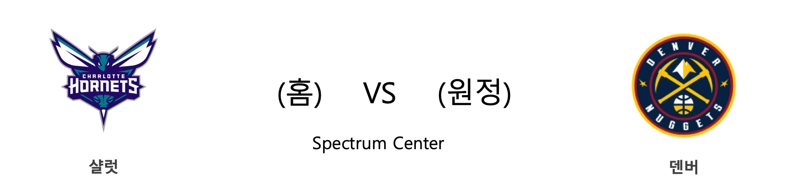

####  MEM(홈) VS SAS(원정) 

<table class="tg">
  <tr>
    <th class="tg-rr9t">MEM</th>
    <th class="tg-rr9t">팀</th>
    <th class="tg-rr9t">SAS</th>
  </tr>
  <tr>
    <td class="tg-dcpn">1승 0패</td>
    <td class="tg-rr9t">시즌 상대전적</td>
    <td class="tg-dcpn">0승 1패</td>
  </tr>
  <tr>
    <td class="tg-dcpn">88</td>
    <td class="tg-rr9t">점수</td>
    <td class="tg-dcpn">108</td>
  </tr>
  <tr>
    <td class="tg-dcpn">20/54(37%)</td>
    <td class="tg-rr9t">2점(%)</td>
    <td class="tg-dcpn">29/51(57%)</td>
  </tr>
  <tr>
    <td class="tg-dcpn">11/28(39%)</td>
    <td class="tg-rr9t">3점(%)</td>
    <td class="tg-dcpn">7/22(32%)</td>
  </tr>
  <tr>
    <td class="tg-dcpn">15/19(79%)</td>
    <td class="tg-rr9t">자유투(%)</td>
    <td class="tg-dcpn">29/35(83%)</td>
  </tr>
  <tr>
    <td class="tg-dcpn">42</td>
    <td class="tg-rr9t">리바운드</td>
    <td class="tg-dcpn">43</td>
  </tr>
  <tr>
    <td class="tg-dcpn">21</td>
    <td class="tg-rr9t">어시스트</td>
    <td class="tg-dcpn">26</td>
  </tr>
  <tr>
    <td class="tg-dcpn">12</td>
    <td class="tg-rr9t">스틸</td>
    <td class="tg-dcpn">10</td>
  </tr>
  <tr>
    <td class="tg-dcpn">3</td>
    <td class="tg-rr9t">블록</td>
    <td class="tg-dcpn">3</td>
  </tr>
  <tr>
    <td class="tg-dcpn">20</td>
    <td class="tg-rr9t">턴오버</td>
    <td class="tg-dcpn">15</td>
  </tr>
  <tr>
    <td class="tg-dcpn">MikeConleyG(21) DillonBrooks(15) JarenJacksonJr.F(15)</td>
    <td class="tg-rr9t">주요 득점선수</td>
    <td class="tg-dcpn">LaMarcusAldridgeC(18) DerrickWhiteF(19) PattyMills(15)</td>
  </tr>
</table>

#### 경기 관련 주요 기사         

[[오늘의 NBA] (4/3) 러셀 웨스트브룩, 오클라호마시티의 괴인](http://sports.news.naver.com/basketball/news/read.nhn?oid=486&aid=0000001005)

[[오늘의 NBA] (5/21) 골든스테이트, 5년 연속 파이널 진출!](http://sports.news.naver.com/basketball/news/read.nhn?oid=486&aid=0000001048)

[[오늘의 NBA] (4/28) 카와이 레너드와 더마 드로잔의 뒤틀린 운명](http://sports.news.naver.com/basketball/news/read.nhn?oid=486&aid=0000001027)

[[오늘의 NBA] (4/23) 밀워키, 동부컨퍼런스 PO 2라운드 진출!](http://sports.news.naver.com/basketball/news/read.nhn?oid=486&aid=0000001022)

[[오늘의 NBA] 시즌 프리뷰 : 프랜차이즈 가치 보전에 나선 골든스테이트](http://sports.news.naver.com/basketball/news/read.nhn?oid=486&aid=0000001112)

        
        

####  DAL(홈) VS PHI(원정) 

<table class="tg">
  <tr>
    <th class="tg-rr9t">DAL</th>
    <th class="tg-rr9t">팀</th>
    <th class="tg-rr9t">PHI</th>
  </tr>
  <tr>
    <td class="tg-dcpn">0승 0패</td>
    <td class="tg-rr9t">시즌 상대전적</td>
    <td class="tg-dcpn">0승 0패</td>
  </tr>
  <tr>
    <td class="tg-dcpn">100</td>
    <td class="tg-rr9t">점수</td>
    <td class="tg-dcpn">106</td>
  </tr>
  <tr>
    <td class="tg-dcpn">29/57(51%)</td>
    <td class="tg-rr9t">2점(%)</td>
    <td class="tg-dcpn">33/57(58%)</td>
  </tr>
  <tr>
    <td class="tg-dcpn">9/31(29%)</td>
    <td class="tg-rr9t">3점(%)</td>
    <td class="tg-dcpn">6/26(23%)</td>
  </tr>
  <tr>
    <td class="tg-dcpn">15/23(65%)</td>
    <td class="tg-rr9t">자유투(%)</td>
    <td class="tg-dcpn">22/33(67%)</td>
  </tr>
  <tr>
    <td class="tg-dcpn">49</td>
    <td class="tg-rr9t">리바운드</td>
    <td class="tg-dcpn">49</td>
  </tr>
  <tr>
    <td class="tg-dcpn">27</td>
    <td class="tg-rr9t">어시스트</td>
    <td class="tg-dcpn">31</td>
  </tr>
  <tr>
    <td class="tg-dcpn">4</td>
    <td class="tg-rr9t">스틸</td>
    <td class="tg-dcpn">7</td>
  </tr>
  <tr>
    <td class="tg-dcpn">3</td>
    <td class="tg-rr9t">블록</td>
    <td class="tg-dcpn">5</td>
  </tr>
  <tr>
    <td class="tg-dcpn">15</td>
    <td class="tg-rr9t">턴오버</td>
    <td class="tg-dcpn">10</td>
  </tr>
  <tr>
    <td class="tg-dcpn">RyanBroekhoff(15) WesleyMatthewsF(18)</td>
    <td class="tg-rr9t">주요 득점선수</td>
    <td class="tg-dcpn">JJRedickG(20) JoelEmbiidC(25) BenSimmonsG(20)</td>
  </tr>
</table>

#### 경기 관련 주요 기사         

[Here’s What We Learned in N.F.L. Week 1](https://www.nytimes.com/2019/09/08/sports/football/nfl-week-1.html?partner=naver)

[[오늘의 NBA] 시즌 프리뷰 : 포틀랜드, 근성과 낭만의 조화](http://sports.news.naver.com/basketball/news/read.nhn?oid=486&aid=0000001110)

[[오늘의 NBA] 시즌 프리뷰 : 피닉스, 날지 못하는 불사조](http://sports.news.naver.com/basketball/news/read.nhn?oid=486&aid=0000001084)

[[오늘의 NBA] 시즌 프리뷰 : 보스턴, 리더십이 필요하다!](http://sports.news.naver.com/basketball/news/read.nhn?oid=486&aid=0000001106)

[[오늘의 NBA] (5/8) DEN 자말 머레이의 농구 각성](http://sports.news.naver.com/basketball/news/read.nhn?oid=486&aid=0000001037)

        
        

####  UTA(홈) VS DET(원정) 

<table class="tg">
  <tr>
    <th class="tg-rr9t">UTA</th>
    <th class="tg-rr9t">팀</th>
    <th class="tg-rr9t">DET</th>
  </tr>
  <tr>
    <td class="tg-dcpn">0승 0패</td>
    <td class="tg-rr9t">시즌 상대전적</td>
    <td class="tg-dcpn">0승 0패</td>
  </tr>
  <tr>
    <td class="tg-dcpn">110</td>
    <td class="tg-rr9t">점수</td>
    <td class="tg-dcpn">105</td>
  </tr>
  <tr>
    <td class="tg-dcpn">32/61(52%)</td>
    <td class="tg-rr9t">2점(%)</td>
    <td class="tg-dcpn">28/57(49%)</td>
  </tr>
  <tr>
    <td class="tg-dcpn">7/21(33%)</td>
    <td class="tg-rr9t">3점(%)</td>
    <td class="tg-dcpn">11/25(44%)</td>
  </tr>
  <tr>
    <td class="tg-dcpn">25/32(78%)</td>
    <td class="tg-rr9t">자유투(%)</td>
    <td class="tg-dcpn">16/20(80%)</td>
  </tr>
  <tr>
    <td class="tg-dcpn">42</td>
    <td class="tg-rr9t">리바운드</td>
    <td class="tg-dcpn">44</td>
  </tr>
  <tr>
    <td class="tg-dcpn">24</td>
    <td class="tg-rr9t">어시스트</td>
    <td class="tg-dcpn">18</td>
  </tr>
  <tr>
    <td class="tg-dcpn">12</td>
    <td class="tg-rr9t">스틸</td>
    <td class="tg-dcpn">7</td>
  </tr>
  <tr>
    <td class="tg-dcpn">6</td>
    <td class="tg-rr9t">블록</td>
    <td class="tg-dcpn">2</td>
  </tr>
  <tr>
    <td class="tg-dcpn">12</td>
    <td class="tg-rr9t">턴오버</td>
    <td class="tg-dcpn">18</td>
  </tr>
  <tr>
    <td class="tg-dcpn">JoeInglesF(16) RickyRubioG(18) DonovanMitchellG(26)</td>
    <td class="tg-rr9t">주요 득점선수</td>
    <td class="tg-dcpn">BlakeGriffinF(34) AndreDrummondC(15) ReggieBullockF(19)</td>
  </tr>
</table>

#### 경기 관련 주요 기사         

[[오늘의 NBA] (2/17) 동부컨퍼런스 전반기 정리](http://sports.news.naver.com/basketball/news/read.nhn?oid=486&aid=0000000964)

[[오늘의 NBA] 시즌 프리뷰 : 디트로이트, 슈팅 문제를 극복하라!](http://sports.news.naver.com/basketball/news/read.nhn?oid=486&aid=0000001096)

[[오늘의 NBA] 2018-19시즌 정리 2부](http://sports.news.naver.com/basketball/news/read.nhn?oid=486&aid=0000001062)

[[오늘의 NBA] (6/14) 토론토 우승, 파이널 MVP 카와이 레너드](http://sports.news.naver.com/basketball/news/read.nhn?oid=486&aid=0000001059)

[[오늘의 NBA] 시즌 프리뷰 : 미네소타, 가시밭길 앞에 서다](http://sports.news.naver.com/basketball/news/read.nhn?oid=486&aid=0000001091)

        
        

####  GSW(홈) VS SAC(원정) 

<table class="tg">
  <tr>
    <th class="tg-rr9t">GSW</th>
    <th class="tg-rr9t">팀</th>
    <th class="tg-rr9t">SAC</th>
  </tr>
  <tr>
    <td class="tg-dcpn">2승 0패</td>
    <td class="tg-rr9t">시즌 상대전적</td>
    <td class="tg-dcpn">0승 2패</td>
  </tr>
  <tr>
    <td class="tg-dcpn">127</td>
    <td class="tg-rr9t">점수</td>
    <td class="tg-dcpn">123</td>
  </tr>
  <tr>
    <td class="tg-dcpn">26/46(57%)</td>
    <td class="tg-rr9t">2점(%)</td>
    <td class="tg-dcpn">26/61(43%)</td>
  </tr>
  <tr>
    <td class="tg-dcpn">21/47(45%)</td>
    <td class="tg-rr9t">3점(%)</td>
    <td class="tg-dcpn">20/36(56%)</td>
  </tr>
  <tr>
    <td class="tg-dcpn">12/14(86%)</td>
    <td class="tg-rr9t">자유투(%)</td>
    <td class="tg-dcpn">11/14(79%)</td>
  </tr>
  <tr>
    <td class="tg-dcpn">47</td>
    <td class="tg-rr9t">리바운드</td>
    <td class="tg-dcpn">43</td>
  </tr>
  <tr>
    <td class="tg-dcpn">29</td>
    <td class="tg-rr9t">어시스트</td>
    <td class="tg-dcpn">34</td>
  </tr>
  <tr>
    <td class="tg-dcpn">5</td>
    <td class="tg-rr9t">스틸</td>
    <td class="tg-dcpn">12</td>
  </tr>
  <tr>
    <td class="tg-dcpn">8</td>
    <td class="tg-rr9t">블록</td>
    <td class="tg-dcpn">0</td>
  </tr>
  <tr>
    <td class="tg-dcpn">13</td>
    <td class="tg-rr9t">턴오버</td>
    <td class="tg-dcpn">8</td>
  </tr>
  <tr>
    <td class="tg-dcpn">StephenCurryG(42) KevinDurantF(29) KlayThompsonG(20)</td>
    <td class="tg-rr9t">주요 득점선수</td>
    <td class="tg-dcpn">BogdanBogdanovicF(17) BuddyHieldG(32) JustinJackson(28)</td>
  </tr>
</table>

#### 경기 관련 주요 기사         

[[줌 인 NBA] Spicy P 파스칼 시아캄, 토론토의 새로운 스타를 꿈꾸다!](http://sports.news.naver.com/basketball/news/read.nhn?oid=065&aid=0000185224)

[[오늘의 NBA] 시즌 프리뷰 : 뉴올리언스, 원나잇 리툴링](http://sports.news.naver.com/basketball/news/read.nhn?oid=486&aid=0000001090)

[[오늘의 NBA] 시즌 프리뷰 : 오클라호마시티, 미래를 향해 달려간다](http://sports.news.naver.com/basketball/news/read.nhn?oid=486&aid=0000001102)

[[오늘의 NBA] 시즌 프리뷰 : 포틀랜드, 근성과 낭만의 조화](http://sports.news.naver.com/basketball/news/read.nhn?oid=486&aid=0000001110)

[[오늘의 NBA] 시즌 프리뷰 : 덴버, 서부컨퍼런스 정복을 노린다](http://sports.news.naver.com/basketball/news/read.nhn?oid=486&aid=0000001111)

        
        

####  NOP(홈) VS CLE(원정) 

<table class="tg">
  <tr>
    <th class="tg-rr9t">NOP</th>
    <th class="tg-rr9t">팀</th>
    <th class="tg-rr9t">CLE</th>
  </tr>
  <tr>
    <td class="tg-dcpn">0승 0패</td>
    <td class="tg-rr9t">시즌 상대전적</td>
    <td class="tg-dcpn">0승 0패</td>
  </tr>
  <tr>
    <td class="tg-dcpn">133</td>
    <td class="tg-rr9t">점수</td>
    <td class="tg-dcpn">98</td>
  </tr>
  <tr>
    <td class="tg-dcpn">33/54(61%)</td>
    <td class="tg-rr9t">2점(%)</td>
    <td class="tg-dcpn">24/55(44%)</td>
  </tr>
  <tr>
    <td class="tg-dcpn">14/27(52%)</td>
    <td class="tg-rr9t">3점(%)</td>
    <td class="tg-dcpn">12/33(36%)</td>
  </tr>
  <tr>
    <td class="tg-dcpn">25/29(86%)</td>
    <td class="tg-rr9t">자유투(%)</td>
    <td class="tg-dcpn">14/18(78%)</td>
  </tr>
  <tr>
    <td class="tg-dcpn">44</td>
    <td class="tg-rr9t">리바운드</td>
    <td class="tg-dcpn">34</td>
  </tr>
  <tr>
    <td class="tg-dcpn">29</td>
    <td class="tg-rr9t">어시스트</td>
    <td class="tg-dcpn">22</td>
  </tr>
  <tr>
    <td class="tg-dcpn">13</td>
    <td class="tg-rr9t">스틸</td>
    <td class="tg-dcpn">12</td>
  </tr>
  <tr>
    <td class="tg-dcpn">7</td>
    <td class="tg-rr9t">블록</td>
    <td class="tg-dcpn">3</td>
  </tr>
  <tr>
    <td class="tg-dcpn">14</td>
    <td class="tg-rr9t">턴오버</td>
    <td class="tg-dcpn">17</td>
  </tr>
  <tr>
    <td class="tg-dcpn">AnthonyDavisC(20) JrueHolidayF(22) JuliusRandleF(22)</td>
    <td class="tg-rr9t">주요 득점선수</td>
    <td class="tg-dcpn">JordanClarkson(23) CollinSextonG(15) JalenJones(15)</td>
  </tr>
</table>

#### 경기 관련 주요 기사         

[CLE 우승 이끈 데이비드 그리핀, NOP의 새 시대 연다](http://www.spotvnews.co.kr/?mod=news&act=articleView&idxno=317316)

[듀란트 말에 반박…커리 "두 번의 우승을 따냈다"](http://www.spotvnews.co.kr/?mod=news&act=articleView&idxno=317467)

[[오늘의 NBA] 시즌 프리뷰 : 프랜차이즈 가치 보전에 나선 골든스테이트](http://sports.news.naver.com/basketball/news/read.nhn?oid=486&aid=0000001112)

['올림픽 경험 無' 커리 "내년에 꼭 뛰고 싶다"](http://www.spotvnews.co.kr/?mod=news&act=articleView&idxno=317505)

[[오늘의 NBA] 시즌 프리뷰 : 애틀랜타, 젊은이들의 양지](http://sports.news.naver.com/basketball/news/read.nhn?oid=486&aid=0000001086)

        
        

####  HOU(홈) VS POR(원정) 

<table class="tg">
  <tr>
    <th class="tg-rr9t">HOU</th>
    <th class="tg-rr9t">팀</th>
    <th class="tg-rr9t">POR</th>
  </tr>
  <tr>
    <td class="tg-dcpn">1승 1패</td>
    <td class="tg-rr9t">시즌 상대전적</td>
    <td class="tg-dcpn">1승 1패</td>
  </tr>
  <tr>
    <td class="tg-dcpn">101</td>
    <td class="tg-rr9t">점수</td>
    <td class="tg-dcpn">110</td>
  </tr>
  <tr>
    <td class="tg-dcpn">26/46(57%)</td>
    <td class="tg-rr9t">2점(%)</td>
    <td class="tg-dcpn">34/66(52%)</td>
  </tr>
  <tr>
    <td class="tg-dcpn">13/38(34%)</td>
    <td class="tg-rr9t">3점(%)</td>
    <td class="tg-dcpn">9/28(32%)</td>
  </tr>
  <tr>
    <td class="tg-dcpn">10/12(83%)</td>
    <td class="tg-rr9t">자유투(%)</td>
    <td class="tg-dcpn">15/20(75%)</td>
  </tr>
  <tr>
    <td class="tg-dcpn">40</td>
    <td class="tg-rr9t">리바운드</td>
    <td class="tg-dcpn">47</td>
  </tr>
  <tr>
    <td class="tg-dcpn">13</td>
    <td class="tg-rr9t">어시스트</td>
    <td class="tg-dcpn">27</td>
  </tr>
  <tr>
    <td class="tg-dcpn">6</td>
    <td class="tg-rr9t">스틸</td>
    <td class="tg-dcpn">7</td>
  </tr>
  <tr>
    <td class="tg-dcpn">5</td>
    <td class="tg-rr9t">블록</td>
    <td class="tg-dcpn">2</td>
  </tr>
  <tr>
    <td class="tg-dcpn">12</td>
    <td class="tg-rr9t">턴오버</td>
    <td class="tg-dcpn">9</td>
  </tr>
  <tr>
    <td class="tg-dcpn">AustinRiversG(21) JamesHardenG(38)</td>
    <td class="tg-rr9t">주요 득점선수</td>
    <td class="tg-dcpn">JusufNurkicC(25) CJMcCollumG(24) DamianLillardG(17)</td>
  </tr>
</table>

#### 경기 관련 주요 기사         

[[오늘의 NBA] 시즌 프리뷰 : 오클라호마시티, 미래를 향해 달려간다](http://sports.news.naver.com/basketball/news/read.nhn?oid=486&aid=0000001102)

[[오늘의 NBA] 시즌 프리뷰 : 덴버, 서부컨퍼런스 정복을 노린다](http://sports.news.naver.com/basketball/news/read.nhn?oid=486&aid=0000001111)

[[오늘의 NBA] 시즌 프리뷰 : 브루클린, 대권 도전 기틀을 마련하다](http://sports.news.naver.com/basketball/news/read.nhn?oid=486&aid=0000001098)

[[오늘의 NBA] 시즌 프리뷰 : 디트로이트, 슈팅 문제를 극복하라!](http://sports.news.naver.com/basketball/news/read.nhn?oid=486&aid=0000001096)

[[오늘의 NBA] 시즌 프리뷰 : 휴스턴, 슈퍼스타 백코트 ver.2](http://sports.news.naver.com/basketball/news/read.nhn?oid=486&aid=0000001109)

        
        

####  TOR(홈) VS MIL(원정) 

<table class="tg">
  <tr>
    <th class="tg-rr9t">TOR</th>
    <th class="tg-rr9t">팀</th>
    <th class="tg-rr9t">MIL</th>
  </tr>
  <tr>
    <td class="tg-dcpn">0승 2패</td>
    <td class="tg-rr9t">시즌 상대전적</td>
    <td class="tg-dcpn">2승 0패</td>
  </tr>
  <tr>
    <td class="tg-dcpn">123</td>
    <td class="tg-rr9t">점수</td>
    <td class="tg-dcpn">116</td>
  </tr>
  <tr>
    <td class="tg-dcpn">28/51(55%)</td>
    <td class="tg-rr9t">2점(%)</td>
    <td class="tg-dcpn">26/44(59%)</td>
  </tr>
  <tr>
    <td class="tg-dcpn">14/31(45%)</td>
    <td class="tg-rr9t">3점(%)</td>
    <td class="tg-dcpn">14/37(38%)</td>
  </tr>
  <tr>
    <td class="tg-dcpn">25/31(81%)</td>
    <td class="tg-rr9t">자유투(%)</td>
    <td class="tg-dcpn">22/27(81%)</td>
  </tr>
  <tr>
    <td class="tg-dcpn">38</td>
    <td class="tg-rr9t">리바운드</td>
    <td class="tg-dcpn">38</td>
  </tr>
  <tr>
    <td class="tg-dcpn">28</td>
    <td class="tg-rr9t">어시스트</td>
    <td class="tg-dcpn">29</td>
  </tr>
  <tr>
    <td class="tg-dcpn">9</td>
    <td class="tg-rr9t">스틸</td>
    <td class="tg-dcpn">9</td>
  </tr>
  <tr>
    <td class="tg-dcpn">6</td>
    <td class="tg-rr9t">블록</td>
    <td class="tg-dcpn">2</td>
  </tr>
  <tr>
    <td class="tg-dcpn">11</td>
    <td class="tg-rr9t">턴오버</td>
    <td class="tg-dcpn">14</td>
  </tr>
  <tr>
    <td class="tg-dcpn">KawhiLeonardF(30) PascalSiakamF(30) SergeIbakaC(25) FredVanVleetG(21)</td>
    <td class="tg-rr9t">주요 득점선수</td>
    <td class="tg-dcpn">GiannisAntetokounmpoF(43) MalcolmBrogdonG(15)</td>
  </tr>
</table>

#### 경기 관련 주요 기사         

[[오늘의 NBA] 시즌 프리뷰 : 브루클린, 대권 도전 기틀을 마련하다](http://sports.news.naver.com/basketball/news/read.nhn?oid=486&aid=0000001098)

[[오늘의 NBA] 시즌 프리뷰 : 클리퍼스의 과감한 베팅](http://sports.news.naver.com/basketball/news/read.nhn?oid=486&aid=0000001100)

[[오늘의 NBA] 시즌 프리뷰 : 새크라멘토, 13년을 소모한 기다림](http://sports.news.naver.com/basketball/news/read.nhn?oid=486&aid=0000001095)

[[PO 프리뷰]루키가 예상한 MIL vs TOR...손대범·박세운의 선택은?](http://www.rookie.co.kr/news/articleView.html?idxno=30573)

[[오늘의MLB] (9.1) 미네소타 단일 시즌 팀 홈런 신기록](http://sports.news.naver.com/wbaseball/news/read.nhn?oid=460&aid=0000001111)

        
        

####  CHA(홈) VS DEN(원정) 

<table class="tg">
  <tr>
    <th class="tg-rr9t">CHA</th>
    <th class="tg-rr9t">팀</th>
    <th class="tg-rr9t">DEN</th>
  </tr>
  <tr>
    <td class="tg-dcpn">1승 0패</td>
    <td class="tg-rr9t">시즌 상대전적</td>
    <td class="tg-dcpn">0승 1패</td>
  </tr>
  <tr>
    <td class="tg-dcpn">110</td>
    <td class="tg-rr9t">점수</td>
    <td class="tg-dcpn">123</td>
  </tr>
  <tr>
    <td class="tg-dcpn">28/53(53%)</td>
    <td class="tg-rr9t">2점(%)</td>
    <td class="tg-dcpn">33/63(52%)</td>
  </tr>
  <tr>
    <td class="tg-dcpn">11/29(38%)</td>
    <td class="tg-rr9t">3점(%)</td>
    <td class="tg-dcpn">14/39(36%)</td>
  </tr>
  <tr>
    <td class="tg-dcpn">21/26(81%)</td>
    <td class="tg-rr9t">자유투(%)</td>
    <td class="tg-dcpn">15/20(75%)</td>
  </tr>
  <tr>
    <td class="tg-dcpn">47</td>
    <td class="tg-rr9t">리바운드</td>
    <td class="tg-dcpn">46</td>
  </tr>
  <tr>
    <td class="tg-dcpn">22</td>
    <td class="tg-rr9t">어시스트</td>
    <td class="tg-dcpn">30</td>
  </tr>
  <tr>
    <td class="tg-dcpn">7</td>
    <td class="tg-rr9t">스틸</td>
    <td class="tg-dcpn">10</td>
  </tr>
  <tr>
    <td class="tg-dcpn">4</td>
    <td class="tg-rr9t">블록</td>
    <td class="tg-dcpn">6</td>
  </tr>
  <tr>
    <td class="tg-dcpn">17</td>
    <td class="tg-rr9t">턴오버</td>
    <td class="tg-dcpn">7</td>
  </tr>
  <tr>
    <td class="tg-dcpn">MarvinWilliamsF(16) KembaWalkerG(20) BismackBiyomboC(16) MalikMonk(16)</td>
    <td class="tg-rr9t">주요 득점선수</td>
    <td class="tg-dcpn">PaulMillsap(18) NikolaJokicF(39) GaryHarris(17)</td>
  </tr>
</table>

#### 경기 관련 주요 기사         

[[오늘의 NBA] (3/25) CHA 제레미 램, 기적의 역전극을 연출하다](http://sports.news.naver.com/basketball/news/read.nhn?oid=486&aid=0000000996)

[[오늘의 NBA] 시즌 프리뷰 : 클리퍼스의 과감한 베팅](http://sports.news.naver.com/basketball/news/read.nhn?oid=486&aid=0000001100)

[[오늘의 NBA] (2/2) DEN 마이크 말론 감독의 역습](http://sports.news.naver.com/basketball/news/read.nhn?oid=486&aid=0000000949)

[[오늘의 NBA] (3/30) BOS, 동부컨퍼런스 4위 고지를 탈환하다](http://sports.news.naver.com/basketball/news/read.nhn?oid=486&aid=0000001001)

[[오늘의 NBA] 시즌 프리뷰 : 샬럿, 막다른 골목에 내몰리다](http://sports.news.naver.com/basketball/news/read.nhn?oid=486&aid=0000001093)

        
        

#### 리그 (Eastern) 순위
    

<table class="tg">
  <tr>
    <th class="tg-d14o">순위</th>
    <th class="tg-d14o">팀명</th>
    <th class="tg-d14o">경기수</th>
    <th class="tg-d14o">승</th>
    <th class="tg-d14o">패</th>
    <th class="tg-d14o">승차</th>
    <th class="tg-d14o">승률</th>
  </tr>
  
<tr>
    <td class="tg-50j8">1</td>
    <td class="tg-50j8">TOR</td>
    <td class="tg-50j8">38</td>
    <td class="tg-50j8">27</td>
    <td class="tg-50j8">11</td>
    <td class="tg-50j8">0</td>
    <td class="tg-50j8">0.711</td>
</tr>

<tr>
    <td class="tg-50j8">2</td>
    <td class="tg-50j8">MIL</td>
    <td class="tg-50j8">35</td>
    <td class="tg-50j8">25</td>
    <td class="tg-50j8">10</td>
    <td class="tg-50j8">2</td>
    <td class="tg-50j8">0.714</td>
</tr>

<tr>
    <td class="tg-50j8">3</td>
    <td class="tg-50j8">IND</td>
    <td class="tg-50j8">37</td>
    <td class="tg-50j8">25</td>
    <td class="tg-50j8">12</td>
    <td class="tg-50j8">2</td>
    <td class="tg-50j8">0.676</td>
</tr>

<tr>
    <td class="tg-50j8">4</td>
    <td class="tg-50j8">PHI</td>
    <td class="tg-50j8">37</td>
    <td class="tg-50j8">23</td>
    <td class="tg-50j8">14</td>
    <td class="tg-50j8">4</td>
    <td class="tg-50j8">0.622</td>
</tr>

<tr>
    <td class="tg-50j8">5</td>
    <td class="tg-50j8">BOS</td>
    <td class="tg-50j8">36</td>
    <td class="tg-50j8">21</td>
    <td class="tg-50j8">15</td>
    <td class="tg-50j8">6</td>
    <td class="tg-50j8">0.583</td>
</tr>

<tr>
    <td class="tg-50j8">6</td>
    <td class="tg-50j8">CHA</td>
    <td class="tg-50j8">36</td>
    <td class="tg-50j8">18</td>
    <td class="tg-50j8">18</td>
    <td class="tg-50j8">9</td>
    <td class="tg-50j8">0.5</td>
</tr>

<tr>
    <td class="tg-50j8">7</td>
    <td class="tg-50j8">MIA</td>
    <td class="tg-50j8">35</td>
    <td class="tg-50j8">17</td>
    <td class="tg-50j8">18</td>
    <td class="tg-50j8">10</td>
    <td class="tg-50j8">0.486</td>
</tr>

<tr>
    <td class="tg-50j8">8</td>
    <td class="tg-50j8">BKN</td>
    <td class="tg-50j8">38</td>
    <td class="tg-50j8">17</td>
    <td class="tg-50j8">21</td>
    <td class="tg-50j8">10</td>
    <td class="tg-50j8">0.447</td>
</tr>

<tr>
    <td class="tg-50j8">9</td>
    <td class="tg-50j8">DET</td>
    <td class="tg-50j8">34</td>
    <td class="tg-50j8">16</td>
    <td class="tg-50j8">18</td>
    <td class="tg-50j8">11</td>
    <td class="tg-50j8">0.471</td>
</tr>

<tr>
    <td class="tg-50j8">10</td>
    <td class="tg-50j8">ORL</td>
    <td class="tg-50j8">36</td>
    <td class="tg-50j8">16</td>
    <td class="tg-50j8">20</td>
    <td class="tg-50j8">11</td>
    <td class="tg-50j8">0.444</td>
</tr>

<tr>
    <td class="tg-50j8">11</td>
    <td class="tg-50j8">WAS</td>
    <td class="tg-50j8">37</td>
    <td class="tg-50j8">14</td>
    <td class="tg-50j8">23</td>
    <td class="tg-50j8">13</td>
    <td class="tg-50j8">0.378</td>
</tr>

<tr>
    <td class="tg-50j8">12</td>
    <td class="tg-50j8">ATL</td>
    <td class="tg-50j8">36</td>
    <td class="tg-50j8">11</td>
    <td class="tg-50j8">25</td>
    <td class="tg-50j8">16</td>
    <td class="tg-50j8">0.306</td>
</tr>

<tr>
    <td class="tg-50j8">13</td>
    <td class="tg-50j8">CHI</td>
    <td class="tg-50j8">37</td>
    <td class="tg-50j8">10</td>
    <td class="tg-50j8">27</td>
    <td class="tg-50j8">17</td>
    <td class="tg-50j8">0.27</td>
</tr>

<tr>
    <td class="tg-50j8">14</td>
    <td class="tg-50j8">NYK</td>
    <td class="tg-50j8">37</td>
    <td class="tg-50j8">9</td>
    <td class="tg-50j8">28</td>
    <td class="tg-50j8">18</td>
    <td class="tg-50j8">0.243</td>
</tr>

<tr>
    <td class="tg-50j8">15</td>
    <td class="tg-50j8">CLE</td>
    <td class="tg-50j8">37</td>
    <td class="tg-50j8">8</td>
    <td class="tg-50j8">29</td>
    <td class="tg-50j8">19</td>
    <td class="tg-50j8">0.216</td>
</tr>
</table> 
#### 리그 (Western) 순위
    

<table class="tg">
  <tr>
    <th class="tg-d14o">순위</th>
    <th class="tg-d14o">팀명</th>
    <th class="tg-d14o">경기수</th>
    <th class="tg-d14o">승</th>
    <th class="tg-d14o">패</th>
    <th class="tg-d14o">승차</th>
    <th class="tg-d14o">승률</th>
  </tr>
  
<tr>
    <td class="tg-50j8">1</td>
    <td class="tg-50j8">GSW</td>
    <td class="tg-50j8">38</td>
    <td class="tg-50j8">25</td>
    <td class="tg-50j8">13</td>
    <td class="tg-50j8">2</td>
    <td class="tg-50j8">0.658</td>
</tr>

<tr>
    <td class="tg-50j8">2</td>
    <td class="tg-50j8">DEN</td>
    <td class="tg-50j8">34</td>
    <td class="tg-50j8">23</td>
    <td class="tg-50j8">11</td>
    <td class="tg-50j8">4</td>
    <td class="tg-50j8">0.676</td>
</tr>

<tr>
    <td class="tg-50j8">3</td>
    <td class="tg-50j8">OKC</td>
    <td class="tg-50j8">36</td>
    <td class="tg-50j8">23</td>
    <td class="tg-50j8">13</td>
    <td class="tg-50j8">4</td>
    <td class="tg-50j8">0.639</td>
</tr>

<tr>
    <td class="tg-50j8">4</td>
    <td class="tg-50j8">HOU</td>
    <td class="tg-50j8">36</td>
    <td class="tg-50j8">21</td>
    <td class="tg-50j8">15</td>
    <td class="tg-50j8">6</td>
    <td class="tg-50j8">0.583</td>
</tr>

<tr>
    <td class="tg-50j8">4</td>
    <td class="tg-50j8">LAC</td>
    <td class="tg-50j8">36</td>
    <td class="tg-50j8">21</td>
    <td class="tg-50j8">15</td>
    <td class="tg-50j8">6</td>
    <td class="tg-50j8">0.583</td>
</tr>

<tr>
    <td class="tg-50j8">6</td>
    <td class="tg-50j8">LAL</td>
    <td class="tg-50j8">37</td>
    <td class="tg-50j8">21</td>
    <td class="tg-50j8">16</td>
    <td class="tg-50j8">6</td>
    <td class="tg-50j8">0.568</td>
</tr>

<tr>
    <td class="tg-50j8">6</td>
    <td class="tg-50j8">POR</td>
    <td class="tg-50j8">37</td>
    <td class="tg-50j8">21</td>
    <td class="tg-50j8">16</td>
    <td class="tg-50j8">6</td>
    <td class="tg-50j8">0.568</td>
</tr>

<tr>
    <td class="tg-50j8">8</td>
    <td class="tg-50j8">SAS</td>
    <td class="tg-50j8">38</td>
    <td class="tg-50j8">21</td>
    <td class="tg-50j8">17</td>
    <td class="tg-50j8">6</td>
    <td class="tg-50j8">0.553</td>
</tr>

<tr>
    <td class="tg-50j8">9</td>
    <td class="tg-50j8">SAC</td>
    <td class="tg-50j8">36</td>
    <td class="tg-50j8">19</td>
    <td class="tg-50j8">17</td>
    <td class="tg-50j8">8</td>
    <td class="tg-50j8">0.528</td>
</tr>

<tr>
    <td class="tg-50j8">10</td>
    <td class="tg-50j8">MEM</td>
    <td class="tg-50j8">36</td>
    <td class="tg-50j8">18</td>
    <td class="tg-50j8">18</td>
    <td class="tg-50j8">9</td>
    <td class="tg-50j8">0.5</td>
</tr>

<tr>
    <td class="tg-50j8">11</td>
    <td class="tg-50j8">UTA</td>
    <td class="tg-50j8">37</td>
    <td class="tg-50j8">18</td>
    <td class="tg-50j8">19</td>
    <td class="tg-50j8">9</td>
    <td class="tg-50j8">0.486</td>
</tr>

<tr>
    <td class="tg-50j8">12</td>
    <td class="tg-50j8">DAL</td>
    <td class="tg-50j8">36</td>
    <td class="tg-50j8">17</td>
    <td class="tg-50j8">19</td>
    <td class="tg-50j8">10</td>
    <td class="tg-50j8">0.472</td>
</tr>

<tr>
    <td class="tg-50j8">13</td>
    <td class="tg-50j8">MIN</td>
    <td class="tg-50j8">37</td>
    <td class="tg-50j8">17</td>
    <td class="tg-50j8">20</td>
    <td class="tg-50j8">10</td>
    <td class="tg-50j8">0.459</td>
</tr>

<tr>
    <td class="tg-50j8">14</td>
    <td class="tg-50j8">NOP</td>
    <td class="tg-50j8">38</td>
    <td class="tg-50j8">17</td>
    <td class="tg-50j8">21</td>
    <td class="tg-50j8">10</td>
    <td class="tg-50j8">0.447</td>
</tr>

<tr>
    <td class="tg-50j8">15</td>
    <td class="tg-50j8">PHX</td>
    <td class="tg-50j8">38</td>
    <td class="tg-50j8">9</td>
    <td class="tg-50j8">29</td>
    <td class="tg-50j8">18</td>
    <td class="tg-50j8">0.237</td>
</tr>
</table> 

        
        
