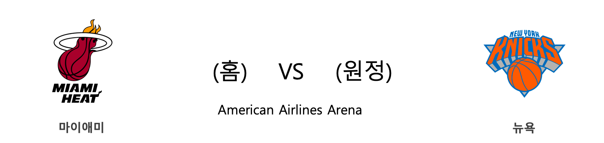

####  WAS(홈) VS SAS(원정) 

#### 2018-2019 시즌 성적

<table class="tg">
  <tr>
    <td class="tg-rr9t">WAS</td>
    <td class="tg-rr9t">팀</td>
    <td class="tg-rr9t">SAS</td>
  </tr>
  <tr>
    <th class="tg-dcpn">9위(21승 27패)</th>
    <th class="tg-o8le">시즌 순위</th>
    <th class="tg-dcpn">6위(28승 22패)</th>
  </tr>
  <tr>
    <td class="tg-txr3">112.7/115.5</td>
    <td class="tg-o8le">평균 득점/실점</td>
    <td class="tg-txr3">111.9/109.6</td>
  </tr>
  <tr>
    <td class="tg-dcpn">홈 6승 18패 원정 15승 9패</td>
    <td class="tg-wazi">홈/원정 성적</td>
    <td class="tg-dcpn">홈 10승 15패 원정 18승 7패</td>
  </tr>
</table>

#### 최근 5경기 상대전적(정규시즌)

<table class="tg">
  <tr>
    <th class="tg-d14o">경기일자 (홈팀)</th>
    <th class="tg-d14o">팀</th>
    <th class="tg-d14o">1Q</th>
    <th class="tg-d14o">2Q</th>
    <th class="tg-d14o">3Q</th>
    <th class="tg-d14o">4Q</th>
    <th class="tg-d14o">EQ</th>
    <th class="tg-d14o">Total</th>
    <th class="tg-d14o">승리팀</th>
  </tr>
</table> 
#### WAS 최근 5경기 분석(정규시즌)

<table class="tg">
  <tr>
    <th class="tg-d14o">경기일자 (홈팀)</th>
    <th class="tg-d14o">팀</th>
    <th class="tg-d14o">1Q</th>
    <th class="tg-d14o">2Q</th>
    <th class="tg-d14o">3Q</th>
    <th class="tg-d14o">4Q</th>
    <th class="tg-d14o">EQ</th>
    <th class="tg-d14o">Total</th>
    <th class="tg-d14o">승리팀</th>
  </tr>

<tr>
  <td class="tg-50j8" rowspan="2">2019-01-25(금) (WAS)</td>
  <td class="tg-50j8">WAS</td>
  <td class="tg-50j8">24</td>
  <td class="tg-50j8">26</td>
  <td class="tg-50j8">25</td>
  <td class="tg-50j8">20</td>
  <td class="tg-50j8">0</td>
  <td class="tg-jb7t">95</td>
  <td class="tg-50j8" rowspan="2">WAS</td>
</tr>
<tr>
  <td class="tg-50j8">ORL</td>
  <td class="tg-50j8">21</td>
  <td class="tg-50j8">17</td>
  <td class="tg-50j8">31</td>
  <td class="tg-50j8">22</td>
  <td class="tg-50j8">0</td>
  <td class=" tg-50j8">91</td>
</tr>

<tr>
  <td class="tg-50j8" rowspan="2">2019-01-24(목) (GSW)</td>
  <td class="tg-50j8">GSW</td>
  <td class="tg-50j8">37</td>
  <td class="tg-50j8">30</td>
  <td class="tg-50j8">37</td>
  <td class="tg-50j8">22</td>
  <td class="tg-50j8">0</td>
  <td class="tg-jb7t">126</td>
  <td class="tg-50j8" rowspan="2">GSW</td>
</tr>
<tr>
  <td class="tg-50j8">WAS</td>
  <td class="tg-50j8">28</td>
  <td class="tg-50j8">31</td>
  <td class="tg-50j8">33</td>
  <td class="tg-50j8">26</td>
  <td class="tg-50j8">0</td>
  <td class=" tg-50j8">118</td>
</tr>

<tr>
  <td class="tg-50j8" rowspan="2">2019-01-21(월) (DET)</td>
  <td class="tg-50j8">DET</td>
  <td class="tg-50j8">17</td>
  <td class="tg-50j8">17</td>
  <td class="tg-50j8">30</td>
  <td class="tg-50j8">23</td>
  <td class="tg-50j8">0</td>
  <td class="tg-50j8">87</td>
  <td class="tg-50j8" rowspan="2">WAS</td>
</tr>
<tr>
  <td class="tg-50j8">WAS</td>
  <td class="tg-50j8">29</td>
  <td class="tg-50j8">21</td>
  <td class="tg-50j8">31</td>
  <td class="tg-50j8">20</td>
  <td class="tg-50j8">0</td>
  <td class=" tg-jb7t">101</td>
</tr>

<tr>
  <td class="tg-50j8" rowspan="2">2019-01-17(목) (NYK)</td>
  <td class="tg-50j8">NYK</td>
  <td class="tg-50j8">30</td>
  <td class="tg-50j8">33</td>
  <td class="tg-50j8">26</td>
  <td class="tg-50j8">11</td>
  <td class="tg-50j8">0</td>
  <td class="tg-50j8">100</td>
  <td class="tg-50j8" rowspan="2">WAS</td>
</tr>
<tr>
  <td class="tg-50j8">WAS</td>
  <td class="tg-50j8">20</td>
  <td class="tg-50j8">33</td>
  <td class="tg-50j8">24</td>
  <td class="tg-50j8">24</td>
  <td class="tg-50j8">0</td>
  <td class=" tg-jb7t">101</td>
</tr>

<tr>
  <td class="tg-50j8" rowspan="2">2019-01-13(일) (TOR)</td>
  <td class="tg-50j8">TOR</td>
  <td class="tg-50j8">36</td>
  <td class="tg-50j8">25</td>
  <td class="tg-50j8">37</td>
  <td class="tg-50j8">26</td>
  <td class="tg-50j8">16</td>
  <td class="tg-jb7t">140</td>
  <td class="tg-50j8" rowspan="2">TOR</td>
</tr>
<tr>
  <td class="tg-50j8">WAS</td>
  <td class="tg-50j8">21</td>
  <td class="tg-50j8">29</td>
  <td class="tg-50j8">34</td>
  <td class="tg-50j8">40</td>
  <td class="tg-50j8">14</td>
  <td class=" tg-50j8">138</td>
</tr>
</table> 
#### SAS 최근 5경기 분석(정규시즌)

<table class="tg">
  <tr>
    <th class="tg-d14o">경기일자 (홈팀)</th>
    <th class="tg-d14o">팀</th>
    <th class="tg-d14o">1Q</th>
    <th class="tg-d14o">2Q</th>
    <th class="tg-d14o">3Q</th>
    <th class="tg-d14o">4Q</th>
    <th class="tg-d14o">EQ</th>
    <th class="tg-d14o">Total</th>
    <th class="tg-d14o">승리팀</th>
  </tr>

<tr>
  <td class="tg-50j8" rowspan="2">2019-01-26(토) (SAS)</td>
  <td class="tg-50j8">SAS</td>
  <td class="tg-50j8">28</td>
  <td class="tg-50j8">32</td>
  <td class="tg-50j8">36</td>
  <td class="tg-50j8">30</td>
  <td class="tg-50j8">0</td>
  <td class="tg-jb7t">126</td>
  <td class="tg-50j8" rowspan="2">SAS</td>
</tr>
<tr>
  <td class="tg-50j8">NOP</td>
  <td class="tg-50j8">27</td>
  <td class="tg-50j8">30</td>
  <td class="tg-50j8">28</td>
  <td class="tg-50j8">29</td>
  <td class="tg-50j8">0</td>
  <td class=" tg-50j8">114</td>
</tr>

<tr>
  <td class="tg-50j8" rowspan="2">2019-01-23(수) (SAS)</td>
  <td class="tg-50j8">SAS</td>
  <td class="tg-50j8">35</td>
  <td class="tg-50j8">29</td>
  <td class="tg-50j8">32</td>
  <td class="tg-50j8">24</td>
  <td class="tg-50j8">0</td>
  <td class="tg-50j8">120</td>
  <td class="tg-50j8" rowspan="2">PHI</td>
</tr>
<tr>
  <td class="tg-50j8">PHI</td>
  <td class="tg-50j8">34</td>
  <td class="tg-50j8">33</td>
  <td class="tg-50j8">29</td>
  <td class="tg-50j8">26</td>
  <td class="tg-50j8">0</td>
  <td class=" tg-jb7t">122</td>
</tr>

<tr>
  <td class="tg-50j8" rowspan="2">2019-01-20(일) (LAC)</td>
  <td class="tg-50j8">LAC</td>
  <td class="tg-50j8">38</td>
  <td class="tg-50j8">22</td>
  <td class="tg-50j8">20</td>
  <td class="tg-50j8">23</td>
  <td class="tg-50j8">0</td>
  <td class="tg-jb7t">103</td>
  <td class="tg-50j8" rowspan="2">LAC</td>
</tr>
<tr>
  <td class="tg-50j8">SAS</td>
  <td class="tg-50j8">26</td>
  <td class="tg-50j8">27</td>
  <td class="tg-50j8">20</td>
  <td class="tg-50j8">22</td>
  <td class="tg-50j8">0</td>
  <td class=" tg-50j8">95</td>
</tr>

<tr>
  <td class="tg-50j8" rowspan="2">2019-01-18(금) (SAS)</td>
  <td class="tg-50j8">SAS</td>
  <td class="tg-50j8">28</td>
  <td class="tg-50j8">30</td>
  <td class="tg-50j8">30</td>
  <td class="tg-50j8">28</td>
  <td class="tg-50j8">0</td>
  <td class="tg-jb7t">116</td>
  <td class="tg-50j8" rowspan="2">SAS</td>
</tr>
<tr>
  <td class="tg-50j8">MIN</td>
  <td class="tg-50j8">31</td>
  <td class="tg-50j8">27</td>
  <td class="tg-50j8">32</td>
  <td class="tg-50j8">23</td>
  <td class="tg-50j8">0</td>
  <td class=" tg-50j8">113</td>
</tr>

<tr>
  <td class="tg-50j8" rowspan="2">2019-01-16(수) (SAS)</td>
  <td class="tg-50j8">SAS</td>
  <td class="tg-50j8">20</td>
  <td class="tg-50j8">25</td>
  <td class="tg-50j8">30</td>
  <td class="tg-50j8">30</td>
  <td class="tg-50j8">0</td>
  <td class="tg-jb7t">105</td>
  <td class="tg-50j8" rowspan="2">SAS</td>
</tr>
<tr>
  <td class="tg-50j8">DAL</td>
  <td class="tg-50j8">35</td>
  <td class="tg-50j8">21</td>
  <td class="tg-50j8">24</td>
  <td class="tg-50j8">21</td>
  <td class="tg-50j8">0</td>
  <td class=" tg-50j8">101</td>
</tr>
</table> 
####  PHX(홈) VS LAL(원정) 

#### 2018-2019 시즌 성적

<table class="tg">
  <tr>
    <td class="tg-rr9t">PHX</td>
    <td class="tg-rr9t">팀</td>
    <td class="tg-rr9t">LAL</td>
  </tr>
  <tr>
    <th class="tg-dcpn">15위(11승 40패)</th>
    <th class="tg-o8le">시즌 순위</th>
    <th class="tg-dcpn">9위(25승 24패)</th>
  </tr>
  <tr>
    <td class="tg-txr3">105.8/115.5</td>
    <td class="tg-o8le">평균 득점/실점</td>
    <td class="tg-txr3">112.2/111.9</td>
  </tr>
  <tr>
    <td class="tg-dcpn">홈 4승 21패 원정 7승 19패</td>
    <td class="tg-wazi">홈/원정 성적</td>
    <td class="tg-dcpn">홈 10승 13패 원정 15승 11패</td>
  </tr>
</table>

#### 최근 5경기 상대전적(정규시즌)

<table class="tg">
  <tr>
    <th class="tg-d14o">경기일자 (홈팀)</th>
    <th class="tg-d14o">팀</th>
    <th class="tg-d14o">1Q</th>
    <th class="tg-d14o">2Q</th>
    <th class="tg-d14o">3Q</th>
    <th class="tg-d14o">4Q</th>
    <th class="tg-d14o">EQ</th>
    <th class="tg-d14o">Total</th>
    <th class="tg-d14o">승리팀</th>
  </tr>

<tr>
  <td class="tg-50j8" rowspan="2">2018-12-02(일) (PHX)</td>
  <td class="tg-50j8">PHX</td>
  <td class="tg-50j8">31</td>
  <td class="tg-50j8">15</td>
  <td class="tg-50j8">28</td>
  <td class="tg-50j8">22</td>
  <td class="tg-50j8">0</td>
  <td class="tg-50j8">96</td>
  <td class="tg-50j8" rowspan="2">LAL</td>
</tr>
<tr>
  <td class="tg-50j8">LAL</td>
  <td class="tg-50j8">21</td>
  <td class="tg-50j8">40</td>
  <td class="tg-50j8">34</td>
  <td class="tg-50j8">25</td>
  <td class="tg-50j8">0</td>
  <td class=" tg-jb7t">120</td>
</tr>

<tr>
  <td class="tg-50j8" rowspan="2">2018-10-24(수) (LAL)</td>
  <td class="tg-50j8">LAL</td>
  <td class="tg-50j8">32</td>
  <td class="tg-50j8">44</td>
  <td class="tg-50j8">30</td>
  <td class="tg-50j8">25</td>
  <td class="tg-50j8">0</td>
  <td class="tg-jb7t">131</td>
  <td class="tg-50j8" rowspan="2">LAL</td>
</tr>
<tr>
  <td class="tg-50j8">PHX</td>
  <td class="tg-50j8">30</td>
  <td class="tg-50j8">24</td>
  <td class="tg-50j8">32</td>
  <td class="tg-50j8">27</td>
  <td class="tg-50j8">0</td>
  <td class=" tg-50j8">113</td>
</tr>
</table> 
#### PHX 최근 5경기 분석(정규시즌)

<table class="tg">
  <tr>
    <th class="tg-d14o">경기일자 (홈팀)</th>
    <th class="tg-d14o">팀</th>
    <th class="tg-d14o">1Q</th>
    <th class="tg-d14o">2Q</th>
    <th class="tg-d14o">3Q</th>
    <th class="tg-d14o">4Q</th>
    <th class="tg-d14o">EQ</th>
    <th class="tg-d14o">Total</th>
    <th class="tg-d14o">승리팀</th>
  </tr>

<tr>
  <td class="tg-50j8" rowspan="2">2019-01-25(금) (PHX)</td>
  <td class="tg-50j8">PHX</td>
  <td class="tg-50j8">32</td>
  <td class="tg-50j8">23</td>
  <td class="tg-50j8">26</td>
  <td class="tg-50j8">14</td>
  <td class="tg-50j8">0</td>
  <td class="tg-50j8">95</td>
  <td class="tg-50j8" rowspan="2">DEN</td>
</tr>
<tr>
  <td class="tg-50j8">DEN</td>
  <td class="tg-50j8">37</td>
  <td class="tg-50j8">33</td>
  <td class="tg-50j8">28</td>
  <td class="tg-50j8">34</td>
  <td class="tg-50j8">0</td>
  <td class=" tg-jb7t">132</td>
</tr>

<tr>
  <td class="tg-50j8" rowspan="2">2019-01-24(목) (POR)</td>
  <td class="tg-50j8">POR</td>
  <td class="tg-50j8">30</td>
  <td class="tg-50j8">26</td>
  <td class="tg-50j8">32</td>
  <td class="tg-50j8">32</td>
  <td class="tg-50j8">0</td>
  <td class="tg-jb7t">120</td>
  <td class="tg-50j8" rowspan="2">POR</td>
</tr>
<tr>
  <td class="tg-50j8">PHX</td>
  <td class="tg-50j8">31</td>
  <td class="tg-50j8">21</td>
  <td class="tg-50j8">24</td>
  <td class="tg-50j8">30</td>
  <td class="tg-50j8">0</td>
  <td class=" tg-50j8">106</td>
</tr>

<tr>
  <td class="tg-50j8" rowspan="2">2019-01-22(화) (MIN)</td>
  <td class="tg-50j8">MIN</td>
  <td class="tg-50j8">32</td>
  <td class="tg-50j8">32</td>
  <td class="tg-50j8">29</td>
  <td class="tg-50j8">25</td>
  <td class="tg-50j8">0</td>
  <td class="tg-jb7t">118</td>
  <td class="tg-50j8" rowspan="2">MIN</td>
</tr>
<tr>
  <td class="tg-50j8">PHX</td>
  <td class="tg-50j8">27</td>
  <td class="tg-50j8">22</td>
  <td class="tg-50j8">22</td>
  <td class="tg-50j8">20</td>
  <td class="tg-50j8">0</td>
  <td class=" tg-50j8">91</td>
</tr>

<tr>
  <td class="tg-50j8" rowspan="2">2019-01-20(일) (PHX)</td>
  <td class="tg-50j8">PHX</td>
  <td class="tg-50j8">31</td>
  <td class="tg-50j8">36</td>
  <td class="tg-50j8">29</td>
  <td class="tg-50j8">18</td>
  <td class="tg-50j8">0</td>
  <td class="tg-50j8">114</td>
  <td class="tg-50j8" rowspan="2">MIN</td>
</tr>
<tr>
  <td class="tg-50j8">MIN</td>
  <td class="tg-50j8">29</td>
  <td class="tg-50j8">35</td>
  <td class="tg-50j8">27</td>
  <td class="tg-50j8">25</td>
  <td class="tg-50j8">0</td>
  <td class=" tg-jb7t">116</td>
</tr>

<tr>
  <td class="tg-50j8" rowspan="2">2019-01-19(토) (PHX)</td>
  <td class="tg-50j8">PHX</td>
  <td class="tg-50j8">26</td>
  <td class="tg-50j8">34</td>
  <td class="tg-50j8">26</td>
  <td class="tg-50j8">29</td>
  <td class="tg-50j8">0</td>
  <td class="tg-50j8">115</td>
  <td class="tg-50j8" rowspan="2">CHA</td>
</tr>
<tr>
  <td class="tg-50j8">CHA</td>
  <td class="tg-50j8">39</td>
  <td class="tg-50j8">32</td>
  <td class="tg-50j8">38</td>
  <td class="tg-50j8">26</td>
  <td class="tg-50j8">0</td>
  <td class=" tg-jb7t">135</td>
</tr>
</table> 
#### LAL 최근 5경기 분석(정규시즌)

<table class="tg">
  <tr>
    <th class="tg-d14o">경기일자 (홈팀)</th>
    <th class="tg-d14o">팀</th>
    <th class="tg-d14o">1Q</th>
    <th class="tg-d14o">2Q</th>
    <th class="tg-d14o">3Q</th>
    <th class="tg-d14o">4Q</th>
    <th class="tg-d14o">EQ</th>
    <th class="tg-d14o">Total</th>
    <th class="tg-d14o">승리팀</th>
  </tr>

<tr>
  <td class="tg-50j8" rowspan="2">2019-01-24(목) (MIN)</td>
  <td class="tg-50j8">MIN</td>
  <td class="tg-50j8">28</td>
  <td class="tg-50j8">30</td>
  <td class="tg-50j8">26</td>
  <td class="tg-50j8">36</td>
  <td class="tg-50j8">0</td>
  <td class="tg-jb7t">120</td>
  <td class="tg-50j8" rowspan="2">MIN</td>
</tr>
<tr>
  <td class="tg-50j8">LAL</td>
  <td class="tg-50j8">29</td>
  <td class="tg-50j8">32</td>
  <td class="tg-50j8">21</td>
  <td class="tg-50j8">23</td>
  <td class="tg-50j8">0</td>
  <td class=" tg-50j8">105</td>
</tr>

<tr>
  <td class="tg-50j8" rowspan="2">2019-01-21(월) (GSW)</td>
  <td class="tg-50j8">GSW</td>
  <td class="tg-50j8">29</td>
  <td class="tg-50j8">36</td>
  <td class="tg-50j8">45</td>
  <td class="tg-50j8">20</td>
  <td class="tg-50j8">0</td>
  <td class="tg-jb7t">130</td>
  <td class="tg-50j8" rowspan="2">GSW</td>
</tr>
<tr>
  <td class="tg-50j8">LAL</td>
  <td class="tg-50j8">24</td>
  <td class="tg-50j8">31</td>
  <td class="tg-50j8">25</td>
  <td class="tg-50j8">31</td>
  <td class="tg-50j8">0</td>
  <td class=" tg-50j8">111</td>
</tr>

<tr>
  <td class="tg-50j8" rowspan="2">2019-01-19(토) (LAL)</td>
  <td class="tg-50j8">LAL</td>
  <td class="tg-50j8">39</td>
  <td class="tg-50j8">25</td>
  <td class="tg-50j8">22</td>
  <td class="tg-50j8">34</td>
  <td class="tg-50j8">14</td>
  <td class="tg-50j8">134</td>
  <td class="tg-50j8" rowspan="2">HOU</td>
</tr>
<tr>
  <td class="tg-50j8">HOU</td>
  <td class="tg-50j8">26</td>
  <td class="tg-50j8">20</td>
  <td class="tg-50j8">36</td>
  <td class="tg-50j8">38</td>
  <td class="tg-50j8">18</td>
  <td class=" tg-jb7t">138</td>
</tr>

<tr>
  <td class="tg-50j8" rowspan="2">2019-01-17(목) (LAL)</td>
  <td class="tg-50j8">LAL</td>
  <td class="tg-50j8">27</td>
  <td class="tg-50j8">40</td>
  <td class="tg-50j8">28</td>
  <td class="tg-50j8">27</td>
  <td class="tg-50j8">16</td>
  <td class="tg-jb7t">138</td>
  <td class="tg-50j8" rowspan="2">LAL</td>
</tr>
<tr>
  <td class="tg-50j8">OKC</td>
  <td class="tg-50j8">39</td>
  <td class="tg-50j8">24</td>
  <td class="tg-50j8">33</td>
  <td class="tg-50j8">26</td>
  <td class="tg-50j8">6</td>
  <td class=" tg-50j8">128</td>
</tr>

<tr>
  <td class="tg-50j8" rowspan="2">2019-01-15(화) (CHI)</td>
  <td class="tg-50j8">CHI</td>
  <td class="tg-50j8">18</td>
  <td class="tg-50j8">25</td>
  <td class="tg-50j8">25</td>
  <td class="tg-50j8">32</td>
  <td class="tg-50j8">0</td>
  <td class="tg-50j8">100</td>
  <td class="tg-50j8" rowspan="2">LAL</td>
</tr>
<tr>
  <td class="tg-50j8">LAL</td>
  <td class="tg-50j8">19</td>
  <td class="tg-50j8">25</td>
  <td class="tg-50j8">32</td>
  <td class="tg-50j8">31</td>
  <td class="tg-50j8">0</td>
  <td class=" tg-jb7t">107</td>
</tr>
</table> 
####  MIA(홈) VS NYK(원정) 

#### 2018-2019 시즌 성적

<table class="tg">
  <tr>
    <td class="tg-rr9t">MIA</td>
    <td class="tg-rr9t">팀</td>
    <td class="tg-rr9t">NYK</td>
  </tr>
  <tr>
    <th class="tg-dcpn">7위(23승 24패)</th>
    <th class="tg-o8le">시즌 순위</th>
    <th class="tg-dcpn">14위(10승 37패)</th>
  </tr>
  <tr>
    <td class="tg-txr3">105.7/105.7</td>
    <td class="tg-o8le">평균 득점/실점</td>
    <td class="tg-txr3">107.0/115.5</td>
  </tr>
  <tr>
    <td class="tg-dcpn">홈 12승 11패 원정 11승 13패</td>
    <td class="tg-wazi">홈/원정 성적</td>
    <td class="tg-dcpn">홈 6승 21패 원정 4승 16패</td>
  </tr>
</table>

#### 최근 5경기 상대전적(정규시즌)

<table class="tg">
  <tr>
    <th class="tg-d14o">경기일자 (홈팀)</th>
    <th class="tg-d14o">팀</th>
    <th class="tg-d14o">1Q</th>
    <th class="tg-d14o">2Q</th>
    <th class="tg-d14o">3Q</th>
    <th class="tg-d14o">4Q</th>
    <th class="tg-d14o">EQ</th>
    <th class="tg-d14o">Total</th>
    <th class="tg-d14o">승리팀</th>
  </tr>

<tr>
  <td class="tg-50j8" rowspan="2">2018-10-24(수) (NYK)</td>
  <td class="tg-50j8">NYK</td>
  <td class="tg-50j8">27</td>
  <td class="tg-50j8">18</td>
  <td class="tg-50j8">20</td>
  <td class="tg-50j8">22</td>
  <td class="tg-50j8">0</td>
  <td class="tg-50j8">87</td>
  <td class="tg-50j8" rowspan="2">MIA</td>
</tr>
<tr>
  <td class="tg-50j8">MIA</td>
  <td class="tg-50j8">16</td>
  <td class="tg-50j8">31</td>
  <td class="tg-50j8">45</td>
  <td class="tg-50j8">18</td>
  <td class="tg-50j8">0</td>
  <td class=" tg-jb7t">110</td>
</tr>
</table> 
#### MIA 최근 5경기 분석(정규시즌)

<table class="tg">
  <tr>
    <th class="tg-d14o">경기일자 (홈팀)</th>
    <th class="tg-d14o">팀</th>
    <th class="tg-d14o">1Q</th>
    <th class="tg-d14o">2Q</th>
    <th class="tg-d14o">3Q</th>
    <th class="tg-d14o">4Q</th>
    <th class="tg-d14o">EQ</th>
    <th class="tg-d14o">Total</th>
    <th class="tg-d14o">승리팀</th>
  </tr>

<tr>
  <td class="tg-50j8" rowspan="2">2019-01-25(금) (MIA)</td>
  <td class="tg-50j8">MIA</td>
  <td class="tg-50j8">27</td>
  <td class="tg-50j8">21</td>
  <td class="tg-50j8">32</td>
  <td class="tg-50j8">20</td>
  <td class="tg-50j8">0</td>
  <td class="tg-jb7t">100</td>
  <td class="tg-50j8" rowspan="2">MIA</td>
</tr>
<tr>
  <td class="tg-50j8">CLE</td>
  <td class="tg-50j8">23</td>
  <td class="tg-50j8">30</td>
  <td class="tg-50j8">17</td>
  <td class="tg-50j8">24</td>
  <td class="tg-50j8">0</td>
  <td class=" tg-50j8">94</td>
</tr>

<tr>
  <td class="tg-50j8" rowspan="2">2019-01-23(수) (LAC)</td>
  <td class="tg-50j8">LAC</td>
  <td class="tg-50j8">27</td>
  <td class="tg-50j8">27</td>
  <td class="tg-50j8">23</td>
  <td class="tg-50j8">34</td>
  <td class="tg-50j8">0</td>
  <td class="tg-jb7t">111</td>
  <td class="tg-50j8" rowspan="2">LAC</td>
</tr>
<tr>
  <td class="tg-50j8">MIA</td>
  <td class="tg-50j8">31</td>
  <td class="tg-50j8">23</td>
  <td class="tg-50j8">18</td>
  <td class="tg-50j8">27</td>
  <td class="tg-50j8">0</td>
  <td class=" tg-50j8">99</td>
</tr>

<tr>
  <td class="tg-50j8" rowspan="2">2019-01-21(월) (MIA)</td>
  <td class="tg-50j8">MIA</td>
  <td class="tg-50j8">23</td>
  <td class="tg-50j8">27</td>
  <td class="tg-50j8">18</td>
  <td class="tg-50j8">31</td>
  <td class="tg-50j8">0</td>
  <td class="tg-50j8">99</td>
  <td class="tg-50j8" rowspan="2">BOS</td>
</tr>
<tr>
  <td class="tg-50j8">BOS</td>
  <td class="tg-50j8">33</td>
  <td class="tg-50j8">17</td>
  <td class="tg-50j8">37</td>
  <td class="tg-50j8">20</td>
  <td class="tg-50j8">0</td>
  <td class=" tg-jb7t">107</td>
</tr>

<tr>
  <td class="tg-50j8" rowspan="2">2019-01-19(토) (MIA)</td>
  <td class="tg-50j8">MIA</td>
  <td class="tg-50j8">31</td>
  <td class="tg-50j8">24</td>
  <td class="tg-50j8">28</td>
  <td class="tg-50j8">34</td>
  <td class="tg-50j8">0</td>
  <td class="tg-jb7t">117</td>
  <td class="tg-50j8" rowspan="2">MIA</td>
</tr>
<tr>
  <td class="tg-50j8">CHI</td>
  <td class="tg-50j8">30</td>
  <td class="tg-50j8">27</td>
  <td class="tg-50j8">19</td>
  <td class="tg-50j8">27</td>
  <td class="tg-50j8">0</td>
  <td class=" tg-50j8">103</td>
</tr>

<tr>
  <td class="tg-50j8" rowspan="2">2019-01-18(금) (MIA)</td>
  <td class="tg-50j8">MIA</td>
  <td class="tg-50j8">17</td>
  <td class="tg-50j8">22</td>
  <td class="tg-50j8">30</td>
  <td class="tg-50j8">24</td>
  <td class="tg-50j8">0</td>
  <td class="tg-50j8">93</td>
  <td class="tg-50j8" rowspan="2">DET</td>
</tr>
<tr>
  <td class="tg-50j8">DET</td>
  <td class="tg-50j8">30</td>
  <td class="tg-50j8">23</td>
  <td class="tg-50j8">12</td>
  <td class="tg-50j8">33</td>
  <td class="tg-50j8">0</td>
  <td class=" tg-jb7t">98</td>
</tr>
</table> 
#### NYK 최근 5경기 분석(정규시즌)

<table class="tg">
  <tr>
    <th class="tg-d14o">경기일자 (홈팀)</th>
    <th class="tg-d14o">팀</th>
    <th class="tg-d14o">1Q</th>
    <th class="tg-d14o">2Q</th>
    <th class="tg-d14o">3Q</th>
    <th class="tg-d14o">4Q</th>
    <th class="tg-d14o">EQ</th>
    <th class="tg-d14o">Total</th>
    <th class="tg-d14o">승리팀</th>
  </tr>

<tr>
  <td class="tg-50j8" rowspan="2">2019-01-25(금) (NYK)</td>
  <td class="tg-50j8">NYK</td>
  <td class="tg-50j8">37</td>
  <td class="tg-50j8">23</td>
  <td class="tg-50j8">22</td>
  <td class="tg-50j8">17</td>
  <td class="tg-50j8">0</td>
  <td class="tg-50j8">99</td>
  <td class="tg-50j8" rowspan="2">BKN</td>
</tr>
<tr>
  <td class="tg-50j8">BKN</td>
  <td class="tg-50j8">30</td>
  <td class="tg-50j8">30</td>
  <td class="tg-50j8">27</td>
  <td class="tg-50j8">22</td>
  <td class="tg-50j8">0</td>
  <td class=" tg-jb7t">109</td>
</tr>

<tr>
  <td class="tg-50j8" rowspan="2">2019-01-23(수) (HOU)</td>
  <td class="tg-50j8">HOU</td>
  <td class="tg-50j8">28</td>
  <td class="tg-50j8">30</td>
  <td class="tg-50j8">30</td>
  <td class="tg-50j8">26</td>
  <td class="tg-50j8">0</td>
  <td class="tg-jb7t">114</td>
  <td class="tg-50j8" rowspan="2">HOU</td>
</tr>
<tr>
  <td class="tg-50j8">NYK</td>
  <td class="tg-50j8">31</td>
  <td class="tg-50j8">32</td>
  <td class="tg-50j8">15</td>
  <td class="tg-50j8">32</td>
  <td class="tg-50j8">0</td>
  <td class=" tg-50j8">110</td>
</tr>

<tr>
  <td class="tg-50j8" rowspan="2">2019-01-21(월) (OKC)</td>
  <td class="tg-50j8">OKC</td>
  <td class="tg-50j8">34</td>
  <td class="tg-50j8">33</td>
  <td class="tg-50j8">36</td>
  <td class="tg-50j8">24</td>
  <td class="tg-50j8">0</td>
  <td class="tg-jb7t">127</td>
  <td class="tg-50j8" rowspan="2">OKC</td>
</tr>
<tr>
  <td class="tg-50j8">NYK</td>
  <td class="tg-50j8">16</td>
  <td class="tg-50j8">31</td>
  <td class="tg-50j8">35</td>
  <td class="tg-50j8">27</td>
  <td class="tg-50j8">0</td>
  <td class=" tg-50j8">109</td>
</tr>

<tr>
  <td class="tg-50j8" rowspan="2">2019-01-17(목) (NYK)</td>
  <td class="tg-50j8">NYK</td>
  <td class="tg-50j8">30</td>
  <td class="tg-50j8">33</td>
  <td class="tg-50j8">26</td>
  <td class="tg-50j8">11</td>
  <td class="tg-50j8">0</td>
  <td class="tg-50j8">100</td>
  <td class="tg-50j8" rowspan="2">WAS</td>
</tr>
<tr>
  <td class="tg-50j8">WAS</td>
  <td class="tg-50j8">20</td>
  <td class="tg-50j8">33</td>
  <td class="tg-50j8">24</td>
  <td class="tg-50j8">24</td>
  <td class="tg-50j8">0</td>
  <td class=" tg-jb7t">101</td>
</tr>

<tr>
  <td class="tg-50j8" rowspan="2">2019-01-13(일) (PHI)</td>
  <td class="tg-50j8">PHI</td>
  <td class="tg-50j8">36</td>
  <td class="tg-50j8">30</td>
  <td class="tg-50j8">17</td>
  <td class="tg-50j8">25</td>
  <td class="tg-50j8">0</td>
  <td class="tg-jb7t">108</td>
  <td class="tg-50j8" rowspan="2">PHI</td>
</tr>
<tr>
  <td class="tg-50j8">NYK</td>
  <td class="tg-50j8">24</td>
  <td class="tg-50j8">26</td>
  <td class="tg-50j8">32</td>
  <td class="tg-50j8">23</td>
  <td class="tg-50j8">0</td>
  <td class=" tg-50j8">105</td>
</tr>
</table> 
####  MIL(홈) VS OKC(원정) 

#### 2018-2019 시즌 성적

<table class="tg">
  <tr>
    <td class="tg-rr9t">MIL</td>
    <td class="tg-rr9t">팀</td>
    <td class="tg-rr9t">OKC</td>
  </tr>
  <tr>
    <th class="tg-dcpn">2위(35승 12패)</th>
    <th class="tg-o8le">시즌 순위</th>
    <th class="tg-dcpn">4위(30승 18패)</th>
  </tr>
  <tr>
    <td class="tg-txr3">117.4/107.4</td>
    <td class="tg-o8le">평균 득점/실점</td>
    <td class="tg-txr3">114.2/109.2</td>
  </tr>
  <tr>
    <td class="tg-dcpn">홈 13승 8패 원정 22승 4패</td>
    <td class="tg-wazi">홈/원정 성적</td>
    <td class="tg-dcpn">홈 14승 11패 원정 16승 7패</td>
  </tr>
</table>

#### 최근 5경기 상대전적(정규시즌)

<table class="tg">
  <tr>
    <th class="tg-d14o">경기일자 (홈팀)</th>
    <th class="tg-d14o">팀</th>
    <th class="tg-d14o">1Q</th>
    <th class="tg-d14o">2Q</th>
    <th class="tg-d14o">3Q</th>
    <th class="tg-d14o">4Q</th>
    <th class="tg-d14o">EQ</th>
    <th class="tg-d14o">Total</th>
    <th class="tg-d14o">승리팀</th>
  </tr>
</table> 
#### MIL 최근 5경기 분석(정규시즌)

<table class="tg">
  <tr>
    <th class="tg-d14o">경기일자 (홈팀)</th>
    <th class="tg-d14o">팀</th>
    <th class="tg-d14o">1Q</th>
    <th class="tg-d14o">2Q</th>
    <th class="tg-d14o">3Q</th>
    <th class="tg-d14o">4Q</th>
    <th class="tg-d14o">EQ</th>
    <th class="tg-d14o">Total</th>
    <th class="tg-d14o">승리팀</th>
  </tr>

<tr>
  <td class="tg-50j8" rowspan="2">2019-01-25(금) (CHA)</td>
  <td class="tg-50j8">CHA</td>
  <td class="tg-50j8">27</td>
  <td class="tg-50j8">27</td>
  <td class="tg-50j8">33</td>
  <td class="tg-50j8">12</td>
  <td class="tg-50j8">0</td>
  <td class="tg-50j8">99</td>
  <td class="tg-50j8" rowspan="2">MIL</td>
</tr>
<tr>
  <td class="tg-50j8">MIL</td>
  <td class="tg-50j8">22</td>
  <td class="tg-50j8">30</td>
  <td class="tg-50j8">24</td>
  <td class="tg-50j8">32</td>
  <td class="tg-50j8">0</td>
  <td class=" tg-jb7t">108</td>
</tr>

<tr>
  <td class="tg-50j8" rowspan="2">2019-01-21(월) (DAL)</td>
  <td class="tg-50j8">DAL</td>
  <td class="tg-50j8">26</td>
  <td class="tg-50j8">33</td>
  <td class="tg-50j8">25</td>
  <td class="tg-50j8">22</td>
  <td class="tg-50j8">0</td>
  <td class="tg-50j8">106</td>
  <td class="tg-50j8" rowspan="2">MIL</td>
</tr>
<tr>
  <td class="tg-50j8">MIL</td>
  <td class="tg-50j8">35</td>
  <td class="tg-50j8">22</td>
  <td class="tg-50j8">35</td>
  <td class="tg-50j8">24</td>
  <td class="tg-50j8">0</td>
  <td class=" tg-jb7t">116</td>
</tr>

<tr>
  <td class="tg-50j8" rowspan="2">2019-01-19(토) (MIL)</td>
  <td class="tg-50j8">MIL</td>
  <td class="tg-50j8">33</td>
  <td class="tg-50j8">26</td>
  <td class="tg-50j8">28</td>
  <td class="tg-50j8">31</td>
  <td class="tg-50j8">0</td>
  <td class="tg-jb7t">118</td>
  <td class="tg-50j8" rowspan="2">MIL</td>
</tr>
<tr>
  <td class="tg-50j8">ORL</td>
  <td class="tg-50j8">24</td>
  <td class="tg-50j8">22</td>
  <td class="tg-50j8">36</td>
  <td class="tg-50j8">26</td>
  <td class="tg-50j8">0</td>
  <td class=" tg-50j8">108</td>
</tr>

<tr>
  <td class="tg-50j8" rowspan="2">2019-01-16(수) (MIL)</td>
  <td class="tg-50j8">MIL</td>
  <td class="tg-50j8">28</td>
  <td class="tg-50j8">22</td>
  <td class="tg-50j8">41</td>
  <td class="tg-50j8">20</td>
  <td class="tg-50j8">0</td>
  <td class="tg-jb7t">111</td>
  <td class="tg-50j8" rowspan="2">MIL</td>
</tr>
<tr>
  <td class="tg-50j8">MEM</td>
  <td class="tg-50j8">20</td>
  <td class="tg-50j8">25</td>
  <td class="tg-50j8">28</td>
  <td class="tg-50j8">28</td>
  <td class="tg-50j8">0</td>
  <td class=" tg-50j8">101</td>
</tr>

<tr>
  <td class="tg-50j8" rowspan="2">2019-01-15(화) (MIA)</td>
  <td class="tg-50j8">MIA</td>
  <td class="tg-50j8">23</td>
  <td class="tg-50j8">22</td>
  <td class="tg-50j8">18</td>
  <td class="tg-50j8">23</td>
  <td class="tg-50j8">0</td>
  <td class="tg-50j8">86</td>
  <td class="tg-50j8" rowspan="2">MIL</td>
</tr>
<tr>
  <td class="tg-50j8">MIL</td>
  <td class="tg-50j8">30</td>
  <td class="tg-50j8">39</td>
  <td class="tg-50j8">24</td>
  <td class="tg-50j8">31</td>
  <td class="tg-50j8">0</td>
  <td class=" tg-jb7t">124</td>
</tr>
</table> 
#### OKC 최근 5경기 분석(정규시즌)

<table class="tg">
  <tr>
    <th class="tg-d14o">경기일자 (홈팀)</th>
    <th class="tg-d14o">팀</th>
    <th class="tg-d14o">1Q</th>
    <th class="tg-d14o">2Q</th>
    <th class="tg-d14o">3Q</th>
    <th class="tg-d14o">4Q</th>
    <th class="tg-d14o">EQ</th>
    <th class="tg-d14o">Total</th>
    <th class="tg-d14o">승리팀</th>
  </tr>

<tr>
  <td class="tg-50j8" rowspan="2">2019-01-24(목) (NOP)</td>
  <td class="tg-50j8">NOP</td>
  <td class="tg-50j8">28</td>
  <td class="tg-50j8">25</td>
  <td class="tg-50j8">29</td>
  <td class="tg-50j8">34</td>
  <td class="tg-50j8">0</td>
  <td class="tg-50j8">116</td>
  <td class="tg-50j8" rowspan="2">OKC</td>
</tr>
<tr>
  <td class="tg-50j8">OKC</td>
  <td class="tg-50j8">28</td>
  <td class="tg-50j8">37</td>
  <td class="tg-50j8">33</td>
  <td class="tg-50j8">24</td>
  <td class="tg-50j8">0</td>
  <td class=" tg-jb7t">122</td>
</tr>

<tr>
  <td class="tg-50j8" rowspan="2">2019-01-22(화) (POR)</td>
  <td class="tg-50j8">POR</td>
  <td class="tg-50j8">25</td>
  <td class="tg-50j8">30</td>
  <td class="tg-50j8">32</td>
  <td class="tg-50j8">27</td>
  <td class="tg-50j8">0</td>
  <td class="tg-50j8">114</td>
  <td class="tg-50j8" rowspan="2">OKC</td>
</tr>
<tr>
  <td class="tg-50j8">OKC</td>
  <td class="tg-50j8">25</td>
  <td class="tg-50j8">37</td>
  <td class="tg-50j8">31</td>
  <td class="tg-50j8">30</td>
  <td class="tg-50j8">0</td>
  <td class=" tg-jb7t">123</td>
</tr>

<tr>
  <td class="tg-50j8" rowspan="2">2019-01-21(월) (OKC)</td>
  <td class="tg-50j8">OKC</td>
  <td class="tg-50j8">34</td>
  <td class="tg-50j8">33</td>
  <td class="tg-50j8">36</td>
  <td class="tg-50j8">24</td>
  <td class="tg-50j8">0</td>
  <td class="tg-jb7t">127</td>
  <td class="tg-50j8" rowspan="2">OKC</td>
</tr>
<tr>
  <td class="tg-50j8">NYK</td>
  <td class="tg-50j8">16</td>
  <td class="tg-50j8">31</td>
  <td class="tg-50j8">35</td>
  <td class="tg-50j8">27</td>
  <td class="tg-50j8">0</td>
  <td class=" tg-50j8">109</td>
</tr>

<tr>
  <td class="tg-50j8" rowspan="2">2019-01-19(토) (OKC)</td>
  <td class="tg-50j8">OKC</td>
  <td class="tg-50j8">33</td>
  <td class="tg-50j8">26</td>
  <td class="tg-50j8">29</td>
  <td class="tg-50j8">29</td>
  <td class="tg-50j8">0</td>
  <td class="tg-jb7t">117</td>
  <td class="tg-50j8" rowspan="2">OKC</td>
</tr>
<tr>
  <td class="tg-50j8">PHI</td>
  <td class="tg-50j8">25</td>
  <td class="tg-50j8">31</td>
  <td class="tg-50j8">23</td>
  <td class="tg-50j8">36</td>
  <td class="tg-50j8">0</td>
  <td class=" tg-50j8">115</td>
</tr>

<tr>
  <td class="tg-50j8" rowspan="2">2019-01-17(목) (LAL)</td>
  <td class="tg-50j8">LAL</td>
  <td class="tg-50j8">27</td>
  <td class="tg-50j8">40</td>
  <td class="tg-50j8">28</td>
  <td class="tg-50j8">27</td>
  <td class="tg-50j8">16</td>
  <td class="tg-jb7t">138</td>
  <td class="tg-50j8" rowspan="2">LAL</td>
</tr>
<tr>
  <td class="tg-50j8">OKC</td>
  <td class="tg-50j8">39</td>
  <td class="tg-50j8">24</td>
  <td class="tg-50j8">33</td>
  <td class="tg-50j8">26</td>
  <td class="tg-50j8">6</td>
  <td class=" tg-50j8">128</td>
</tr>
</table> 
####  ORL(홈) VS HOU(원정) 

#### 2018-2019 시즌 성적

<table class="tg">
  <tr>
    <td class="tg-rr9t">ORL</td>
    <td class="tg-rr9t">팀</td>
    <td class="tg-rr9t">HOU</td>
  </tr>
  <tr>
    <th class="tg-dcpn">11위(20승 29패)</th>
    <th class="tg-o8le">시즌 순위</th>
    <th class="tg-dcpn">5위(28승 20패)</th>
  </tr>
  <tr>
    <td class="tg-txr3">104.1/107.7</td>
    <td class="tg-o8le">평균 득점/실점</td>
    <td class="tg-txr3">112.4/110.9</td>
  </tr>
  <tr>
    <td class="tg-dcpn">홈 8승 15패 원정 12승 14패</td>
    <td class="tg-wazi">홈/원정 성적</td>
    <td class="tg-dcpn">홈 10승 13패 원정 18승 7패</td>
  </tr>
</table>

#### 최근 5경기 상대전적(정규시즌)

<table class="tg">
  <tr>
    <th class="tg-d14o">경기일자 (홈팀)</th>
    <th class="tg-d14o">팀</th>
    <th class="tg-d14o">1Q</th>
    <th class="tg-d14o">2Q</th>
    <th class="tg-d14o">3Q</th>
    <th class="tg-d14o">4Q</th>
    <th class="tg-d14o">EQ</th>
    <th class="tg-d14o">Total</th>
    <th class="tg-d14o">승리팀</th>
  </tr>

<tr>
  <td class="tg-50j8" rowspan="2">2019-01-13(일) (HOU)</td>
  <td class="tg-50j8">HOU</td>
  <td class="tg-50j8">26</td>
  <td class="tg-50j8">33</td>
  <td class="tg-50j8">29</td>
  <td class="tg-50j8">21</td>
  <td class="tg-50j8">0</td>
  <td class="tg-50j8">109</td>
  <td class="tg-50j8" rowspan="2">ORL</td>
</tr>
<tr>
  <td class="tg-50j8">ORL</td>
  <td class="tg-50j8">18</td>
  <td class="tg-50j8">34</td>
  <td class="tg-50j8">34</td>
  <td class="tg-50j8">30</td>
  <td class="tg-50j8">0</td>
  <td class=" tg-jb7t">116</td>
</tr>
</table> 
#### ORL 최근 5경기 분석(정규시즌)

<table class="tg">
  <tr>
    <th class="tg-d14o">경기일자 (홈팀)</th>
    <th class="tg-d14o">팀</th>
    <th class="tg-d14o">1Q</th>
    <th class="tg-d14o">2Q</th>
    <th class="tg-d14o">3Q</th>
    <th class="tg-d14o">4Q</th>
    <th class="tg-d14o">EQ</th>
    <th class="tg-d14o">Total</th>
    <th class="tg-d14o">승리팀</th>
  </tr>

<tr>
  <td class="tg-50j8" rowspan="2">2019-01-25(금) (WAS)</td>
  <td class="tg-50j8">WAS</td>
  <td class="tg-50j8">24</td>
  <td class="tg-50j8">26</td>
  <td class="tg-50j8">25</td>
  <td class="tg-50j8">20</td>
  <td class="tg-50j8">0</td>
  <td class="tg-jb7t">95</td>
  <td class="tg-50j8" rowspan="2">WAS</td>
</tr>
<tr>
  <td class="tg-50j8">ORL</td>
  <td class="tg-50j8">21</td>
  <td class="tg-50j8">17</td>
  <td class="tg-50j8">31</td>
  <td class="tg-50j8">22</td>
  <td class="tg-50j8">0</td>
  <td class=" tg-50j8">91</td>
</tr>

<tr>
  <td class="tg-50j8" rowspan="2">2019-01-23(수) (ORL)</td>
  <td class="tg-50j8">ORL</td>
  <td class="tg-50j8">25</td>
  <td class="tg-50j8">31</td>
  <td class="tg-50j8">30</td>
  <td class="tg-50j8">24</td>
  <td class="tg-50j8">0</td>
  <td class="tg-50j8">110</td>
  <td class="tg-50j8" rowspan="2">BKN</td>
</tr>
<tr>
  <td class="tg-50j8">BKN</td>
  <td class="tg-50j8">26</td>
  <td class="tg-50j8">30</td>
  <td class="tg-50j8">33</td>
  <td class="tg-50j8">25</td>
  <td class="tg-50j8">0</td>
  <td class=" tg-jb7t">114</td>
</tr>

<tr>
  <td class="tg-50j8" rowspan="2">2019-01-21(월) (ORL)</td>
  <td class="tg-50j8">ORL</td>
  <td class="tg-50j8">28</td>
  <td class="tg-50j8">32</td>
  <td class="tg-50j8">31</td>
  <td class="tg-50j8">31</td>
  <td class="tg-50j8">0</td>
  <td class="tg-jb7t">122</td>
  <td class="tg-50j8" rowspan="2">ORL</td>
</tr>
<tr>
  <td class="tg-50j8">ATL</td>
  <td class="tg-50j8">31</td>
  <td class="tg-50j8">26</td>
  <td class="tg-50j8">21</td>
  <td class="tg-50j8">25</td>
  <td class="tg-50j8">0</td>
  <td class=" tg-50j8">103</td>
</tr>

<tr>
  <td class="tg-50j8" rowspan="2">2019-01-19(토) (MIL)</td>
  <td class="tg-50j8">MIL</td>
  <td class="tg-50j8">33</td>
  <td class="tg-50j8">26</td>
  <td class="tg-50j8">28</td>
  <td class="tg-50j8">31</td>
  <td class="tg-50j8">0</td>
  <td class="tg-jb7t">118</td>
  <td class="tg-50j8" rowspan="2">MIL</td>
</tr>
<tr>
  <td class="tg-50j8">ORL</td>
  <td class="tg-50j8">24</td>
  <td class="tg-50j8">22</td>
  <td class="tg-50j8">36</td>
  <td class="tg-50j8">26</td>
  <td class="tg-50j8">0</td>
  <td class=" tg-50j8">108</td>
</tr>

<tr>
  <td class="tg-50j8" rowspan="2">2019-01-18(금) (BKN)</td>
  <td class="tg-50j8">BKN</td>
  <td class="tg-50j8">25</td>
  <td class="tg-50j8">29</td>
  <td class="tg-50j8">32</td>
  <td class="tg-50j8">31</td>
  <td class="tg-50j8">0</td>
  <td class="tg-jb7t">117</td>
  <td class="tg-50j8" rowspan="2">BKN</td>
</tr>
<tr>
  <td class="tg-50j8">ORL</td>
  <td class="tg-50j8">32</td>
  <td class="tg-50j8">35</td>
  <td class="tg-50j8">28</td>
  <td class="tg-50j8">20</td>
  <td class="tg-50j8">0</td>
  <td class=" tg-50j8">115</td>
</tr>
</table> 
#### HOU 최근 5경기 분석(정규시즌)

<table class="tg">
  <tr>
    <th class="tg-d14o">경기일자 (홈팀)</th>
    <th class="tg-d14o">팀</th>
    <th class="tg-d14o">1Q</th>
    <th class="tg-d14o">2Q</th>
    <th class="tg-d14o">3Q</th>
    <th class="tg-d14o">4Q</th>
    <th class="tg-d14o">EQ</th>
    <th class="tg-d14o">Total</th>
    <th class="tg-d14o">승리팀</th>
  </tr>

<tr>
  <td class="tg-50j8" rowspan="2">2019-01-25(금) (TOR)</td>
  <td class="tg-50j8">TOR</td>
  <td class="tg-50j8">20</td>
  <td class="tg-50j8">41</td>
  <td class="tg-50j8">28</td>
  <td class="tg-50j8">30</td>
  <td class="tg-50j8">0</td>
  <td class="tg-50j8">119</td>
  <td class="tg-50j8" rowspan="2">HOU</td>
</tr>
<tr>
  <td class="tg-50j8">HOU</td>
  <td class="tg-50j8">33</td>
  <td class="tg-50j8">37</td>
  <td class="tg-50j8">26</td>
  <td class="tg-50j8">25</td>
  <td class="tg-50j8">0</td>
  <td class=" tg-jb7t">121</td>
</tr>

<tr>
  <td class="tg-50j8" rowspan="2">2019-01-23(수) (HOU)</td>
  <td class="tg-50j8">HOU</td>
  <td class="tg-50j8">28</td>
  <td class="tg-50j8">30</td>
  <td class="tg-50j8">30</td>
  <td class="tg-50j8">26</td>
  <td class="tg-50j8">0</td>
  <td class="tg-jb7t">114</td>
  <td class="tg-50j8" rowspan="2">HOU</td>
</tr>
<tr>
  <td class="tg-50j8">NYK</td>
  <td class="tg-50j8">31</td>
  <td class="tg-50j8">32</td>
  <td class="tg-50j8">15</td>
  <td class="tg-50j8">32</td>
  <td class="tg-50j8">0</td>
  <td class=" tg-50j8">110</td>
</tr>

<tr>
  <td class="tg-50j8" rowspan="2">2019-01-21(월) (HOU)</td>
  <td class="tg-50j8">HOU</td>
  <td class="tg-50j8">26</td>
  <td class="tg-50j8">24</td>
  <td class="tg-50j8">13</td>
  <td class="tg-50j8">30</td>
  <td class="tg-50j8">0</td>
  <td class="tg-50j8">93</td>
  <td class="tg-50j8" rowspan="2">PHI</td>
</tr>
<tr>
  <td class="tg-50j8">PHI</td>
  <td class="tg-50j8">30</td>
  <td class="tg-50j8">35</td>
  <td class="tg-50j8">29</td>
  <td class="tg-50j8">27</td>
  <td class="tg-50j8">0</td>
  <td class=" tg-jb7t">121</td>
</tr>

<tr>
  <td class="tg-50j8" rowspan="2">2019-01-19(토) (LAL)</td>
  <td class="tg-50j8">LAL</td>
  <td class="tg-50j8">39</td>
  <td class="tg-50j8">25</td>
  <td class="tg-50j8">22</td>
  <td class="tg-50j8">34</td>
  <td class="tg-50j8">14</td>
  <td class="tg-50j8">134</td>
  <td class="tg-50j8" rowspan="2">HOU</td>
</tr>
<tr>
  <td class="tg-50j8">HOU</td>
  <td class="tg-50j8">26</td>
  <td class="tg-50j8">20</td>
  <td class="tg-50j8">36</td>
  <td class="tg-50j8">38</td>
  <td class="tg-50j8">18</td>
  <td class=" tg-jb7t">138</td>
</tr>

<tr>
  <td class="tg-50j8" rowspan="2">2019-01-16(수) (BKN)</td>
  <td class="tg-50j8">BKN</td>
  <td class="tg-50j8">34</td>
  <td class="tg-50j8">28</td>
  <td class="tg-50j8">23</td>
  <td class="tg-50j8">46</td>
  <td class="tg-50j8">14</td>
  <td class="tg-jb7t">145</td>
  <td class="tg-50j8" rowspan="2">BKN</td>
</tr>
<tr>
  <td class="tg-50j8">HOU</td>
  <td class="tg-50j8">30</td>
  <td class="tg-50j8">24</td>
  <td class="tg-50j8">40</td>
  <td class="tg-50j8">37</td>
  <td class="tg-50j8">11</td>
  <td class=" tg-50j8">142</td>
</tr>
</table> 
####  CLE(홈) VS CHI(원정) 

#### 2018-2019 시즌 성적

<table class="tg">
  <tr>
    <td class="tg-rr9t">CLE</td>
    <td class="tg-rr9t">팀</td>
    <td class="tg-rr9t">CHI</td>
  </tr>
  <tr>
    <th class="tg-dcpn">15위(9승 41패)</th>
    <th class="tg-o8le">시즌 순위</th>
    <th class="tg-dcpn">13위(11승 38패)</th>
  </tr>
  <tr>
    <td class="tg-txr3">102.3/113.6</td>
    <td class="tg-o8le">평균 득점/실점</td>
    <td class="tg-txr3">101.1/111.2</td>
  </tr>
  <tr>
    <td class="tg-dcpn">홈 4승 22패 원정 5승 19패</td>
    <td class="tg-wazi">홈/원정 성적</td>
    <td class="tg-dcpn">홈 6승 19패 원정 5승 19패</td>
  </tr>
</table>

#### 최근 5경기 상대전적(정규시즌)

<table class="tg">
  <tr>
    <th class="tg-d14o">경기일자 (홈팀)</th>
    <th class="tg-d14o">팀</th>
    <th class="tg-d14o">1Q</th>
    <th class="tg-d14o">2Q</th>
    <th class="tg-d14o">3Q</th>
    <th class="tg-d14o">4Q</th>
    <th class="tg-d14o">EQ</th>
    <th class="tg-d14o">Total</th>
    <th class="tg-d14o">승리팀</th>
  </tr>

<tr>
  <td class="tg-50j8" rowspan="2">2019-01-21(월) (CHI)</td>
  <td class="tg-50j8">CHI</td>
  <td class="tg-50j8">31</td>
  <td class="tg-50j8">17</td>
  <td class="tg-50j8">28</td>
  <td class="tg-50j8">28</td>
  <td class="tg-50j8">0</td>
  <td class="tg-jb7t">104</td>
  <td class="tg-50j8" rowspan="2">CHI</td>
</tr>
<tr>
  <td class="tg-50j8">CLE</td>
  <td class="tg-50j8">18</td>
  <td class="tg-50j8">24</td>
  <td class="tg-50j8">25</td>
  <td class="tg-50j8">21</td>
  <td class="tg-50j8">0</td>
  <td class=" tg-50j8">88</td>
</tr>

<tr>
  <td class="tg-50j8" rowspan="2">2018-12-23(일) (CHI)</td>
  <td class="tg-50j8">CHI</td>
  <td class="tg-50j8">28</td>
  <td class="tg-50j8">26</td>
  <td class="tg-50j8">30</td>
  <td class="tg-50j8">28</td>
  <td class="tg-50j8">0</td>
  <td class="tg-jb7t">112</td>
  <td class="tg-50j8" rowspan="2">CHI</td>
</tr>
<tr>
  <td class="tg-50j8">CLE</td>
  <td class="tg-50j8">29</td>
  <td class="tg-50j8">30</td>
  <td class="tg-50j8">15</td>
  <td class="tg-50j8">18</td>
  <td class="tg-50j8">0</td>
  <td class=" tg-50j8">92</td>
</tr>

<tr>
  <td class="tg-50j8" rowspan="2">2018-11-10(토) (CLE)</td>
  <td class="tg-50j8">CLE</td>
  <td class="tg-50j8">23</td>
  <td class="tg-50j8">30</td>
  <td class="tg-50j8">24</td>
  <td class="tg-50j8">21</td>
  <td class="tg-50j8">0</td>
  <td class="tg-50j8">98</td>
  <td class="tg-50j8" rowspan="2">CHI</td>
</tr>
<tr>
  <td class="tg-50j8">CHI</td>
  <td class="tg-50j8">37</td>
  <td class="tg-50j8">16</td>
  <td class="tg-50j8">26</td>
  <td class="tg-50j8">20</td>
  <td class="tg-50j8">0</td>
  <td class=" tg-jb7t">99</td>
</tr>
</table> 
#### CLE 최근 5경기 분석(정규시즌)

<table class="tg">
  <tr>
    <th class="tg-d14o">경기일자 (홈팀)</th>
    <th class="tg-d14o">팀</th>
    <th class="tg-d14o">1Q</th>
    <th class="tg-d14o">2Q</th>
    <th class="tg-d14o">3Q</th>
    <th class="tg-d14o">4Q</th>
    <th class="tg-d14o">EQ</th>
    <th class="tg-d14o">Total</th>
    <th class="tg-d14o">승리팀</th>
  </tr>

<tr>
  <td class="tg-50j8" rowspan="2">2019-01-25(금) (MIA)</td>
  <td class="tg-50j8">MIA</td>
  <td class="tg-50j8">27</td>
  <td class="tg-50j8">21</td>
  <td class="tg-50j8">32</td>
  <td class="tg-50j8">20</td>
  <td class="tg-50j8">0</td>
  <td class="tg-jb7t">100</td>
  <td class="tg-50j8" rowspan="2">MIA</td>
</tr>
<tr>
  <td class="tg-50j8">CLE</td>
  <td class="tg-50j8">23</td>
  <td class="tg-50j8">30</td>
  <td class="tg-50j8">17</td>
  <td class="tg-50j8">24</td>
  <td class="tg-50j8">0</td>
  <td class=" tg-50j8">94</td>
</tr>

<tr>
  <td class="tg-50j8" rowspan="2">2019-01-23(수) (CLE)</td>
  <td class="tg-50j8">CLE</td>
  <td class="tg-50j8">30</td>
  <td class="tg-50j8">20</td>
  <td class="tg-50j8">30</td>
  <td class="tg-50j8">23</td>
  <td class="tg-50j8">0</td>
  <td class="tg-50j8">103</td>
  <td class="tg-50j8" rowspan="2">BOS</td>
</tr>
<tr>
  <td class="tg-50j8">BOS</td>
  <td class="tg-50j8">27</td>
  <td class="tg-50j8">38</td>
  <td class="tg-50j8">27</td>
  <td class="tg-50j8">31</td>
  <td class="tg-50j8">0</td>
  <td class=" tg-jb7t">123</td>
</tr>

<tr>
  <td class="tg-50j8" rowspan="2">2019-01-21(월) (CHI)</td>
  <td class="tg-50j8">CHI</td>
  <td class="tg-50j8">31</td>
  <td class="tg-50j8">17</td>
  <td class="tg-50j8">28</td>
  <td class="tg-50j8">28</td>
  <td class="tg-50j8">0</td>
  <td class="tg-jb7t">104</td>
  <td class="tg-50j8" rowspan="2">CHI</td>
</tr>
<tr>
  <td class="tg-50j8">CLE</td>
  <td class="tg-50j8">18</td>
  <td class="tg-50j8">24</td>
  <td class="tg-50j8">25</td>
  <td class="tg-50j8">21</td>
  <td class="tg-50j8">0</td>
  <td class=" tg-50j8">88</td>
</tr>

<tr>
  <td class="tg-50j8" rowspan="2">2019-01-19(토) (CLE)</td>
  <td class="tg-50j8">CLE</td>
  <td class="tg-50j8">25</td>
  <td class="tg-50j8">21</td>
  <td class="tg-50j8">30</td>
  <td class="tg-50j8">26</td>
  <td class="tg-50j8">0</td>
  <td class="tg-50j8">102</td>
  <td class="tg-50j8" rowspan="2">DEN</td>
</tr>
<tr>
  <td class="tg-50j8">DEN</td>
  <td class="tg-50j8">37</td>
  <td class="tg-50j8">33</td>
  <td class="tg-50j8">31</td>
  <td class="tg-50j8">23</td>
  <td class="tg-50j8">0</td>
  <td class=" tg-jb7t">124</td>
</tr>

<tr>
  <td class="tg-50j8" rowspan="2">2019-01-18(금) (CLE)</td>
  <td class="tg-50j8">CLE</td>
  <td class="tg-50j8">20</td>
  <td class="tg-50j8">17</td>
  <td class="tg-50j8">23</td>
  <td class="tg-50j8">39</td>
  <td class="tg-50j8">0</td>
  <td class="tg-50j8">99</td>
  <td class="tg-50j8" rowspan="2">UTA</td>
</tr>
<tr>
  <td class="tg-50j8">UTA</td>
  <td class="tg-50j8">29</td>
  <td class="tg-50j8">32</td>
  <td class="tg-50j8">32</td>
  <td class="tg-50j8">22</td>
  <td class="tg-50j8">0</td>
  <td class=" tg-jb7t">115</td>
</tr>
</table> 
#### CHI 최근 5경기 분석(정규시즌)

<table class="tg">
  <tr>
    <th class="tg-d14o">경기일자 (홈팀)</th>
    <th class="tg-d14o">팀</th>
    <th class="tg-d14o">1Q</th>
    <th class="tg-d14o">2Q</th>
    <th class="tg-d14o">3Q</th>
    <th class="tg-d14o">4Q</th>
    <th class="tg-d14o">EQ</th>
    <th class="tg-d14o">Total</th>
    <th class="tg-d14o">승리팀</th>
  </tr>

<tr>
  <td class="tg-50j8" rowspan="2">2019-01-25(금) (LAC)</td>
  <td class="tg-50j8">LAC</td>
  <td class="tg-50j8">27</td>
  <td class="tg-50j8">25</td>
  <td class="tg-50j8">28</td>
  <td class="tg-50j8">26</td>
  <td class="tg-50j8">0</td>
  <td class="tg-jb7t">106</td>
  <td class="tg-50j8" rowspan="2">LAC</td>
</tr>
<tr>
  <td class="tg-50j8">CHI</td>
  <td class="tg-50j8">20</td>
  <td class="tg-50j8">36</td>
  <td class="tg-50j8">26</td>
  <td class="tg-50j8">19</td>
  <td class="tg-50j8">0</td>
  <td class=" tg-50j8">101</td>
</tr>

<tr>
  <td class="tg-50j8" rowspan="2">2019-01-23(수) (ATL)</td>
  <td class="tg-50j8">ATL</td>
  <td class="tg-50j8">42</td>
  <td class="tg-50j8">24</td>
  <td class="tg-50j8">32</td>
  <td class="tg-50j8">23</td>
  <td class="tg-50j8">0</td>
  <td class="tg-jb7t">121</td>
  <td class="tg-50j8" rowspan="2">ATL</td>
</tr>
<tr>
  <td class="tg-50j8">CHI</td>
  <td class="tg-50j8">25</td>
  <td class="tg-50j8">35</td>
  <td class="tg-50j8">23</td>
  <td class="tg-50j8">18</td>
  <td class="tg-50j8">0</td>
  <td class=" tg-50j8">101</td>
</tr>

<tr>
  <td class="tg-50j8" rowspan="2">2019-01-21(월) (CHI)</td>
  <td class="tg-50j8">CHI</td>
  <td class="tg-50j8">31</td>
  <td class="tg-50j8">17</td>
  <td class="tg-50j8">28</td>
  <td class="tg-50j8">28</td>
  <td class="tg-50j8">0</td>
  <td class="tg-jb7t">104</td>
  <td class="tg-50j8" rowspan="2">CHI</td>
</tr>
<tr>
  <td class="tg-50j8">CLE</td>
  <td class="tg-50j8">18</td>
  <td class="tg-50j8">24</td>
  <td class="tg-50j8">25</td>
  <td class="tg-50j8">21</td>
  <td class="tg-50j8">0</td>
  <td class=" tg-50j8">88</td>
</tr>

<tr>
  <td class="tg-50j8" rowspan="2">2019-01-19(토) (MIA)</td>
  <td class="tg-50j8">MIA</td>
  <td class="tg-50j8">31</td>
  <td class="tg-50j8">24</td>
  <td class="tg-50j8">28</td>
  <td class="tg-50j8">34</td>
  <td class="tg-50j8">0</td>
  <td class="tg-jb7t">117</td>
  <td class="tg-50j8" rowspan="2">MIA</td>
</tr>
<tr>
  <td class="tg-50j8">CHI</td>
  <td class="tg-50j8">30</td>
  <td class="tg-50j8">27</td>
  <td class="tg-50j8">19</td>
  <td class="tg-50j8">27</td>
  <td class="tg-50j8">0</td>
  <td class=" tg-50j8">103</td>
</tr>

<tr>
  <td class="tg-50j8" rowspan="2">2019-01-17(목) (CHI)</td>
  <td class="tg-50j8">CHI</td>
  <td class="tg-50j8">30</td>
  <td class="tg-50j8">17</td>
  <td class="tg-50j8">26</td>
  <td class="tg-50j8">32</td>
  <td class="tg-50j8">0</td>
  <td class="tg-50j8">105</td>
  <td class="tg-50j8" rowspan="2">DEN</td>
</tr>
<tr>
  <td class="tg-50j8">DEN</td>
  <td class="tg-50j8">28</td>
  <td class="tg-50j8">33</td>
  <td class="tg-50j8">42</td>
  <td class="tg-50j8">32</td>
  <td class="tg-50j8">0</td>
  <td class=" tg-jb7t">135</td>
</tr>
</table> 
####  TOR(홈) VS DAL(원정) 

#### 2018-2019 시즌 성적

<table class="tg">
  <tr>
    <td class="tg-rr9t">TOR</td>
    <td class="tg-rr9t">팀</td>
    <td class="tg-rr9t">DAL</td>
  </tr>
  <tr>
    <th class="tg-dcpn">1위(36승 15패)</th>
    <th class="tg-o8le">시즌 순위</th>
    <th class="tg-dcpn">12위(22승 26패)</th>
  </tr>
  <tr>
    <td class="tg-txr3">113.9/108.5</td>
    <td class="tg-o8le">평균 득점/실점</td>
    <td class="tg-txr3">109.4/109.3</td>
  </tr>
  <tr>
    <td class="tg-dcpn">홈 15승 11패 원정 21승 4패</td>
    <td class="tg-wazi">홈/원정 성적</td>
    <td class="tg-dcpn">홈 4승 20패 원정 18승 6패</td>
  </tr>
</table>

#### 최근 5경기 상대전적(정규시즌)

<table class="tg">
  <tr>
    <th class="tg-d14o">경기일자 (홈팀)</th>
    <th class="tg-d14o">팀</th>
    <th class="tg-d14o">1Q</th>
    <th class="tg-d14o">2Q</th>
    <th class="tg-d14o">3Q</th>
    <th class="tg-d14o">4Q</th>
    <th class="tg-d14o">EQ</th>
    <th class="tg-d14o">Total</th>
    <th class="tg-d14o">승리팀</th>
  </tr>

<tr>
  <td class="tg-50j8" rowspan="2">2018-10-26(금) (DAL)</td>
  <td class="tg-50j8">DAL</td>
  <td class="tg-50j8">26</td>
  <td class="tg-50j8">34</td>
  <td class="tg-50j8">29</td>
  <td class="tg-50j8">18</td>
  <td class="tg-50j8">0</td>
  <td class="tg-50j8">107</td>
  <td class="tg-50j8" rowspan="2">TOR</td>
</tr>
<tr>
  <td class="tg-50j8">TOR</td>
  <td class="tg-50j8">39</td>
  <td class="tg-50j8">30</td>
  <td class="tg-50j8">23</td>
  <td class="tg-50j8">24</td>
  <td class="tg-50j8">0</td>
  <td class=" tg-jb7t">116</td>
</tr>
</table> 
#### TOR 최근 5경기 분석(정규시즌)

<table class="tg">
  <tr>
    <th class="tg-d14o">경기일자 (홈팀)</th>
    <th class="tg-d14o">팀</th>
    <th class="tg-d14o">1Q</th>
    <th class="tg-d14o">2Q</th>
    <th class="tg-d14o">3Q</th>
    <th class="tg-d14o">4Q</th>
    <th class="tg-d14o">EQ</th>
    <th class="tg-d14o">Total</th>
    <th class="tg-d14o">승리팀</th>
  </tr>

<tr>
  <td class="tg-50j8" rowspan="2">2019-01-25(금) (TOR)</td>
  <td class="tg-50j8">TOR</td>
  <td class="tg-50j8">20</td>
  <td class="tg-50j8">41</td>
  <td class="tg-50j8">28</td>
  <td class="tg-50j8">30</td>
  <td class="tg-50j8">0</td>
  <td class="tg-50j8">119</td>
  <td class="tg-50j8" rowspan="2">HOU</td>
</tr>
<tr>
  <td class="tg-50j8">HOU</td>
  <td class="tg-50j8">33</td>
  <td class="tg-50j8">37</td>
  <td class="tg-50j8">26</td>
  <td class="tg-50j8">25</td>
  <td class="tg-50j8">0</td>
  <td class=" tg-jb7t">121</td>
</tr>

<tr>
  <td class="tg-50j8" rowspan="2">2019-01-23(수) (TOR)</td>
  <td class="tg-50j8">TOR</td>
  <td class="tg-50j8">16</td>
  <td class="tg-50j8">31</td>
  <td class="tg-50j8">28</td>
  <td class="tg-50j8">31</td>
  <td class="tg-50j8">0</td>
  <td class="tg-50j8">106</td>
  <td class="tg-50j8" rowspan="2">IND</td>
</tr>
<tr>
  <td class="tg-50j8">IND</td>
  <td class="tg-50j8">24</td>
  <td class="tg-50j8">35</td>
  <td class="tg-50j8">25</td>
  <td class="tg-50j8">26</td>
  <td class="tg-50j8">0</td>
  <td class=" tg-jb7t">110</td>
</tr>

<tr>
  <td class="tg-50j8" rowspan="2">2019-01-22(화) (SAC)</td>
  <td class="tg-50j8">SAC</td>
  <td class="tg-50j8">34</td>
  <td class="tg-50j8">22</td>
  <td class="tg-50j8">22</td>
  <td class="tg-50j8">27</td>
  <td class="tg-50j8">0</td>
  <td class="tg-50j8">105</td>
  <td class="tg-50j8" rowspan="2">TOR</td>
</tr>
<tr>
  <td class="tg-50j8">TOR</td>
  <td class="tg-50j8">29</td>
  <td class="tg-50j8">31</td>
  <td class="tg-50j8">28</td>
  <td class="tg-50j8">32</td>
  <td class="tg-50j8">0</td>
  <td class=" tg-jb7t">120</td>
</tr>

<tr>
  <td class="tg-50j8" rowspan="2">2019-01-19(토) (MEM)</td>
  <td class="tg-50j8">MEM</td>
  <td class="tg-50j8">19</td>
  <td class="tg-50j8">29</td>
  <td class="tg-50j8">14</td>
  <td class="tg-50j8">28</td>
  <td class="tg-50j8">0</td>
  <td class="tg-50j8">90</td>
  <td class="tg-50j8" rowspan="2">TOR</td>
</tr>
<tr>
  <td class="tg-50j8">TOR</td>
  <td class="tg-50j8">23</td>
  <td class="tg-50j8">32</td>
  <td class="tg-50j8">45</td>
  <td class="tg-50j8">19</td>
  <td class="tg-50j8">0</td>
  <td class=" tg-jb7t">119</td>
</tr>

<tr>
  <td class="tg-50j8" rowspan="2">2019-01-17(목) (PHX)</td>
  <td class="tg-50j8">PHX</td>
  <td class="tg-50j8">20</td>
  <td class="tg-50j8">29</td>
  <td class="tg-50j8">29</td>
  <td class="tg-50j8">31</td>
  <td class="tg-50j8">0</td>
  <td class="tg-50j8">109</td>
  <td class="tg-50j8" rowspan="2">TOR</td>
</tr>
<tr>
  <td class="tg-50j8">TOR</td>
  <td class="tg-50j8">32</td>
  <td class="tg-50j8">25</td>
  <td class="tg-50j8">20</td>
  <td class="tg-50j8">34</td>
  <td class="tg-50j8">0</td>
  <td class=" tg-jb7t">111</td>
</tr>
</table> 
#### DAL 최근 5경기 분석(정규시즌)

<table class="tg">
  <tr>
    <th class="tg-d14o">경기일자 (홈팀)</th>
    <th class="tg-d14o">팀</th>
    <th class="tg-d14o">1Q</th>
    <th class="tg-d14o">2Q</th>
    <th class="tg-d14o">3Q</th>
    <th class="tg-d14o">4Q</th>
    <th class="tg-d14o">EQ</th>
    <th class="tg-d14o">Total</th>
    <th class="tg-d14o">승리팀</th>
  </tr>

<tr>
  <td class="tg-50j8" rowspan="2">2019-01-25(금) (DET)</td>
  <td class="tg-50j8">DET</td>
  <td class="tg-50j8">28</td>
  <td class="tg-50j8">26</td>
  <td class="tg-50j8">31</td>
  <td class="tg-50j8">16</td>
  <td class="tg-50j8">0</td>
  <td class="tg-50j8">101</td>
  <td class="tg-50j8" rowspan="2">DAL</td>
</tr>
<tr>
  <td class="tg-50j8">DAL</td>
  <td class="tg-50j8">23</td>
  <td class="tg-50j8">39</td>
  <td class="tg-50j8">26</td>
  <td class="tg-50j8">18</td>
  <td class="tg-50j8">0</td>
  <td class=" tg-jb7t">106</td>
</tr>

<tr>
  <td class="tg-50j8" rowspan="2">2019-01-22(화) (LAC)</td>
  <td class="tg-50j8">LAC</td>
  <td class="tg-50j8">29</td>
  <td class="tg-50j8">27</td>
  <td class="tg-50j8">17</td>
  <td class="tg-50j8">25</td>
  <td class="tg-50j8">0</td>
  <td class="tg-50j8">98</td>
  <td class="tg-50j8" rowspan="2">DAL</td>
</tr>
<tr>
  <td class="tg-50j8">DAL</td>
  <td class="tg-50j8">26</td>
  <td class="tg-50j8">32</td>
  <td class="tg-50j8">20</td>
  <td class="tg-50j8">28</td>
  <td class="tg-50j8">0</td>
  <td class=" tg-jb7t">106</td>
</tr>

<tr>
  <td class="tg-50j8" rowspan="2">2019-01-21(월) (DAL)</td>
  <td class="tg-50j8">DAL</td>
  <td class="tg-50j8">26</td>
  <td class="tg-50j8">33</td>
  <td class="tg-50j8">25</td>
  <td class="tg-50j8">22</td>
  <td class="tg-50j8">0</td>
  <td class="tg-50j8">106</td>
  <td class="tg-50j8" rowspan="2">MIL</td>
</tr>
<tr>
  <td class="tg-50j8">MIL</td>
  <td class="tg-50j8">35</td>
  <td class="tg-50j8">22</td>
  <td class="tg-50j8">35</td>
  <td class="tg-50j8">24</td>
  <td class="tg-50j8">0</td>
  <td class=" tg-jb7t">116</td>
</tr>

<tr>
  <td class="tg-50j8" rowspan="2">2019-01-19(토) (DAL)</td>
  <td class="tg-50j8">DAL</td>
  <td class="tg-50j8">23</td>
  <td class="tg-50j8">19</td>
  <td class="tg-50j8">27</td>
  <td class="tg-50j8">30</td>
  <td class="tg-50j8">0</td>
  <td class="tg-50j8">99</td>
  <td class="tg-50j8" rowspan="2">IND</td>
</tr>
<tr>
  <td class="tg-50j8">IND</td>
  <td class="tg-50j8">24</td>
  <td class="tg-50j8">34</td>
  <td class="tg-50j8">26</td>
  <td class="tg-50j8">27</td>
  <td class="tg-50j8">0</td>
  <td class=" tg-jb7t">111</td>
</tr>

<tr>
  <td class="tg-50j8" rowspan="2">2019-01-16(수) (SAS)</td>
  <td class="tg-50j8">SAS</td>
  <td class="tg-50j8">20</td>
  <td class="tg-50j8">25</td>
  <td class="tg-50j8">30</td>
  <td class="tg-50j8">30</td>
  <td class="tg-50j8">0</td>
  <td class="tg-jb7t">105</td>
  <td class="tg-50j8" rowspan="2">SAS</td>
</tr>
<tr>
  <td class="tg-50j8">DAL</td>
  <td class="tg-50j8">35</td>
  <td class="tg-50j8">21</td>
  <td class="tg-50j8">24</td>
  <td class="tg-50j8">21</td>
  <td class="tg-50j8">0</td>
  <td class=" tg-50j8">101</td>
</tr>
</table> 
####  UTA(홈) VS MIN(원정) 

#### 2018-2019 시즌 성적

<table class="tg">
  <tr>
    <td class="tg-rr9t">UTA</td>
    <td class="tg-rr9t">팀</td>
    <td class="tg-rr9t">MIN</td>
  </tr>
  <tr>
    <th class="tg-dcpn">6위(28승 22패)</th>
    <th class="tg-o8le">시즌 순위</th>
    <th class="tg-dcpn">11위(24승 25패)</th>
  </tr>
  <tr>
    <td class="tg-txr3">108.4/105.0</td>
    <td class="tg-o8le">평균 득점/실점</td>
    <td class="tg-txr3">111.7/111.3</td>
  </tr>
  <tr>
    <td class="tg-dcpn">홈 13승 13패 원정 15승 9패</td>
    <td class="tg-wazi">홈/원정 성적</td>
    <td class="tg-dcpn">홈 8승 17패 원정 16승 8패</td>
  </tr>
</table>

#### 최근 5경기 상대전적(정규시즌)

<table class="tg">
  <tr>
    <th class="tg-d14o">경기일자 (홈팀)</th>
    <th class="tg-d14o">팀</th>
    <th class="tg-d14o">1Q</th>
    <th class="tg-d14o">2Q</th>
    <th class="tg-d14o">3Q</th>
    <th class="tg-d14o">4Q</th>
    <th class="tg-d14o">EQ</th>
    <th class="tg-d14o">Total</th>
    <th class="tg-d14o">승리팀</th>
  </tr>

<tr>
  <td class="tg-50j8" rowspan="2">2019-01-25(금) (MIN)</td>
  <td class="tg-50j8">MIN</td>
  <td class="tg-50j8">24</td>
  <td class="tg-50j8">21</td>
  <td class="tg-50j8">24</td>
  <td class="tg-50j8">33</td>
  <td class="tg-50j8">0</td>
  <td class="tg-50j8">102</td>
  <td class="tg-50j8" rowspan="2">UTA</td>
</tr>
<tr>
  <td class="tg-50j8">UTA</td>
  <td class="tg-50j8">31</td>
  <td class="tg-50j8">21</td>
  <td class="tg-50j8">38</td>
  <td class="tg-50j8">16</td>
  <td class="tg-50j8">0</td>
  <td class=" tg-jb7t">106</td>
</tr>

<tr>
  <td class="tg-50j8" rowspan="2">2018-10-31(수) (UTA)</td>
  <td class="tg-50j8">UTA</td>
  <td class="tg-50j8">25</td>
  <td class="tg-50j8">31</td>
  <td class="tg-50j8">40</td>
  <td class="tg-50j8">29</td>
  <td class="tg-50j8">0</td>
  <td class="tg-50j8">125</td>
  <td class="tg-50j8" rowspan="2">MIN</td>
</tr>
<tr>
  <td class="tg-50j8">MIN</td>
  <td class="tg-50j8">32</td>
  <td class="tg-50j8">33</td>
  <td class="tg-50j8">36</td>
  <td class="tg-50j8">27</td>
  <td class="tg-50j8">0</td>
  <td class=" tg-jb7t">128</td>
</tr>
</table> 
#### UTA 최근 5경기 분석(정규시즌)

<table class="tg">
  <tr>
    <th class="tg-d14o">경기일자 (홈팀)</th>
    <th class="tg-d14o">팀</th>
    <th class="tg-d14o">1Q</th>
    <th class="tg-d14o">2Q</th>
    <th class="tg-d14o">3Q</th>
    <th class="tg-d14o">4Q</th>
    <th class="tg-d14o">EQ</th>
    <th class="tg-d14o">Total</th>
    <th class="tg-d14o">승리팀</th>
  </tr>

<tr>
  <td class="tg-50j8" rowspan="2">2019-01-25(금) (MIN)</td>
  <td class="tg-50j8">MIN</td>
  <td class="tg-50j8">24</td>
  <td class="tg-50j8">21</td>
  <td class="tg-50j8">24</td>
  <td class="tg-50j8">33</td>
  <td class="tg-50j8">0</td>
  <td class="tg-50j8">102</td>
  <td class="tg-50j8" rowspan="2">UTA</td>
</tr>
<tr>
  <td class="tg-50j8">UTA</td>
  <td class="tg-50j8">31</td>
  <td class="tg-50j8">21</td>
  <td class="tg-50j8">38</td>
  <td class="tg-50j8">16</td>
  <td class="tg-50j8">0</td>
  <td class=" tg-jb7t">106</td>
</tr>

<tr>
  <td class="tg-50j8" rowspan="2">2019-01-23(수) (DEN)</td>
  <td class="tg-50j8">DEN</td>
  <td class="tg-50j8">24</td>
  <td class="tg-50j8">34</td>
  <td class="tg-50j8">22</td>
  <td class="tg-50j8">28</td>
  <td class="tg-50j8">0</td>
  <td class="tg-50j8">108</td>
  <td class="tg-50j8" rowspan="2">UTA</td>
</tr>
<tr>
  <td class="tg-50j8">UTA</td>
  <td class="tg-50j8">30</td>
  <td class="tg-50j8">35</td>
  <td class="tg-50j8">23</td>
  <td class="tg-50j8">26</td>
  <td class="tg-50j8">0</td>
  <td class=" tg-jb7t">114</td>
</tr>

<tr>
  <td class="tg-50j8" rowspan="2">2019-01-21(월) (POR)</td>
  <td class="tg-50j8">POR</td>
  <td class="tg-50j8">29</td>
  <td class="tg-50j8">15</td>
  <td class="tg-50j8">39</td>
  <td class="tg-50j8">26</td>
  <td class="tg-50j8">0</td>
  <td class="tg-jb7t">109</td>
  <td class="tg-50j8" rowspan="2">POR</td>
</tr>
<tr>
  <td class="tg-50j8">UTA</td>
  <td class="tg-50j8">28</td>
  <td class="tg-50j8">23</td>
  <td class="tg-50j8">28</td>
  <td class="tg-50j8">25</td>
  <td class="tg-50j8">0</td>
  <td class=" tg-50j8">104</td>
</tr>

<tr>
  <td class="tg-50j8" rowspan="2">2019-01-18(금) (CLE)</td>
  <td class="tg-50j8">CLE</td>
  <td class="tg-50j8">20</td>
  <td class="tg-50j8">17</td>
  <td class="tg-50j8">23</td>
  <td class="tg-50j8">39</td>
  <td class="tg-50j8">0</td>
  <td class="tg-50j8">99</td>
  <td class="tg-50j8" rowspan="2">UTA</td>
</tr>
<tr>
  <td class="tg-50j8">UTA</td>
  <td class="tg-50j8">29</td>
  <td class="tg-50j8">32</td>
  <td class="tg-50j8">32</td>
  <td class="tg-50j8">22</td>
  <td class="tg-50j8">0</td>
  <td class=" tg-jb7t">115</td>
</tr>

<tr>
  <td class="tg-50j8" rowspan="2">2019-01-16(수) (UTA)</td>
  <td class="tg-50j8">UTA</td>
  <td class="tg-50j8">31</td>
  <td class="tg-50j8">25</td>
  <td class="tg-50j8">32</td>
  <td class="tg-50j8">41</td>
  <td class="tg-50j8">0</td>
  <td class="tg-jb7t">129</td>
  <td class="tg-50j8" rowspan="2">UTA</td>
</tr>
<tr>
  <td class="tg-50j8">LAC</td>
  <td class="tg-50j8">22</td>
  <td class="tg-50j8">27</td>
  <td class="tg-50j8">23</td>
  <td class="tg-50j8">37</td>
  <td class="tg-50j8">0</td>
  <td class=" tg-50j8">109</td>
</tr>
</table> 
#### MIN 최근 5경기 분석(정규시즌)

<table class="tg">
  <tr>
    <th class="tg-d14o">경기일자 (홈팀)</th>
    <th class="tg-d14o">팀</th>
    <th class="tg-d14o">1Q</th>
    <th class="tg-d14o">2Q</th>
    <th class="tg-d14o">3Q</th>
    <th class="tg-d14o">4Q</th>
    <th class="tg-d14o">EQ</th>
    <th class="tg-d14o">Total</th>
    <th class="tg-d14o">승리팀</th>
  </tr>

<tr>
  <td class="tg-50j8" rowspan="2">2019-01-25(금) (MIN)</td>
  <td class="tg-50j8">MIN</td>
  <td class="tg-50j8">24</td>
  <td class="tg-50j8">21</td>
  <td class="tg-50j8">24</td>
  <td class="tg-50j8">33</td>
  <td class="tg-50j8">0</td>
  <td class="tg-50j8">102</td>
  <td class="tg-50j8" rowspan="2">UTA</td>
</tr>
<tr>
  <td class="tg-50j8">UTA</td>
  <td class="tg-50j8">31</td>
  <td class="tg-50j8">21</td>
  <td class="tg-50j8">38</td>
  <td class="tg-50j8">16</td>
  <td class="tg-50j8">0</td>
  <td class=" tg-jb7t">106</td>
</tr>

<tr>
  <td class="tg-50j8" rowspan="2">2019-01-24(목) (MIN)</td>
  <td class="tg-50j8">MIN</td>
  <td class="tg-50j8">28</td>
  <td class="tg-50j8">30</td>
  <td class="tg-50j8">26</td>
  <td class="tg-50j8">36</td>
  <td class="tg-50j8">0</td>
  <td class="tg-jb7t">120</td>
  <td class="tg-50j8" rowspan="2">MIN</td>
</tr>
<tr>
  <td class="tg-50j8">LAL</td>
  <td class="tg-50j8">29</td>
  <td class="tg-50j8">32</td>
  <td class="tg-50j8">21</td>
  <td class="tg-50j8">23</td>
  <td class="tg-50j8">0</td>
  <td class=" tg-50j8">105</td>
</tr>

<tr>
  <td class="tg-50j8" rowspan="2">2019-01-22(화) (MIN)</td>
  <td class="tg-50j8">MIN</td>
  <td class="tg-50j8">32</td>
  <td class="tg-50j8">32</td>
  <td class="tg-50j8">29</td>
  <td class="tg-50j8">25</td>
  <td class="tg-50j8">0</td>
  <td class="tg-jb7t">118</td>
  <td class="tg-50j8" rowspan="2">MIN</td>
</tr>
<tr>
  <td class="tg-50j8">PHX</td>
  <td class="tg-50j8">27</td>
  <td class="tg-50j8">22</td>
  <td class="tg-50j8">22</td>
  <td class="tg-50j8">20</td>
  <td class="tg-50j8">0</td>
  <td class=" tg-50j8">91</td>
</tr>

<tr>
  <td class="tg-50j8" rowspan="2">2019-01-20(일) (PHX)</td>
  <td class="tg-50j8">PHX</td>
  <td class="tg-50j8">31</td>
  <td class="tg-50j8">36</td>
  <td class="tg-50j8">29</td>
  <td class="tg-50j8">18</td>
  <td class="tg-50j8">0</td>
  <td class="tg-50j8">114</td>
  <td class="tg-50j8" rowspan="2">MIN</td>
</tr>
<tr>
  <td class="tg-50j8">MIN</td>
  <td class="tg-50j8">29</td>
  <td class="tg-50j8">35</td>
  <td class="tg-50j8">27</td>
  <td class="tg-50j8">25</td>
  <td class="tg-50j8">0</td>
  <td class=" tg-jb7t">116</td>
</tr>

<tr>
  <td class="tg-50j8" rowspan="2">2019-01-18(금) (SAS)</td>
  <td class="tg-50j8">SAS</td>
  <td class="tg-50j8">28</td>
  <td class="tg-50j8">30</td>
  <td class="tg-50j8">30</td>
  <td class="tg-50j8">28</td>
  <td class="tg-50j8">0</td>
  <td class="tg-jb7t">116</td>
  <td class="tg-50j8" rowspan="2">SAS</td>
</tr>
<tr>
  <td class="tg-50j8">MIN</td>
  <td class="tg-50j8">31</td>
  <td class="tg-50j8">27</td>
  <td class="tg-50j8">32</td>
  <td class="tg-50j8">23</td>
  <td class="tg-50j8">0</td>
  <td class=" tg-50j8">113</td>
</tr>
</table> 
####  SAC(홈) VS LAC(원정) 

#### 2018-2019 시즌 성적

<table class="tg">
  <tr>
    <td class="tg-rr9t">SAC</td>
    <td class="tg-rr9t">팀</td>
    <td class="tg-rr9t">LAC</td>
  </tr>
  <tr>
    <th class="tg-dcpn">9위(25승 24패)</th>
    <th class="tg-o8le">시즌 순위</th>
    <th class="tg-dcpn">8위(27승 22패)</th>
  </tr>
  <tr>
    <td class="tg-txr3">113.1/114.9</td>
    <td class="tg-o8le">평균 득점/실점</td>
    <td class="tg-txr3">113.9/113.4</td>
  </tr>
  <tr>
    <td class="tg-dcpn">홈 11승 14패 원정 14승 10패</td>
    <td class="tg-wazi">홈/원정 성적</td>
    <td class="tg-dcpn">홈 13승 12패 원정 14승 10패</td>
  </tr>
</table>

#### 최근 5경기 상대전적(정규시즌)

<table class="tg">
  <tr>
    <th class="tg-d14o">경기일자 (홈팀)</th>
    <th class="tg-d14o">팀</th>
    <th class="tg-d14o">1Q</th>
    <th class="tg-d14o">2Q</th>
    <th class="tg-d14o">3Q</th>
    <th class="tg-d14o">4Q</th>
    <th class="tg-d14o">EQ</th>
    <th class="tg-d14o">Total</th>
    <th class="tg-d14o">승리팀</th>
  </tr>

<tr>
  <td class="tg-50j8" rowspan="2">2018-12-26(수) (SAC)</td>
  <td class="tg-50j8">SAC</td>
  <td class="tg-50j8">27</td>
  <td class="tg-50j8">29</td>
  <td class="tg-50j8">29</td>
  <td class="tg-50j8">33</td>
  <td class="tg-50j8">0</td>
  <td class="tg-50j8">118</td>
  <td class="tg-50j8" rowspan="2">LAC</td>
</tr>
<tr>
  <td class="tg-50j8">LAC</td>
  <td class="tg-50j8">39</td>
  <td class="tg-50j8">32</td>
  <td class="tg-50j8">31</td>
  <td class="tg-50j8">25</td>
  <td class="tg-50j8">0</td>
  <td class=" tg-jb7t">127</td>
</tr>

<tr>
  <td class="tg-50j8" rowspan="2">2018-11-29(목) (LAC)</td>
  <td class="tg-50j8">LAC</td>
  <td class="tg-50j8">42</td>
  <td class="tg-50j8">29</td>
  <td class="tg-50j8">30</td>
  <td class="tg-50j8">32</td>
  <td class="tg-50j8">0</td>
  <td class="tg-jb7t">133</td>
  <td class="tg-50j8" rowspan="2">LAC</td>
</tr>
<tr>
  <td class="tg-50j8">SAC</td>
  <td class="tg-50j8">26</td>
  <td class="tg-50j8">42</td>
  <td class="tg-50j8">25</td>
  <td class="tg-50j8">28</td>
  <td class="tg-50j8">0</td>
  <td class=" tg-50j8">121</td>
</tr>
</table> 
#### SAC 최근 5경기 분석(정규시즌)

<table class="tg">
  <tr>
    <th class="tg-d14o">경기일자 (홈팀)</th>
    <th class="tg-d14o">팀</th>
    <th class="tg-d14o">1Q</th>
    <th class="tg-d14o">2Q</th>
    <th class="tg-d14o">3Q</th>
    <th class="tg-d14o">4Q</th>
    <th class="tg-d14o">EQ</th>
    <th class="tg-d14o">Total</th>
    <th class="tg-d14o">승리팀</th>
  </tr>

<tr>
  <td class="tg-50j8" rowspan="2">2019-01-25(금) (SAC)</td>
  <td class="tg-50j8">SAC</td>
  <td class="tg-50j8">24</td>
  <td class="tg-50j8">24</td>
  <td class="tg-50j8">29</td>
  <td class="tg-50j8">22</td>
  <td class="tg-50j8">0</td>
  <td class="tg-jb7t">99</td>
  <td class="tg-50j8" rowspan="2">SAC</td>
</tr>
<tr>
  <td class="tg-50j8">MEM</td>
  <td class="tg-50j8">23</td>
  <td class="tg-50j8">19</td>
  <td class="tg-50j8">29</td>
  <td class="tg-50j8">25</td>
  <td class="tg-50j8">0</td>
  <td class=" tg-50j8">96</td>
</tr>

<tr>
  <td class="tg-50j8" rowspan="2">2019-01-22(화) (SAC)</td>
  <td class="tg-50j8">SAC</td>
  <td class="tg-50j8">34</td>
  <td class="tg-50j8">22</td>
  <td class="tg-50j8">22</td>
  <td class="tg-50j8">27</td>
  <td class="tg-50j8">0</td>
  <td class="tg-50j8">105</td>
  <td class="tg-50j8" rowspan="2">TOR</td>
</tr>
<tr>
  <td class="tg-50j8">TOR</td>
  <td class="tg-50j8">29</td>
  <td class="tg-50j8">31</td>
  <td class="tg-50j8">28</td>
  <td class="tg-50j8">32</td>
  <td class="tg-50j8">0</td>
  <td class=" tg-jb7t">120</td>
</tr>

<tr>
  <td class="tg-50j8" rowspan="2">2019-01-21(월) (SAC)</td>
  <td class="tg-50j8">SAC</td>
  <td class="tg-50j8">23</td>
  <td class="tg-50j8">37</td>
  <td class="tg-50j8">25</td>
  <td class="tg-50j8">9</td>
  <td class="tg-50j8">0</td>
  <td class="tg-50j8">94</td>
  <td class="tg-50j8" rowspan="2">BKN</td>
</tr>
<tr>
  <td class="tg-50j8">BKN</td>
  <td class="tg-50j8">29</td>
  <td class="tg-50j8">26</td>
  <td class="tg-50j8">38</td>
  <td class="tg-50j8">30</td>
  <td class="tg-50j8">0</td>
  <td class=" tg-jb7t">123</td>
</tr>

<tr>
  <td class="tg-50j8" rowspan="2">2019-01-19(토) (SAC)</td>
  <td class="tg-50j8">SAC</td>
  <td class="tg-50j8">26</td>
  <td class="tg-50j8">25</td>
  <td class="tg-50j8">23</td>
  <td class="tg-50j8">29</td>
  <td class="tg-50j8">0</td>
  <td class="tg-jb7t">103</td>
  <td class="tg-50j8" rowspan="2">SAC</td>
</tr>
<tr>
  <td class="tg-50j8">DET</td>
  <td class="tg-50j8">30</td>
  <td class="tg-50j8">27</td>
  <td class="tg-50j8">25</td>
  <td class="tg-50j8">19</td>
  <td class="tg-50j8">0</td>
  <td class=" tg-50j8">101</td>
</tr>

<tr>
  <td class="tg-50j8" rowspan="2">2019-01-17(목) (SAC)</td>
  <td class="tg-50j8">SAC</td>
  <td class="tg-50j8">25</td>
  <td class="tg-50j8">25</td>
  <td class="tg-50j8">23</td>
  <td class="tg-50j8">22</td>
  <td class="tg-50j8">0</td>
  <td class="tg-50j8">95</td>
  <td class="tg-50j8" rowspan="2">CHA</td>
</tr>
<tr>
  <td class="tg-50j8">CHA</td>
  <td class="tg-50j8">20</td>
  <td class="tg-50j8">43</td>
  <td class="tg-50j8">20</td>
  <td class="tg-50j8">31</td>
  <td class="tg-50j8">0</td>
  <td class=" tg-jb7t">114</td>
</tr>
</table> 
#### LAC 최근 5경기 분석(정규시즌)

<table class="tg">
  <tr>
    <th class="tg-d14o">경기일자 (홈팀)</th>
    <th class="tg-d14o">팀</th>
    <th class="tg-d14o">1Q</th>
    <th class="tg-d14o">2Q</th>
    <th class="tg-d14o">3Q</th>
    <th class="tg-d14o">4Q</th>
    <th class="tg-d14o">EQ</th>
    <th class="tg-d14o">Total</th>
    <th class="tg-d14o">승리팀</th>
  </tr>

<tr>
  <td class="tg-50j8" rowspan="2">2019-01-25(금) (LAC)</td>
  <td class="tg-50j8">LAC</td>
  <td class="tg-50j8">27</td>
  <td class="tg-50j8">25</td>
  <td class="tg-50j8">28</td>
  <td class="tg-50j8">26</td>
  <td class="tg-50j8">0</td>
  <td class="tg-jb7t">106</td>
  <td class="tg-50j8" rowspan="2">LAC</td>
</tr>
<tr>
  <td class="tg-50j8">CHI</td>
  <td class="tg-50j8">20</td>
  <td class="tg-50j8">36</td>
  <td class="tg-50j8">26</td>
  <td class="tg-50j8">19</td>
  <td class="tg-50j8">0</td>
  <td class=" tg-50j8">101</td>
</tr>

<tr>
  <td class="tg-50j8" rowspan="2">2019-01-23(수) (LAC)</td>
  <td class="tg-50j8">LAC</td>
  <td class="tg-50j8">27</td>
  <td class="tg-50j8">27</td>
  <td class="tg-50j8">23</td>
  <td class="tg-50j8">34</td>
  <td class="tg-50j8">0</td>
  <td class="tg-jb7t">111</td>
  <td class="tg-50j8" rowspan="2">LAC</td>
</tr>
<tr>
  <td class="tg-50j8">MIA</td>
  <td class="tg-50j8">31</td>
  <td class="tg-50j8">23</td>
  <td class="tg-50j8">18</td>
  <td class="tg-50j8">27</td>
  <td class="tg-50j8">0</td>
  <td class=" tg-50j8">99</td>
</tr>

<tr>
  <td class="tg-50j8" rowspan="2">2019-01-22(화) (LAC)</td>
  <td class="tg-50j8">LAC</td>
  <td class="tg-50j8">29</td>
  <td class="tg-50j8">27</td>
  <td class="tg-50j8">17</td>
  <td class="tg-50j8">25</td>
  <td class="tg-50j8">0</td>
  <td class="tg-50j8">98</td>
  <td class="tg-50j8" rowspan="2">DAL</td>
</tr>
<tr>
  <td class="tg-50j8">DAL</td>
  <td class="tg-50j8">26</td>
  <td class="tg-50j8">32</td>
  <td class="tg-50j8">20</td>
  <td class="tg-50j8">28</td>
  <td class="tg-50j8">0</td>
  <td class=" tg-jb7t">106</td>
</tr>

<tr>
  <td class="tg-50j8" rowspan="2">2019-01-20(일) (LAC)</td>
  <td class="tg-50j8">LAC</td>
  <td class="tg-50j8">38</td>
  <td class="tg-50j8">22</td>
  <td class="tg-50j8">20</td>
  <td class="tg-50j8">23</td>
  <td class="tg-50j8">0</td>
  <td class="tg-jb7t">103</td>
  <td class="tg-50j8" rowspan="2">LAC</td>
</tr>
<tr>
  <td class="tg-50j8">SAS</td>
  <td class="tg-50j8">26</td>
  <td class="tg-50j8">27</td>
  <td class="tg-50j8">20</td>
  <td class="tg-50j8">22</td>
  <td class="tg-50j8">0</td>
  <td class=" tg-50j8">95</td>
</tr>

<tr>
  <td class="tg-50j8" rowspan="2">2019-01-18(금) (GSW)</td>
  <td class="tg-50j8">GSW</td>
  <td class="tg-50j8">28</td>
  <td class="tg-50j8">24</td>
  <td class="tg-50j8">29</td>
  <td class="tg-50j8">31</td>
  <td class="tg-50j8">0</td>
  <td class="tg-jb7t">112</td>
  <td class="tg-50j8" rowspan="2">GSW</td>
</tr>
<tr>
  <td class="tg-50j8">LAC</td>
  <td class="tg-50j8">25</td>
  <td class="tg-50j8">26</td>
  <td class="tg-50j8">21</td>
  <td class="tg-50j8">22</td>
  <td class="tg-50j8">0</td>
  <td class=" tg-50j8">94</td>
</tr>
</table> 
#### 리그 (Eastern) 순위
    

<table class="tg">
  <tr>
    <th class="tg-d14o">순위</th>
    <th class="tg-d14o">팀명</th>
    <th class="tg-d14o">경기수</th>
    <th class="tg-d14o">승</th>
    <th class="tg-d14o">패</th>
    <th class="tg-d14o">승차</th>
    <th class="tg-d14o">승률</th>
  </tr>
  
<tr>
    <td class="tg-50j8">1</td>
    <td class="tg-50j8">TOR</td>
    <td class="tg-50j8">51</td>
    <td class="tg-50j8">36</td>
    <td class="tg-50j8">15</td>
    <td class="tg-50j8">0</td>
    <td class="tg-50j8">0.706</td>
</tr>

<tr>
    <td class="tg-50j8">2</td>
    <td class="tg-50j8">MIL</td>
    <td class="tg-50j8">47</td>
    <td class="tg-50j8">35</td>
    <td class="tg-50j8">12</td>
    <td class="tg-50j8">1</td>
    <td class="tg-50j8">0.745</td>
</tr>

<tr>
    <td class="tg-50j8">3</td>
    <td class="tg-50j8">IND</td>
    <td class="tg-50j8">48</td>
    <td class="tg-50j8">32</td>
    <td class="tg-50j8">16</td>
    <td class="tg-50j8">4</td>
    <td class="tg-50j8">0.667</td>
</tr>

<tr>
    <td class="tg-50j8">4</td>
    <td class="tg-50j8">PHI</td>
    <td class="tg-50j8">50</td>
    <td class="tg-50j8">32</td>
    <td class="tg-50j8">18</td>
    <td class="tg-50j8">4</td>
    <td class="tg-50j8">0.64</td>
</tr>

<tr>
    <td class="tg-50j8">5</td>
    <td class="tg-50j8">BOS</td>
    <td class="tg-50j8">49</td>
    <td class="tg-50j8">30</td>
    <td class="tg-50j8">19</td>
    <td class="tg-50j8">6</td>
    <td class="tg-50j8">0.612</td>
</tr>

<tr>
    <td class="tg-50j8">6</td>
    <td class="tg-50j8">BKN</td>
    <td class="tg-50j8">50</td>
    <td class="tg-50j8">27</td>
    <td class="tg-50j8">23</td>
    <td class="tg-50j8">9</td>
    <td class="tg-50j8">0.54</td>
</tr>

<tr>
    <td class="tg-50j8">7</td>
    <td class="tg-50j8">MIA</td>
    <td class="tg-50j8">47</td>
    <td class="tg-50j8">23</td>
    <td class="tg-50j8">24</td>
    <td class="tg-50j8">13</td>
    <td class="tg-50j8">0.489</td>
</tr>

<tr>
    <td class="tg-50j8">8</td>
    <td class="tg-50j8">CHA</td>
    <td class="tg-50j8">48</td>
    <td class="tg-50j8">23</td>
    <td class="tg-50j8">25</td>
    <td class="tg-50j8">13</td>
    <td class="tg-50j8">0.479</td>
</tr>

<tr>
    <td class="tg-50j8">9</td>
    <td class="tg-50j8">DET</td>
    <td class="tg-50j8">48</td>
    <td class="tg-50j8">21</td>
    <td class="tg-50j8">27</td>
    <td class="tg-50j8">15</td>
    <td class="tg-50j8">0.438</td>
</tr>

<tr>
    <td class="tg-50j8">9</td>
    <td class="tg-50j8">WAS</td>
    <td class="tg-50j8">48</td>
    <td class="tg-50j8">21</td>
    <td class="tg-50j8">27</td>
    <td class="tg-50j8">15</td>
    <td class="tg-50j8">0.438</td>
</tr>

<tr>
    <td class="tg-50j8">11</td>
    <td class="tg-50j8">ORL</td>
    <td class="tg-50j8">49</td>
    <td class="tg-50j8">20</td>
    <td class="tg-50j8">29</td>
    <td class="tg-50j8">16</td>
    <td class="tg-50j8">0.408</td>
</tr>

<tr>
    <td class="tg-50j8">12</td>
    <td class="tg-50j8">ATL</td>
    <td class="tg-50j8">48</td>
    <td class="tg-50j8">15</td>
    <td class="tg-50j8">33</td>
    <td class="tg-50j8">21</td>
    <td class="tg-50j8">0.312</td>
</tr>

<tr>
    <td class="tg-50j8">13</td>
    <td class="tg-50j8">CHI</td>
    <td class="tg-50j8">49</td>
    <td class="tg-50j8">11</td>
    <td class="tg-50j8">38</td>
    <td class="tg-50j8">25</td>
    <td class="tg-50j8">0.224</td>
</tr>

<tr>
    <td class="tg-50j8">14</td>
    <td class="tg-50j8">NYK</td>
    <td class="tg-50j8">47</td>
    <td class="tg-50j8">10</td>
    <td class="tg-50j8">37</td>
    <td class="tg-50j8">26</td>
    <td class="tg-50j8">0.213</td>
</tr>

<tr>
    <td class="tg-50j8">15</td>
    <td class="tg-50j8">CLE</td>
    <td class="tg-50j8">50</td>
    <td class="tg-50j8">9</td>
    <td class="tg-50j8">41</td>
    <td class="tg-50j8">27</td>
    <td class="tg-50j8">0.18</td>
</tr>
</table> 
#### 리그 (Western) 순위
    

<table class="tg">
  <tr>
    <th class="tg-d14o">순위</th>
    <th class="tg-d14o">팀명</th>
    <th class="tg-d14o">경기수</th>
    <th class="tg-d14o">승</th>
    <th class="tg-d14o">패</th>
    <th class="tg-d14o">승차</th>
    <th class="tg-d14o">승률</th>
  </tr>
  
<tr>
    <td class="tg-50j8">1</td>
    <td class="tg-50j8">GSW</td>
    <td class="tg-50j8">49</td>
    <td class="tg-50j8">35</td>
    <td class="tg-50j8">14</td>
    <td class="tg-50j8">1</td>
    <td class="tg-50j8">0.714</td>
</tr>

<tr>
    <td class="tg-50j8">2</td>
    <td class="tg-50j8">DEN</td>
    <td class="tg-50j8">48</td>
    <td class="tg-50j8">33</td>
    <td class="tg-50j8">15</td>
    <td class="tg-50j8">3</td>
    <td class="tg-50j8">0.688</td>
</tr>

<tr>
    <td class="tg-50j8">3</td>
    <td class="tg-50j8">POR</td>
    <td class="tg-50j8">51</td>
    <td class="tg-50j8">31</td>
    <td class="tg-50j8">20</td>
    <td class="tg-50j8">5</td>
    <td class="tg-50j8">0.608</td>
</tr>

<tr>
    <td class="tg-50j8">4</td>
    <td class="tg-50j8">OKC</td>
    <td class="tg-50j8">48</td>
    <td class="tg-50j8">30</td>
    <td class="tg-50j8">18</td>
    <td class="tg-50j8">6</td>
    <td class="tg-50j8">0.625</td>
</tr>

<tr>
    <td class="tg-50j8">5</td>
    <td class="tg-50j8">HOU</td>
    <td class="tg-50j8">48</td>
    <td class="tg-50j8">28</td>
    <td class="tg-50j8">20</td>
    <td class="tg-50j8">8</td>
    <td class="tg-50j8">0.583</td>
</tr>

<tr>
    <td class="tg-50j8">6</td>
    <td class="tg-50j8">UTA</td>
    <td class="tg-50j8">50</td>
    <td class="tg-50j8">28</td>
    <td class="tg-50j8">22</td>
    <td class="tg-50j8">8</td>
    <td class="tg-50j8">0.56</td>
</tr>

<tr>
    <td class="tg-50j8">6</td>
    <td class="tg-50j8">SAS</td>
    <td class="tg-50j8">50</td>
    <td class="tg-50j8">28</td>
    <td class="tg-50j8">22</td>
    <td class="tg-50j8">8</td>
    <td class="tg-50j8">0.56</td>
</tr>

<tr>
    <td class="tg-50j8">8</td>
    <td class="tg-50j8">LAC</td>
    <td class="tg-50j8">49</td>
    <td class="tg-50j8">27</td>
    <td class="tg-50j8">22</td>
    <td class="tg-50j8">9</td>
    <td class="tg-50j8">0.551</td>
</tr>

<tr>
    <td class="tg-50j8">9</td>
    <td class="tg-50j8">SAC</td>
    <td class="tg-50j8">49</td>
    <td class="tg-50j8">25</td>
    <td class="tg-50j8">24</td>
    <td class="tg-50j8">11</td>
    <td class="tg-50j8">0.51</td>
</tr>

<tr>
    <td class="tg-50j8">9</td>
    <td class="tg-50j8">LAL</td>
    <td class="tg-50j8">49</td>
    <td class="tg-50j8">25</td>
    <td class="tg-50j8">24</td>
    <td class="tg-50j8">11</td>
    <td class="tg-50j8">0.51</td>
</tr>

<tr>
    <td class="tg-50j8">11</td>
    <td class="tg-50j8">MIN</td>
    <td class="tg-50j8">49</td>
    <td class="tg-50j8">24</td>
    <td class="tg-50j8">25</td>
    <td class="tg-50j8">12</td>
    <td class="tg-50j8">0.49</td>
</tr>

<tr>
    <td class="tg-50j8">12</td>
    <td class="tg-50j8">DAL</td>
    <td class="tg-50j8">48</td>
    <td class="tg-50j8">22</td>
    <td class="tg-50j8">26</td>
    <td class="tg-50j8">14</td>
    <td class="tg-50j8">0.458</td>
</tr>

<tr>
    <td class="tg-50j8">13</td>
    <td class="tg-50j8">NOP</td>
    <td class="tg-50j8">50</td>
    <td class="tg-50j8">22</td>
    <td class="tg-50j8">28</td>
    <td class="tg-50j8">14</td>
    <td class="tg-50j8">0.44</td>
</tr>

<tr>
    <td class="tg-50j8">14</td>
    <td class="tg-50j8">MEM</td>
    <td class="tg-50j8">50</td>
    <td class="tg-50j8">20</td>
    <td class="tg-50j8">30</td>
    <td class="tg-50j8">16</td>
    <td class="tg-50j8">0.4</td>
</tr>

<tr>
    <td class="tg-50j8">15</td>
    <td class="tg-50j8">PHX</td>
    <td class="tg-50j8">51</td>
    <td class="tg-50j8">11</td>
    <td class="tg-50j8">40</td>
    <td class="tg-50j8">25</td>
    <td class="tg-50j8">0.216</td>
</tr>
</table> 