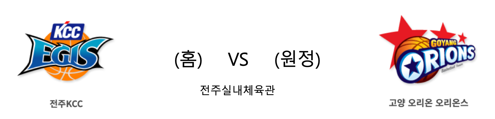

####  인천전자랜드(홈) VS 창원LG(원정) 

<table class="tg">
  <tr>
    <th class="tg-rr9t">인천전자랜드</th>
    <th class="tg-rr9t">팀</th>
    <th class="tg-rr9t">창원LG</th>
  </tr>
  <tr>
    <td class="tg-dcpn">30승 14패</td>
    <td class="tg-rr9t">시즌 상대전적</td>
    <td class="tg-dcpn">23승 21패</td>
  </tr>
  <tr>
    <td class="tg-dcpn">96</td>
    <td class="tg-rr9t">점수</td>
    <td class="tg-dcpn">89</td>
  </tr>
  <tr>
    <td class="tg-dcpn">17/29(59%)</td>
    <td class="tg-rr9t">2점(%)</td>
    <td class="tg-dcpn">26/50(52%)</td>
  </tr>
  <tr>
    <td class="tg-dcpn">16/34(47%)</td>
    <td class="tg-rr9t">3점(%)</td>
    <td class="tg-dcpn">5/16(31%)</td>
  </tr>
  <tr>
    <td class="tg-dcpn">14/19(74%)</td>
    <td class="tg-rr9t">자유투(%)</td>
    <td class="tg-dcpn">22/26(85%)</td>
  </tr>
  <tr>
    <td class="tg-dcpn">23</td>
    <td class="tg-rr9t">리바운드</td>
    <td class="tg-dcpn">38</td>
  </tr>
  <tr>
    <td class="tg-dcpn">21</td>
    <td class="tg-rr9t">어시스트</td>
    <td class="tg-dcpn">17</td>
  </tr>
  <tr>
    <td class="tg-dcpn">5</td>
    <td class="tg-rr9t">스틸</td>
    <td class="tg-dcpn">3</td>
  </tr>
  <tr>
    <td class="tg-dcpn">1</td>
    <td class="tg-rr9t">블록</td>
    <td class="tg-dcpn">1</td>
  </tr>
  <tr>
    <td class="tg-dcpn">8</td>
    <td class="tg-rr9t">턴오버</td>
    <td class="tg-dcpn">11</td>
  </tr>
  <tr>
    <td class="tg-dcpn">기디 팟츠(34) 정효근(22)</td>
    <td class="tg-rr9t">주요 득점선수</td>
    <td class="tg-dcpn">조쉬 그레이(15) 김종규(17) 제임스 메이스(33)</td>
  </tr>
</table>

####  전주KCC(홈) VS 고양오리온(원정) 

<table class="tg">
  <tr>
    <th class="tg-rr9t">전주KCC</th>
    <th class="tg-rr9t">팀</th>
    <th class="tg-rr9t">고양오리온</th>
  </tr>
  <tr>
    <td class="tg-dcpn">22승 22패</td>
    <td class="tg-rr9t">시즌 상대전적</td>
    <td class="tg-dcpn">22승 22패</td>
  </tr>
  <tr>
    <td class="tg-dcpn">93</td>
    <td class="tg-rr9t">점수</td>
    <td class="tg-dcpn">72</td>
  </tr>
  <tr>
    <td class="tg-dcpn">31/51(61%)</td>
    <td class="tg-rr9t">2점(%)</td>
    <td class="tg-dcpn">16/38(42%)</td>
  </tr>
  <tr>
    <td class="tg-dcpn">7/19(37%)</td>
    <td class="tg-rr9t">3점(%)</td>
    <td class="tg-dcpn">11/32(34%)</td>
  </tr>
  <tr>
    <td class="tg-dcpn">10/14(71%)</td>
    <td class="tg-rr9t">자유투(%)</td>
    <td class="tg-dcpn">7/9(78%)</td>
  </tr>
  <tr>
    <td class="tg-dcpn">42</td>
    <td class="tg-rr9t">리바운드</td>
    <td class="tg-dcpn">33</td>
  </tr>
  <tr>
    <td class="tg-dcpn">27</td>
    <td class="tg-rr9t">어시스트</td>
    <td class="tg-dcpn">13</td>
  </tr>
  <tr>
    <td class="tg-dcpn">11</td>
    <td class="tg-rr9t">스틸</td>
    <td class="tg-dcpn">7</td>
  </tr>
  <tr>
    <td class="tg-dcpn">1</td>
    <td class="tg-rr9t">블록</td>
    <td class="tg-dcpn">0</td>
  </tr>
  <tr>
    <td class="tg-dcpn">12</td>
    <td class="tg-rr9t">턴오버</td>
    <td class="tg-dcpn">14</td>
  </tr>
  <tr>
    <td class="tg-dcpn">브랜든 브라운(20) 이정현(20)</td>
    <td class="tg-rr9t">주요 득점선수</td>
    <td class="tg-dcpn">조쉬 에코이언(15)</td>
  </tr>
</table>
