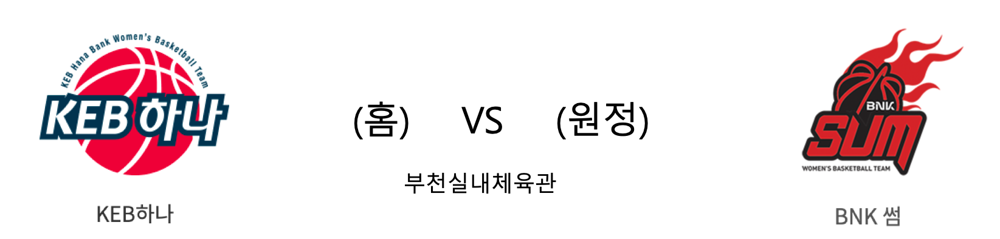

####  KEB하나(홈) VS BNK썸(원정) 

<table class="tg">
  <tr>
    <th class="tg-rr9t">KEB하나</th>
    <th class="tg-rr9t">팀</th>
    <th class="tg-rr9t">BNK썸</th>
  </tr>
  <tr>
    <td class="tg-dcpn">1승 0패</td>
    <td class="tg-rr9t">시즌 상대전적</td>
    <td class="tg-dcpn">0승 1패</td>
  </tr>
  <tr>
    <td class="tg-dcpn">82</td>
    <td class="tg-rr9t">점수</td>
    <td class="tg-dcpn">78</td>
  </tr>
  <tr>
    <td class="tg-dcpn">20/39(51%)</td>
    <td class="tg-rr9t">2점(%)</td>
    <td class="tg-dcpn">33/60(55%)</td>
  </tr>
  <tr>
    <td class="tg-dcpn">13/22(59%)</td>
    <td class="tg-rr9t">3점(%)</td>
    <td class="tg-dcpn">3/25(12%)</td>
  </tr>
  <tr>
    <td class="tg-dcpn">3/6(50%)</td>
    <td class="tg-rr9t">자유투(%)</td>
    <td class="tg-dcpn">3/9(33%)</td>
  </tr>
  <tr>
    <td class="tg-dcpn">35</td>
    <td class="tg-rr9t">리바운드</td>
    <td class="tg-dcpn">41</td>
  </tr>
  <tr>
    <td class="tg-dcpn">18</td>
    <td class="tg-rr9t">어시스트</td>
    <td class="tg-dcpn">21</td>
  </tr>
  <tr>
    <td class="tg-dcpn">5</td>
    <td class="tg-rr9t">스틸</td>
    <td class="tg-dcpn">11</td>
  </tr>
  <tr>
    <td class="tg-dcpn">13</td>
    <td class="tg-rr9t">블록</td>
    <td class="tg-dcpn">6</td>
  </tr>
  <tr>
    <td class="tg-dcpn">13</td>
    <td class="tg-rr9t">턴오버</td>
    <td class="tg-dcpn">13</td>
  </tr>
  <tr>
    <td class="tg-dcpn">강이슬(30)</td>
    <td class="tg-rr9t">주요 득점선수</td>
    <td class="tg-dcpn">단타스(32) 진안(16)</td>
  </tr>
</table>

#### 경기 관련 주요 기사         

[[포토]KEB하나,개막승 환호](http://isplus.live.joins.com/news/article/aid.asp?aid=23201527)

[KEB 하나은행, BNK 썸 꺾고 개막전 승리](http://stoo.asiae.co.kr/article.php?aid=58941366538)

[KEB하나은행 'BNK 썸 제치고 개막전 승리'[포토]](http://www.xportsnews.com/?ac=article_view&entry_id=1185097)

['강이슬 30점+고아라 쐐기 3점포' KEB하나, BNK썸 상대 시즌 개막전 승리](http://www.osen.co.kr/article/G1111244413)

        
        

####  KEB하나(홈) VS BNK(원정) 

<table class="tg">
  <tr>
    <th class="tg-rr9t">KEB하나</th>
    <th class="tg-rr9t">팀</th>
    <th class="tg-rr9t">BNK</th>
  </tr>
  <tr>
    <td class="tg-dcpn">1승 0패</td>
    <td class="tg-rr9t">시즌 상대전적</td>
    <td class="tg-dcpn">0승 1패</td>
  </tr>
  <tr>
    <td class="tg-dcpn">82</td>
    <td class="tg-rr9t">점수</td>
    <td class="tg-dcpn">78</td>
  </tr>
  <tr>
    <td class="tg-dcpn">20/39(51%)</td>
    <td class="tg-rr9t">2점(%)</td>
    <td class="tg-dcpn">33/60(55%)</td>
  </tr>
  <tr>
    <td class="tg-dcpn">13/22(59%)</td>
    <td class="tg-rr9t">3점(%)</td>
    <td class="tg-dcpn">3/25(12%)</td>
  </tr>
  <tr>
    <td class="tg-dcpn">3/6(50%)</td>
    <td class="tg-rr9t">자유투(%)</td>
    <td class="tg-dcpn">3/9(33%)</td>
  </tr>
  <tr>
    <td class="tg-dcpn">35</td>
    <td class="tg-rr9t">리바운드</td>
    <td class="tg-dcpn">41</td>
  </tr>
  <tr>
    <td class="tg-dcpn">18</td>
    <td class="tg-rr9t">어시스트</td>
    <td class="tg-dcpn">21</td>
  </tr>
  <tr>
    <td class="tg-dcpn">5</td>
    <td class="tg-rr9t">스틸</td>
    <td class="tg-dcpn">11</td>
  </tr>
  <tr>
    <td class="tg-dcpn">13</td>
    <td class="tg-rr9t">블록</td>
    <td class="tg-dcpn">6</td>
  </tr>
  <tr>
    <td class="tg-dcpn">13</td>
    <td class="tg-rr9t">턴오버</td>
    <td class="tg-dcpn">13</td>
  </tr>
  <tr>
    <td class="tg-dcpn">강이슬(30)</td>
    <td class="tg-rr9t">주요 득점선수</td>
    <td class="tg-dcpn">진안(16) 단타스(32)</td>
  </tr>
</table>

#### 경기 관련 주요 기사         

[[포토] 박소정 치어리더 'KEB하나은행 같이 응원해요'](http://www.rookie.co.kr/news/articleView.html?idxno=33826)

[‘강이슬 30득점’ KEB하나은행, BNK 꺾고 개막전 첫 승](http://sports.news.naver.com/basketball/news/read.nhn?oid=065&aid=0000190444)

[KEB하나은행 'BNK 썸 제치고 개막전 승리'[포토]](http://www.xportsnews.com/?ac=article_view&entry_id=1185097)

        
        

#### 리그 순위

<table class="tg">
  <tr>
    <th class="tg-d14o">순위</th>
    <th class="tg-d14o">팀명</th>
    <th class="tg-d14o">경기수</th>
    <th class="tg-d14o">승</th>
    <th class="tg-d14o">패</th>
    <th class="tg-d14o">승차</th>
    <th class="tg-d14o">승률</th>
  </tr>
  
<tr>
    <td class="tg-50j8">1</td>
    <td class="tg-50j8">KEB하나</td>
    <td class="tg-50j8">2</td>
    <td class="tg-50j8">2</td>
    <td class="tg-50j8">0</td>
    <td class="tg-50j8">0</td>
    <td class="tg-50j8">1.0</td>
</tr>

<tr>
    <td class="tg-50j8">2</td>
    <td class="tg-50j8">신한은행</td>
    <td class="tg-50j8">0</td>
    <td class="tg-50j8">0</td>
    <td class="tg-50j8">0</td>
    <td class="tg-50j8">2</td>
    <td class="tg-50j8">0.0</td>
</tr>

<tr>
    <td class="tg-50j8">2</td>
    <td class="tg-50j8">우리은행</td>
    <td class="tg-50j8">0</td>
    <td class="tg-50j8">0</td>
    <td class="tg-50j8">0</td>
    <td class="tg-50j8">2</td>
    <td class="tg-50j8">0.0</td>
</tr>

<tr>
    <td class="tg-50j8">2</td>
    <td class="tg-50j8">KB스타즈</td>
    <td class="tg-50j8">0</td>
    <td class="tg-50j8">0</td>
    <td class="tg-50j8">0</td>
    <td class="tg-50j8">2</td>
    <td class="tg-50j8">0.0</td>
</tr>

<tr>
    <td class="tg-50j8">2</td>
    <td class="tg-50j8">삼성생명</td>
    <td class="tg-50j8">0</td>
    <td class="tg-50j8">0</td>
    <td class="tg-50j8">0</td>
    <td class="tg-50j8">2</td>
    <td class="tg-50j8">0.0</td>
</tr>

<tr>
    <td class="tg-50j8">6</td>
    <td class="tg-50j8">BNK</td>
    <td class="tg-50j8">1</td>
    <td class="tg-50j8">0</td>
    <td class="tg-50j8">1</td>
    <td class="tg-50j8">2</td>
    <td class="tg-50j8">0.0</td>
</tr>
</table> 