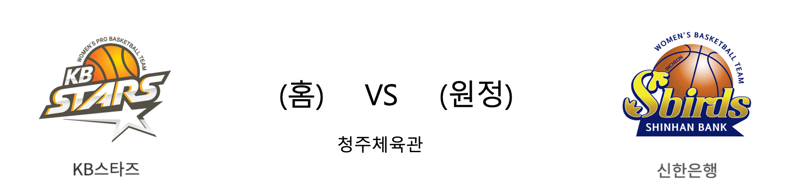

####  KB스타즈(홈) VS 신한은행(원정) 

<table class="tg">
  <tr>
    <th class="tg-rr9t">KB스타즈</th>
    <th class="tg-rr9t">팀</th>
    <th class="tg-rr9t">신한은행</th>
  </tr>
  <tr>
    <td class="tg-dcpn">1승 0패</td>
    <td class="tg-rr9t">시즌 상대전적</td>
    <td class="tg-dcpn">0승 1패</td>
  </tr>
  <tr>
    <td class="tg-dcpn">68</td>
    <td class="tg-rr9t">점수</td>
    <td class="tg-dcpn">53</td>
  </tr>
  <tr>
    <td class="tg-dcpn">23/45(51%)</td>
    <td class="tg-rr9t">2점(%)</td>
    <td class="tg-dcpn">17/43(40%)</td>
  </tr>
  <tr>
    <td class="tg-dcpn">3/24(12%)</td>
    <td class="tg-rr9t">3점(%)</td>
    <td class="tg-dcpn">4/13(31%)</td>
  </tr>
  <tr>
    <td class="tg-dcpn">13/17(76%)</td>
    <td class="tg-rr9t">자유투(%)</td>
    <td class="tg-dcpn">7/10(70%)</td>
  </tr>
  <tr>
    <td class="tg-dcpn">39</td>
    <td class="tg-rr9t">리바운드</td>
    <td class="tg-dcpn">34</td>
  </tr>
  <tr>
    <td class="tg-dcpn">13</td>
    <td class="tg-rr9t">어시스트</td>
    <td class="tg-dcpn">18</td>
  </tr>
  <tr>
    <td class="tg-dcpn">6</td>
    <td class="tg-rr9t">스틸</td>
    <td class="tg-dcpn">6</td>
  </tr>
  <tr>
    <td class="tg-dcpn">11</td>
    <td class="tg-rr9t">블록</td>
    <td class="tg-dcpn">10</td>
  </tr>
  <tr>
    <td class="tg-dcpn">16</td>
    <td class="tg-rr9t">턴오버</td>
    <td class="tg-dcpn">13</td>
  </tr>
  <tr>
    <td class="tg-dcpn">박지수(17) 쏜튼(17)</td>
    <td class="tg-rr9t">주요 득점선수</td>
    <td class="tg-dcpn"></td>
  </tr>
</table>

#### 경기 관련 주요 기사         

[디펜딩 챔피언은 강했다! KB스타즈, 신한은행 압도하며 1승!](http://sports.news.naver.com/basketball/news/read.nhn?oid=282&aid=0000005283)

[디펜딩 챔프 KB, 개막전서 신한은행 완파](http://www.osen.co.kr/article/G1111244877)

[챔피언 KB, 신한은행에 완승 거두며 쾌조의 출발](http://www.rookie.co.kr/news/articleView.html?idxno=33872)

[[BK Review] '박지수 더블더블' KB스타즈, 신한은행 꺾고 홈 개막전 승리](http://www.basketkorea.com/news/articleView.html?idxno=189495)

        
        

#### 리그 순위

<table class="tg">
  <tr>
    <th class="tg-d14o">순위</th>
    <th class="tg-d14o">팀명</th>
    <th class="tg-d14o">경기수</th>
    <th class="tg-d14o">승</th>
    <th class="tg-d14o">패</th>
    <th class="tg-d14o">승차</th>
    <th class="tg-d14o">승률</th>
  </tr>
  
<tr>
    <td class="tg-50j8">1</td>
    <td class="tg-50j8">KEB하나</td>
    <td class="tg-50j8">1</td>
    <td class="tg-50j8">1</td>
    <td class="tg-50j8">0</td>
    <td class="tg-50j8">0</td>
    <td class="tg-50j8">1.0</td>
</tr>

<tr>
    <td class="tg-50j8">1</td>
    <td class="tg-50j8">KB스타즈</td>
    <td class="tg-50j8">1</td>
    <td class="tg-50j8">1</td>
    <td class="tg-50j8">0</td>
    <td class="tg-50j8">0</td>
    <td class="tg-50j8">1.0</td>
</tr>

<tr>
    <td class="tg-50j8">3</td>
    <td class="tg-50j8">우리은행</td>
    <td class="tg-50j8">0</td>
    <td class="tg-50j8">0</td>
    <td class="tg-50j8">0</td>
    <td class="tg-50j8">1</td>
    <td class="tg-50j8">0.0</td>
</tr>

<tr>
    <td class="tg-50j8">3</td>
    <td class="tg-50j8">삼성생명</td>
    <td class="tg-50j8">0</td>
    <td class="tg-50j8">0</td>
    <td class="tg-50j8">0</td>
    <td class="tg-50j8">1</td>
    <td class="tg-50j8">0.0</td>
</tr>

<tr>
    <td class="tg-50j8">5</td>
    <td class="tg-50j8">BNK썸</td>
    <td class="tg-50j8">1</td>
    <td class="tg-50j8">0</td>
    <td class="tg-50j8">1</td>
    <td class="tg-50j8">1</td>
    <td class="tg-50j8">0.0</td>
</tr>

<tr>
    <td class="tg-50j8">5</td>
    <td class="tg-50j8">신한은행</td>
    <td class="tg-50j8">1</td>
    <td class="tg-50j8">0</td>
    <td class="tg-50j8">1</td>
    <td class="tg-50j8">1</td>
    <td class="tg-50j8">0.0</td>
</tr>
</table> 

        
        
