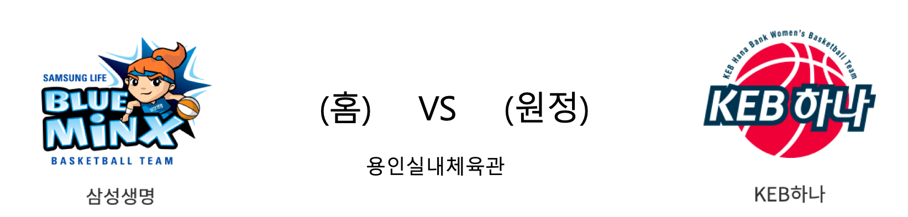

#### 국내 여자 농구 분석
##### 삼성생명은 3승1패로 공동2위를 달리고 있습니다. 김한별, 배혜윤, 김보미 등 국내선수들이 좋은 공격력을 보여주고 있으며, 강한 수비력으로 많은 실점도 하지 않고 있습니다. 반면 KEB하나는 지난 경기에서 신한은행에게 첫승을 선사했습니다. 최근 야투율도 좋지 않고 평균 실점이 80점으로 수비에서도 무너지는 모습을 보여주고 있습니다. 이번경기는 국내선수층이 더 탄탄한 삼성생명이 우세할 것으로 예상됩니다.

####  삼성생명(홈) VS KEB하나(원정) 

#### 2019-2020 시즌 성적

<table class="tg">
  <tr>
    <td class="tg-rr9t">삼성생명</td>
    <td class="tg-rr9t">팀</td>
    <td class="tg-rr9t">KEB하나</td>
  </tr>
  <tr>
    <th class="tg-dcpn">2위(3승 1패)</th>
    <th class="tg-o8le">시즌 순위</th>
    <th class="tg-dcpn">4위(1승 2패)</th>
  </tr>
  <tr>
    <td class="tg-txr3">67.0/63.2</td>
    <td class="tg-o8le">평균 득점/실점</td>
    <td class="tg-txr3">68.7/80.0</td>
  </tr>
  <tr>
    <td class="tg-dcpn">홈 1승 1패 원정 2승 0패</td>
    <td class="tg-wazi">홈/원정 성적</td>
    <td class="tg-dcpn">홈 1승 1패 원정 0승 1패</td>
  </tr>
</table>

#### 최근 5경기 상대전적(정규시즌)

<table class="tg">
  <tr>
    <th class="tg-d14o">경기일자 (홈팀)</th>
    <th class="tg-d14o">팀</th>
    <th class="tg-d14o">1Q</th>
    <th class="tg-d14o">2Q</th>
    <th class="tg-d14o">3Q</th>
    <th class="tg-d14o">4Q</th>
    <th class="tg-d14o">EQ</th>
    <th class="tg-d14o">Total</th>
    <th class="tg-d14o">승리팀</th>
  </tr>

<tr>
  <td class="tg-50j8" rowspan="2">2019-03-09(토) (KEB하나)</td>
  <td class="tg-50j8">KEB하나</td>
  <td class="tg-50j8">22</td>
  <td class="tg-50j8">21</td>
  <td class="tg-50j8">25</td>
  <td class="tg-50j8">19</td>
  <td class="tg-50j8">0</td>
  <td class="tg-50j8">87</td>
  <td class="tg-50j8" rowspan="2">삼성생명</td>
</tr>
<tr>
  <td class="tg-50j8">삼성생명</td>
  <td class="tg-50j8">18</td>
  <td class="tg-50j8">24</td>
  <td class="tg-50j8">26</td>
  <td class="tg-50j8">21</td>
  <td class="tg-50j8">0</td>
  <td class=" tg-jb7t">89</td>
</tr>

<tr>
  <td class="tg-50j8" rowspan="2">2019-02-18(월) (KEB하나)</td>
  <td class="tg-50j8">KEB하나</td>
  <td class="tg-50j8">19</td>
  <td class="tg-50j8">18</td>
  <td class="tg-50j8">18</td>
  <td class="tg-50j8">19</td>
  <td class="tg-50j8">0</td>
  <td class="tg-50j8">74</td>
  <td class="tg-50j8" rowspan="2">삼성생명</td>
</tr>
<tr>
  <td class="tg-50j8">삼성생명</td>
  <td class="tg-50j8">13</td>
  <td class="tg-50j8">26</td>
  <td class="tg-50j8">17</td>
  <td class="tg-50j8">19</td>
  <td class="tg-50j8">0</td>
  <td class=" tg-jb7t">75</td>
</tr>

<tr>
  <td class="tg-50j8" rowspan="2">2019-01-23(수) (삼성생명)</td>
  <td class="tg-50j8">삼성생명</td>
  <td class="tg-50j8">19</td>
  <td class="tg-50j8">17</td>
  <td class="tg-50j8">23</td>
  <td class="tg-50j8">18</td>
  <td class="tg-50j8">0</td>
  <td class="tg-jb7t">77</td>
  <td class="tg-50j8" rowspan="2">삼성생명</td>
</tr>
<tr>
  <td class="tg-50j8">KEB하나</td>
  <td class="tg-50j8">11</td>
  <td class="tg-50j8">16</td>
  <td class="tg-50j8">12</td>
  <td class="tg-50j8">22</td>
  <td class="tg-50j8">0</td>
  <td class=" tg-50j8">61</td>
</tr>

<tr>
  <td class="tg-50j8" rowspan="2">2019-01-03(목) (삼성생명)</td>
  <td class="tg-50j8">삼성생명</td>
  <td class="tg-50j8">20</td>
  <td class="tg-50j8">12</td>
  <td class="tg-50j8">15</td>
  <td class="tg-50j8">13</td>
  <td class="tg-50j8">0</td>
  <td class="tg-50j8">60</td>
  <td class="tg-50j8" rowspan="2">KEB하나</td>
</tr>
<tr>
  <td class="tg-50j8">KEB하나</td>
  <td class="tg-50j8">14</td>
  <td class="tg-50j8">20</td>
  <td class="tg-50j8">17</td>
  <td class="tg-50j8">22</td>
  <td class="tg-50j8">0</td>
  <td class=" tg-jb7t">73</td>
</tr>

<tr>
  <td class="tg-50j8" rowspan="2">2018-12-23(일) (KEB하나)</td>
  <td class="tg-50j8">KEB하나</td>
  <td class="tg-50j8">15</td>
  <td class="tg-50j8">17</td>
  <td class="tg-50j8">15</td>
  <td class="tg-50j8">26</td>
  <td class="tg-50j8">0</td>
  <td class="tg-jb7t">73</td>
  <td class="tg-50j8" rowspan="2">KEB하나</td>
</tr>
<tr>
  <td class="tg-50j8">삼성생명</td>
  <td class="tg-50j8">21</td>
  <td class="tg-50j8">13</td>
  <td class="tg-50j8">22</td>
  <td class="tg-50j8">13</td>
  <td class="tg-50j8">0</td>
  <td class=" tg-50j8">69</td>
</tr>
</table> 
#### 삼성생명 최근 5경기 분석(정규시즌)

<table class="tg">
  <tr>
    <th class="tg-d14o">경기일자 (홈팀)</th>
    <th class="tg-d14o">팀</th>
    <th class="tg-d14o">1Q</th>
    <th class="tg-d14o">2Q</th>
    <th class="tg-d14o">3Q</th>
    <th class="tg-d14o">4Q</th>
    <th class="tg-d14o">EQ</th>
    <th class="tg-d14o">Total</th>
    <th class="tg-d14o">승리팀</th>
  </tr>

<tr>
  <td class="tg-50j8" rowspan="2">2019-10-31(목) (BNK썸)</td>
  <td class="tg-50j8">BNK썸</td>
  <td class="tg-50j8">19</td>
  <td class="tg-50j8">12</td>
  <td class="tg-50j8">13</td>
  <td class="tg-50j8">18</td>
  <td class="tg-50j8">0</td>
  <td class="tg-50j8">62</td>
  <td class="tg-50j8" rowspan="2">삼성생명</td>
</tr>
<tr>
  <td class="tg-50j8">삼성생명</td>
  <td class="tg-50j8">17</td>
  <td class="tg-50j8">28</td>
  <td class="tg-50j8">17</td>
  <td class="tg-50j8">22</td>
  <td class="tg-50j8">0</td>
  <td class=" tg-jb7t">84</td>
</tr>

<tr>
  <td class="tg-50j8" rowspan="2">2019-10-27(일) (삼성생명)</td>
  <td class="tg-50j8">삼성생명</td>
  <td class="tg-50j8">10</td>
  <td class="tg-50j8">8</td>
  <td class="tg-50j8">10</td>
  <td class="tg-50j8">15</td>
  <td class="tg-50j8">0</td>
  <td class="tg-50j8">43</td>
  <td class="tg-50j8" rowspan="2">KB스타즈</td>
</tr>
<tr>
  <td class="tg-50j8">KB스타즈</td>
  <td class="tg-50j8">15</td>
  <td class="tg-50j8">15</td>
  <td class="tg-50j8">15</td>
  <td class="tg-50j8">18</td>
  <td class="tg-50j8">0</td>
  <td class=" tg-jb7t">63</td>
</tr>

<tr>
  <td class="tg-50j8" rowspan="2">2019-10-25(금) (신한은행)</td>
  <td class="tg-50j8">신한은행</td>
  <td class="tg-50j8">17</td>
  <td class="tg-50j8">21</td>
  <td class="tg-50j8">16</td>
  <td class="tg-50j8">12</td>
  <td class="tg-50j8">0</td>
  <td class="tg-50j8">66</td>
  <td class="tg-50j8" rowspan="2">삼성생명</td>
</tr>
<tr>
  <td class="tg-50j8">삼성생명</td>
  <td class="tg-50j8">16</td>
  <td class="tg-50j8">23</td>
  <td class="tg-50j8">15</td>
  <td class="tg-50j8">19</td>
  <td class="tg-50j8">0</td>
  <td class=" tg-jb7t">73</td>
</tr>

<tr>
  <td class="tg-50j8" rowspan="2">2019-10-21(월) (삼성생명)</td>
  <td class="tg-50j8">삼성생명</td>
  <td class="tg-50j8">18</td>
  <td class="tg-50j8">19</td>
  <td class="tg-50j8">13</td>
  <td class="tg-50j8">18</td>
  <td class="tg-50j8">0</td>
  <td class="tg-jb7t">68</td>
  <td class="tg-50j8" rowspan="2">삼성생명</td>
</tr>
<tr>
  <td class="tg-50j8">우리은행</td>
  <td class="tg-50j8">17</td>
  <td class="tg-50j8">22</td>
  <td class="tg-50j8">11</td>
  <td class="tg-50j8">12</td>
  <td class="tg-50j8">0</td>
  <td class=" tg-50j8">62</td>
</tr>

<tr>
  <td class="tg-50j8" rowspan="2">2019-03-09(토) (KEB하나)</td>
  <td class="tg-50j8">KEB하나</td>
  <td class="tg-50j8">22</td>
  <td class="tg-50j8">21</td>
  <td class="tg-50j8">25</td>
  <td class="tg-50j8">19</td>
  <td class="tg-50j8">0</td>
  <td class="tg-50j8">87</td>
  <td class="tg-50j8" rowspan="2">삼성생명</td>
</tr>
<tr>
  <td class="tg-50j8">삼성생명</td>
  <td class="tg-50j8">18</td>
  <td class="tg-50j8">24</td>
  <td class="tg-50j8">26</td>
  <td class="tg-50j8">21</td>
  <td class="tg-50j8">0</td>
  <td class=" tg-jb7t">89</td>
</tr>
</table> 
#### KEB하나 최근 5경기 분석(정규시즌)

<table class="tg">
  <tr>
    <th class="tg-d14o">경기일자 (홈팀)</th>
    <th class="tg-d14o">팀</th>
    <th class="tg-d14o">1Q</th>
    <th class="tg-d14o">2Q</th>
    <th class="tg-d14o">3Q</th>
    <th class="tg-d14o">4Q</th>
    <th class="tg-d14o">EQ</th>
    <th class="tg-d14o">Total</th>
    <th class="tg-d14o">승리팀</th>
  </tr>

<tr>
  <td class="tg-50j8" rowspan="2">2019-10-28(월) (KEB하나)</td>
  <td class="tg-50j8">KEB하나</td>
  <td class="tg-50j8">17</td>
  <td class="tg-50j8">18</td>
  <td class="tg-50j8">18</td>
  <td class="tg-50j8">22</td>
  <td class="tg-50j8">0</td>
  <td class="tg-50j8">75</td>
  <td class="tg-50j8" rowspan="2">신한은행</td>
</tr>
<tr>
  <td class="tg-50j8">신한은행</td>
  <td class="tg-50j8">23</td>
  <td class="tg-50j8">14</td>
  <td class="tg-50j8">21</td>
  <td class="tg-50j8">29</td>
  <td class="tg-50j8">0</td>
  <td class=" tg-jb7t">87</td>
</tr>

<tr>
  <td class="tg-50j8" rowspan="2">2019-10-24(목) (우리은행)</td>
  <td class="tg-50j8">우리은행</td>
  <td class="tg-50j8">16</td>
  <td class="tg-50j8">13</td>
  <td class="tg-50j8">24</td>
  <td class="tg-50j8">22</td>
  <td class="tg-50j8">0</td>
  <td class="tg-jb7t">75</td>
  <td class="tg-50j8" rowspan="2">우리은행</td>
</tr>
<tr>
  <td class="tg-50j8">KEB하나</td>
  <td class="tg-50j8">14</td>
  <td class="tg-50j8">17</td>
  <td class="tg-50j8">7</td>
  <td class="tg-50j8">11</td>
  <td class="tg-50j8">0</td>
  <td class=" tg-50j8">49</td>
</tr>

<tr>
  <td class="tg-50j8" rowspan="2">2019-10-19(토) (KEB하나)</td>
  <td class="tg-50j8">KEB하나</td>
  <td class="tg-50j8">19</td>
  <td class="tg-50j8">34</td>
  <td class="tg-50j8">20</td>
  <td class="tg-50j8">9</td>
  <td class="tg-50j8">0</td>
  <td class="tg-jb7t">82</td>
  <td class="tg-50j8" rowspan="2">KEB하나</td>
</tr>
<tr>
  <td class="tg-50j8">BNK썸</td>
  <td class="tg-50j8">21</td>
  <td class="tg-50j8">21</td>
  <td class="tg-50j8">15</td>
  <td class="tg-50j8">21</td>
  <td class="tg-50j8">0</td>
  <td class=" tg-50j8">78</td>
</tr>

<tr>
  <td class="tg-50j8" rowspan="2">2019-03-09(토) (KEB하나)</td>
  <td class="tg-50j8">KEB하나</td>
  <td class="tg-50j8">22</td>
  <td class="tg-50j8">21</td>
  <td class="tg-50j8">25</td>
  <td class="tg-50j8">19</td>
  <td class="tg-50j8">0</td>
  <td class="tg-50j8">87</td>
  <td class="tg-50j8" rowspan="2">삼성생명</td>
</tr>
<tr>
  <td class="tg-50j8">삼성생명</td>
  <td class="tg-50j8">18</td>
  <td class="tg-50j8">24</td>
  <td class="tg-50j8">26</td>
  <td class="tg-50j8">21</td>
  <td class="tg-50j8">0</td>
  <td class=" tg-jb7t">89</td>
</tr>

<tr>
  <td class="tg-50j8" rowspan="2">2019-03-07(목) (신한은행)</td>
  <td class="tg-50j8">신한은행</td>
  <td class="tg-50j8">10</td>
  <td class="tg-50j8">10</td>
  <td class="tg-50j8">13</td>
  <td class="tg-50j8">19</td>
  <td class="tg-50j8">0</td>
  <td class="tg-50j8">52</td>
  <td class="tg-50j8" rowspan="2">KEB하나</td>
</tr>
<tr>
  <td class="tg-50j8">KEB하나</td>
  <td class="tg-50j8">10</td>
  <td class="tg-50j8">16</td>
  <td class="tg-50j8">18</td>
  <td class="tg-50j8">18</td>
  <td class="tg-50j8">0</td>
  <td class=" tg-jb7t">62</td>
</tr>
</table> 

        
        

#### 리그 순위

<table class="tg">
  <tr>
    <th class="tg-d14o">순위</th>
    <th class="tg-d14o">팀명</th>
    <th class="tg-d14o">경기수</th>
    <th class="tg-d14o">승</th>
    <th class="tg-d14o">패</th>
    <th class="tg-d14o">승차</th>
    <th class="tg-d14o">승률</th>
  </tr>
  
<tr>
    <td class="tg-50j8">1</td>
    <td class="tg-50j8">우리은행</td>
    <td class="tg-50j8">5</td>
    <td class="tg-50j8">4</td>
    <td class="tg-50j8">1</td>
    <td class="tg-50j8">0</td>
    <td class="tg-50j8">0.8</td>
</tr>

<tr>
    <td class="tg-50j8">2</td>
    <td class="tg-50j8">KB스타즈</td>
    <td class="tg-50j8">4</td>
    <td class="tg-50j8">3</td>
    <td class="tg-50j8">1</td>
    <td class="tg-50j8">1</td>
    <td class="tg-50j8">0.75</td>
</tr>

<tr>
    <td class="tg-50j8">2</td>
    <td class="tg-50j8">삼성생명</td>
    <td class="tg-50j8">4</td>
    <td class="tg-50j8">3</td>
    <td class="tg-50j8">1</td>
    <td class="tg-50j8">1</td>
    <td class="tg-50j8">0.75</td>
</tr>

<tr>
    <td class="tg-50j8">4</td>
    <td class="tg-50j8">KEB하나</td>
    <td class="tg-50j8">3</td>
    <td class="tg-50j8">1</td>
    <td class="tg-50j8">2</td>
    <td class="tg-50j8">3</td>
    <td class="tg-50j8">0.333</td>
</tr>

<tr>
    <td class="tg-50j8">5</td>
    <td class="tg-50j8">신한은행</td>
    <td class="tg-50j8">4</td>
    <td class="tg-50j8">1</td>
    <td class="tg-50j8">3</td>
    <td class="tg-50j8">3</td>
    <td class="tg-50j8">0.25</td>
</tr>

<tr>
    <td class="tg-50j8">6</td>
    <td class="tg-50j8">BNK썸</td>
    <td class="tg-50j8">4</td>
    <td class="tg-50j8">0</td>
    <td class="tg-50j8">4</td>
    <td class="tg-50j8">4</td>
    <td class="tg-50j8">0.0</td>
</tr>
</table> 

        
        
